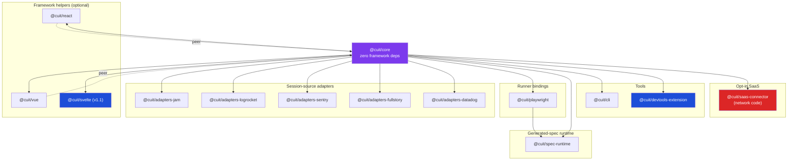
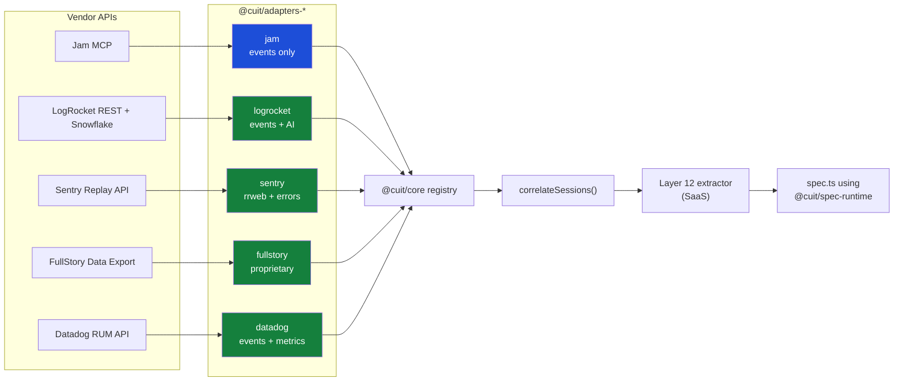
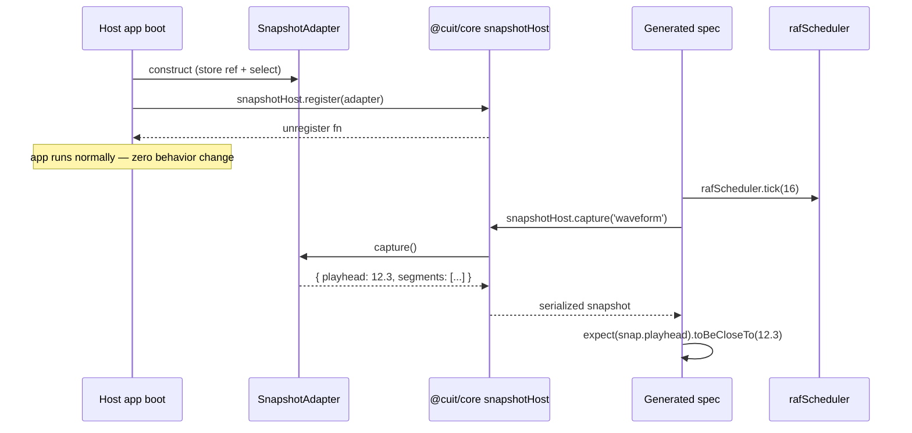
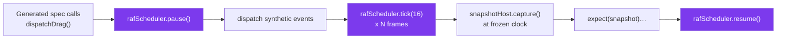

# complex-ui-tester — Library Architecture

| Field | Value |
|---|---|
| Document type | Open-source library architecture / staff-engineering design doc |
| Owner | ryan@speechlab.ai |
| Last reviewed | 2026-05-25 |
| Status | Draft — implementation-ready |
| Source vision | `/Users/ryanmedlin/Downloads/ui-feedback-loop-product-vision.md` |
| Related | `/Users/ryanmedlin/speechlab/complex-ui-tester/docs/01-product-spec.md`, `/Users/ryanmedlin/speechlab/complex-ui-tester/docs/03-saas-platform.md` |
| Design partner | SpeechLab waveform editor (Branch B, PR #1995) |
| First-party consumers | SpeechLab `translate-ui-react`, Othelia (Next.js video pipeline UI), PointLoad |
| Distribution | MIT/Apache-2.0 dual license, npm + JSR, **single canonical codebase, no forks** |

---

## 0. TL;DR

The library is the **OSS substrate** of the product. Exactly **one copy of the code** is consumed by SpeechLab UI, Othelia, PointLoad, and third-party customers via `npm install`. It provides the **harness primitives (Layers 1–6)** that **AI-generated specs (Layer 12) call into**, plus the **adapter surface (Layer 11)** that normalizes Jam / LogRocket / Sentry Replay / FullStory / Datadog RUM into a single `SessionEvent[]` stream.

Critical design pillars:

1. **Monorepo of small, framework-agnostic packages.** pnpm workspaces + Turborepo + tsup + Vitest + Changesets. `@cuit/core` has zero framework deps; React / Vue / Playwright / adapter packages depend on `@cuit/core` only.
2. **Adapters are first-class plugins.** Jam (events-only, no video) and Sentry (rrweb events + errors) are treated symmetrically. The product feature is **multi-source correlation** — `correlateSessions([jamSession, sentrySession, lrSession])` — not "the vendor with the most data wins."
3. **Telemetry boundary is physical.** The OSS library has zero network code. The SaaS connector is a separate, opt-in `@cuit/saas-connector` package that must be explicitly imported. No env vars, no auto-discovery, no phone-home.
4. **State-snapshot plugins** abstract over Zustand, Redux, Pinia, MobX, plain DOM via a tiny interface. SpeechLab's existing `window.__waveformDebug.getState()` becomes one adapter; new apps wire their own in <10 LoC.
5. **Deterministic clock injection** is a 3-line host integration (`rafScheduler.setClock`). The "1-hour onboarding" target is enforceable by `cuit doctor`.
6. **"One copy" is enforced by Changesets + canary tags + workspace overrides.** First-party consumers stay on `next` or `canary` channels; third parties stay on `latest`. Bug fixes flow upstream from any consumer, never sideways into a fork.

---

## 1. Goals and Non-Goals for the Library

### 1.1 Goals

- One canonical codebase, consumed unchanged by 4+ first-party apps and arbitrary third parties
- Incremental adoption: a drag-heavy UI can install `@cuit/core` and use only `dispatchDrag` + `setClock` on day 1, add `getStateSnapshot` on day 2, add Playwright bindings on day 3
- Framework-agnostic core; React / Vue / Svelte are optional helper packages
- Sub-50 KB minified `@cuit/core`; tree-shakeable
- Strict semver, public API stability after v1.0, experimental APIs flagged
- Adapters for Jam, LogRocket, Sentry Replay, FullStory, Datadog RUM. Jam is **first-class even without video bytes.**
- Multi-source correlation API as a core differentiator
- Zero phone-home from OSS. SaaS opt-in is a separate package.

### 1.2 Non-Goals (Year 1)

- Native mobile (React Native, iOS, Android)
- Non-DOM rendering (WebGL-only, three.js, native canvas games without DOM accessibility tree)
- Replacing Playwright / Cypress runners — we provide bindings, not a runner
- A test-authoring UI — that lives in the SaaS dashboard, not the library
- Visual regression as a primary signal — secondary check via `expect.toHaveScreenshot` at frozen clock

---

## 2. Monorepo Structure

### 2.1 Tooling choices and rationale

| Concern | Choice | Why this over the alternative |
|---|---|---|
| Workspace manager | **pnpm workspaces** | Strict dependency hoisting prevents the "phantom dep" class of bugs that bit `translate-ui-react` twice in 2025. Yarn Berry's PnP breaks too many third-party tools (Playwright trace viewer, RN Metro). Bun workspaces are still beta for Windows CI. |
| Task runner | **Turborepo 2.x** | Remote cache via Vercel free tier; works without lock-in. Nx is heavier and pushes a generator pattern we don't need. Moon is promising but young. |
| Bundler | **tsup** (esbuild under the hood) for libraries; **unbuild** considered and rejected | tsup is the de-facto standard for TS libraries (Vercel, tRPC, Drizzle, Hono all use it). unbuild is fine but its Rollup-based output is slower without a clear benefit for our package sizes. |
| Test runner | **Vitest 2.x** | Same Vite pipeline as future docs site; runs Jest-compatible specs; supports browser mode via Playwright provider — important for `@cuit/core` DOM tests. |
| Release tool | **Changesets** | Per-package versioning, automated changelogs, supports prerelease channels (`next`, `canary`) — required by the "one copy" constraint (§11). |
| Lint / format | **Biome 1.9+** with ESLint fallback for `@typescript-eslint` rules Biome doesn't cover | Biome is 30–100× faster than ESLint+Prettier and the speed matters in a monorepo with 13 packages. |
| TypeScript | **TS 5.6+**, `strict: true`, `exactOptionalPropertyTypes: true`, `noUncheckedIndexedAccess: true` | Catches the class of bugs that AI-generated spec code is most prone to (optional chain on possibly-undef array index). |
| Docs site | **Astro Starlight** for `/docs`; **TypeDoc** for API reference | Starlight is the lightest option that supports MDX + Mermaid + dark mode. |

### 2.2 Concrete package tree

```
complex-ui-tester/
├── .changeset/                       # Changesets config + pending changes
├── .github/
│   └── workflows/
│       ├── ci.yml                    # build + test + lint matrix
│       ├── release.yml               # changesets/action → npm publish
│       └── canary.yml                # nightly canary tag publish
├── apps/
│   ├── docs/                         # Astro Starlight site (cuit.dev)
│   └── playground/                   # Vite app for manual harness QA
├── packages/
│   ├── core/                         # @cuit/core
│   │   ├── src/
│   │   │   ├── index.ts              # Public re-export surface
│   │   │   ├── clock/                # Layer 2: rafScheduler, setClock, tick
│   │   │   ├── dispatch/             # Layer 3+5: drag, resize, wheel, touch, seekTo
│   │   │   ├── snapshot/             # Layer 1: state-snapshot plugin host
│   │   │   ├── observe/              # Layer 6: DOM mutation, instance counters
│   │   │   ├── events/               # Common SessionEvent schema (rrweb-derived)
│   │   │   ├── correlate/            # Multi-source correlation engine
│   │   │   ├── adapter/              # Adapter registry + base classes
│   │   │   └── version.ts            # Pkg version, schema version
│   │   ├── tests/                    # Vitest, browser+node
│   │   ├── tsup.config.ts
│   │   ├── package.json
│   │   └── README.md
│   ├── react/                        # @cuit/react
│   │   └── src/
│   │       ├── useHarness.ts         # Mounts debug API on window in dev only
│   │       ├── adapters/zustand.ts   # State-snapshot adapter for Zustand
│   │       ├── adapters/redux.ts
│   │       └── adapters/jotai.ts
│   ├── vue/                          # @cuit/vue (Pinia + plain reactive)
│   ├── svelte/                       # @cuit/svelte (stub for v1.1)
│   ├── playwright/                   # @cuit/playwright
│   │   └── src/
│   │       ├── fixtures.ts           # test.extend with harness fixture
│   │       ├── locators.ts           # harness-aware locator helpers
│   │       └── trace.ts              # bind playwright trace to SessionEvent[]
│   ├── spec-runtime/                 # @cuit/spec-runtime — used by AI-generated specs
│   │   └── src/
│   │       ├── index.ts              # exports stable subset: drag, tick, snap, expect
│   │       └── compat/               # version-shim layer for spec backward compat
│   ├── adapters-jam/                 # @cuit/adapters-jam (events-only, no video)
│   ├── adapters-logrocket/           # @cuit/adapters-logrocket (REST + Galileo)
│   ├── adapters-sentry/              # @cuit/adapters-sentry (rrweb passthrough)
│   ├── adapters-fullstory/           # @cuit/adapters-fullstory
│   ├── adapters-datadog/             # @cuit/adapters-datadog (RUM Replay)
│   ├── cli/                          # @cuit/cli — `cuit ingest|extract|run|doctor`
│   ├── devtools-extension/           # @cuit/devtools-extension (Chrome MV3)
│   └── examples-waveform/            # Runnable waveform reference impl
├── scripts/
│   ├── verify-no-phone-home.ts       # CI guard: blocks fetch/XHR in @cuit/core
│   └── compat-matrix.ts              # Generates compatibility table from package.json peers
├── pnpm-workspace.yaml
├── turbo.json
├── tsconfig.base.json
├── biome.json
├── package.json                      # root, "private": true
├── ARCHITECTURE.md → docs/02-library-architecture.md (this file)
├── README.md
└── LICENSE                           # MIT or Apache-2.0 — see §12
```

### 2.3 Package decisions table

| Package | Decision | Justification |
|---|---|---|
| `@cuit/core` | **Ship.** Foundation. | Framework-agnostic, zero deps except `@types/node` and an `rrweb-types` typedoc dep. Every other package depends on this. |
| `@cuit/react` | **Ship.** | SpeechLab + Othelia are React. First-party usage validates the package. |
| `@cuit/vue` | **Ship.** | One named design partner is on Vue 3.4. Without this, the "framework-agnostic" claim is unsupported. |
| `@cuit/svelte` | **Defer to v1.1.** | No design partner yet. Stub package with a README pointer prevents naming squatters. |
| `@cuit/playwright` | **Ship.** | The primary runner story. Playwright fixtures are the canonical way to wire harness into specs. |
| `@cuit/spec-runtime` | **Ship.** Distinct from `@cuit/core`. | Generated specs import only from this. Lets us version the spec API independently of the harness internals — critical for keeping 2 years of generated specs running as the harness evolves. |
| `@cuit/adapters-jam` | **Ship.** First-class. | Events-only sources are the dominant case once we count error breadcrumbs + analytics events. Jam being "no video" is the rule, not the exception. |
| `@cuit/adapters-logrocket` | **Ship.** | Best export story (REST + Snowflake/BigQuery streaming + Galileo Highlights). |
| `@cuit/adapters-sentry` | **Ship.** | Sentry Replay events are native rrweb — adapter is mostly passthrough + error correlation. |
| `@cuit/adapters-fullstory` | **Ship.** | Enterprise design partners use FullStory. Proprietary schema = highest adapter complexity. |
| `@cuit/adapters-datadog` | **Ship.** | RUM Replay is rrweb-compatible; metrics correlation is a unique value vs the other four. |
| `@cuit/cli` | **Ship.** | `cuit doctor` enforces the 1-hour onboarding promise. `cuit ingest` + `cuit extract` are the CI-friendly entry points for self-hosted users. |
| `@cuit/devtools-extension` | **Ship as optional.** | Useful for diagnosing why state snapshots are empty during onboarding. Distributed via Chrome Web Store, code lives here. |
| `@cuit/examples-waveform` | **Ship.** | The reference implementation. Doubles as a regression harness for the harness itself. |
| `@cuit/saas-connector` | **Ship separately, opt-in.** | Lives in this repo but published with **explicit-install requirement**. Contains all network code. See §8. |

### 2.4 Dependency graph



Key invariants:

- **`@cuit/core` has zero runtime dependencies** beyond TypeScript types
- **No package imports another via path; all imports go through workspace `@cuit/*` aliases**
- **No adapter depends on another adapter** — composition happens in `@cuit/core/correlate`
- **`@cuit/spec-runtime` never imports `@cuit/playwright`** — generated specs are runner-agnostic and can be wrapped by a Playwright fixture or run from Vitest browser mode

---

## 3. Public API Design Principles

### 3.1 Stability tiers

Every exported symbol carries one of three stability tiers, declared via TSDoc and re-exported via `index.ts`:

```ts
/**
 * @stable since 1.0
 * Frozen API. Breaking changes only at major version. Two-version deprecation window.
 */
export function dispatchDrag(target: DragTarget, opts: DragOptions): Promise<void>;

/**
 * @experimental since 1.2
 * May change or be removed in any minor. Must be opted into via:
 *   import { __experimental__ } from '@cuit/core';
 *   const { neuralReplay } = __experimental__;
 */
export const __experimental__: { neuralReplay: typeof neuralReplay };

/**
 * @internal — not part of the public API. Imported only by @cuit/* packages.
 * Visible only via subpath `@cuit/core/internal`.
 */
export function _resolveClock(): InternalClockHandle;
```

Enforcement:

- `api-extractor` runs in CI and writes a `etc/<pkg>.api.md` snapshot. Any change to the public surface requires a Changeset entry.
- `@internal` symbols live under the subpath `@cuit/core/internal` declared in `package.json#exports`; consumers who import from there opt out of semver.
- Experimental symbols are namespaced under a single `__experimental__` export so they cannot be accidentally imported by AI-generated specs.

### 3.2 Semver contract

| Change | Bump |
|---|---|
| New stable API added | minor |
| Stable API parameter widened (e.g., `string` → `string \| URL`) | minor |
| Stable API parameter narrowed | major |
| Stable API removed | major (after two-minor deprecation) |
| Experimental API anything | minor |
| Internal symbol moved | patch |
| `SessionEvent` schema field added (non-required) | minor + schema-version minor bump |
| `SessionEvent` schema field removed or renamed | major + schema-version major bump |

The `SessionEvent` schema version is a separate string in `@cuit/core/events/schema.ts`. Adapters declare which schema versions they emit; the correlator rejects mismatches.

### 3.3 Export surface rules

- Every package exports a single `.` entry plus narrowly-scoped subpaths (`./adapters/zustand`, `./internal`). No wildcard re-exports.
- `package.json#exports` is the source of truth. Deep imports outside declared subpaths fail TypeScript resolution.
- Every public function has a TSDoc `@example` block that doubles as a doctest run by Vitest.
- All `Promise`-returning functions take an `AbortSignal` in the options bag and reject with `AbortError` on abort. No exceptions — required so AI-generated specs can be uniformly cancelled at the Playwright fixture level.

### 3.4 Error model

```ts
export class CuitError extends Error {
  constructor(
    readonly code: CuitErrorCode,
    message: string,
    readonly cause?: unknown,
    readonly remediation?: string,
  ) { super(message); this.name = 'CuitError'; }
}

export type CuitErrorCode =
  | 'CLOCK_NOT_INSTALLED'           // setClock was never called
  | 'SNAPSHOT_ADAPTER_NOT_REGISTERED'
  | 'ADAPTER_SCHEMA_VERSION_MISMATCH'
  | 'CORRELATION_TIME_DRIFT_TOO_LARGE'
  | 'DRAG_TARGET_NOT_IN_DOM'
  | 'HARNESS_NOT_MOUNTED'           // useHarness never ran on the page
  | 'SAAS_CONNECTOR_NOT_INSTALLED'; // attempting telemetry without opt-in
```

Every error includes `remediation` pointing to a docs URL. AI-generated specs that fail surface `remediation` directly in the test output to keep extraction confidence calibrated.

---

## 4. Adapter Pattern for Session Sources

### 4.1 The adapter contract

```ts
// @cuit/core/adapter/types.ts

export interface SessionSourceAdapter<RawSession = unknown> {
  /** Stable vendor identifier; lowercased, used as discriminator in CommonSession.source */
  readonly id:
    | 'jam' | 'logrocket' | 'sentry-replay' | 'fullstory' | 'datadog-rum' | (string & {});

  /** SemVer of this adapter's emitted SessionEvent schema. Major must match @cuit/core. */
  readonly schemaVersion: `${number}.${number}.${number}`;

  /**
   * Capabilities exposed to the correlator and the LLM extractor.
   * The richer the capability set the higher-confidence the generated spec.
   */
  readonly capabilities: AdapterCapabilities;

  /** Fetch raw session by vendor-native ID. Network calls live here, never in @cuit/core. */
  fetch(id: string, ctx: AdapterContext): Promise<RawSession>;

  /** Pure transform: vendor format → normalized CommonSession. No I/O. */
  normalize(raw: RawSession): CommonSession;
}

export interface AdapterCapabilities {
  /** Has full DOM event timeline (rrweb-style). False for analytics-only sources. */
  domEvents: boolean;
  /** Has console output. */
  console: boolean;
  /** Has network requests with timing. */
  network: boolean;
  /** Has user-interaction events (clicks, drags) as discrete records. */
  userInteractions: boolean;
  /** Has error/exception records linked into the timeline. */
  errors: boolean;
  /** Has video bytes (true for none today; documented future-proofing). */
  videoBytes: boolean;
  /** Has visible-region heatmap / scroll depth. */
  attention: boolean;
  /** Pre-computed AI insights (LogRocket Galileo Highlights, Sentry seer). */
  aiSummary: boolean;
}

export interface AdapterContext {
  /** Bring-your-own credentials. OSS library never reads env or filesystem itself. */
  credentials: Record<string, string>;
  /** Caller-provided fetch. Defaults to globalThis.fetch in @cuit/cli; injected in SaaS. */
  fetch: typeof globalThis.fetch;
  /** Optional logger. Defaults to no-op. */
  log?: (level: 'debug'|'info'|'warn'|'error', msg: string, data?: unknown) => void;
  /** AbortSignal — all adapter I/O honors this. */
  signal: AbortSignal;
}
```

### 4.2 The common session schema

```ts
// @cuit/core/events/types.ts

export interface CommonSession {
  /** Vendor identifier, e.g. 'jam' | 'sentry-replay'. */
  source: string;
  /** Vendor-native session ID. */
  sourceSessionId: string;
  /** ISO-8601 timestamp of the session's first event. */
  startedAt: string;
  /** ISO-8601 of the session's last event. */
  endedAt: string;
  /** Schema version this session was emitted with. */
  schemaVersion: `${number}.${number}.${number}`;
  /** Capabilities surfaced by the adapter that produced this session. */
  capabilities: AdapterCapabilities;
  /** Time-ordered event stream. */
  events: SessionEvent[];
  /** Vendor-specific raw payload, opaque to @cuit/core. */
  raw?: unknown;
}

export type SessionEvent =
  | DomMutationEvent       // type: 'dom-mutation'   — rrweb-compatible
  | UserInteractionEvent   // type: 'user-interact'  — click, drag, key, scroll
  | ConsoleEvent           // type: 'console'
  | NetworkEvent           // type: 'network'        — request + response
  | ErrorEvent             // type: 'error'          — uncaught + Sentry-tagged
  | NavigationEvent        // type: 'nav'
  | CustomEvent            // type: 'custom'         — vendor-specific, namespaced
  | AnnotationEvent;       // type: 'annotation'     — Jam comment, FullStory note

export interface BaseEvent {
  /** Milliseconds since session.startedAt. */
  t: number;
  /** Stable global ID across correlation: `${source}:${sourceSessionId}:${seq}`. */
  id: string;
}
```

### 4.3 Jam-as-first-class: the events-only profile

Jam exposes user actions and error context via MCP but **does not provide DOM-event video or pixel bytes**. The adapter declares this honestly and the rest of the system adapts:

```ts
// @cuit/adapters-jam/src/index.ts

export const jamAdapter: SessionSourceAdapter<JamRawSession> = {
  id: 'jam',
  schemaVersion: '1.0.0',
  capabilities: {
    domEvents: false,         // ← honest. Triggers degraded-mode extraction.
    console: true,
    network: true,
    userInteractions: true,   // Jam captures click/type/nav as discrete records
    errors: true,
    videoBytes: false,
    attention: false,
    aiSummary: true,          // Jam's own annotation comments
  },
  async fetch(id, ctx) { /* MCP call via ctx.fetch */ },
  normalize(raw) { /* → CommonSession with events = userInteractions + errors */ },
};
```

The LLM extractor (Layer 12) reads `capabilities.domEvents === false` and shifts strategy: instead of replaying DOM mutations to infer state, it relies on **user-interaction records + console output + the SpeechLab/Othelia state-snapshot trail** to reconstruct what happened. This is *less* information per session but *not less reliable* — and it's the reason multi-source correlation is the headline feature, not a workaround.

### 4.4 Multi-source correlation

Most real bugs at SpeechLab show up in **two or three tools simultaneously**: Jam captures the user's narration, Sentry captures the stack trace, LogRocket captures the DOM mutations. The library exposes this as a first-class operation:

```ts
// @cuit/core/correlate/index.ts

export interface CorrelateOptions {
  /** Max wall-clock drift between sources before refusing to merge. Default 5 s. */
  maxDriftMs?: number;
  /** Strategy when an event appears in multiple sources. */
  dedupe?: 'prefer-richest' | 'keep-all' | ((events: SessionEvent[]) => SessionEvent[]);
  /** Reference clock: which source defines t=0. Default: earliest startedAt. */
  reference?: 'earliest' | string;
}

export interface CorrelatedSession {
  /** Source IDs that contributed events. */
  sources: string[];
  /** Merged, time-ordered event stream. */
  events: SessionEvent[];
  /** Per-source provenance for each event. */
  provenance: Map<string /* event.id */, string /* source */>;
  /** Capability union across all sources. */
  capabilities: AdapterCapabilities;
  /** Drift measurements per source pair. */
  drift: Array<{ a: string; b: string; ms: number }>;
}

export function correlateSessions(
  sessions: CommonSession[],
  opts?: CorrelateOptions,
): CorrelatedSession;
```

Concrete example — Jam + Sentry + LogRocket on the same bug:

```ts
import { correlateSessions } from '@cuit/core';
import { jamAdapter } from '@cuit/adapters-jam';
import { sentryAdapter } from '@cuit/adapters-sentry';
import { logRocketAdapter } from '@cuit/adapters-logrocket';

const ctx = { credentials: bringYourOwnTokens, fetch, signal: ac.signal };
const [jam, sentry, lr] = await Promise.all([
  jamAdapter.normalize(await jamAdapter.fetch('jam_abc', ctx)),
  sentryAdapter.normalize(await sentryAdapter.fetch('replay_xyz', ctx)),
  logRocketAdapter.normalize(await logRocketAdapter.fetch('lr_123', ctx)),
]);

const merged = correlateSessions([jam, sentry, lr], { maxDriftMs: 3_000 });
// merged.capabilities.domEvents === true (from LogRocket + Sentry)
// merged.capabilities.aiSummary === true (from Jam)
// merged.events includes the Sentry error, the LogRocket DOM mutation that
// preceded it, and the Jam user narration — all on one timeline.
```

### 4.5 Adapter registration

Adapters are not auto-loaded. The CLI and SaaS connector explicitly register them, which keeps the dependency graph honest and prevents an unused adapter's transitive deps from bloating the consumer bundle:

```ts
// @cuit/core/adapter/registry.ts
const registry = new Map<string, SessionSourceAdapter>();
export function registerAdapter(adapter: SessionSourceAdapter): void;
export function getAdapter(id: string): SessionSourceAdapter | undefined;
export function listAdapters(): SessionSourceAdapter[];
```

```ts
// @cuit/cli/src/setup.ts
import { registerAdapter } from '@cuit/core';
import { jamAdapter } from '@cuit/adapters-jam';
import { sentryAdapter } from '@cuit/adapters-sentry';
// LogRocket / FullStory / Datadog registered only if their package is installed
registerAdapter(jamAdapter);
registerAdapter(sentryAdapter);
```



---

## 5. State-Snapshot Extensibility

### 5.1 The plugin interface

Every host app has its own state store. We don't pick a winner; we let the consumer register a tiny adapter:

```ts
// @cuit/core/snapshot/types.ts

/**
 * A SnapshotAdapter exposes a host app's runtime state in a stable, serializable shape
 * that AI-generated specs can assert against. One-time registration in dev mode.
 */
export interface SnapshotAdapter<S = unknown> {
  /** Stable identifier, e.g. 'waveform' | 'othelia-timeline' | 'pointload-board'. */
  readonly id: string;

  /** Schema version of the returned snapshot. Bump when shape changes. */
  readonly version: `${number}.${number}.${number}`;

  /**
   * Returns a serializable snapshot. Must be PURE and SYNCHRONOUS.
   * Called inside a frozen-clock window; must not start timers, fetches, or rAFs.
   */
  capture(): S;

  /**
   * Optional: returns a JSON-pointer-keyed map of just the fields that changed
   * since lastSnapshot. Enables incremental diffs in long sessions.
   */
  diff?(prev: S, next: S): SnapshotDiff;

  /**
   * Optional: human-readable summary for the LLM extractor.
   * One line, <120 chars. e.g. "playhead=12.3s, 4 segments, segment 2 selected"
   */
  summary?(s: S): string;
}

export interface SnapshotDiff {
  added: Record<string, unknown>;
  removed: Record<string, unknown>;
  changed: Record<string, { from: unknown; to: unknown }>;
}

export interface SnapshotHost {
  register<S>(adapter: SnapshotAdapter<S>): () => void;  // returns unregister
  capture(id?: string): Record<string, unknown>;          // all if id omitted
  list(): readonly { id: string; version: string }[];
}

export const snapshotHost: SnapshotHost;
```

### 5.2 Reference adapter implementations

```ts
// @cuit/react/src/adapters/zustand.ts
import type { StoreApi } from 'zustand';
import { snapshotHost, type SnapshotAdapter } from '@cuit/core';

export function registerZustandSnapshot<T extends object>(
  id: string,
  store: StoreApi<T>,
  opts?: { select?: (s: T) => unknown; version?: `${number}.${number}.${number}` },
): () => void {
  const adapter: SnapshotAdapter<unknown> = {
    id,
    version: opts?.version ?? '1.0.0',
    capture: () => (opts?.select ? opts.select(store.getState()) : store.getState()),
  };
  return snapshotHost.register(adapter);
}
```

```ts
// @cuit/react/src/adapters/redux.ts
import type { Store } from 'redux';
export function registerReduxSnapshot(id: string, store: Store, select?: (s: any) => unknown): () => void;
```

```ts
// @cuit/vue/src/adapters/pinia.ts
import type { Pinia } from 'pinia';
export function registerPiniaSnapshot(id: string, pinia: Pinia, storeIds?: string[]): () => void;
```

```ts
// @cuit/core/snapshot/mobx.ts (in core because mobx is framework-agnostic)
export function registerMobxSnapshot<T extends object>(id: string, observable: T): () => void;
```

```ts
// @cuit/core/snapshot/dom.ts — fallback for plain DOM apps
export function registerDomSnapshot(
  id: string,
  selector: string,
  /** Attributes/data-* keys to capture. */
  attrs: string[] = ['data-state', 'aria-*'],
): () => void;
```

### 5.3 Migration path for SpeechLab's existing `window.__waveformDebug`

SpeechLab's Branch B exposes `window.__waveformDebug.getState()`. This becomes one adapter and the legacy shape is preserved:

```ts
// translate-ui-react/src/test/cuit-setup.ts
import { snapshotHost } from '@cuit/core';
import { registerZustandSnapshot } from '@cuit/react';
import { useWaveformStore } from '~/stores/waveform';

if (import.meta.env.DEV || import.meta.env.MODE === 'test') {
  registerZustandSnapshot('waveform', useWaveformStore);

  // Legacy compat — existing 37 jest tests keep working unchanged.
  (window as any).__waveformDebug = { getState: () => snapshotHost.capture('waveform') };
}
```

### 5.4 Lifecycle diagram



---

## 6. Deterministic Clock Injection

### 6.1 The 3-line host integration

The "1-hour onboarding" promise rests on this being trivial. Host apps wire it once at boot:

```ts
// translate-ui-react/src/app/boot.ts
import { rafScheduler } from '@cuit/core';
import { setRafScheduler } from '~/animation/rafScheduler';  // SpeechLab's existing module

setRafScheduler(rafScheduler);   // line 1: hand the host's rAF module to the harness
rafScheduler.install(window);    // line 2: monkey-patch requestAnimationFrame in dev only
// line 3: that's it — no line 3.
```

In production builds `rafScheduler.install` is a no-op (tree-shaken via the `__DEV__` global the host already uses).

### 6.2 Clock API

```ts
// @cuit/core/clock/types.ts

export interface Clock {
  /** Current time in ms. Monotonic. */
  now(): number;
  /** Schedule a callback. Returns a cancel handle. */
  schedule(cb: (t: number) => void, atMs: number): () => void;
}

export interface RafScheduler {
  /** Install the controllable scheduler. No-op in production. */
  install(host: { requestAnimationFrame: typeof requestAnimationFrame; cancelAnimationFrame: typeof cancelAnimationFrame }): void;

  /** Replace the underlying clock. Used by tests. */
  setClock(clock: Clock): void;

  /** Advance virtual time by ms, flushing pending rAFs in order. */
  tick(ms: number): Promise<void>;

  /** Advance until predicate returns true or maxMs elapses. */
  tickUntil(pred: () => boolean, opts?: { maxMs?: number; stepMs?: number }): Promise<void>;

  /** Pause all rAFs until resume() is called. */
  pause(): void;
  resume(): void;

  /** Read-only handle to inspect pending rAF queue (debug only). */
  readonly pending: ReadonlyArray<{ id: number; atMs: number }>;
}

export const rafScheduler: RafScheduler;
```

### 6.3 Default clock implementations

```ts
// @cuit/core/clock/clocks.ts
export const realClock: Clock;        // wraps performance.now() + setTimeout
export function fakeClock(start = 0): Clock & { advance(ms: number): void };
export function frozenClock(at: number): Clock;  // never advances unless tick() called
```

### 6.4 Why this matters for the harness



The entire test runs at virtual time. No `waitForTimeout`. No flake from CI cores being slow. This is the single biggest determinism win from Branch B and it must remain a 3-line install for any new consumer.

---

## 7. Harness Primitive Surface — The Exact 15

Every generated spec is composed of calls into this surface. Stability of these signatures is the most load-bearing API stability contract in the library.

### 7.1 The 15 primitives

```ts
// @cuit/spec-runtime/src/index.ts — the public surface generated specs see

// ── Clock (3) ────────────────────────────────────────────────────────────
export function tick(ms: number): Promise<void>;
export function tickUntil(pred: () => boolean, opts?: { maxMs?: number }): Promise<void>;
export function freezeClock(at?: number): Disposable;

// ── State (3) ────────────────────────────────────────────────────────────
export function snap<T = unknown>(id?: string): T;
export function snapDiff<T>(id: string): SnapshotDiff;
export function waitForSnap<T>(id: string, pred: (s: T) => boolean, opts?: { timeoutMs?: number }): Promise<T>;

// ── Dispatch (5) ─────────────────────────────────────────────────────────
export function dispatchDrag(target: DragTarget, opts: DragOptions): Promise<void>;
export function dispatchResize(target: ResizeTarget, opts: ResizeOptions): Promise<void>;
export function dispatchWheel(target: ElementLocator, opts: WheelOptions): Promise<void>;
export function dispatchTouch(target: ElementLocator, opts: TouchOptions): Promise<void>;
export function seekTo(target: SeekTarget, position: number): Promise<void>;

// ── Observe (2) ──────────────────────────────────────────────────────────
export function observeMutations(target: ElementLocator, opts?: MutationOptions): MutationObserverHandle;
export function instanceCount(constructorName: string): number;

// ── Lifecycle (2) ────────────────────────────────────────────────────────
export function mount(url: string, opts?: MountOptions): Promise<HarnessHandle>;
export function unmount(handle: HarnessHandle): Promise<void>;
```

### 7.2 Detailed contracts

```ts
// ── Clock ───────────────────────────────────────────────────────────────

/**
 * Advance virtual time by `ms`. All pending rAFs scheduled within the window
 * fire in order. Resolves after the last rAF callback returns.
 * @throws CuitError('CLOCK_NOT_INSTALLED') if rafScheduler.install was never called.
 */
export function tick(ms: number): Promise<void>;

/**
 * Advance virtual time until `pred()` returns true or `maxMs` elapses.
 * Steps at 16ms by default. Useful when the spec doesn't know exact frame count.
 * @throws CuitError('CLOCK_NOT_INSTALLED' | 'TICK_TIMEOUT')
 */
export function tickUntil(pred: () => boolean, opts?: { maxMs?: number; stepMs?: number }): Promise<void>;

/**
 * Stops rAF entirely. Returns a Disposable; calling [Symbol.dispose]() resumes.
 * Use with `using` keyword:
 *   using _ = freezeClock();
 *   const before = snap();
 */
export function freezeClock(at?: number): Disposable;

// ── State ───────────────────────────────────────────────────────────────

/**
 * Capture the current state snapshot from a registered adapter.
 * @param id  registered adapter id; omit to merge all adapters.
 * @throws CuitError('SNAPSHOT_ADAPTER_NOT_REGISTERED')
 */
export function snap<T = unknown>(id?: string): T;

/**
 * Snapshot diff since the last call to snap(id) within this test.
 */
export function snapDiff<T = unknown>(id: string): SnapshotDiff;

/**
 * Resolve when a snapshot satisfies pred or reject after timeoutMs (default 2000).
 * Polls on every rAF — works with both real and virtual clocks.
 */
export function waitForSnap<T>(
  id: string,
  pred: (s: T) => boolean,
  opts?: { timeoutMs?: number },
): Promise<T>;

// ── Dispatch ────────────────────────────────────────────────────────────

export type ElementLocator = string | Element | { testId: string } | { role: string; name?: string };

export interface DragTarget {
  /** Element to grab. */
  from: ElementLocator;
  /** Optional handle child within `from` (e.g. resize grip). */
  handle?: ElementLocator;
}

export interface DragOptions {
  /** Pixel delta from the handle's center. */
  dx: number;
  dy: number;
  /** Number of intermediate pointermove events. Default 8. */
  steps?: number;
  /** Hold pointerdown for this many ms before moving. Default 0. */
  preDelayMs?: number;
  /** Modifier keys held during drag. */
  modifiers?: ('Shift'|'Control'|'Alt'|'Meta')[];
  /** Pointer type. Default 'mouse'. Use 'touch' to test touch paths. */
  pointerType?: 'mouse' | 'touch' | 'pen';
  /** AbortSignal — drag is cancelled and pointerup is dispatched on abort. */
  signal?: AbortSignal;
}

/**
 * Dispatch a deterministic drag. Synthesizes pointerdown → pointermove* → pointerup
 * with rAF ticks between moves so consumers see real animation frames.
 * NEVER uses page.mouse — this is the in-page primitive. @cuit/playwright wraps it.
 * @throws CuitError('DRAG_TARGET_NOT_IN_DOM')
 */
export function dispatchDrag(target: DragTarget, opts: DragOptions): Promise<void>;

export interface ResizeTarget { element: ElementLocator; edge: 'left'|'right'|'top'|'bottom'|'tl'|'tr'|'bl'|'br'; }
export interface ResizeOptions { dx?: number; dy?: number; steps?: number; signal?: AbortSignal; }
export function dispatchResize(target: ResizeTarget, opts: ResizeOptions): Promise<void>;

export interface WheelOptions { deltaX?: number; deltaY?: number; deltaMode?: 0|1|2; ctrlKey?: boolean; signal?: AbortSignal; }
export function dispatchWheel(target: ElementLocator, opts: WheelOptions): Promise<void>;

export interface TouchOptions {
  touches: Array<{ dx: number; dy: number; steps?: number }>;
  gesture?: 'pinch' | 'rotate' | 'pan';
  signal?: AbortSignal;
}
export function dispatchTouch(target: ElementLocator, opts: TouchOptions): Promise<void>;

export type SeekTarget = { mediaId: string } | { snapshotId: string; field: string };

/**
 * Move a playhead/scrubber to `position` (seconds for media, units defined by snapshot field otherwise).
 * Used in waveform / video / animation timeline tests. Routes through the host's seek path,
 * not raw DOM clicks — preserves the determinism of the host's own seek logic.
 */
export function seekTo(target: SeekTarget, position: number): Promise<void>;

// ── Observe ─────────────────────────────────────────────────────────────

export interface MutationOptions { attributes?: boolean; childList?: boolean; subtree?: boolean; }
export interface MutationObserverHandle {
  readonly records: readonly MutationRecord[];
  stop(): void;
  /** Wait until N records match `match`. */
  waitFor(match: (r: MutationRecord) => boolean, count?: number): Promise<void>;
}
export function observeMutations(target: ElementLocator, opts?: MutationOptions): MutationObserverHandle;

/**
 * Count active instances of a class registered via @cuit/core/observe/instances.
 * Used by SpeechLab's WaveSurfer leak guard.
 */
export function instanceCount(constructorName: string): number;

// ── Lifecycle ───────────────────────────────────────────────────────────

export interface MountOptions {
  /** Viewport. Default 1280x800. */
  viewport?: { width: number; height: number };
  /** Wait condition before resolving. Default 'harness-ready' (custom event). */
  waitFor?: 'load' | 'domcontentloaded' | 'harness-ready' | (() => boolean);
  /** Initial snapshot adapters to require. Throws if not registered after waitFor. */
  requireSnapshots?: string[];
}
export interface HarnessHandle {
  readonly url: string;
  readonly mountedAt: number;
}
export function mount(url: string, opts?: MountOptions): Promise<HarnessHandle>;
export function unmount(handle: HarnessHandle): Promise<void>;
```

### 7.3 What's NOT a primitive

Intentional omissions, because they belong in the runner binding or the host adapter:

- `page.goto`, `page.click`, `expect(locator).toBeVisible()` — these are Playwright APIs and remain in `@cuit/playwright` fixtures, not in `@cuit/spec-runtime`. AI-generated specs may import both, but the **harness contract is the 15 primitives**.
- Network mocking — handled by the host's existing tools (MSW, Playwright route handlers).
- Visual screenshot — handled by `@cuit/playwright/visual` at frozen clock, never by spec-runtime directly.

### 7.4 Generated spec example

```ts
// tests/playwright/issue-1933-playhead-clamp.spec.ts (LLM-generated, human-reviewed)
import { test, expect } from '@cuit/playwright';
import { mount, dispatchDrag, tick, snap, freezeClock } from '@cuit/spec-runtime';

test('issue #1933 — playhead clamps to project end on drag past edge', async () => {
  const h = await mount('/projects/demo/edit', { requireSnapshots: ['waveform'] });

  await dispatchDrag({ from: '[data-testid="playhead"]' }, { dx: 9999, dy: 0, steps: 12 });
  await tick(16);

  using _ = freezeClock();
  const s = snap<{ playhead: number; durationSec: number }>('waveform');
  expect(s.playhead).toBeCloseTo(s.durationSec, 3);
});
```

This spec was generated by the LLM from a Jam + Sentry correlated session. It is **viewport-independent**, **clock-deterministic**, **state-asserted not pixel-asserted**, and **uses only stable primitives**. That is the contract.
