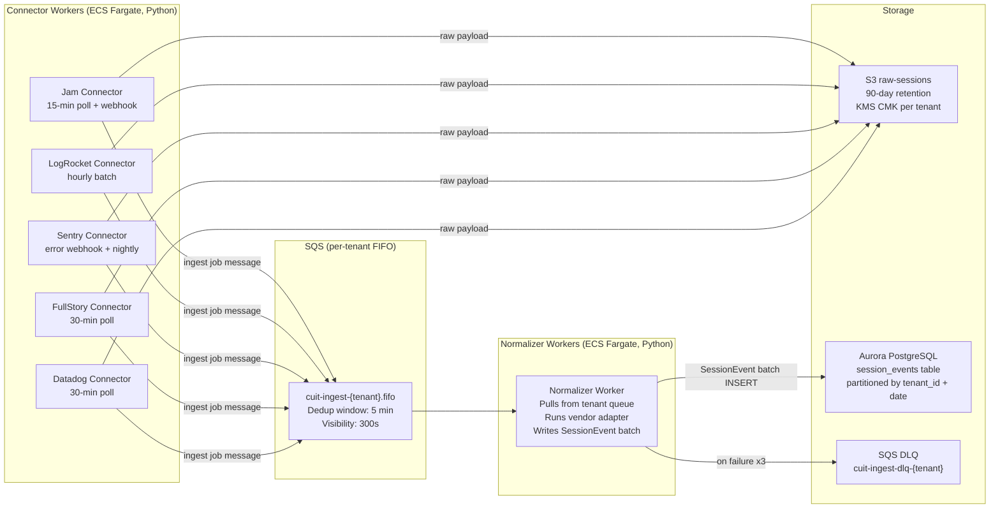
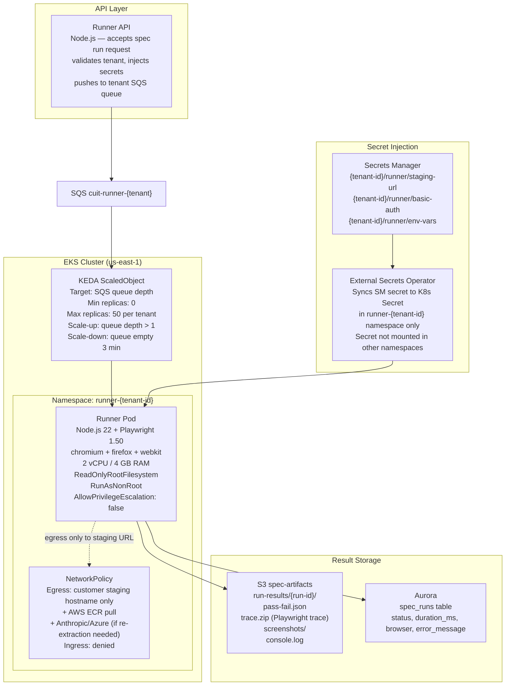
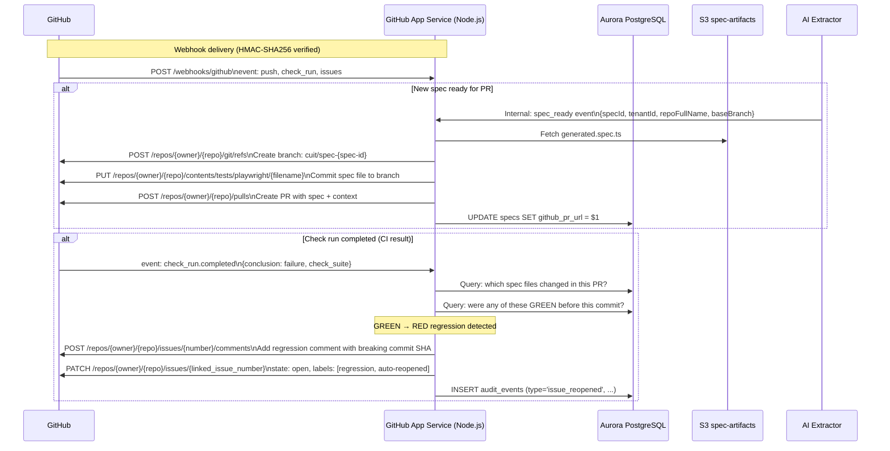

# SaaS Platform Architecture — complex-ui-tester

**Version:** 0.1  
**Date:** 2026-05-25  
**Author:** Platform Architecture Review  
**Status:** Draft — pre-v1

---

## 1. High-Level System Architecture

### Service Map

```mermaid
graph TB
    subgraph External["External Actors"]
        CUST["Customer Browser"]
        GH["GitHub"]
        JAM["Jam"]
        LR["LogRocket"]
        SENTRY["Sentry"]
        FS["FullStory"]
        DD["Datadog RUM"]
    end

    subgraph Edge["Edge / Auth Layer"]
        APIGW["API Gateway\nAWS API Gateway v2\n(Node/HTTP)"]
        WAF["WAF\nAWS WAF"]
        COGNITO["Auth Service\nAmazon Cognito +\nAuth0 for enterprise SSO\n(managed)"]
    end

    subgraph Control["Control Plane — Node.js 22 on ECS Fargate"]
        TENANT["Tenant Management API\nNode.js — CRUD orgs,\nusers, billing plans,\nconnector credentials"]
        BILLING["Billing + Metering API\nNode.js — usage events\nto Stripe + cost ledger"]
        AUDIT["Audit Log Service\nNode.js — append-only\nimmutable event stream"]
        GHAPP["GitHub App Service\nNode.js — webhook\nhandler + PR creator"]
    end

    subgraph Ingest["Session Ingestion Pipeline — Python 3.12 on ECS Fargate"]
        CONN["Connector Workers\nPython — one worker class\nper vendor, pull+push"]
        NORM["Normalizer\nPython — vendor payload\nto SessionEvent schema"]
        DLQ["Dead Letter Queue\nSQS DLQ — failed\nnormalization"]
    end

    subgraph AI["AI Extractor — Python 3.12 on ECS Fargate"]
        ORCH["LLM Orchestrator\nPython LangGraph —\n3-pass pipeline"]
        CACHE["Extraction Cache\nElastiCache Redis —\ncontent-hash keyed"]
        METER["Token Meter\nPython — per-tenant\nbudget enforcement"]
    end

    subgraph Runner["Spec Runner Cluster — Go 1.23 on EKS"]
        RQUEUE["Runner Queue\nSQS FIFO per tenant"]
        RSCHED["Runner Scheduler\nGo — KEDA-driven\npod autoscaler"]
        RPOD["Runner Pods\nPlaywright in K8s pod\nisolated namespace"]
        RRESULT["Result Collector\nGo — store pass/fail\n+ artifacts"]
    end

    subgraph Storage["Storage Layer"]
        AURORA["Aurora PostgreSQL 16\nMulti-AZ — tenants,\nspecs, run results"]
        S3RAW["S3 raw-sessions\nKMS-encrypted per-tenant\nprefix"]
        S3SPEC["S3 spec-artifacts\nKMS — generated .ts\nfiles + screenshots"]
        REDIS["ElastiCache Redis 7\nqueue state + session cache"]
    end

    subgraph Observe["Observability"]
        DD2["Datadog APM + Logs\n+ RUM dashboard"]
        CW["CloudWatch\ninfra metrics + alarms"]
    end

    CUST --> WAF --> APIGW
    APIGW --> COGNITO
    APIGW --> TENANT
    APIGW --> BILLING
    APIGW --> GHAPP
    APIGW --> ORCH

    JAM & LR & SENTRY & FS & DD --> CONN
    CONN --> NORM
    NORM --> S3RAW
    NORM --> AURORA
    NORM --> DLQ

    ORCH --> CACHE
    ORCH --> METER
    ORCH --> S3SPEC
    ORCH --> AURORA

    GHAPP --> GH
    GH --> GHAPP

    TENANT --> AURORA
    BILLING --> AURORA
    AUDIT --> AURORA

    RSCHED --> RQUEUE
    RQUEUE --> RPOD
    RPOD --> RRESULT
    RRESULT --> AURORA
    RRESULT --> S3SPEC

    CONN & NORM & ORCH & RPOD --> DD2
    APIGW & AURORA --> CW
```



### Runtime Language Justifications

| Service | Language | Reason |
|---|---|---|
| API Gateway, Tenant, Billing, GitHub App | Node.js 22 | JSON-heavy I/O bound work, fastest iteration, existing SpeechLab team skills, Stripe SDK first-class |
| Connector Workers, Normalizer, LLM Orchestrator | Python 3.12 | LangGraph, LangChain, anthropic SDK, rrweb parsing — all Python-first. Async I/O handles vendor API polling cleanly |
| Runner Scheduler | Go 1.23 | KEDA autoscaling control loop needs low latency, low memory footprint; Go handles high-concurrency goroutines for pod lifecycle management without GC pressure |
| Runner Pods | Node.js 22 | Playwright is Node-native; running it in Go via subprocess adds zero value |

---

## 2. Cloud Platform & IaC Choice

### AWS vs GCP for v1

**Decision: AWS primary.**

GCP has better managed Playwright-at-scale story (Cloud Run + browser container) and first-class Vertex AI. But:
- SpeechLab's existing infra is AWS — shared VPC peering is simpler
- Aurora Postgres + RDS Proxy handles multi-tenant connection pooling better than Cloud SQL for this workload
- EKS + KEDA is the industry-standard Playwright runner pattern with the most tooling
- S3 + KMS + IAM policy separation for per-tenant object isolation is battle-tested and auditable
- SOC 2 Type II evidence collection is more mature in AWS (CloudTrail, Config, GuardDuty)

Azure OpenAI remains for any GPT-4o fallback (already in use at SpeechLab). GCP is not in scope for v1.

### IaC: AWS CDK (TypeScript)

**Decision: CDK over Terraform for this project.**

Rationale:
- The team writes TypeScript/Node already — CDK constructs are first-class TypeScript, no HCL context switch
- L2/L3 constructs for EKS, Aurora, SQS eliminate hundreds of lines of boilerplate
- CDK Pipelines gives self-mutating pipeline without separate Terraform pipeline tooling
- CDK Nag runs as part of `cdk synth` — security checks are never skipped
- Escape hatch to CloudFormation L1 when needed

Terraform is used only for the Azure OpenAI provider (secondary inference) since CDK has no Azure support.

### Pinned AWS Services

| Layer | Service | Size / Config | Trade-off vs Alternative |
|---|---|---|---|
| Compute — API services | ECS Fargate | 0.5–2 vCPU, 1–4 GB per task | vs EKS: Fargate has zero cluster management overhead for stateless HTTP services. EKS reserved for runner cluster only where KEDA pod-level autoscaling is required |
| Compute — Runner cluster | EKS 1.31 + KEDA 2.14 | m7g.xlarge nodes (ARM Graviton3), spot for workers | vs ECS: KEDA's ScaledObject targeting SQS queue depth is the cleanest autoscale primitive for job queues. No equivalent in ECS |
| Database | Aurora PostgreSQL 16 Serverless v2 | 0.5–16 ACU, Multi-AZ | vs DynamoDB: relational joins across tenants/specs/runs require SQL. RLS for tenant isolation is SQL-native. Serverless v2 eliminates over-provisioning at low tenant counts |
| Object storage | S3 Standard + Intelligent-Tiering | Per-tenant KMS CMK | No alternative — S3 is the universal choice |
| Queue | SQS FIFO (ingest), SQS Standard (runner) | Per-tenant FIFO queues for ingest ordering | vs Kafka: Kafka requires MSK cluster management overhead. SQS scales to zero cost at low volume. Kafka becomes relevant at >10M events/day — revisit at scale |
| Cache | ElastiCache Redis 7 Serverless | Auto-scaled | vs DAX: DAX only serves DynamoDB. Redis handles both extraction cache and queue state |
| Auth | Amazon Cognito + Auth0 (enterprise tier) | User pools per environment | Cognito handles consumer OAuth + OIDC at low cost. Auth0 added for enterprise SAML/SSO which Cognito supports poorly |
| KMS | AWS KMS CMK per tenant | Automatic 365-day rotation | One CMK per tenant — S3, Aurora encryption, Secrets Manager all reference tenant CMK |
| Secrets | AWS Secrets Manager | Auto-rotation where supported | vs SSM Parameter Store: Secrets Manager has native rotation Lambda hooks for RDS creds |
| CDN / edge | CloudFront + WAF | WAF managed rules + rate limiting | Protects dashboard and API from abuse |
| DNS | Route 53 | Weighted routing for blue/green | |
| Container registry | ECR | Image scanning on push | |
| CI/CD | GitHub Actions + CDK Pipelines | | |

---

## 3. Multi-Tenancy Model

### Decision: Hybrid — Pooled DB with Row-Level Security + Per-Tenant S3 Prefix + Per-Tenant SQS Queue

Pure silo (one RDS per tenant) costs ~$200/tenant/month at minimum before any app cost — non-starter at v1. Pure pool risks a noisy-neighbor query destroying p99 for everyone. Hybrid gives isolation where it matters (data, queues) with pooled cost where it doesn't (compute, cluster).

### Database Isolation — Row-Level Security

Every table that holds tenant data carries a `tenant_id UUID NOT NULL` column. Aurora PostgreSQL RLS policies enforce isolation at the engine level:

```sql
-- Applied to every tenant-scoped table
ALTER TABLE sessions ENABLE ROW LEVEL SECURITY;

CREATE POLICY tenant_isolation ON sessions
  USING (tenant_id = current_setting('app.current_tenant_id')::uuid);

-- API service sets this before any query
SET LOCAL app.current_tenant_id = '<tenant-uuid>';
```

The application DB user (`app_rw`) has NO superuser privileges and cannot bypass RLS. A separate `migrations_user` (used only during deploy) has `BYPASSRLS` — its credentials are never in app runtime secrets.

Cross-tenant query is structurally impossible at the DB layer even if application code has a bug.

### Object Storage Isolation — Per-Tenant KMS + S3 Prefix

```
s3://cuit-raw-sessions-{env}/
  tenants/{tenant-id}/sessions/{year}/{month}/{session-id}.json.gz

s3://cuit-spec-artifacts-{env}/
  tenants/{tenant-id}/specs/{spec-id}/
    generated.spec.ts
    run-results/{run-id}/
```

Each tenant gets its own KMS Customer Managed Key. The S3 bucket policy enforces that objects under `tenants/{tenant-id}/` can only be encrypted/decrypted with that tenant's CMK. The IAM role for each ECS task includes a condition restricting KMS access to `kms:ResourceTag/TenantId = ${tenant_id}`.

A cross-tenant read attempt fails at KMS decrypt — the S3 object is returned but is undecryptable without the correct CMK.

### Compute Isolation — Per-Tenant SQS Queues + Runner Namespaces

Each tenant gets:
- One SQS FIFO queue for session ingest: `cuit-ingest-{tenant-id}.fifo`
- One SQS Standard queue for spec runs: `cuit-runner-{tenant-id}`

Connector workers consume only their tenant's queue. This prevents a high-volume tenant's ingest from blocking a low-volume tenant's processing.

For the runner cluster, each spec run executes in a dedicated Kubernetes namespace with:
- `NetworkPolicy` blocking all egress except the customer's declared staging hostname
- Resource quotas (2 vCPU, 4 GB RAM per pod) preventing memory bombs from affecting other pods
- No shared volumes between namespaces

### SOC 2 Audit Verification Points

| Control | Evidence | Where Auditor Looks |
|---|---|---|
| Tenant data isolation | RLS policy definitions in DB schema | Aurora schema export + pg_policies query |
| Encryption at rest | KMS CMK per tenant, S3 default encryption | AWS Config rule `S3_BUCKET_SERVER_SIDE_ENCRYPTION_ENABLED`, KMS key policy |
| Encryption in transit | TLS 1.2+ enforced on ALB + Aurora | ALB listener policy, Aurora parameter `ssl = on` |
| Access control | IAM least-privilege roles, no cross-tenant permissions | IAM Access Analyzer findings (zero cross-account, zero overly-permissive) |
| Audit logging | CloudTrail + application audit log table | CloudTrail S3 export with log file validation enabled |
| Vulnerability management | ECR image scanning on push, Dependabot PRs | ECR scan findings report, GitHub security tab |

---

## 4. Session Ingestion Pipeline

### Common SessionEvent Schema

All vendors normalize to this schema before any downstream processing:

```typescript
interface SessionEvent {
  id: string;                    // deterministic: sha256(vendor+vendorSessionId+sequence)
  tenantId: string;
  sessionId: string;             // vendor-native session ID
  vendorSource: 'jam' | 'logrocket' | 'sentry' | 'fullstory' | 'datadog';
  timestamp: number;             // epoch ms, UTC
  type: 'dom_mutation' | 'user_interaction' | 'console' | 'network' | 'custom';
  subtype: string;               // 'click' | 'drag_start' | 'drag_end' | 'input' | 'scroll' | ...
  target: {
    selector: string;            // CSS selector, vendor-translated
    xpath?: string;
    textContent?: string;
    boundingRect?: DOMRect;
  };
  data: Record<string, unknown>; // vendor-specific payload, preserved verbatim
  rrwebEvent?: RRWebEvent;       // populated when vendor is rrweb-native (Sentry, Datadog)
  bugTag?: string;               // Sentry error ID, Jam report ID — links session to bug
  sequenceIndex: number;
  sessionMetadata: {
    userAgent: string;
    viewportWidth: number;
    viewportHeight: number;
    url: string;
    durationMs: number;
  };
}
```

### Per-Vendor Ingestion Details

#### Jam

| Property | Detail |
|---|---|
| Auth | Per-user OAuth 2.0. Customer authorizes via OAuth flow in dashboard. Tokens stored in Secrets Manager, refreshed automatically |
| Pull vs Push | Pull on schedule (15-min polling) + push via Jam webhook on new recording |
| Volume assumption | Low: 10–200 sessions/day per tenant. Jam is used for one-off bug captures, not continuous recording |
| Rate limits | Jam API: undocumented but observed ~100 req/min. Connector uses exponential backoff with jitter |
| Raw landing | `s3://cuit-raw-sessions/{env}/tenants/{id}/jam/{session-id}.json.gz` within 60 seconds of pull. KMS-encrypted. 90-day retention |
| Normalization | Jam returns partial rrweb-like events + user event summaries. Adapter translates user events to `SessionEvent.subtype`. DOM mutations passed through as-is. Confidence field set to `medium` — Jam's DOM event fidelity is lower than rrweb-native tools |
| Idempotency | Session ID is vendor-provided. Worker checks `SELECT 1 FROM ingest_sessions WHERE vendor='jam' AND vendor_session_id=$1 AND tenant_id=$2` before processing. SQS message deduplication ID = `jam-{session-id}` |
| Dead letter | After 3 failed normalization attempts, raw payload moves to DLQ. Alert fires to on-call. Manual reprocessing via `cuit-cli ingest reprocess --vendor jam --session-id X` |

#### LogRocket

| Property | Detail |
|---|---|
| Auth | Org API token stored in Secrets Manager. Customer pastes token in dashboard connector setup |
| Pull vs Push | Pull: hourly batch export via `/v1/orgs/{org}/apps/{app}/data-export/`. Also supports streaming export to S3 (customer's own bucket) — connector can consume from that too as an alternate path |
| Volume assumption | Medium-high: LogRocket records all sessions in many deployments. Assume 500–5,000 sessions/day per tenant. Apply tenant-level daily cap to prevent runaway ingestion cost |
| Rate limits | LogRocket API: 60 req/min documented. Batch export returns paginated results. Connector uses cursor-based pagination with 45 req/min target |
| Raw landing | Same S3 pattern. LogRocket exports are JSON-L format — each line is one session event batch. Stored as-is, decompressed at normalization time |
| Normalization | LogRocket uses MutationObserver events — structurally similar to rrweb. Adapter maps `mouseInteraction` → `user_interaction`, console → `console`, XHR → `network`. High fidelity. Confidence: `high` |
| Idempotency | `sessionRecordingId` is stable across export runs |
| Dead letter | Same pattern |

#### Sentry Replay

| Property | Detail |
|---|---|
| Auth | Sentry OAuth app OR org token. OAuth preferred — scoped to `project:read` + `event:read` |
| Pull vs Push | **Both.** Push: Sentry error webhook fires when an issue is created/updated. Connector extracts `replay_id` from the error event and fetches the replay. Pull: nightly sweep of unprocessed replays for the project |
| Volume assumption | Medium: only replays linked to errors are ingested by default (otherwise cost explodes). Tenant can opt into "all replays" mode with a daily cap |
| Rate limits | Sentry API: 100 req/s org-level. Replay recording segments are paginated. Connector fetches segments concurrently (5 parallel) with rate limiter |
| Raw landing | Sentry stores replays as rrweb segment arrays. Segments stored verbatim in S3. This is the highest-fidelity source — native rrweb JSON |
| Normalization | rrweb passthrough adapter — minimal transformation. EventType mapping is 1:1. `bugTag` populated from Sentry issue ID. Confidence: `high` |
| Idempotency | `replay_id` + `segment_id` composite key |
| Dead letter | Same pattern |

#### FullStory

| Property | Detail |
|---|---|
| Auth | Org API token (FullStory has no OAuth for third-party integrations as of 2026) |
| Pull vs Push | Pull only: REST Data Export API, paginated by time range |
| Volume assumption | High: FullStory records all sessions at most enterprise customers. Apply aggressive daily cap (1,000 sessions/day default, configurable) |
| Rate limits | FullStory: 200 req/min. Export endpoint returns batches of 100 sessions. Connector polls every 30 minutes |
| Raw landing | FullStory proprietary event format (not rrweb). Stored raw in S3, normalized separately |
| Normalization | Highest adapter complexity. FullStory `EventType` → SessionEvent mapping table maintained in `normalizer/adapters/fullstory/event_map.py`. DOM selector reconstruction from FullStory's element path format is lossy — confidence: `medium` |
| Idempotency | FullStory `SessionId` |
| Dead letter | Same pattern |

#### Datadog RUM

| Property | Detail |
|---|---|
| Auth | Datadog API key + Application key. Stored in Secrets Manager |
| Pull vs Push | Pull: Datadog Events API + RUM Replay API. No native webhook for replay events |
| Volume assumption | Medium: Datadog RUM customers typically sample (10–30% of sessions). Assume 200–2,000 sessions/day per tenant |
| Rate limits | Datadog API: 300 req/min default. RUM Replay segments paginated |
| Raw landing | S3, same pattern |
| Normalization | rrweb-compatible events — Datadog migrated to rrweb format in 2024. Adapter is thin passthrough with Datadog-specific metadata extraction. Confidence: `high` |
| Idempotency | `session_id` + `segment_index` |
| Dead letter | Same pattern |

### Pipeline Architecture



### Retention Policy

| Data | Retention | Reason |
|---|---|---|
| Raw vendor payloads (S3) | 90 days | SOC 2 audit trail; vendor re-pull is possible but slow |
| Normalized SessionEvents (Aurora) | 1 year | Spec regeneration, analytics |
| Generated spec files (S3) | Indefinite (customer-controlled) | These are customer IP |
| Run results + artifacts (S3) | 90 days default, 1 year on enterprise plan | Storage cost driver |
| Audit log (Aurora append-only) | 7 years | SOC 2 requirement |

---

## 5. AI Extractor Service

### 3-Pass LLM Pipeline

```mermaid
flowchart TB
    INPUT["Input bundle\nSessionEvent array (normalized)\n+ console events\n+ network events\n+ bugTag (Sentry issue ID or Jam report ID)"]

    INPUT --> HASH["Content hash\nsha256(sessionId + bugTag + modelVersion)\nCheck Redis extraction cache"]

    HASH -->|cache hit| CACHED["Return cached spec\nno LLM cost"]
    HASH -->|cache miss| BUDGET["Budget check\nTenant token allowance remaining?\nIf over limit → queue or reject with 429"]

    BUDGET --> P1

    subgraph Pass1["Pass 1 — Time Window Identification (Claude claude-sonnet-4-6)"]
        P1["Prompt: Given this event timeline,\nidentify the 5-30 second window\ncontaining the bug-relevant interactions.\nReturn: start_ms, end_ms, confidence, reasoning"]
        P1O["Output: {start_ms, end_ms, confidence}"]
    end

    P1 --> P1O --> FILTER["Filter SessionEvents to window\nTypically 50-300 events remaining\nfrom potentially 10,000+ in full session"]

    FILTER --> P2

    subgraph Pass2["Pass 2 — Interaction Extraction (Claude claude-sonnet-4-6)"]
        P2["Prompt: From these filtered events,\nextract the canonical user interactions\nin order. Map each to the harness primitives:\ndispatchDrag, seekTo, setClock, tick,\ngetState, assertVisible, etc.\nReturn: ordered interaction list with\ntarget selectors and parameters"]
        P2O["Output: InteractionStep[]"]
    end

    P2 --> P2O --> P3

    subgraph Pass3["Pass 3 — Assertion Inference (Claude Opus 4.5)"]
        P3["Prompt: Given these interactions\nand the observable post-bug state\n(DOM mutations, console errors,\nnetwork failures), infer the\ndeterministic assertions the spec\nshould verify. Prefer state assertions\nover visual assertions."]
        P3O["Output: AssertionStep[]"]
    end

    P3 --> P3O --> SPECGEN

    subgraph SpecGen["Spec Generator (Python template engine)"]
        SPECGEN["Combine InteractionStep[] + AssertionStep[]\ninto spec.ts using harness primitives.\nNO raw page.mouse.move() calls.\nAll selectors are semantic, not pixel coords."]
    end

    SPECGEN --> DRYRUN["Dry-run validation\nSubmit spec to Runner cluster\nwith 'validate' flag\nagainst customer dev URL"]

    DRYRUN -->|RED — spec fails| RETRY["Pass 2 retry with\nerror feedback injected\nMax 2 retries"]
    RETRY --> P2
    DRYRUN -->|GREEN — spec reproduces bug| STORE["Store spec in S3\nRecord extraction in Aurora\nUpdate Redis cache\nDecrement tenant token budget"]

    STORE --> READY["Spec ready for\nengineer review\nDashboard notification\n+ optional GitHub PR"]
```



### Inference Provider Strategy

| Role | Provider | Model | When Used |
|---|---|---|---|
| Pass 1 + Pass 2 (high-volume) | Anthropic | claude-sonnet-4-6 | Default. Best cost/quality ratio for structured extraction. ~$3/MTok input, ~$15/MTok output |
| Pass 3 (assertion quality critical) | Anthropic | claude-opus-4-5 | Pass 3 only — assertions need the highest reasoning quality to be correct. ~$15/MTok input, ~$75/MTok output |
| Secondary / fallback | Azure OpenAI | gpt-4o-2024-11-20 | Activated if Anthropic API returns 529 or p95 latency >30s for 3 consecutive minutes. Circuit breaker pattern |
| Local fallback | None in v1 | — | Llama 3.3 70B on EKS GPU nodes is a v2 consideration. Cold-start and quality gap make it premature for v1 |

### Token Budget Metering

Each tenant has a `token_budget` in Aurora:

```sql
CREATE TABLE tenant_token_budgets (
    tenant_id UUID PRIMARY KEY REFERENCES tenants(id),
    monthly_token_limit BIGINT NOT NULL DEFAULT 10000000,  -- 10M tokens default (Starter plan)
    tokens_used_this_month BIGINT NOT NULL DEFAULT 0,
    budget_reset_at TIMESTAMPTZ NOT NULL,
    overage_policy TEXT NOT NULL DEFAULT 'reject'  -- 'reject' | 'queue' | 'allow_with_overage_charge'
);
```

Before each extraction job, the orchestrator calls `acquire_tokens(tenant_id, estimated_tokens)`. This uses a SELECT FOR UPDATE with a 50ms timeout. If budget exhausted, the job is rejected with HTTP 429 and a `Retry-After` header pointing to budget reset date.

Estimated tokens are calculated as: `len(filtered_events_json) / 4 * 3` (conservative 75% character-to-token ratio). Actual tokens (from Anthropic response headers) are reconciled post-extraction.

### Caching Strategy

Redis key: `extraction:{content_hash}:{model_version}`  
TTL: 7 days  
Content hash inputs: `sha256(sorted(session_event_ids) + bug_tag + model_version_string)`

Cache is invalidated when:
- Customer explicitly requests re-extraction
- Model version is bumped (version string is part of the key)
- The extracted spec is rejected by the engineer (feedback loop — mark hash as `rejected`, don't serve from cache)

Cache hit rate target: 30% at steady state (many sessions are unique, but duplicate Sentry errors pointing to same session recur).

### SLA Targets

| Metric | Target | Measurement |
|---|---|---|
| p50 spec generation time (Pass 1+2+3 + dry-run) | < 45 seconds | Datadog APM trace |
| p95 spec generation time | < 3 minutes | Datadog APM trace |
| p99 spec generation time | < 8 minutes | Includes retry on RED dry-run |
| Extraction queue backlog drain (10 concurrent jobs) | < 30 minutes | SQS ApproximateAgeOfOldestMessage alarm at 25 min |
| Provider failover activation | < 90 seconds | Circuit breaker half-open probe interval |

---

## 6. Spec Runner Cluster

### Architecture



### Sandbox Isolation

Each spec run gets a **dedicated Kubernetes pod** in the tenant's namespace. No shared processes, no shared volumes, no shared network namespace. Pod spec enforces:

```yaml
securityContext:
  runAsNonRoot: true
  runAsUser: 10001
  readOnlyRootFilesystem: true
  allowPrivilegeEscalation: false
  seccompProfile:
    type: RuntimeDefault
resources:
  requests:
    cpu: "1"
    memory: "2Gi"
  limits:
    cpu: "2"
    memory: "4Gi"
```

Playwright runs in `--no-sandbox` mode inside the container (the K8s pod IS the sandbox — no need for Chromium's internal sandbox on top). This is the standard pattern for containerized Playwright on Kubernetes.

Firecracker microVMs are not used in v1. They add ~500ms cold start and require custom Kata Containers runtime. Revisit if a multi-tenant customer with untrusted code execution is added. For spec runs executing customer-authored tests, the K8s pod boundary + NetworkPolicy is sufficient.

### Customer Secret Injection

Customer secrets (staging URL, basic auth credentials, API keys for their test environment) are stored in Secrets Manager under `{tenant-id}/runner/*`. External Secrets Operator syncs these to a Kubernetes Secret in the `runner-{tenant-id}` namespace. The secret is mounted as environment variables in the runner pod.

The runner pod never has IAM credentials — it cannot read Secrets Manager directly. The ESO sync is one-way and namespace-scoped. A pod in `runner-tenant-A` cannot read a Secret in `runner-tenant-B`.

Rotation: customer updates secrets via dashboard API → Secrets Manager updated → ESO syncs to K8s Secret within 60 seconds → next run picks up new values automatically.

### Autoscaling

KEDA ScaledObject per tenant queue:

```yaml
triggers:
- type: aws-sqs-queue
  metadata:
    queueURL: https://sqs.us-east-1.amazonaws.com/ACCOUNT/cuit-runner-{tenant-id}
    targetQueueLength: "1"      # 1 message = 1 pod (each spec run is ~30-120s)
    awsRegion: us-east-1
minReplicaCount: 0              # scales to zero when idle — zero cost
maxReplicaCount: 10             # per-tenant cap, configurable per plan
```

Global node pool uses `m7g.xlarge` (4 vCPU, 16 GB, Graviton3) Spot instances with on-demand fallback. Each node can run 3-4 runner pods simultaneously (2 vCPU/4 GB per pod with headroom).

### Per-Tenant Rate Limits

| Plan | Max concurrent runs | Max runs/day | Max spec run time |
|---|---|---|---|
| Starter | 2 | 50 | 5 minutes |
| Growth | 5 | 500 | 10 minutes |
| Enterprise | 20 | unlimited | 20 minutes |

---

## 7. Cost Accounting & Metering

### Per-Spec Cost Calculation

Every spec generation event writes a `usage_events` row:

```sql
CREATE TABLE usage_events (
    id UUID PRIMARY KEY DEFAULT gen_random_uuid(),
    tenant_id UUID NOT NULL REFERENCES tenants(id),
    event_type TEXT NOT NULL,  -- 'extraction' | 'spec_run' | 'session_ingest' | 'storage_gb_day'
    occurred_at TIMESTAMPTZ NOT NULL DEFAULT now(),
    -- LLM extraction fields
    llm_input_tokens BIGINT,
    llm_output_tokens BIGINT,
    llm_provider TEXT,         -- 'anthropic' | 'azure_openai'
    llm_model TEXT,
    llm_cost_usd NUMERIC(10,6),
    -- Runner fields
    runner_duration_ms BIGINT,
    runner_browser TEXT,
    runner_cost_usd NUMERIC(10,6),
    -- Storage fields
    storage_bytes BIGINT,
    storage_cost_usd NUMERIC(10,6),
    -- Composite
    total_cost_usd NUMERIC(10,6) GENERATED ALWAYS AS
        (COALESCE(llm_cost_usd,0) + COALESCE(runner_cost_usd,0) + COALESCE(storage_cost_usd,0)) STORED,
    spec_id UUID REFERENCES specs(id),
    session_id UUID REFERENCES sessions(id)
);
```

### Cost-Per-Spec Math

For a typical spec generation (Starter plan, no caching):

| Component | Calculation | Cost |
|---|---|---|
| Pass 1 (Sonnet) | 8,000 input tokens × $3/MTok + 200 output × $15/MTok | $0.0270 |
| Pass 2 (Sonnet) | 12,000 input × $3/MTok + 800 output × $15/MTok | $0.0480 |
| Pass 3 (Opus) | 6,000 input × $15/MTok + 400 output × $75/MTok | $0.1200 |
| Dry-run runner (Fargate) | 90s × $0.00001406/vCPU-sec × 2 vCPU | $0.0025 |
| S3 storage (spec file, 5KB) | negligible | $0.0001 |
| **Total per spec** | | **~$0.20** |

On cache hit (same session re-extracted): $0.0026 (runner only). This creates a strong incentive to cache aggressively.

At scale with volume discounts on Anthropic (negotiated at >$50K/month): estimated 30% reduction → ~$0.14/spec.

### Billing Surface

Stripe handles invoicing. Usage data flows: `usage_events` → billing aggregation job (runs hourly) → Stripe Meter API → Stripe invoice.

Plans:

| Plan | Price | Includes | Overage |
|---|---|---|---|
| Starter | $99/month | 500 specs generated, 3 connectors | $0.30/spec |
| Growth | $499/month | 3,000 specs, all connectors, 5 users | $0.20/spec |
| Enterprise | Custom | Unlimited specs, dedicated runner pool, SLA, SSO | Negotiated |

The "dependable cost metric" the founder cares about is the **cost-per-spec dashboard**: each customer sees a real-time breakdown of LLM cost, runner cost, and storage cost per spec generated that month, with a running monthly total. This transparency is a differentiator — customers can model their ROI (engineer-hours saved writing tests vs. cost-per-spec).

### Dashboard Cost Widget

```
This month: 127 specs generated
  LLM extraction:     $18.42  (72%)
  Runner compute:     $5.84   (23%)
  Storage:            $1.27   (5%)
  ─────────────────────────────
  Total:              $25.53
  Cost per spec:      $0.201
  Plan allowance:     500 specs ($99/mo)
  Remaining:          373 specs
```

---

## 8. GitHub Integration

### GitHub App Architecture



### GitHub App Registration

The platform registers as a GitHub App (not OAuth App) to get:
- Installation-level access scoped per organization
- Webhook delivery to the platform's endpoint
- Fine-grained permissions: `contents:write`, `pull_requests:write`, `issues:write`, `checks:read`

Each customer installs the GitHub App on their repositories via the standard GitHub App installation flow. Installation ID is stored in `tenant_github_installations` table.

### PR Creation Flow

Generated spec PR includes:
- The `spec.ts` file in the customer's existing Playwright test directory (detected via repository scan or configured in dashboard)
- PR description with: session source link, Sentry issue link (if applicable), confidence score, suggested fix area (file + function, inferred from console stacktrace in session)
- PR body includes a "Review this spec" link to the dashboard where the engineer can see the full session replay alongside the generated test

### Auto-Reopen Logic

When a check run completes with failure on a PR that touches files in `tests/playwright/`:

1. Look up which spec files were modified in the PR
2. Query `spec_run_history` for those specs — was the most recent run on `main` GREEN?
3. If GREEN → RED, this is a regression introduced by this PR
4. Post a comment on the PR citing the spec file, the last-GREEN commit SHA, and the diff since
5. Re-open any GitHub Issues linked to this spec (stored in `spec_issue_links` table, populated when the spec was generated)

This is the direct fix for the "6 Reopened tickets in 60 days" problem documented in the product vision.

---

## 9. CI/CD for the Platform

### Environment Strategy

| Environment | Trigger | Infrastructure | Purpose |
|---|---|---|---|
| `dev` | Push to any feature branch | Shared ECS cluster, shared Aurora (dev schema), no runner cluster | Developer iteration |
| `preview-{pr-number}` | PR opened | Ephemeral: separate ECS tasks, separate Aurora schema, no runner cluster | PR-specific integration testing |
| `staging` | Merge to `main` | Full replica of prod (smaller instance sizes), real runner cluster (max 5 pods) | Pre-prod validation, SpeechLab design partner testing |
| `production` | Manual approval gate after staging | Full prod | Live customers |

### Pipeline Structure

```mermaid
flowchart LR
    PR["PR opened / push"] --> LINT["Parallel jobs:\nlint + typecheck\nunit tests\nCDK synth + Nag\nTerraform plan (Azure)\nDocker build + Trivy scan"]

    LINT -->|all pass| PREVIEW["Deploy preview env\nEphemeral Aurora schema\nRun integration tests\nPost results to PR"]

    PREVIEW -->|PR merged to main| STAGING["Deploy to staging\n1. Run DB migrations (safe)\n2. Deploy ECS services (blue/green)\n3. Run E2E tests against staging\n4. Smoke test runner cluster"]

    STAGING -->|manual approval\n(any 1 of 2 engineers)| PROD["Deploy to production\n1. Run DB migrations\n2. ECS blue/green deploy\n3. Synthetic monitor checks\n4. Canary 10% → 100%"]

    PROD --> NOTIFY["Slack #deploys notification\nDatadog deployment marker\nSentry release created"]
```

### Key CI/CD Decisions

**Database migrations** use `golang-migrate` with forward-only migrations in `staging`. Migrations run as a separate ECS task before the new app version starts. The migration task uses the `migrations_user` (BYPASSRLS capable, connection from Secrets Manager). If migration fails, deployment halts and the previous app version remains running.

**Zero-downtime deploys** via ECS blue/green deployment with CodeDeploy. Traffic shifts from blue to green over 10 minutes with automatic rollback if health checks fail. The ALB target group swap ensures no dropped requests.

**Feature flags** via GrowthBook (self-hosted on ECS, backed by Aurora). Chosen over LaunchDarkly to avoid another SaaS vendor in the data path; GrowthBook OSS is sufficient for a 5-engineer team. SDK integrated into Node.js API services. Flags control: new connector rollout, new LLM model activation, UI dashboard features.

**CDK Pipelines** self-mutate: the pipeline stack updates itself before deploying application stacks. This means pipeline changes go through the same review process as application changes.

```yaml
# .github/workflows/deploy.yml (excerpt)
jobs:
  lint-and-test:
    runs-on: ubuntu-latest
    strategy:
      matrix:
        check: [lint, typecheck, unit-test, cdk-synth]
    steps:
      - uses: actions/checkout@v4
      - uses: actions/setup-node@v4
        with: { node-version: '22', cache: 'npm' }
      - run: npm ci
      - run: npm run ${{ matrix.check }}

  security-scan:
    runs-on: ubuntu-latest
    steps:
      - uses: aquasecurity/trivy-action@master
        with:
          scan-type: fs
          severity: CRITICAL,HIGH
          exit-code: 1

  deploy-staging:
    needs: [lint-and-test, security-scan]
    environment: staging
    if: github.ref == 'refs/heads/main'
    steps:
      - run: npx cdk deploy --app "npx ts-node bin/app.ts" --context env=staging --require-approval never
      - run: npm run test:e2e:staging

  deploy-prod:
    needs: deploy-staging
    environment: production   # GitHub environment with required reviewer
    steps:
      - run: npx cdk deploy --context env=production --require-approval never
```

---

## 10. Observability

### Decision: Datadog (primary) + CloudWatch (infra fallback)

Datadog over Grafana Cloud because:
- Datadog APM traces automatically correlate across ECS tasks, Lambda, and EKS pods with zero instrumentation for AWS services
- The team already uses Datadog RUM (it's one of the session source connectors) — shared vendor reduces context switching
- Datadog Log Management with automatic parsing of structured JSON logs from all services
- Cost: ~$35/host/month. At v1 scale (10 hosts equivalent), $350/month — acceptable

CloudWatch receives all VPC flow logs, ALB access logs, and Aurora slow query logs. These feed CloudWatch Alarms for infra-level breaches (disk, memory) but are not the primary observability surface.

### Distributed Tracing Architecture

Every request gets a `X-Request-ID` header at the API Gateway. This ID flows through all SQS messages (`MessageAttribute: RequestId`) and all database operations (`SET LOCAL app.request_id = $1`). Datadog APM auto-instruments:
- Express.js (API services) — automatic span creation
- Python workers — `ddtrace` library with `patch_all()`
- SQS message polling — producer/consumer trace linking via message attributes
- Aurora queries — automatic slow query spans >100ms

The full trace for "session ingested → spec generated → spec run completed" spans 3 services, 2 queues, and 5-8 minutes of wall time. Datadog's async trace linking (via SQS message attributes) makes this a single connected trace.

### SLOs

| SLO | Target | Measurement Window | Alert Threshold |
|---|---|---|---|
| Session ingestion lag (webhook → SessionEvent in Aurora) | p95 < 60 seconds | 7-day rolling | Alert if p95 > 45s for 10 min |
| Spec generation latency (queue entry → spec ready) | p95 < 3 minutes | 7-day rolling | Alert if p95 > 5 min for 15 min |
| Runner queue depth (per tenant) | < 10 jobs waiting | Real-time | Alert if any tenant queue > 25 jobs |
| API availability | 99.9% (8.7 hours downtime/year) | 30-day rolling | Alert if error rate > 1% for 5 min |
| Extraction provider availability | 99.5% (circuit breaker active < 0.5%) | 30-day rolling | Alert if circuit breaker trips |

### Key Dashboards

**Ingestion Pipeline Dashboard:**
- Sessions received per vendor per hour (by tenant)
- Normalization success/failure rate
- DLQ depth (alarm if > 0 for > 30 min)
- P95 end-to-end ingestion lag

**AI Extractor Dashboard:**
- Extractions queued / in-flight / completed / failed (by tenant)
- P50/P95/P99 extraction time
- Token usage by tenant (current month vs budget)
- Provider split (Anthropic % vs Azure OpenAI %)
- Cache hit rate
- Dry-run pass/fail rate (leading indicator of extraction quality)

**Runner Cluster Dashboard:**
- Active pods per tenant
- Queue depth per tenant
- P95 run duration by browser
- Pass/fail rate by spec (regressions visible immediately)
- Node pool utilization (spot vs on-demand split)

**Business Dashboard:**
- Specs generated today / this week / this month (by tenant)
- GitHub PRs created (by tenant)
- Issues auto-reopened (regression detection hits)
- Revenue: MRR, usage overage

### On-Call Strategy (5-engineer team)

- Pagerduty rotations: 2-week rotations, 1 primary + 1 secondary on-call at all times
- Pages only fire for: API error rate > 1% for 5 min, spec runner cluster down, ingestion DLQ > 10 messages, extraction queue age > 30 min
- Runbooks in `/docs/runbooks/` for every alert type
- No alert for > 15 min average — if it pages, it matters

---

## 11. Cost Projections

### Assumptions

- Spec generation: ~$0.20/spec (blended, including cache hits at 30%)
- ECS Fargate: API + worker services
- Aurora Serverless v2: scales with load
- EKS node pool: Spot instances ($0.0612/hr for m7g.xlarge Spot in us-east-1 as of May 2026)
- S3 + egress: modest
- Datadog: $35/host-equivalent/month

### Monthly Run Rate by Tenant Count

#### 0 Tenants (Baseline infrastructure)

| Service | Config | Monthly Cost |
|---|---|---|
| EKS cluster (control plane) | 1 cluster | $72 |
| Aurora Serverless v2 | 0.5 ACU minimum | $65 |
| ECS Fargate (API + workers, minimal) | 3 tasks × 0.5 vCPU | $35 |
| ElastiCache Redis Serverless | minimal | $30 |
| CloudFront + WAF | minimal | $25 |
| Route 53, ECR, misc | | $20 |
| Datadog (2 hosts) | | $70 |
| GitHub Actions minutes | | $40 |
| **Total** | | **~$357/month** |

#### 10 Paying Tenants (~50 specs/tenant/month = 500 specs/month)

| Service | Config | Monthly Cost |
|---|---|---|
| LLM inference (500 specs × $0.20) | Anthropic + Azure | $100 |
| ECS Fargate (API + 10 connector workers + 5 normalizer + 3 extractor) | ~8 tasks avg | $180 |
| EKS nodes (m7g.xlarge Spot, ~2 nodes avg) | 2 × $45 | $90 |
| Aurora Serverless v2 (2-4 ACU avg) | | $180 |
| S3 (raw sessions + artifacts, ~50 GB) | | $12 |
| ElastiCache Redis Serverless | | $60 |
| SQS, CloudFront, WAF, Route 53 | | $55 |
| Datadog (8 hosts) | | $280 |
| Secrets Manager (100 secrets) | | $40 |
| GitHub Actions | | $80 |
| **Total infrastructure** | | **~$1,077/month** |
| **Revenue** (10 × $99 Starter avg) | | **$990/month** |
| Note: at this scale, cost exceeds revenue — normal for v1 | | |

#### 100 Paying Tenants (~75 specs/tenant/month = 7,500 specs/month)

| Service | Config | Monthly Cost |
|---|---|---|
| LLM inference (7,500 specs × $0.18 blended with volume discount) | | $1,350 |
| ECS Fargate (scaled to load) | ~25 tasks avg | $550 |
| EKS nodes (8 nodes avg, Spot) | 8 × $45 | $360 |
| Aurora Serverless v2 (6-10 ACU avg) | | $450 |
| S3 (500 GB) | | $115 |
| ElastiCache Redis Serverless | | $150 |
| Networking + misc AWS | | $200 |
| Datadog (20 hosts) | | $700 |
| Stripe fees (2.9% of ~$30K MRR) | | $870 |
| GitHub Actions | | $150 |
| **Total** | | **~$4,895/month** |
| **Revenue** (100 tenants × $300 avg blended) | | **~$30,000/month** |
| **Gross margin** | | **~84%** |

#### 1,000 Paying Tenants (~100 specs/tenant/month = 100,000 specs/month)

| Service | Config | Monthly Cost |
|---|---|---|
| LLM inference (100K specs × $0.14 with volume) | Negotiated rate | $14,000 |
| ECS Fargate | ~100 tasks avg | $2,200 |
| EKS nodes (50 nodes avg, Spot with on-demand fallback) | | $3,600 |
| Aurora (provisioned r7g.2xlarge Multi-AZ at this scale) | | $2,400 |
| S3 (5 TB) | | $1,150 |
| ElastiCache (cluster mode) | | $600 |
| CloudFront + WAF + networking | | $1,200 |
| Datadog (100 hosts) | | $3,500 |
| Stripe fees (~$300K MRR × 2.9%) | | $8,700 |
| Misc (CDN, DNS, support tools) | | $800 |
| **Total** | | **~$38,150/month** |
| **Revenue** (1,000 × $300 avg) | | **~$300,000/month** |
| **Gross margin** | | **~87%** |

### Marginal Cost Analysis

At all scales, **LLM tokens are the dominant variable cost** — 60-70% of marginal cost per spec. This means:
1. Cache hit rate is the single most impactful cost lever. Each 10% improvement in cache hit rate reduces marginal cost by ~$0.014/spec
2. Model selection for Pass 3 (Opus is expensive) — a fine-tuned Sonnet for assertion inference could reduce Pass 3 cost by 80% at 1,000 tenant scale
3. The runner fleet becomes significant at >500 tenants where parallel runs scale up, but LLM still dominates

The runner fleet surpasses LLM as the dominant cost only when customers run specs continuously (nightly CI mode across all specs). At that point, reserved EKS node capacity replaces Spot to maintain SLA, pushing compute costs up.

---

## 12. Disaster Recovery

### RPO / RTO Targets

| Scenario | RPO (data loss tolerance) | RTO (recovery time) |
|---|---|---|
| Single AZ failure | 0 (Multi-AZ active-passive) | < 60 seconds (Aurora automatic failover) |
| Single service crash (ECS task) | 0 | < 30 seconds (ECS health check → replacement task) |
| Full region failure | 1 hour (last S3 replication) | 4 hours (cross-region restore) |
| Accidental data deletion (table drop) | 5 minutes (Aurora PITR) | 30 minutes (restore + validate) |
| S3 bucket loss | 24 hours (cross-region replication lag) | 2 hours (restore from replica + reprocess) |

### Backup Architecture

**Aurora PostgreSQL:**
- Automated daily snapshots retained 35 days (Aurora default)
- Point-in-time recovery (PITR) to any second within 35 days
- Cross-region snapshot copy to `us-west-2` daily (automated via CloudWatch Events → Lambda → `copy-db-snapshot`)
- Snapshot exported to S3 in Parquet format weekly for long-term audit retention (7 years)

**S3 (raw sessions + artifacts):**
- S3 Cross-Region Replication enabled: `us-east-1` → `us-west-2` for both `cuit-raw-sessions` and `cuit-spec-artifacts` buckets
- S3 Versioning enabled on all buckets — accidental object deletion is recoverable
- Object Lock (Compliance mode) on `cuit-audit-logs` bucket — audit logs cannot be deleted even by root

**Redis (ElastiCache):**
- Not backed up — Redis holds only cache and queue state, both of which are reconstructible. SQS is the source of truth for queue state.

### Multi-AZ Configuration

All production services are Multi-AZ:
- Aurora: Multi-AZ cluster with 1 writer + 2 readers
- ECS: tasks distributed across `us-east-1a`, `us-east-1b`, `us-east-1c`
- EKS: node groups span 3 AZs
- ElastiCache Redis: cluster mode with replicas across AZs
- SQS: regionally redundant (AWS managed)

Multi-region is a v2 feature, triggered when >10% of tenant base is EU-domiciled (GDPR data residency) or when an enterprise customer contractually requires it.

### Runbook: "S3 Lost a Bucket of Session Payloads"

This scenario means `cuit-raw-sessions-prod` is deleted or corrupted for a tenant's prefix.

**Detection:** CloudWatch alarm on `NumberOfObjects` dropping >20% in 5 minutes, or on-call report.

**Immediate response (0-15 minutes):**
1. Verify scope: `aws s3 ls s3://cuit-raw-sessions-prod/tenants/{tenant-id}/ --recursive | wc -l`
2. Check if deletion was accidental: `aws s3api list-object-versions --bucket cuit-raw-sessions-prod --prefix tenants/{tenant-id}/` — if versioning is intact, objects are recoverable
3. If versioned: restore with `aws s3api list-object-versions | jq ... | xargs aws s3api delete-object --version-id delete-marker-id` (script in `/scripts/dr/restore-s3-versions.sh`)

**If cross-region replication is needed (15-60 minutes):**
1. Identify the CRR replica bucket in `us-west-2`: `cuit-raw-sessions-prod-replica`
2. Sync back: `aws s3 sync s3://cuit-raw-sessions-prod-replica/tenants/{tenant-id}/ s3://cuit-raw-sessions-prod/tenants/{tenant-id}/ --sse aws:kms --sse-kms-key-id {tenant-cmk-arn}`
3. Verify object count matches replica: `aws s3 ls --recursive | wc -l`

**Re-normalization (60-120 minutes):**
Raw payloads that were already normalized into Aurora are not affected — SessionEvents are in Aurora. The S3 raw payloads are only needed for:
- Re-extraction if extraction quality improves
- SOC 2 audit evidence

If raw payloads cannot be recovered from S3, check if the session sources (Jam/LogRocket/Sentry) can be re-fetched via their API for the affected time window. Document in incident report which sessions are unrecoverable.

**Post-incident:**
- Update S3 bucket policy to add `s3:DeleteBucket` deny for all principals except break-glass account
- Add Object Lock on raw-sessions bucket for 90-day compliance hold
- Document in incident post-mortem

---

## Appendix: CDK Stack Decomposition

The CDK app is split into independent stacks with separate lifecycles:

| Stack | Contents | Deploy frequency |
|---|---|---|
| `NetworkStack` | VPC, subnets, NAT gateways, Security Groups | Rare |
| `DataStack` | Aurora, ElastiCache, S3 buckets, KMS CMKs | Rare |
| `AuthStack` | Cognito User Pool, Auth0 config, IAM roles | Rare |
| `EksStack` | EKS cluster, node groups, KEDA, ESO | Weekly |
| `ApiServicesStack` | ECS cluster, all API + worker services | Daily |
| `GithubAppStack` | Lambda webhook handler, API Gateway | Weekly |
| `ObservabilityStack` | CloudWatch dashboards, Datadog forwarder Lambda | Weekly |
| `TenantProvisioningStack` | Lambda for per-tenant SQS + KMS provisioning | Per-customer |

Cross-stack references use SSM Parameter Store (not CDK exports) to avoid circular dependencies and to allow independent deployment order.

---

## Appendix: SpeechLab Design Partner Considerations

SpeechLab (tenant 0) has specific requirements that shape v1 defaults:

1. **Session sources:** Jam (active) + Sentry (active). LogRocket not in use. FullStory not in use. The Jam + Sentry connector pair ships first.
2. **UI type:** waveform editor — Canvas-adjacent but DOM-based. The harness primitives (Layers 1-6) abstract this correctly. No Canvas special-casing needed in v1.
3. **Existing test suite:** 9 Playwright specs + 37 Jest tests (Branch B). The generated specs must land as additions to the existing `tests/playwright/waveform/` directory, not a parallel structure.
4. **Data sensitivity:** SpeechLab's session data contains user audio filenames, project metadata, and potentially customer PII in segment labels. Row-level security, tenant-CMK encryption, and 90-day retention caps are required from day 1 — not a later compliance retrofit.
5. **GitHub integration:** `speechlabinc/translate-ui-react` monorepo. The GitHub App must handle monorepo PR creation correctly — spec files go into a specific subdirectory, not the repo root.

SpeechLab's sessions never leave their tenant prefix in S3 (`tenants/{speechlab-tenant-id}/`). Their CMK is provisioned in a dedicated KMS key alias (`alias/cuit-tenant-speechlab`). The Aurora RLS policy guarantees their session_events rows are inaccessible to any other tenant's DB session.
