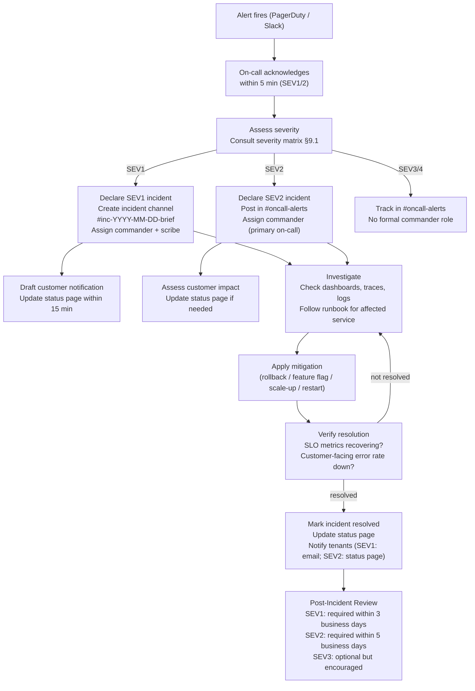

# Operations & SRE Plan

This document defines how the complex-ui-tester SaaS is run in production. Architecture is defined in `03-saas-platform.md`; this document covers availability commitments, observability, alerting, on-call, deployments, capacity, cost management, incident response, and the operational milestones required before each GA gate.

The services described here are the same ones introduced in `03-saas-platform.md §1`: ECS Fargate control-plane services, the EKS spec-runner cluster, Aurora PostgreSQL 16 Multi-AZ, ElastiCache Redis 7, SQS queues, and S3 object storage — all in `us-east-1`, all instrumented with Datadog APM and CloudWatch.

---

## Table of Contents

1. [SLOs, SLIs, and Error Budgets](#1-slos-slis-and-error-budgets)
2. [Service Catalog](#2-service-catalog)
3. [Observability Stack](#3-observability-stack)
4. [Alerting Policy](#4-alerting-policy)
5. [On-Call Rotation](#5-on-call-rotation)
6. [Deployment Pipeline](#6-deployment-pipeline)
7. [Capacity Planning](#7-capacity-planning)
8. [Cost Management](#8-cost-management)
9. [Incident Management](#9-incident-management)
10. [Runbooks](#10-runbooks)
11. [Backup, Restore, and Disaster Recovery](#11-backup-restore-and-disaster-recovery)
12. [Maintenance Windows and Customer Communications](#12-maintenance-windows-and-customer-communications)
13. [Tooling and Access](#13-tooling-and-access)
14. [Hiring and Ramp](#14-hiring-and-ramp)
15. [Year-1 Readiness Milestones](#15-year-1-readiness-milestones)

---

## 1. SLOs, SLIs, and Error Budgets

### 1.1 Service Tiers

Services are grouped into four tiers based on customer impact and recovery urgency. Tier assignment governs alert routing, error budget policy, and on-call paging rules.

| Tier | Services | Rationale |
|---|---|---|
| **1** | Control Plane API (Tenant, Billing, Audit, Auth), GitHub App webhook handler | Direct customer-facing; outage blocks all product usage and breaks GitHub event delivery |
| **2** | Session Ingestion Connectors (Jam, LogRocket, Sentry, FullStory, Datadog), Normalizer Workers | Session ingest falling behind creates visible data lag but does not immediately break the dashboard or active specs |
| **3** | AI Extractor (LLM Orchestrator, Token Meter, Extraction Cache) | Spec generation failures are recoverable by retry; no live customer data at risk |
| **4** | Spec Runner Cluster (Runner Scheduler, Runner Pods, Result Collector) | Runner queue growth impacts spec turnaround time but not availability of existing specs or history |

### 1.2 SLI Definitions

SLIs are measured by Datadog APM and SQS CloudWatch metrics. Definitions are precise to avoid measurement ambiguity.

**Tier 1 — Control Plane API**

| SLI | Definition | Measurement source |
|---|---|---|
| Availability | `(total_requests - error_requests) / total_requests` where error = HTTP 5xx (excluding 503 returned during planned maintenance windows) | Datadog APM `service:control-plane-api` error rate |
| Latency p95 | 95th percentile of request duration for all non-health-check endpoints, measured over a 5-minute window | Datadog APM `p95(duration)` |
| Latency p99 | 99th percentile, same scope | Datadog APM `p99(duration)` |

**Tier 1 — GitHub App Webhook Handler**

| SLI | Definition | Measurement source |
|---|---|---|
| Availability | `(webhooks_accepted_200 + webhooks_queued_202) / total_webhooks_received` — GitHub retries on 5xx, so a 5xx is a confirmed delivery failure | Datadog APM `service:github-app` |
| Processing lag | Time from webhook arrival to `spec_ready` event written to Aurora, for webhook-triggered specs | Custom metric `cuit.spec.webhook_to_ready_ms` |

**Tier 2 — Session Ingestion**

| SLI | Definition | Measurement source |
|---|---|---|
| Availability | `(ingest_jobs_completed) / (ingest_jobs_attempted)` — a failed job that exhausts DLQ retries counts as unavailable | SQS `NumberOfMessagesSent` vs `NumberOfMessagesDeleted` |
| End-to-end ingest latency | Time from connector poll/push to `SessionEvent` row written to Aurora, p95 | Custom metric `cuit.ingest.e2e_latency_ms` |

**Tier 3 — AI Extractor**

| SLI | Definition | Measurement source |
|---|---|---|
| Availability | `(extraction_jobs_completed_non_inconclusive) / (extraction_jobs_attempted)` — INCONCLUSIVE is not a failure; a job that times out or returns an exception is | Custom metric `cuit.extraction.success_rate` |
| Spec-gen turnaround | Time from job enqueue to `spec_ready` event (Pass 1+2+3 + dry-run), p95 | Custom metric `cuit.extraction.total_latency_ms` |

**Tier 4 — Spec Runner Cluster**

| SLI | Definition | Measurement source |
|---|---|---|
| Availability | `(spec_runs_completed) / (spec_runs_dispatched)` — pod OOM or timeout counts as unavailable | Custom metric `cuit.runner.completion_rate` |
| Queue-to-start latency | Time from SQS message enqueue to Playwright runner process start in pod, p95 | Custom metric `cuit.runner.queue_to_start_ms` |

### 1.3 SLO Targets

| Tier | Service | Availability SLO | Latency SLO |
|---|---|---|---|
| 1 | Control Plane API | **99.9%** (43.8 min/month downtime allowance) | p95 < 250ms; p99 < 800ms |
| 1 | GitHub App Webhook Handler | **99.9%** | p95 processing lag < 30s |
| 2 | Session Ingestion | **99.5%** (3.65 hr/month) | End-to-end ingest p95 < 5 min |
| 3 | AI Extractor | **99.0%** (7.3 hr/month) | Spec-gen turnaround p95 < 8 min |
| 4 | Spec Runner Cluster | **99.0%** | Queue-to-start p95 < 60s |

Measurement window for all SLOs: 30-day rolling.

### 1.4 Error Budget Policy

**Error budget = 1 - SLO target, consumed at the rate of actual unavailability.**

| Budget consumed | Action required |
|---|---|
| 0–50% in the current window | Normal operations; no restriction |
| 50–75% | No new Tier 1 or Tier 2 capacity changes without SRE review; document root cause of consumption events |
| 75–100% | **Feature freeze** for affected tier: no non-critical deploys to that service until budget resets; on-call escalation to engineering lead |
| >100% (SLO breached) | **Incident declared** (minimum SEV2 for Tier 1, SEV3 for Tier 2–4); post-incident review required; customer notification triggered for Tier 1 breaches >15 minutes |

**Freeze rules:**
- A deployment freeze applies only to the specific service whose budget is consumed, not to unrelated services.
- Hotfixes that directly recover availability are exempt from the freeze by engineering-lead approval.
- The budget resets on the first day of each calendar month. Consumption history is retained in Datadog SLO tracker for trend analysis.

---

## 2. Service Catalog

The following table enumerates every service from `03-saas-platform.md §1`. Owner is the responsible engineer for Y1 (ryan@speechlab.ai until headcount grows). Capacity headroom target is the fraction of peak capacity that should remain unused under normal load — see §7 for the load model behind these numbers.

| Service | Runtime | Tier | Owner | On-call rotation | Runbook | Key dependencies | Headroom target |
|---|---|---|---|---|---|---|---|
| Control Plane API — Tenant Mgmt | Node.js 22 / ECS Fargate | 1 | ryan@speechlab.ai | Primary | `/docs/runbooks/control-plane.md` | Aurora PG, Cognito, ElastiCache | 40% |
| Control Plane API — Billing + Metering | Node.js 22 / ECS Fargate | 1 | ryan@speechlab.ai | Primary | `/docs/runbooks/control-plane.md` | Aurora PG, Stripe, ElastiCache | 40% |
| Control Plane API — Audit Log | Node.js 22 / ECS Fargate | 1 | ryan@speechlab.ai | Primary | `/docs/runbooks/control-plane.md` | Aurora PG (append-only) | 40% |
| GitHub App Service | Node.js 22 / ECS Fargate | 1 | ryan@speechlab.ai | Primary | `/docs/runbooks/github-app.md` | Aurora PG, S3 spec-artifacts, GitHub API | 40% |
| Jam Connector | Python 3.12 / ECS Fargate | 2 | ryan@speechlab.ai | Primary | `/docs/runbooks/ingestion-connector.md` | SQS FIFO, S3 raw-sessions, Jam API, Secrets Manager | 50% |
| LogRocket Connector | Python 3.12 / ECS Fargate | 2 | ryan@speechlab.ai | Primary | `/docs/runbooks/ingestion-connector.md` | SQS FIFO, S3, LogRocket API | 50% |
| Sentry Connector | Python 3.12 / ECS Fargate | 2 | ryan@speechlab.ai | Primary | `/docs/runbooks/ingestion-connector.md` | SQS FIFO, S3, Sentry API | 50% |
| FullStory Connector | Python 3.12 / ECS Fargate | 2 | ryan@speechlab.ai | Secondary | `/docs/runbooks/ingestion-connector.md` | SQS FIFO, S3, FullStory API | 50% |
| Datadog RUM Connector | Python 3.12 / ECS Fargate | 2 | ryan@speechlab.ai | Secondary | `/docs/runbooks/ingestion-connector.md` | SQS FIFO, S3, Datadog API | 50% |
| Normalizer Workers | Python 3.12 / ECS Fargate | 2 | ryan@speechlab.ai | Primary | `/docs/runbooks/ingestion-connector.md` | SQS FIFO, Aurora PG, SQS DLQ | 50% |
| LLM Orchestrator (AI Extractor) | Python 3.12 / ECS Fargate | 3 | ryan@speechlab.ai | Primary | `/docs/runbooks/ai-extractor.md` | Anthropic API, Azure OpenAI, ElastiCache, Aurora PG, S3 spec-artifacts | 40% |
| Token Meter | Python 3.12 / ECS Fargate | 3 | ryan@speechlab.ai | Primary | `/docs/runbooks/ai-extractor.md` | Aurora PG | 40% |
| Runner Scheduler | Go 1.23 / EKS | 4 | ryan@speechlab.ai | Primary | `/docs/runbooks/runner-cluster.md` | SQS Standard, KEDA, EKS node pool | 60% |
| Runner Pods | Node.js 22 / EKS pods | 4 | ryan@speechlab.ai | Primary | `/docs/runbooks/runner-cluster.md` | S3 spec-artifacts, Aurora PG, Secrets Manager (ESO) | 60% |
| Result Collector | Go 1.23 / EKS | 4 | ryan@speechlab.ai | Primary | `/docs/runbooks/runner-cluster.md` | S3 spec-artifacts, Aurora PG | 60% |
| Aurora PostgreSQL 16 (Multi-AZ) | AWS RDS managed | 1 | ryan@speechlab.ai | Primary | `/docs/runbooks/aurora-failover.md` | AWS RDS, KMS | 40% |
| ElastiCache Redis 7 (Serverless) | AWS managed | 1 | ryan@speechlab.ai | Primary | `/docs/runbooks/redis-failover.md` | AWS ElastiCache | 40% |
| S3 raw-sessions | AWS S3 + CRR | 2 | ryan@speechlab.ai | — | `/docs/runbooks/s3-restore.md` | KMS CMK per tenant, S3 CRR to us-west-2 | — |
| SQS queues (per-tenant FIFO + DLQ) | AWS SQS managed | 2 | ryan@speechlab.ai | — | `/docs/runbooks/ingestion-connector.md` | AWS SQS | — |
| GrowthBook (feature flags) | ECS Fargate (OSS) | 3 | ryan@speechlab.ai | Secondary | `/docs/runbooks/feature-flags.md` | Aurora PG | 40% |

---

## 3. Observability Stack

### 3.1 Tools and their roles

| Tool | Role | What it owns |
|---|---|---|
| Datadog APM | Distributed traces across all services | Request latency, error rates, span-level profiling, SLO tracking |
| Datadog Logs | Structured log aggregation | Parsed JSON logs from all ECS tasks and EKS pods; log-based alerts |
| Datadog RUM | Frontend observability | Dashboard load times, JS errors, user session funnels |
| Datadog Monitors | Alerting engine | All symptom-based alerts; PagerDuty and Slack routing |
| CloudWatch | AWS infra metrics | VPC flow logs, ALB access logs, Aurora slow query log, ECS/EKS node metrics, SQS queue depth |
| CloudWatch Alarms | Infra-level alerting | Disk full, memory pressure, unhealthy target count — feeds into Datadog via the Datadog-CloudWatch integration |
| Sentry | Application error tracking | Unhandled exceptions in Node.js and Python services; source-map linked stack traces |

Datadog is the primary observability surface. CloudWatch is the infra safety net and the evidence store for SOC 2 audit controls (per `05-security-compliance.md`).

### 3.2 Log structure

Every log line is structured JSON. Required fields on every log event:

```json
{
  "ts": "2026-05-26T14:32:01.123Z",
  "level": "info",
  "service": "control-plane-api",
  "version": "1.4.2",
  "env": "production",
  "tenant_id": "t_01j...",
  "request_id": "req_9f...",
  "trace_id": "dd_abc123...",
  "span_id": "dd_def456...",
  "msg": "spec generation job enqueued",
  "spec_id": "spec_7e...",
  "duration_ms": 42
}
```

`tenant_id` and `request_id` are **required** on every log event from any service that handles tenant-scoped data. Log lines missing these fields are flagged by a Datadog log parser rule and emitted to a `log-quality-violations` metric for periodic review. Services that handle internal infrastructure (e.g., GrowthBook health checks) omit `tenant_id` but retain `request_id` and `trace_id`.

Fields that must never appear in logs: OAuth tokens, API keys, raw session DOM content, PII (emails, names, credit card numbers). Log sanitization is enforced in the logging middleware layer (`src/middleware/log-sanitizer.ts`) which strips any field matching a known-sensitive key list before emission.

### 3.3 Trace propagation across SQS hops

The full spec-generation trace spans three services and two SQS hops:

```
Control Plane API → SQS ingest FIFO → Normalizer → SQS extraction queue → LLM Orchestrator
```

Trace context is propagated using **W3C Trace Context** (`traceparent` and `tracestate`) stored as SQS Message Attributes:

```python
# Producer (Normalizer, after writing SessionEvent)
message_attributes = {
    "traceparent": {
        "DataType": "String",
        "StringValue": ddtrace.tracer.current_trace_headers()["traceparent"]
    },
    "tracestate": {
        "DataType": "String",
        "StringValue": ddtrace.tracer.current_trace_headers().get("tracestate", "")
    },
    "RequestId": {
        "DataType": "String",
        "StringValue": request_id
    },
    "TenantId": {
        "DataType": "String",
        "StringValue": tenant_id
    }
}
```

The consumer (LLM Orchestrator) extracts `traceparent` and calls `ddtrace.tracer.extract(Format.HTTP_HEADERS, headers)` before starting its span. This produces a single connected trace in Datadog from the original HTTP request through to the dry-run result, spanning 5–8 minutes of wall time.

`request_id` is also included as a message attribute so it flows through without requiring trace reconstruction.

### 3.4 RED dashboards per service (Tier 1 and Tier 2)

Each service has a dedicated Datadog dashboard with the three RED signals (Rate, Errors, Duration) as the top three panels, followed by service-specific panels. Dashboard naming convention: `cuit - {service-name} - RED`.

| Dashboard | Top panels | Service-specific panels |
|---|---|---|
| `cuit - control-plane - RED` | Request rate, error rate (5xx%), p95/p99 latency | Auth failures per minute, RBAC denial rate, Stripe webhook lag |
| `cuit - github-app - RED` | Webhook receipt rate, 5xx%, p95 processing lag | PR creation success rate, issue-reopen rate, GitHub API rate limit remaining |
| `cuit - ingestion - RED` | Sessions ingested/hr by vendor, normalization failure rate, p95 ingest latency | DLQ depth by tenant, connector poll lag by vendor, SQS queue depth |
| `cuit - ai-extractor - RED` | Extractions/hr, failure rate (exception + timeout), p95/p99 turnaround | Token usage by tenant (% of budget), cache hit rate, provider split (Anthropic % vs Azure %), dry-run pass rate |
| `cuit - runner - RED` | Spec runs/hr, failure rate (OOM + timeout), p95 run duration | Queue depth per tenant, pod count by state, node pool spot/on-demand split, KEDA scale events/hr |

### 3.5 USE dashboards for infrastructure

Infrastructure resources follow the USE method (Utilization, Saturation, Errors). Dashboard: `cuit - infrastructure - USE`.

| Resource | Utilization | Saturation | Errors |
|---|---|---|---|
| ECS tasks (per service) | CPU% and memory% of limit | Task replacement rate (restarts/hr) | ECS task exit codes (non-zero) |
| EKS nodes (runner pool) | CPU% and memory% per node | Pending pods waiting for node scale-up | Node NotReady events |
| Aurora PostgreSQL | ACU utilization, connection count / max_connections | Replication lag on read replicas | Slow queries >500ms/hr, deadlock count |
| ElastiCache Redis | Memory used / max, connection count | Evicted keys/hr | Cache errors, cluster failover events |
| SQS queues | Messages in flight / visibility timeout | `ApproximateAgeOfOldestMessage` by queue | DLQ depth, dead-letter delivery rate |
| S3 | Storage bytes by bucket/prefix | — | 5xx error rate per bucket |

---

## 4. Alerting Policy

### 4.1 Principles

Three rules apply to every alert before it goes live:

1. **Symptom-based, not cause-based.** Alert on "API error rate elevated" not "ECS task exited". The engineer follows the runbook to find the cause.
2. **Every alert links to a runbook.** No alert fires without a `runbook_url` field in the monitor definition. No exceptions.
3. **Alert hygiene is a quality gate.** Any alert that fires and is silenced or resolved without action within 30 minutes is a candidate for tuning. Monthly alert hygiene review compares fire count vs. action taken.

### 4.2 Multi-burn-rate SLO alerts (Google SRE book pattern)

For Tier 1 and Tier 2 SLOs, multi-burn-rate alerting fires at two speeds:

| Window | Burn rate threshold | Alert severity | Meaning |
|---|---|---|---|
| 1 hour / 5 minute | 14× | **Page immediately** (SEV1/SEV2) | Consuming 14% of 30-day budget in 1 hour — budget exhausted in ~2 days if not corrected |
| 6 hour / 30 minute | 6× | **Page** (SEV2/SEV3) | Consuming 6% per hour — budget exhausted in ~5 days |
| 3 day / 6 hour | 1× | **Slack notification** | Steady slow burn — trend alert, no immediate action required |

For Tier 3 and Tier 4, only the 6-hour/30-minute and 3-day/6-hour windows are used (no immediate page).

### 4.3 Alert routing

| Alert type | Destination | Who acts |
|---|---|---|
| Tier 1 SLO burn (fast) | PagerDuty → primary on-call | Primary on-call, escalate to engineering lead if no ack in 5 min |
| Tier 2 SLO burn (fast) | PagerDuty → primary on-call | Primary on-call |
| Tier 1/2 SLO burn (slow) | Slack `#oncall-alerts` | Reviewed at start of next business hour |
| Tier 3/4 SLO burn | Slack `#oncall-alerts` | Secondary on-call reviews; pages primary only if burn rate accelerates |
| DLQ depth > 0 for > 30 min | Slack `#oncall-alerts` | On-call; see ingestion runbook |
| Aurora failover detected | PagerDuty → primary on-call | Primary on-call |
| Redis cluster failover | PagerDuty → primary on-call | Primary on-call |
| Budget threshold 80% (tenant) | Email + Slack to tenant and internal `#billing-alerts` | Account owner follows up with tenant |
| Deployment failure | Slack `#deploys` | Engineer who triggered the deploy |

### 4.4 Alert definitions that must exist before GA

The following Datadog monitor definitions are required before each GA gate (see §15). This list is the source of truth — if a monitor from this list does not exist in Terraform, the deployment is blocked.

| Monitor name | Type | Condition | Runbook |
|---|---|---|---|
| `cuit-api-error-rate-high` | SLO burn | Tier 1 fast burn | `control-plane.md` |
| `cuit-api-p99-latency-high` | Threshold | p99 > 800ms for 5 min | `control-plane.md` |
| `cuit-github-webhook-lag-high` | Threshold | p95 processing lag > 25s for 5 min | `github-app.md` |
| `cuit-ingest-dlq-nonempty` | Threshold | DLQ depth > 0 for 30 min | `ingestion-connector.md` |
| `cuit-ingest-latency-high` | SLO burn | Tier 2 fast burn | `ingestion-connector.md` |
| `cuit-extraction-queue-age-high` | Threshold | `ApproximateAgeOfOldestMessage` > 7 min | `ai-extractor.md` |
| `cuit-extraction-token-budget-exhausted` | Threshold | Any tenant at 95%+ of monthly token budget | `ai-extractor.md` |
| `cuit-runner-pod-oom` | Log-based | OOMKilled event in EKS pod logs | `runner-cluster.md` |
| `cuit-runner-queue-depth-high` | Threshold | Any tenant queue > 20 messages | `runner-cluster.md` |
| `cuit-aurora-failover` | CloudWatch | RDS `FailoverComplete` event | `aurora-failover.md` |
| `cuit-aurora-connections-high` | Threshold | Connection count > 80% of max | `aurora-failover.md` |
| `cuit-redis-failover` | CloudWatch | ElastiCache `FailoverComplete` event | `redis-failover.md` |
| `cuit-deploy-failure` | GitHub Actions | Workflow conclusion = failure on main | `deploy-rollback.md` |

### 4.5 On-call escalation path

```
Alert fires → PagerDuty pages primary on-call
    ↓ (no ack in 5 minutes)
Secondary on-call paged
    ↓ (no ack in 10 minutes from primary)
Engineering lead (ryan@speechlab.ai) paged directly
    ↓ (SEV1 only, no resolution in 30 minutes)
Incident commander declared, customer notification drafted
```

---

## 5. On-Call Rotation

### 5.1 Rotation structure

Year 1 constraint: ryan@speechlab.ai is the only engineer until the first engineering hires land. The rotation structure below is the target once the founding engineering team reaches 3+; until then, ryan is both primary and secondary.

| Role | Cadence | Responsibilities |
|---|---|---|
| **Primary on-call** | Weekly (Mon 09:00 ET → Mon 09:00 ET) | First responder to all PagerDuty pages; acknowledges within 5 minutes; owns incident until resolved or handed off |
| **Secondary on-call** | Weekly, offset by 3.5 days from primary | Backup if primary does not ack; assists on SEV1/SEV2; covers primary during PTO |
| **Escalation manager** | Ryan (permanent Y1) | Receives escalation pages for SEV1 if primary+secondary do not resolve within 30 min; authorizes customer communication and rollbacks |

Rotation schedule is maintained in PagerDuty under schedule `cuit-oncall-primary` and `cuit-oncall-secondary`. Changes require 72-hour notice except for emergency swaps.

### 5.2 On-call compensation policy

Until Series A close, on-call compensation follows SpeechLab's founding-team agreement. Post-Series A, the policy is:

- Weekday pages (Mon–Fri 08:00–22:00 local): no additional compensation (within normal work expectations)
- Off-hours pages (22:00–08:00 or weekends): 0.5 day of comp time per page that requires >30 minutes of active work
- On-call weeks with >3 off-hours pages: engineering lead reviews and considers rotation adjustment

Comp time is tracked in the HR system and does not expire.

### 5.3 Handoff protocol

At the end of each on-call week, the outgoing primary completes a handoff document and posts it in `#oncall-handoff` Slack channel. Template:

```markdown
## On-Call Handoff — Week of YYYY-MM-DD

**Outgoing:** [name]
**Incoming:** [name]

### Incidents this week
- [SEV/date/service/root cause/resolution/follow-up action items]

### Open issues to watch
- [anything trending toward an alert threshold but not yet alerting]

### Runbook gaps discovered
- [any runbook that was missing or incorrect; link to PR fixing it]

### System state
- Error budget consumed this week: Tier 1 __%, Tier 2 __%, Tier 3 __%, Tier 4 __%
- Any tenant hitting token budget limits or exhibiting unusual traffic patterns: [details]
- Deployments this week: [list with SHA and any issues]

### Anything else the incoming on-call should know
- [free text]
```

The handoff document is required. Missing handoffs are flagged in the weekly engineering sync.

### 5.4 SRE hire trigger

The founding team takes on-call until either (a) $1M ARR or (b) 50 paying tenants — whichever comes first. At that point, the first dedicated SRE hire is approved. See §14 for the full hiring plan.

---

## 6. Deployment Pipeline

### 6.1 Environment strategy

Four environments match `03-saas-platform.md §9`:

| Environment | Trigger | Purpose |
|---|---|---|
| `dev` | Push to any feature branch | Developer iteration; shared ECS cluster, no runner cluster |
| `preview-{pr-number}` | PR opened | Ephemeral, per-PR integration testing; auto-destroyed on PR close |
| `staging` | Merge to `main` | Full prod replica (smaller instance sizes); SpeechLab design partner testing; daily deploy target |
| `production` | Manual approval gate after staging green | Live customers; weekly release window (Tuesday 14:00 ET, or hotfix path) |

### 6.2 Pipeline gates

Every deployment to staging and production must pass all of the following gates in sequence. Failure at any gate halts the deployment.

```mermaid
flowchart LR
    PR["PR / merge to main"] --> CI

    subgraph CI["CI Gates (parallel, required)"]
        LINT["lint + typecheck"]
        UNIT["unit tests"]
        CDK["CDK synth + CDK Nag\n(security checks)"]
        SEC["Trivy FS scan\nCRITICAL/HIGH = fail"]
        EVAL["Prompt eval suite\n(04-ai-spec-generation.md §8)\nAcceptance rate regression = fail"]
    end

    CI -->|all pass| STAGING_DEPLOY

    subgraph STAGING_DEPLOY["Staging Deploy"]
        MIG_S["DB migration (golang-migrate)\nforward-only, separate task"]
        ECS_S["ECS blue/green deploy\nCodeDeploy, 10 min traffic shift"]
        E2E["E2E test suite\nagainst staging URL"]
        SMOKE["Smoke test runner cluster\n1 synthetic spec run per browser"]
    end

    STAGING_DEPLOY -->|all pass| APPROVAL["Manual approval\n(1 of 2 engineers)"]
    APPROVAL --> PROD_DEPLOY

    subgraph PROD_DEPLOY["Production Deploy"]
        MIG_P["DB migration"]
        CANARY["Canary 10% traffic\nfor 30 minutes"]
        GUARD["Error-rate guard\nrollback if 5xx > 0.5% during canary"]
        FULL["100% traffic shift"]
    end

    PROD_DEPLOY --> NOTIFY["Datadog deployment marker\nSlack #deploys\nSentry release"]
```



**Prompt eval gate:** any change to a prompt template, model version, or extraction logic in `04-ai-spec-generation.md §4` must pass the eval harness before staging deploy. The eval runs the 8 Branch B historical bugs plus the accumulated accepted/rejected spec corpus. A drop in acceptance rate of >5 percentage points relative to the prior baseline fails the gate. This gate is enforced regardless of error budget state.

**Canary guard:** during the 30-minute canary window, Datadog monitors `cuit-api-error-rate-high` against the canary target group. If 5xx rate on the canary cohort exceeds 0.5% for 3 consecutive minutes, the CodeDeploy deployment is automatically rolled back via the `cuit-canary-rollback` Lambda (invoked by a CloudWatch alarm). The engineer does not need to manually intervene — rollback is automatic, and a Slack notification fires with the rollback reason.

### 6.3 Release cadence

| Environment | Cadence | Notes |
|---|---|---|
| Staging | Daily (on merge to `main`) | Every PR that passes CI gates reaches staging the same day |
| Production | Weekly, Tuesday 14:00 ET | The staging-to-prod promotion is a single manual approval for all changes accumulated since last Tuesday |
| Hotfix | Any time | See §6.4 |

The weekly prod window is chosen for Tuesdays at 14:00 ET because: Monday gives time to catch staging regressions; Tuesday afternoon ET is business-hours overlap for US and EU; Friday deployments are prohibited (error budget protection).

### 6.4 Hotfix path

A hotfix is defined as a fix for a SEV1 or SEV2 production incident where waiting until the next weekly window is unacceptable.

1. Engineer creates a branch from the last production tag (not from `main`, which may contain unreleased changes).
2. Fix is implemented, reviewed, and merged to the hotfix branch by at least one other engineer (or the engineering lead if team is too small).
3. Hotfix branch runs the same CI gates as `main` (no skipping).
4. Hotfix is deployed to staging and passes the smoke test (abbreviated E2E is acceptable for a true hotfix).
5. Engineering lead approves the prod deploy; canary window is shortened to 10 minutes.
6. After hotfix lands in prod, it is merged back to `main` via a PR.
7. The hotfix is documented in the incident post-mortem.

Hotfixes are tracked in a `hotfixes/` directory in the repo with one file per hotfix: `hotfixes/YYYY-MM-DD-{service}-{brief-description}.md`.

---

## 7. Capacity Planning

### 7.1 Load model

The model below anchors all scaling and headroom decisions. Inputs are tenant count and per-tenant activity assumptions.

**Session ingestion**

| Variable | Design-partner GA (3 tenants) | Public beta (10 tenants) | GA (open signup, 50 tenants) |
|---|---|---|---|
| Sessions ingested / tenant / day | 50 (SpeechLab-like usage) | 200 (mixed Sentry + Jam) | 500 (mixed, some FullStory heavy) |
| Peak-to-average ratio | 3× (batch export flush) | 3× | 4× |
| Peak sessions / hr (all tenants) | ~19 | ~250 | ~4,200 |
| Normalizer tasks needed at peak | 1 task (0.5 vCPU) | 2 tasks | 8 tasks |

**AI extractor**

| Variable | 3 tenants | 10 tenants | 50 tenants |
|---|---|---|---|
| Specs generated / tenant / day | 5 | 8 | 10 |
| Peak concurrent extractions | 2 | 5 | 20 |
| Token throughput at peak (Anthropic input) | ~80k tokens/hr | ~200k/hr | ~1M/hr |
| Extractor tasks needed | 1 | 2 | 6 |

**Spec runner cluster**

| Variable | 3 tenants | 10 tenants | 50 tenants |
|---|---|---|---|
| Spec runs / tenant / day | 10 (dry-run + 1 CI run) | 20 | 30 |
| Average run duration | 90s | 90s | 90s |
| Peak concurrent pods needed | 3 | 10 | 40 |
| EKS nodes required at peak (3 pods/node) | 1 (+ headroom: 2) | 4 (+2) | 15 (+9) |

### 7.2 Headroom targets and auto-scaling

| Service | Headroom target | Rationale | Auto-scaling mechanism |
|---|---|---|---|
| Control Plane API (ECS) | 40% CPU/memory headroom at p95 load | Tier 1; spikes from GitHub webhook storms | ECS target tracking, CPU target 60% |
| Ingestion Connectors (ECS) | 50% headroom | Tier 2; batch export flushes cause 3–4× spikes | ECS target tracking, SQS queue depth metric via Application Auto Scaling |
| AI Extractor (ECS) | 40% headroom | Tier 3; LLM call duration is the bottleneck, not CPU | ECS target tracking, custom metric `extraction_queue_depth` |
| Runner Pods (EKS) | 60% headroom | Tier 4; most burst-prone; cold-start latency matters | KEDA ScaledObject per tenant queue, `targetQueueLength: 1`, min 0 / max 10 per tenant |
| Aurora PostgreSQL | 40% ACU headroom | Tier 1 dependency; serverless v2 scales, but query connection count is a hard limit | Aurora Serverless v2 auto-scales; alert at 80% `max_connections` |
| ElastiCache Redis | 40% memory headroom | Tier 1 dependency | Redis Serverless auto-scales; alert at 80% memory |

EKS node pool uses Spot instances (m7g.xlarge, Graviton3) with 20% on-demand fallback. Cluster Autoscaler provisions new nodes when pending pods exceed 0 for 2 minutes. Node scale-down delay is 10 minutes to avoid thrashing on short spec bursts.

### 7.3 Capacity review cadence

Monthly capacity review on the first Tuesday of each month. Agenda:

1. Review actual vs modeled load for each service in the prior month
2. Review auto-scaling events: how many times did any service hit its max? How close did the runner cluster come to its per-tenant cap?
3. Review Spot interruption rate on EKS nodes: if >5%, evaluate switching to a different instance type or region
4. Update the load model with actual per-tenant session and spec volumes
5. Confirm headroom targets are met; if any service is running below target headroom, file a capacity action item
6. Review reserved capacity purchases: commit to 1-year Compute Savings Plan when EC2 spend exceeds $500/month (currently Fargate Savings Plans for ECS)

Capacity review output is a one-page note in `history/capacity-YYYY-MM.md`.

---

## 8. Cost Management

### 8.1 Per-tenant cost attribution

Every infrastructure cost is attributed to a tenant via the `usage_events` table (schema in `03-saas-platform.md §7`). The four cost components per tenant:

| Component | Attribution method | Billing line item |
|---|---|---|
| LLM inference (Anthropic + Azure) | Per-job token counts from provider response headers, stored in `usage_events.llm_cost_usd` | Spec generation cost |
| Runner compute (EKS pods) | Pod run duration × node-cost-per-second, tagged with `tenant_id` via EKS pod label | Runner minutes |
| Ingestion storage (S3) | Per-tenant S3 prefix byte-count, sampled daily by a Lambda | Sessions stored |
| Database compute (Aurora) | ACU × duration apportioned by tenant's share of query time (sampled from pg_stat_statements hourly) | Platform fee component |

The cost dashboard visible to customers (`03-saas-platform.md §7` widget) reflects `usage_events` in near-real-time (2-minute lag). Internal cost attribution for FinOps uses the same data, augmented with AWS Cost and Usage Report (CUR) line items.

### 8.2 Cost SLOs

Internal cost targets. Breaching these triggers a FinOps review, not a customer-facing alert.

| Metric | Target | Action on breach |
|---|---|---|
| All-in cost per spec generated (LLM + runner + storage) | < $0.40 at list price; < $0.20 at steady state (volume discounts + cache) | Review cache hit rate; review Opus → Sonnet model routing; review runner pod sizing |
| Per-active-tenant infra cost (tenants with >0 activity this month) | < $120/month at 10-tenant scale; < $60/month at 100-tenant scale | Auto-scaling review; identify noisy-neighbor tenants; consider per-tenant rate limiting |
| LLM cost as % of total infra cost | < 65% at steady state | If rising, investigate cache hit rate regression or model version change |
| Runner cost as % of total infra cost | < 25% at steady state | If rising, investigate spec timeout rate or pod sizing |

### 8.3 FinOps review cadence

Monthly FinOps review on the third Tuesday of each month (after the capacity review, using the same data).

1. Pull AWS Cost and Usage Report for the prior month; reconcile against `usage_events` totals
2. Review per-tenant cost vs revenue; flag tenants with cost > revenue (loss-leader acceptable during design-partner phase; not sustainable beyond Q2)
3. Review idle resources: any ECS tasks, EKS nodes, or Aurora ACUs running at <10% utilization for >7 days are candidates for Right-Sizing
4. Review Savings Plan coverage: Fargate Savings Plan should cover >70% of Fargate spend; Compute Savings Plan should cover >60% of EC2 spend
5. Review Spot interruption impact on runner SLO
6. Commit to any new Savings Plans or Reserved Instances

### 8.4 Reserved and Spot strategy

| Resource | Strategy | Rationale |
|---|---|---|
| ECS Fargate (control plane) | Fargate Compute Savings Plan (1-year, no-upfront) once spend exceeds $300/month | Predictable baseline load; Savings Plan breaks even at ~35% discount vs on-demand |
| EKS nodes (runner pool) | Spot with 20% on-demand fallback; diversified across m7g.xlarge, m6g.xlarge, m6i.xlarge | Runner pods are ephemeral and stateless; Spot interruption handled by KEDA rescheduling |
| Aurora Serverless v2 | No reservation needed; ACU auto-scales per request | Serverless pricing already optimized for variable load |
| ElastiCache Redis Serverless | No reservation; auto-scales | Same reasoning |

### 8.5 Dev and staging Right-Sizing

Dev and staging environments run at reduced capacity:

- ECS tasks: 0.25 vCPU / 512 MB (vs 0.5–2 vCPU / 1–4 GB in prod)
- Aurora: 0.5 ACU min (same as prod baseline; acceptable since it's Serverless v2)
- EKS runner cluster: max 5 pods; Spot only; scale-to-zero after 30 min idle
- Dev environments: automatically stopped at 20:00 ET daily and restarted at 08:00 ET Monday–Friday via a scheduled Lambda

Dev/staging Right-Sizing is reviewed quarterly. Any resource running in staging at >50% of its prod equivalent is flagged for reduction.

---

## 9. Incident Management

This section covers operational incidents — outages, performance degradation, and capacity exhaustion. Security incidents are governed by `05-security-compliance.md §7` and follow a separate process.

### 9.1 Severity matrix

| Severity | Definition | Page rule | Customer notification | Target time-to-resolve |
|---|---|---|---|---|
| **SEV1** | Tier 1 service completely unavailable OR data loss confirmed OR all tenants unable to generate specs | Page primary + secondary immediately; escalate to engineering lead in 10 min if not ack'd | Status page update within 15 min; email to all affected tenants within 30 min | 2 hours |
| **SEV2** | Tier 1 SLO breached (error rate >0.1% or p99 >2s for >10 min) OR Tier 2 ingest down for >30 min for any tenant | Page primary on-call; secondary on standby | Status page update within 30 min if customer-impacting; email if >1 hour | 4 hours |
| **SEV3** | Tier 3/4 SLO degraded (AI extractor slow, runner queue growing) OR single-tenant ingestion failure | Slack alert to `#oncall-alerts`; on-call acknowledges within 30 min | No proactive notification unless tenant reports; update if tenant reports | 8 hours (next business day if off-hours) |
| **SEV4** | Cosmetic issues, non-critical dashboard failures, DLQ depth <5, minor latency elevation | Slack notification; engineering team aware; no page | No notification | Next sprint |

**Declaring an incident:** any engineer can declare an incident. Declaring is never wrong. The cost of a false alarm is a 15-minute meeting; the cost of delayed declaration is a longer outage and a harder post-mortem.

### 9.2 Incident response flow



### 9.3 Commander and scribe roles

**Incident Commander (IC):**
- Owns the incident from declaration to resolution
- Makes all decisions: rollback, escalation, customer communication
- Does not debug directly — delegates investigation to team members
- Ensures runbook steps are followed and documented in real time

**Incident Scribe:**
- Maintains a running timeline in the incident channel, with timestamps: what was noticed, what was tried, what changed
- Drafts customer-facing communications for IC approval
- Captures action items and owners during the incident

For SEV1: IC = engineering lead; Scribe = secondary on-call.  
For SEV2: IC = primary on-call; no dedicated scribe (primary handles both).  
For SEV3/4: no formal roles.

### 9.4 Communication templates

**Status page update (SEV1, initial):**
```
Investigating: [Service] degraded — [brief symptom description]
We are investigating elevated error rates on [service]. [X] of our customers may be 
experiencing [symptom]. We will provide an update in 30 minutes.
Posted: [timestamp]
```

**Status page update (SEV1, resolved):**
```
Resolved: [Service] returned to normal operation
[Service] is now fully operational. The incident began at [time] and was resolved at 
[time]. A post-mortem will be published within 5 business days.
Posted: [timestamp]
```

### 9.5 Post-incident review template (blameless, 5 whys)

All SEV1 and SEV2 incidents require a post-incident review (PIR). PIRs are blameless: the system failed, not the person. The goal is to find the systemic cause and prevent recurrence.

```markdown
## Post-Incident Review — [SEV level] — [Brief title]

**Date of incident:** YYYY-MM-DD HH:MM ET
**Date of PIR:** YYYY-MM-DD
**IC:** [name]
**Participants:** [names]
**Status:** Draft | In Review | Published

### Summary (1–3 sentences for external consumption)
[What happened? What was the user impact? How long did it last?]

### Timeline
| Time (ET) | Event |
|---|---|
| HH:MM | [what was noticed / done] |

### Root cause analysis (5 whys)
1. **Why did [symptom] happen?** [cause 1]
2. **Why did [cause 1] happen?** [cause 2]
3. **Why did [cause 2] happen?** [cause 3]
4. **Why did [cause 3] happen?** [cause 4]
5. **Why did [cause 4] happen?** [root cause]

### What went well
- [systems / processes / people that performed correctly]

### What could have gone better
- [detection lag, runbook gaps, miscommunication, etc.]

### Action items
| Item | Owner | Due date | Status |
|---|---|---|---|
| [specific, testable action] | [name] | YYYY-MM-DD | Open |

### Public retro (SEV1 only)
[2–3 sentence public summary for the status page blog / customer email. No internal detail.]
```

SEV1 PIRs are shared with affected tenants on request. The public retro is posted on the status page under "Incident Reports" within 5 business days of resolution.

---

## 10. Runbooks

The following runbooks must exist as complete, tested documents in `/docs/runbooks/` before the design-partner GA gate. "Complete" means: a non-author engineer followed the runbook cold during a staging drill and resolved the simulated issue without asking for help.

### 10.1 Required runbooks before GA

| Runbook | File | Trigger condition | Key resolution steps |
|---|---|---|---|
| Ingestion connector stuck | `ingestion-connector.md` | DLQ depth > 0 for 30 min; connector metrics show 0 sessions ingested for >15 min | Check connector ECS task logs for vendor API errors; verify Secrets Manager token is valid (not revoked); if token revoked, alert customer via dashboard and pause ingestion; if API rate-limited, check backoff config; force-requeue DLQ messages via `cuit-cli ingest reprocess` |
| AI extractor token budget exhausted | `ai-extractor.md` | Any tenant at 95%+ of monthly token budget; extraction jobs returning 429 | Confirm budget state in Aurora `tenant_token_budgets`; notify tenant via dashboard alert and email; offer budget top-up via Stripe; if tenant is on overage policy `reject`, jobs queue silently — verify queue age not growing unboundedly; if budget calc is wrong (bug), apply emergency override via GrowthBook flag `extraction.budget_override_{tenant_id}` |
| Runner pod OOM | `runner-cluster.md` | OOMKilled event in EKS pod logs; spec run result = TIMEOUT or ERROR | Check which spec triggered the OOM via Datadog trace for the run; check pod memory limit (default 4 GB); if single spec repeatedly OOMs, flag spec for manual review and skip in queue; if multiple pods OOM simultaneously, suspect EKS node memory pressure — check node USE dashboard; scale node pool if needed; increase pod memory limit as a hotfix |
| Aurora failover | `aurora-failover.md` | CloudWatch RDS `FailoverComplete` event fires; API services seeing connection errors | Aurora Multi-AZ failover is automatic (<60s typical); confirm the new writer endpoint is responding via `psql`; check ECS services — they use RDS Proxy which re-routes automatically; if RDS Proxy itself is unhealthy, restart proxy endpoint via AWS console; verify migration user is not blocking on the old writer; check for any in-flight transactions that need manual resolution; run read-replica lag check after failover |
| Redis cluster failover | `redis-failover.md` | ElastiCache `FailoverComplete` event; extraction cache miss rate spikes to 100%; API response times elevated | ElastiCache Redis Serverless handles failover automatically; confirm new primary is responding via `redis-cli ping`; warm-up note: cache will be cold post-failover — expect elevated Anthropic API costs for 30–60 min while extraction cache refills; if Redis is not recovering, check ElastiCache health in AWS console; if cluster is partitioned, the circuit breaker in the orchestrator falls back to LLM calls without cache — this is safe but expensive |
| Deploy rollback | `deploy-rollback.md` | Canary error-rate guard triggered automatic rollback; or engineer needs manual rollback after canary completes | Automatic: CodeDeploy rollback fires; verify in CodeDeploy console that rollback completed; check Datadog for error rate recovery; post in #deploys with rollback reason. Manual: `aws deploy create-deployment --deployment-group-name cuit-api-prod --revision {previous-revision-arn}`; confirm ECS task definitions reverted; run smoke test; document in #deploys |
| Tenant data restore from backup | `s3-restore.md` | Tenant requests recovery of specific sessions lost due to accidental deletion or corruption | Identify scope: which `tenant_id` prefix, which date range; check S3 versioning for soft-deleted objects first (`aws s3api list-object-versions --prefix tenants/{id}/`); if versioning covers the loss, restore delete markers; if CRR replica needed, sync from `us-west-2` replica bucket; for Aurora data, use PITR to a point before the loss event — restore to a temporary cluster, export the rows, insert into prod (migrations user, BYPASSRLS); document recovery in the tenant's audit log |
| Feature flag kill switch | `feature-flags.md` | New feature causing unexpected behavior in production; need to disable without a deploy | GrowthBook is the feature flag system (self-hosted on ECS); flags are managed at `https://growthbook.internal.cuit.ai`; to kill a feature: log into GrowthBook, find the flag by name, set it to 100% off (or forced false for all environments); ECS services pick up the change within 60 seconds (poll interval); if GrowthBook itself is unhealthy, the SDK falls back to the default value compiled into the service — ensure all new flags have a safe default; if GrowthBook is completely down, a hardcoded override can be deployed as a one-line hotfix |

### 10.2 Runbook maintenance

Runbooks are reviewed and re-drilled every quarter as part of the DR game day (§11.3). Any runbook that fails a staging drill is updated and re-drilled before the next production incident. Runbooks are owned by the primary on-call engineer for that service tier and are subject to the same code-review process as application code.

---

## 11. Backup, Restore, and Disaster Recovery

### 11.1 RPO and RTO by data class

| Data class | Storage | RPO | RTO | Recovery method |
|---|---|---|---|---|
| Tenant metadata, specs, audit log (Aurora) | Aurora PostgreSQL 16 Multi-AZ | 5 minutes | 1 hour | PITR to any second in the last 35 days; cross-region snapshot to `us-west-2` daily |
| Normalized session events (Aurora) | Aurora PostgreSQL 16 Multi-AZ | 5 minutes | 1 hour | Same as above |
| Raw vendor payloads (S3) | S3 Standard + S3 Versioning + CRR | 24 hours (CRR lag) | 2 hours (sync from replica) | S3 versioning for soft deletes; CRR to `us-west-2` for region-level loss |
| Generated spec files + run artifacts (S3) | S3 Standard + S3 Versioning + CRR | 24 hours | 2 hours | Same as raw sessions |
| Extraction cache (ElastiCache Redis) | Redis Serverless (no persistence) | N/A — cache only | 30–60 minutes of elevated LLM cost while cache refills | Cache reconstructed from re-extraction on cache miss; no backup needed |
| Feature flag config (GrowthBook / Aurora) | Aurora (same cluster) | 5 minutes | 1 hour | Same as Aurora PITR |
| Audit log (Aurora append-only + S3 Object Lock) | Aurora + S3 (Object Lock, compliance mode, 7 years) | 5 minutes | 1 hour | PITR; Object Lock prevents deletion |

The 5-minute Aurora RPO is achieved via continuous transaction log replication to the standby instance. PITR is enabled for 35 days. Cross-region snapshot copy runs nightly via a scheduled Lambda.

### 11.2 Backup architecture

**Aurora PostgreSQL:**
- Automated snapshots: daily, retained 35 days (Aurora default)
- PITR: enabled, continuously streamed to S3 by RDS
- Cross-region copy: nightly `copy-db-cluster-snapshot` to `us-west-2`, retained 14 days
- Long-term audit export: weekly Parquet export to `cuit-audit-archive-{env}` S3 bucket, retained 7 years (per `05-security-compliance.md` audit log requirement)

**S3 (raw sessions, spec artifacts):**
- S3 Versioning: enabled on all buckets; accidental object deletion creates a delete marker, not a permanent loss
- Cross-Region Replication (CRR): `us-east-1` → `us-west-2` for `cuit-raw-sessions-{env}` and `cuit-spec-artifacts-{env}`; replication lag <1 hour under normal conditions
- Object Lock (compliance mode): enabled on `cuit-audit-logs-{env}` only; audit logs cannot be deleted by any principal including root for 7 years

**What is not backed up:**
- ElastiCache Redis: cache state only; no business-critical data
- SQS in-flight messages: SQS provides its own redundancy; messages are not lost unless the queue is explicitly deleted. Queue deletion is protected by IAM policy (only the `queue-admin` role, used only by the provisioning Lambda, can delete queues)

### 11.3 DR game day

Quarterly DR game day (scheduled for the second Friday of the last month of each quarter: March, June, September, December).

**Scenarios tested each game day:**

| Scenario | Pass criteria |
|---|---|
| Aurora single-AZ failure simulation | Auto-failover completes in <90s; API services reconnect automatically; no data loss detectable |
| S3 object restore from versioning | Specific tenant session prefix restored within RTO target |
| Cross-region Aurora snapshot restore | Snapshot in `us-west-2` restored to a temporary cluster in <1 hour; row counts match source |
| Feature flag kill switch | Feature disabled in GrowthBook within 60 seconds; services reflect change without restart |
| Runbook drill (1 runbook per game day, rotated) | Engineer completes runbook without asking for help; timing recorded |

Game day results are documented in `history/dr-gameday-YYYY-QN.md`. Any scenario that fails its pass criteria generates a P0 action item for the following sprint.

### 11.4 Multi-region and future state

Today: Multi-AZ in `us-east-1`. Aurora Multi-AZ (1 writer + 2 readers) provides <60s RTO for AZ-level failures.

Year 2 plan: Multi-region is triggered when either:
- >10% of tenant base is EU-domiciled (GDPR data residency obligation, see `05-security-compliance.md §5`), or
- A paying enterprise customer contractually requires it, or
- Annual infra spend exceeds $200k (at which point the cost of a multi-region architecture becomes proportional to revenue)

Multi-region architecture will use Aurora Global Database (5-second RPO for cross-region, active-passive) and S3 CRR to a permanent `eu-west-1` bucket with independent KMS keys.

---

## 12. Maintenance Windows and Customer Communications

### 12.1 Status page

The status page is the customer-facing availability signal. It is hosted at `status.cuit.ai` (Statuspage.io or equivalent). All SLO metrics for Tier 1 and Tier 2 services are published as public status page components.

Components on the status page:

| Component | Maps to |
|---|---|
| API and Dashboard | Tier 1 Control Plane API |
| GitHub App Integration | Tier 1 GitHub App Service |
| Session Ingestion | Tier 2 Connectors + Normalizer |
| Spec Generation | Tier 3 AI Extractor |
| Spec Runner | Tier 4 Runner Cluster |
| Infrastructure (informational) | Aurora, Redis — updated only if customer-visible |

Datadog monitors for Tier 1 and Tier 2 services are connected to the status page via the Datadog → Statuspage integration. When a Tier 1 monitor fires, the status page component automatically transitions to "Degraded" (or "Outage" for SEV1). The on-call engineer sets it back to "Operational" after verifying resolution — it does not auto-recover.

### 12.2 Maintenance window policy

**Unplanned maintenance** (emergency fix, hotfix): no advance notice required. Status page updated to "Under Maintenance" before the change begins; customers notified via email if downtime exceeds 5 minutes.

**Planned maintenance** (database version upgrade, EKS cluster update, infrastructure change requiring downtime):
- 7-day minimum advance notice via status page and email to all affected tenants
- Maintenance windows scheduled for Sunday 02:00–06:00 ET (lowest traffic)
- Tenants on Enterprise tier receive individual email with specific start/end times
- No planned maintenance during the last week of any month (end-of-month usage billing runs)
- Design-partner GA period: get explicit sign-off from each design-partner tenant before any planned maintenance

**Maintenance notice template:**
```
Subject: Scheduled Maintenance — complex-ui-tester — [Date]

We have scheduled maintenance for [Service] on [Date] from [Start Time] to [End Time] ET.

What to expect: [brief description of what will be unavailable or degraded]
Expected duration: [N] minutes
Affected customers: [All / [specific tier]]

No action is required on your part. We will notify you when maintenance is complete.
```

### 12.3 Customer-facing post-mortems for SEV1

For every SEV1 incident:
- The public retro section from the PIR (§9.5) is published on the status page under "Incident Reports" within 5 business days of resolution.
- Enterprise tenants receive the full PIR (with internal detail redacted) on request.
- Design-partner tenants receive the full PIR proactively during Year 1 — they are partners, not just customers, and transparency is part of the partnership value.

Post-mortem format for public consumption is the 3-sentence summary: what happened, how long it lasted, what we changed to prevent recurrence. No blame, no jargon, no hedging.

---

## 13. Tooling and Access

### 13.1 Infrastructure as Code

All infrastructure is managed via AWS CDK (TypeScript), per the decision in `03-saas-platform.md §2`. The CDK app is in `infra/` with stacks decomposed as documented in `03-saas-platform.md Appendix: CDK Stack Decomposition`. Terraform is used only for the Azure OpenAI provider (no CDK Azure support).

IaC rules that are non-negotiable:
- No manual changes in the AWS console to any resource managed by CDK. The CDK stack is the source of truth; console changes will be overwritten on next deploy.
- CDK Nag runs on every `cdk synth`. Any `AwsSolutions-*` WARNING is tracked in `infra/nag-suppressions.ts` with a justification comment. Any ERROR fails the pipeline.
- All resource tags include: `env`, `service`, `tenant_id` (where applicable), `managed-by: cdk`, `cost-center: cuit`.
- Drift detection: AWS Config rule `CLOUDFORMATION_STACK_DRIFT_DETECTION_CHECK` runs daily. Drift on any managed resource pages the on-call engineer.

### 13.2 Break-glass access

Production AWS access follows the break-glass model documented in `05-security-compliance.md §3.2`. Summary for ops context:

- Engineers do not have standing IAM access to production AWS accounts
- All production access is via AWS IAM Identity Center (SSO) with time-limited session credentials (1 hour max, with MFA)
- Break-glass credentials are stored in 1Password Teams under the `cuit-prod-breakglass` vault; access to this vault requires approval from ryan@speechlab.ai and is logged in 1Password's audit log
- Every production CLI session via SSO is logged in CloudTrail with the engineer's SSO identity (not a shared role)
- Production database access (psql against Aurora) requires the break-glass IAM role AND an active VPN session; direct internet-facing database connections are not permitted (Aurora is in a private subnet)

The principle: **no standing access to production**. All access is just-in-time, approved, and logged.

### 13.3 Staging and dev parity

Staging is a full replica of production infrastructure with smaller instance sizes. The critical parity requirements:

| Property | Production | Staging | Allowed divergence |
|---|---|---|---|
| CDK stack code | `env=production` | `env=staging` | Context variable only; same stack code |
| Aurora version | PG 16 | PG 16 | None — version must match |
| EKS version | 1.31 | 1.31 | None — minor version must match |
| KEDA version | 2.14 | 2.14 | None |
| Runner Playwright version | 1.50 | 1.50 | None |
| TLS configuration | TLS 1.2+ enforced | TLS 1.2+ enforced | None |
| RLS policies | Enabled | Enabled | None — cross-tenant isolation must be testable |
| Feature flags (GrowthBook) | Prod flags | Independent staging flags | Staging can enable flags not yet in prod |
| Log level | INFO | DEBUG | Allowed — staging emits more verbosity |
| Instance sizes | Full prod sizes | 50% of prod sizes | Allowed |

Parity failures (staging running a different DB version, KEDA version, etc.) are caught by a weekly `cdk diff prod staging` check that runs in GitHub Actions and posts differences to `#infra-drift`.

### 13.4 Secrets management

- All application secrets (API keys, DB credentials, OAuth tokens) are in AWS Secrets Manager, never in environment variables in ECS task definitions or EKS pod manifests
- Secrets are referenced by ARN in CDK; the ECS task role has a `secretsmanager:GetSecretValue` permission scoped to the specific secret ARNs for that service
- Rotation: database credentials rotate automatically via Secrets Manager's RDS rotation Lambda (every 7 days); vendor OAuth tokens are monitored for expiry and rotated via the dashboard connector management UI
- Local development uses `.env.local` files (gitignored) with sandbox/development credentials; never production credentials in local dev

---

## 14. Hiring and Ramp

### 14.1 Year 1: founding team carries on-call

Until the SRE #1 hire, on-call responsibility is distributed across the founding engineering team with the following prioritization:

| Phase | Team size | On-call structure |
|---|---|---|
| Pre-seed through design-partner GA | ryan@speechlab.ai only | Ryan is primary and secondary; escalation manager is the same person |
| Design-partner GA through 25 tenants | 2–3 engineers | Rotating 1 primary + 1 secondary (ryan + 1 hire); weekly cadence |
| 25–50 tenants | 3–5 engineers | Rotating pool of 3–4 engineers; ryan comes off primary rotation but remains escalation manager |

This is not sustainable past 50 tenants. The SRE hire is approved at the $1M ARR or 50 paying tenants threshold, whichever comes first.

### 14.2 SRE #1 hire profile

The first SRE hire is an IC3/IC4 (senior) SRE, not a junior operations engineer. The founding team has built the infrastructure; the SRE hire needs to own it, improve it, and build the on-call culture.

Required:
- 4+ years operating AWS infrastructure at production scale (ECS or EKS, not just Lambda)
- Hands-on with at least one of: CDK, Terraform, Pulumi — and willing to own all CDK going forward
- Datadog or equivalent APM experience — not just "I've used dashboards", but "I've written monitors, fixed flaky alerts, and built RED dashboards from scratch"
- On-call experience: has been primary on-call for a production service with paying customers; understands the human side of incidents
- Comfortable with Python and Node.js at the debugging level (does not need to write product code, but must be able to read a stack trace and a flamegraph)

Nice to have:
- Kubernetes experience (KEDA-based autoscaling or similar)
- Experience with LLM inference infrastructure (not required — this is learnable on the job)
- SOC 2 audit experience from the engineering side

### 14.3 SRE ramp milestones

The SRE hire should be fully independent on-call within 8 weeks:

| Week | Milestone |
|---|---|
| 1–2 | Shadow all on-call incidents; complete all runbook drills in staging; read all 6 docs in this series |
| 3–4 | Primary on-call with ryan as backup; owns 1 runbook update after first drill |
| 5–6 | Independent primary on-call; ryan is escalation manager only |
| 7–8 | Leads first quarterly DR game day; ships first capacity planning note |
| Month 3 | Owns all IaC PRs for a specific CDK stack; contributes to FinOps review |

---

## 15. Year-1 Readiness Milestones

The three gates below define what "ready" means operationally at each scale inflection point. These are go/no-go gates, not aspirations. Missing any checked item delays the gate.

### 15.1 Gate 1 — Design-Partner GA (3 tenants, Q2)

Must be true before activating the first paying tenant:

**Availability and SLOs:**
- [ ] All SLIs instrumented in Datadog with data flowing from production
- [ ] All Tier 1 and Tier 2 SLO monitors active in Datadog
- [ ] Error budgets baselining for 30 days (can be on staging traffic)
- [ ] Multi-burn-rate alert definitions deployed and tested with synthetic traffic

**On-call:**
- [ ] PagerDuty configured with ryan as primary and secondary (Year 1 constraint)
- [ ] All 8 required runbooks exist and have been drilled in staging
- [ ] Handoff template posted in Slack `#oncall-handoff` channel

**Deployments:**
- [ ] Full CI pipeline (lint, unit, CDK Nag, Trivy, prompt eval) passing on `main`
- [ ] Canary deploy + automatic rollback tested in staging (simulated 5xx spike during canary)
- [ ] Hotfix path tested end-to-end at least once

**Observability:**
- [ ] RED dashboards exist for all services listed in §3.4
- [ ] USE dashboard for infrastructure (§3.5) exists
- [ ] Log structure validated: all required fields present in production log samples
- [ ] Trace propagation across SQS hops confirmed in Datadog for at least 1 end-to-end trace

**Capacity:**
- [ ] Load model (§7.1) populated with actual staging data; headroom targets confirmed
- [ ] KEDA ScaledObject for runner cluster deployed and tested (scale-up + scale-to-zero)
- [ ] Dev environment auto-stop/start Lambda deployed

**Cost:**
- [ ] Per-tenant cost attribution flowing into `usage_events` for all cost components
- [ ] Customer-facing cost dashboard widget live
- [ ] Internal FinOps dashboard in Datadog showing cost per tenant

**Incident management:**
- [ ] Incident severity matrix posted in `#oncall-runbooks` and linked from all runbooks
- [ ] Status page (`status.cuit.ai`) live with all service components
- [ ] Datadog → Statuspage integration tested (manual trigger + auto-recover)
- [ ] Post-incident review template agreed and posted

**Backup and DR:**
- [ ] Aurora PITR verified: restore a staging snapshot to a point-in-time
- [ ] S3 versioning restore verified: delete a staging object, restore from delete marker
- [ ] First DR game day complete with all scenarios passed or documented

**Access:**
- [ ] Break-glass IAM roles configured and tested for all production services
- [ ] 1Password `cuit-prod-breakglass` vault populated
- [ ] All production access goes through SSO + MFA; no long-term access keys in production

### 15.2 Gate 2 — Public Beta (10 tenants, Q3)

In addition to everything in Gate 1:

**Availability:**
- [ ] 30 days of production SLO data showing Tier 1 availability ≥ 99.9% (actual, not aspirational)
- [ ] At least 1 SEV1 or SEV2 incident resolved, with completed PIR demonstrating the process works
- [ ] Error budget policy enforced at least once (freeze triggered, documented)

**On-call:**
- [ ] At least 2 engineers in the on-call rotation (ryan + ≥1 hire) with weekly cadence
- [ ] Two completed handoff documents in `#oncall-handoff`
- [ ] First quarterly DR game day post-Gate-1 complete

**Capacity:**
- [ ] First monthly capacity review complete; load model updated with real per-tenant data
- [ ] Runner cluster proven capable of 10 concurrent pods without SLO degradation (load test)

**Cost:**
- [ ] First monthly FinOps review complete; any loss-leader tenants identified and documented
- [ ] Fargate Savings Plan purchased if Fargate spend >$300/month
- [ ] Per-tenant cost vs revenue dashboard used in at least one board/investor review

**Communications:**
- [ ] At least 1 planned maintenance window executed with 7-day advance notice
- [ ] Status page has at least 30 days of public uptime history

### 15.3 Gate 3 — General Availability (open signup, Q4)

In addition to everything in Gates 1 and 2:

**Availability:**
- [ ] 90-day moving average of Tier 1 availability ≥ 99.9%
- [ ] No open P0 action items from any PIR
- [ ] SLO error budgets healthy (< 50% consumed) in the 30 days leading up to GA

**On-call:**
- [ ] On-call rotation covers at least 3 engineers (prevents single-point-of-person failure)
- [ ] SRE #1 hire approved and either hired or actively recruiting (per §14.1 threshold)
- [ ] All runbooks reviewed and updated post at least 2 quarterly DR game days

**Observability:**
- [ ] Datadog SLO dashboards published internally and reviewed by engineering lead monthly
- [ ] Alert hygiene review conducted monthly for previous 3 months; alert fire-without-action rate < 10%
- [ ] Full distributed trace coverage confirmed across all service-to-service paths

**Capacity:**
- [ ] Auto-scaling tested under realistic multi-tenant load (10 simultaneous tenants ingesting at peak rate)
- [ ] EKS node pool Spot interruption scenario tested (drain a node, verify KEDA reschedules within SLO)
- [ ] 6-month capacity forecast documented and reviewed

**Cost:**
- [ ] All-in cost per spec ≤ $0.40 (at list price) confirmed via FinOps data
- [ ] Tenant budget cap enforcement tested end-to-end (cap hit → soft block → overage confirmation flow)
- [ ] Reserved capacity strategy reviewed and Savings Plans purchased where cost-effective

**Customer communications:**
- [ ] Status page has public history of all incidents with post-mortems linked
- [ ] Maintenance window policy published in customer-facing documentation
- [ ] At least 1 customer has received a proactive PIR for a SEV1 or SEV2 incident


