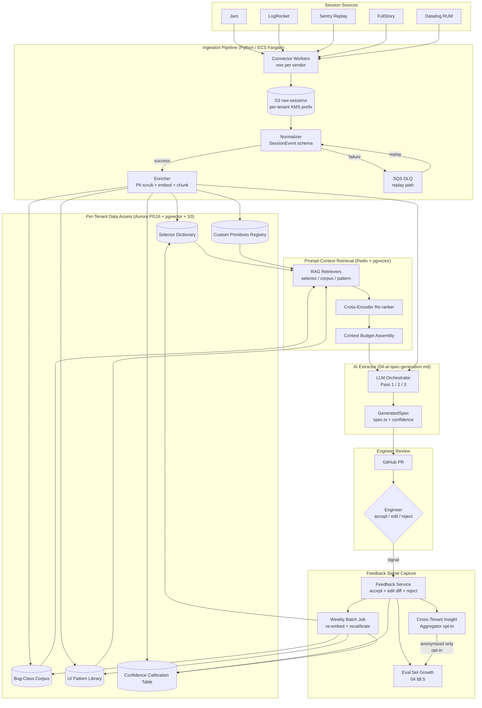
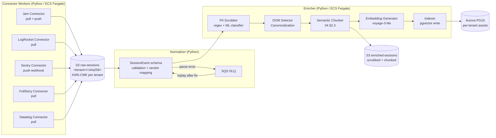
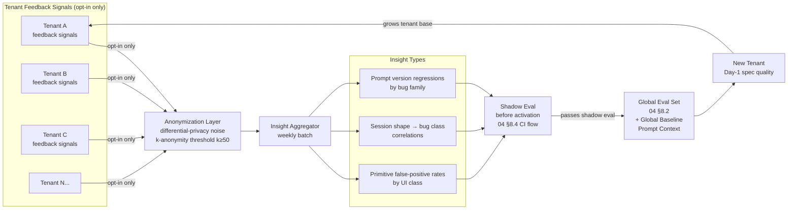

# Data Platform & Feedback Loops

This document is the authoritative design for the data infrastructure that converts customer UI sessions into per-tenant data assets, feedback signals, and prompt context — and the closed loop that makes those assets improve over time.

It is also the moat document. The OSS library (`@cuit/*`) is MIT-licensed and freely forkable. The data platform described here is not a feature — it is the reason the SaaS has durable value. Customers who self-host the library get the primitives. Customers who pay get a system that learns from every session, every accepted spec, and every engineer edit, and gets measurably more accurate for their specific UI surface over time.

---

## Table of Contents

1. [Thesis and Scope](#1-thesis-and-scope)
2. [Architecture Overview](#2-architecture-overview)
3. [Per-Tenant Data Assets](#3-per-tenant-data-assets)
4. [Feedback Signal Taxonomy](#4-feedback-signal-taxonomy)
5. [Data Ingestion Pipeline](#5-data-ingestion-pipeline)
6. [Prompt-Context Retrieval (RAG over Per-Tenant Assets)](#6-prompt-context-retrieval-rag-over-per-tenant-assets)
7. [The Closed-Loop Tuning Cycle](#7-the-closed-loop-tuning-cycle)
8. [Cross-Tenant Insights and the Network Effect](#8-cross-tenant-insights-and-the-network-effect)
9. [Data Ownership, Portability, and Exit](#9-data-ownership-portability-and-exit)
10. [Why This Is Hard to Self-Build](#10-why-this-is-hard-to-self-build)
11. [Storage and Infrastructure](#11-storage-and-infrastructure)
12. [Failure Modes and Observability](#12-failure-modes-and-observability)
13. [Roadmap](#13-roadmap)

---

## 1. Thesis and Scope

### 1.1 The library vs. the product

The OSS library (`@cuit/harness`, `@cuit/spec-runtime`, `@cuit/adapters-*`) provides deterministic test primitives: `dispatchDrag`, `dispatchResize`, `seekTo`, `tick`, `snap`, and the rest. These primitives are the vocabulary. Any team can install them and hand-write specs that use them. The library being open source does not commoditize the product.

The product is the system that watches how a specific customer's engineers interact with generated specs over months, builds a structured representation of that customer's UI surface from their sessions and feedback, and uses that representation to make every subsequent spec generation more accurate. The library gives you the words. The data platform gives you a fluent speaker for your particular dialect.

The distinction is concrete. Consider SpeechLab's waveform editor — the canonical design partner from `01-product-spec.md §2.2`. Without per-tenant context, an LLM extracting from a drag session produces:

```typescript
await dispatchDrag(
  { from: page.locator('[data-testid]').nth(2) },
  { dx: 100, dy: 0 }
);
```

Generic selector, hard-coded pixel delta, no semantic meaning. After the data platform has processed 30 SpeechLab sessions and accumulated the selector dictionary, bug-class corpus, and two accepted specs for drag bugs, the same extraction produces:

```typescript
await dispatchDrag(
  { from: getSegment('seg-0'), handle: getSegmentEnd('seg-0') },
  { dx: segmentDeltaPx(100), dy: 0 }
);
```

Named selectors from the customer's own helper registry. A semantically meaningful delta computation using the customer's own utility function. An assertion that references waveform state by property name, not pixel position. The delta between these two outputs is the product.

### 1.2 Scope of this document

This document covers:

- The five per-tenant data stores (selector dictionary, bug-class corpus, UI pattern library, custom primitives registry, confidence calibration table).
- Every feedback signal the system collects and what consumes it.
- The ingestion pipeline from raw vendor payload to normalized, enriched, indexed session.
- The RAG retrieval system that assembles prompt context at extraction time.
- The weekly tuning cycle that keeps context current without model fine-tuning.
- Cross-tenant insight aggregation and the network-effect flywheel.
- Data ownership, portability, and exit guarantees.
- The honest case for why this is hard to self-build.

This document extends `04-ai-spec-generation.md §13` (Feedback Loops) and `04-ai-spec-generation.md §8` (Eval Harness). Read those sections before this one. This document describes the *data infrastructure* that feeds those loops; `04` describes the *LLM pipeline* that consumes it.

---

## 2. Architecture Overview

The full data flow, from vendor session to closed loop:



The loop closes through `Feedback Signal Capture` back into `Per-Tenant Data Assets`. The LLM model itself is never updated by this loop in v1 (see §7.4 for the explicit non-goal). What updates is the *retrieval surface* — the content that is injected into prompts changes as the customer's selector dictionary grows, their bug-class corpus expands, and their confidence calibration table converges on their specific acceptance pattern.

---

## 3. Per-Tenant Data Assets

These five stores are the accumulated value of a customer's subscription. They cannot be bootstrapped from zero — they require real sessions, real feedback, and time. A new customer who installs the OSS library today and starts self-hosting the pipeline has the primitives but has none of these assets. That asymmetry is the moat.

### 3.1 Asset inventory

| Store | Description | Storage | Update cadence | Retention | Security posture |
|---|---|---|---|---|---|
| **Selector Dictionary** | Every named DOM element the customer has produced a spec for: stable element ID, role, accessibility name, associated test-ID, historical bug rate, last-seen timestamp | Aurora PG16, `selector_dictionary` table, one row per element per tenant | Streaming: updated within minutes of any accepted or edited spec | 7 years (follows spec retention; see §9) | Row-level security: `tenant_id = current_setting('app.current_tenant_id')` (same pattern as `05-security-compliance.md §1` row 1) |
| **Bug-Class Corpus** | Every accepted and rejected spec, indexed by primitive used, interaction class (drag / resize / scroll / touch / observe / lifecycle), framework, and outcome (caught regression yes/no, edit count) | Aurora PG16, `bug_class_corpus` table + S3 spec-artifacts for full spec text; pgvector embedding column on corpus table | Batch: weekly re-embedding + continuous append on each feedback signal | 7 years | Same RLS as above; spec text in S3 under per-tenant KMS CMK |
| **UI Pattern Library** | Canonicalized multi-step interaction patterns: drag sequences, modal-stack open/close patterns, virtualized-list scroll-then-interact, waveform-playhead seek-then-assert. Used as few-shot examples in prompts | Aurora PG16, `ui_patterns` table; embedding stored in pgvector column; canonical spec text in S3 | Weekly batch: new patterns extracted from accepted specs via pattern-hash clustering | 7 years | Same RLS; patterns that match fewer than 3 accepted specs are not promoted (prevents singleton noise) |
| **Custom Primitives Registry** | The customer's own `@cuit/spec-runtime` extensions, registered in `cuit.config.ts`: name, description, argsSchema, usage examples | Aurora PG16, `custom_primitives` table | On-demand: updated when customer pushes a new `cuit.config.ts` via the SaaS connector | Indefinite (follows tenant lifecycle) | Same RLS; primitives are part of the per-tenant prompt cache block (`04-ai-spec-generation.md §5.1`) |
| **Confidence Calibration Table** | Per-tenant isotonic regression model weights mapping raw LLM confidence components to empirical accept probability | Aurora PG16, `confidence_calibration` table (serialized model bytes + metadata) | Weekly batch: retrained on trailing 90d accept/reject signals | Indefinite; prior version retained for 90d for rollback | Same RLS; calibration state is never shared across tenants |

### 3.2 Asset bootstrapping

A new tenant starts with zero entries in all five stores except Custom Primitives (populated from `cuit.config.ts` on day 1). The pipeline falls back to:

1. Global baseline few-shot examples from Branch B (the 8 SpeechLab bugs from `04-ai-spec-generation.md §4.3`).
2. Global confidence calibration weights trained on all tenants' signals.
3. Empty selector dictionary — Pass 1 infers selectors from raw DOM events without per-tenant context.

The baseline produces lower-quality specs than a mature tenant's context does. This is intentional and disclosed. The product story is: "the first 5 specs may need 3–4 engineer edits; by session 30, edits drop to ≤1."

Empirical target (from SpeechLab design-partner data): selector dictionary reaches useful coverage (~50 named elements) after approximately 15–20 accepted specs. Bug-class corpus reaches calibrated confidence after approximately 30–50 feedback signals. A new paying customer should expect 4–6 weeks before the context assets produce measurably better specs than baseline.

---

## 4. Feedback Signal Taxonomy

Every signal the system captures has a defined source, latency, semantic meaning, and downstream consumer. Signals are append-only events in the `spec_feedback` Aurora table (same insert-only pattern as the billing cluster in `05-security-compliance.md §1` row 8).

| Signal | Source | Latency (session → signal) | Semantic meaning | Downstream consumers |
|---|---|---|---|---|
| **Accept** | Engineer merges PR with generated spec unchanged (0 edits) | Hours to days (engineer review time) | Spec was correct; all grounding, selector, and assertion choices were right | Bug-class corpus (positive example), confidence calibration (positive label), eval set growth candidate (`04 §8.5`) |
| **Edit** | Engineer modifies spec before merging; diff captured | Hours to days | The diff is the gold signal: what the model got wrong vs. what the engineer considers correct | Bug-class corpus (positive example with edit annotation), selector dictionary update (engineer-corrected selectors are ground truth), confidence calibration (partial positive — lower weight than clean accept) |
| **Reject** | Engineer closes the PR without merging | Hours to days | Spec was wrong enough to discard; rejection reason (if comment provided) is classified | Bug-class corpus (negative example), confidence calibration (negative label), eval set growth candidate (if rejection reason is a known grounding error class) |
| **Re-RED** | A previously GREEN spec (bug confirmed fixed) turns RED again in CI | Minutes (CI run) | Possible regression in the fix or the harness; the spec caught it | Bug-class corpus (regression-caught positive), coverage signal update, Datadog alert for SRE review |
| **Flake** | Spec passes locally but fails in CI ≥ 3× in a 7d window | Days | Spec has timing or environment sensitivity; likely a `tick` count or `waitForSnap` threshold issue | Confidence calibration downward adjustment for that spec; flagged for re-extraction with flake annotation; Datadog `spec.flake_rate` metric |
| **Cost** | LLM token count + runner CPU-minutes per accepted spec | Minutes (post-extraction) | Real unit economics for this tenant / interaction class | Cost model calibration (`04 §9`); token budget enforcement (`04 §10`); per-tenant cost ledger for billing |
| **Latency** | Session-to-PR p95 wall-clock time | Continuous | Pipeline health; SLO tracking (`06-operations-sre.md §1`) | Datadog SLO `session_to_pr_p95`; alerts on SLO burn rate; capacity planning |
| **Coverage** | Fraction of sessions with a known bug tag that produced an accepted spec in last 30d | Weekly batch | How well the pipeline is converting known bugs into locked regressions | Product dashboard metric; used in customer QBR to show value |

### 4.1 Signal capture implementation

Signals are captured by the `feedback-service` — a thin Node.js ECS Fargate service that listens on two input paths:

1. **GitHub App webhook**: `pull_request.closed` events. If `merged=true` and the PR was created by the CUIT GitHub App, a `ACCEPT` or `EDIT` signal is fired. The edit diff is fetched via the GitHub API and stored in S3 spec-artifacts alongside the original spec.

2. **CI status webhook**: GitHub `check_run.completed` events on spec files in `tests/playwright/`. If a spec that was previously GREEN is now RED, a `RE_RED` signal fires. Flake detection runs nightly: if a spec has ≥ 3 failed runs in the last 7 days with ≥ 1 pass, it is classified as a flake.

All signals include: `tenant_id`, `spec_id`, `session_id`, `signal_type`, `triggered_by_user_id` (hashed), `ts`, `metadata` (JSONB). The table is append-only; no UPDATE or DELETE permissions on the `spec_feedback` table role.

---

## 5. Data Ingestion Pipeline

### 5.1 Pipeline stages



### 5.2 Connector workers

Each vendor has a dedicated connector worker class. Pull connectors run on a 5-minute polling interval; push connectors (Sentry) handle inbound webhooks. All connectors write raw payloads to S3 before any processing — the raw payload is immutable and replayable.

| Vendor | Mechanism | Auth | Raw payload format | Known reliability issues |
|---|---|---|---|---|
| Jam | Pull via Jam REST API | OAuth 2.0 per-tenant refresh token | JSON array of DOM events + metadata | No video bytes; events-only. Jam API has ~2% 5xx rate at peak; retry with exponential backoff up to 3× |
| LogRocket | Pull via LogRocket Sessions API | API key per-tenant | rrweb-derived JSON | Schema has drifted twice in 12 months; connector version-pins the schema and alerts on unexpected fields |
| Sentry | Push webhook + pull Replay API | Webhook secret + DSN per-tenant | rrweb events + Sentry error envelope | Most reliable source; webhook delivery has < 0.1% loss at Sentry SLA |
| FullStory | Pull via Data Export API | API key per-tenant | Proprietary event format; FullStory adapter handles mapping | Export lag can be 15–30 min; connector adjusts polling window accordingly |
| Datadog RUM | Pull via Logs API | API key + Application key per-tenant | RUM event stream (JSON) | Rate-limited at 300 req/min per org; connector respects `X-RateLimit-Remaining` header |

### 5.3 SessionEvent schema

The normalizer converts every vendor payload into `SessionEvent[]`. This is the same schema referenced in `02-library-architecture.md §7.2`.

```typescript
interface SessionEvent {
  id: string;                    // uuid v7 — monotonic for ordering
  sessionId: string;
  tenantId: string;
  ts: number;                    // ms since epoch
  type: SessionEventType;        // see enum below
  source: VendorSource;          // 'jam' | 'logrocket' | 'sentry' | 'fullstory' | 'datadog'
  payload: SessionEventPayload;  // discriminated union by type
  piiScrubbed: boolean;          // set by enricher; MUST be true before indexing
  piiScrubFields?: string[];     // which payload fields were scrubbed
  rawEventRef: string;           // S3 key of the source raw event for audit
}

type SessionEventType =
  | 'user_interaction'   // mouse, keyboard, touch, pointer
  | 'dom_mutation'       // rrweb DOM snapshot delta
  | 'console'            // console.log/error/warn
  | 'network'            // XHR/fetch request/response
  | 'navigation'         // page load, route change
  | 'error'              // JS error, unhandled rejection
  | 'custom'             // customer-emitted via @cuit/harness telemetry API
```

### 5.4 PII scrubbing

PII scrubbing runs before any embedding or indexing. Two layers:

**Layer 1 — Regex patterns (fast, synchronous):** credit card numbers (Luhn), SSNs, email addresses, phone numbers (E.164 + common formats), IP addresses, UUIDs that match known PII patterns (session tokens). Applied to all string fields in `payload`.

**Layer 2 — ML classifier (async, higher recall):** A fine-tuned `bert-base-uncased` classifier (hosted on ECS Fargate, not via external API) scores each text span > 20 characters for PII probability. Spans scoring > 0.85 are replaced with `[REDACTED:<class>]`. The classifier is evaluated quarterly against a held-out PII corpus; recall target ≥ 0.97.

`piiScrubbed` is set to `true` only after both layers complete. The indexer refuses to write any `SessionEvent` with `piiScrubbed = false`. This is a hard gate, not a soft check.

Note on embeddings: scrubbing before embedding reduces but does not eliminate PII risk in the vector space. We assume worst case — that embeddings are not reversibly decodable but that a sufficiently adversarial nearest-neighbor query could surface approximate PII. The mitigation is access control on the vector store (same RLS as all other per-tenant assets), not reliance on embedding opacity. See §12.5 for the failure mode.

### 5.5 DOM selector canonicalization

Raw vendor payloads often contain fragile selectors: nth-child paths, auto-generated class names, pixel coordinates. The canonicalizer attempts to replace these with stable, semantic selectors by:

1. Matching the raw selector against the tenant's existing selector dictionary (exact match on `accessibility_name` or `test_id`).
2. If no match, attempting to infer a stable selector from the element's ARIA role + accessible name (if present in the DOM snapshot).
3. If ARIA is insufficient, generating a candidate `data-testid` suggestion and flagging it as `selector_confidence: LOW` for the LLM to handle carefully.

Canonicalized selectors are written back to the selector dictionary with a `source: 'inferred'` flag. Selectors that appear in ≥ 3 accepted specs are promoted to `source: 'confirmed'` and weighted more heavily in retrieval.

### 5.6 Embedding generation

Embeddings are generated for three types of content:

| Content type | Model | Dimension | What is embedded | Used for |
|---|---|---|---|---|
| Session event windows (chunked) | `voyage-3-lite` | 512 | The normalized event window text: event types, targets, timing | Nearest-neighbor retrieval at extraction time to find similar past sessions |
| Bug-class corpus entries | `voyage-3-lite` | 512 | The spec text of accepted/rejected specs + interaction class label | Few-shot retrieval: find the most similar past spec to the current interaction |
| UI pattern library entries | `voyage-3-lite` | 512 | The canonicalized multi-step pattern description | Pattern matching: identify which known pattern the current session matches |

`voyage-3-lite` is used over `text-embedding-3-small` for cost at this embedding volume. If a customer's throughput exceeds ~500 sessions/day, pgvector query latency is monitored; the Pinecone migration path is described in §11.

---

## 6. Prompt-Context Retrieval (RAG over Per-Tenant Assets)

At extraction time, the LLM orchestrator assembles a prompt context from the per-tenant data assets via parallel RAG retrieval. This retrieval is what makes the per-tenant context valuable — it is not included wholesale (too many tokens), but retrieved selectively based on the current session's content.

### 6.1 Retrieval pipeline

```mermaid
flowchart TD
    SESSION[Current session\nRelevantWindow from 04 §2.3]

    subgraph Parallel["Parallel Retrievers"]
        R1[Selector Dictionary\nRetriever\ntop-k=20 by cosine sim\nto event targets]
        R2[Bug-Class Corpus\nRetriever\ntop-k=5 by interaction-class\n+ embedding similarity]
        R3[UI Pattern Library\nRetriever\ntop-k=3 by pattern hash\nthen embedding sim]
        R4[Custom Primitives\nRegistry\nno retrieval — full\ninclude always]
    end

    RERANK[Cross-Encoder Re-ranker\ncross-encoder/ms-marco-MiniLM-L-6-v2\nscores each candidate\nagainst session query]
    BUDGET[Context Budget Assembly\nhard token limit per pass\npriority eviction order:\ncustom primitives > selectors > corpus > patterns]
    CACHE2[Redis Cache\nkey: hash(retrieval_result_set\n+ session_content_hash\n+ prompt_version)\nTTL: 1h]

    SESSION --> R1 & R2 & R3 & R4
    R1 & R2 & R3 --> RERANK
    R4 --> BUDGET
    RERANK --> BUDGET
    BUDGET --> CACHE2
    CACHE2 --> ORCH2[LLM Orchestrator\n04-ai-spec-generation.md §2]
```

### 6.2 Retrieval details per store

**Selector Dictionary (R1):** The session's event targets (raw DOM selectors from the vendor payload) are embedded and compared against the selector dictionary via pgvector ANN query (`<=>` cosine distance operator). The top-20 candidates are returned with their stable IDs, roles, and bug rates. High-bug-rate selectors are boosted in the budget assembly step — if an element has a historical bug rate > 15%, it is promoted to the top-k regardless of embedding rank.

**Bug-Class Corpus (R2):** Retrieval is two-stage. First, the session's interaction classes (drag, resize, scroll, etc.) are extracted deterministically from the event stream. The corpus is filtered to entries matching at least one interaction class. Within that filtered set, embedding similarity ranks the candidates. The top-5 are passed to the re-ranker. These become the few-shot examples for Pass 2 — replacing or augmenting the global Branch B examples when tenant-specific examples are more similar to the current session.

**UI Pattern Library (R3):** Pattern matching uses a pattern hash (a deterministic hash over the ordered sequence of interaction classes in the session window) to find exact or near-exact matches first. If no hash match, falls back to embedding similarity. The top-3 patterns are passed to the re-ranker. Pattern library entries are injected into the Pass 3 (Spec Materialization) prompt as structural templates.

**Custom Primitives (R4):** Not retrieved — included in full. A customer with 5 custom primitives has ~300–600 tokens of custom primitive context injected into every prompt. This is bounded in `cuit.config.ts` validation (max 10 custom primitives, max 100 tokens each). Custom primitives are part of the per-tenant Anthropic prompt cache block (`04-ai-spec-generation.md §5.1`).

### 6.3 Cache interaction with per-tenant retrieval

`04-ai-spec-generation.md §5` describes the Anthropic prompt cache strategy. Per-tenant retrieval interacts with it as follows:

- The **global harness primitive catalog** (~4,500 tokens) is Anthropic-cached across all tenants and all sessions. Cache hit rate target: >95%.
- The **per-tenant selector dictionary block** (the top-k retrieved selectors, ~800–1,500 tokens) is Anthropic-cached per tenant per retrieval result set. Because retrieval results change per session, the Anthropic cache hit rate for this block is lower — approximately 30–50% for tenants with consistent UI surfaces (similar sessions reuse the same top selectors), lower for high-variety tenants.
- The **bug-class corpus few-shots** are session-specific after re-ranking. These are not Anthropic-cached; they are the dynamic portion of the context.
- The **Redis result cache** (keyed by `hash(retrieval_result_set + session_content_hash + prompt_version)`) deduplicates the entire retrieval + extraction pipeline for identical sessions. Hit rate target: 30% at steady state (`04 §5.3`).

The practical implication: for a tenant whose sessions cluster around a small set of interaction patterns (e.g., SpeechLab's waveform drag/resize), the selector block Anthropic cache hit rate will be high and the per-spec LLM cost will converge toward the lower end of the §9 cost model estimates.

### 6.4 Context budget

| Priority | Content block | Approximate tokens | Eviction behavior |
|---|---|---|---|
| 1 (never evicted) | Harness primitive catalog | ~4,500 | Never evicted; if session + catalog exceeds budget, session is chunked further |
| 2 (never evicted) | Custom primitives registry | ~300–600 | Never evicted |
| 3 | Retrieved selectors (top-k) | ~800–1,500 | If budget tight: reduce k from 20 to 10 |
| 4 | Bug-class corpus few-shots | ~2,000–4,000 | If budget tight: reduce from 5 to 2 examples |
| 5 | UI pattern templates | ~500–1,000 | First to be evicted |
| 6 | Session event window | ~1,500–8,000 | Chunked further if needed; hard minimum 50 events |

Hard token budget per pass: 28,000 input tokens (leaves headroom below Sonnet 4.6 and Opus 4.7 context limits with safety margin).

---

## 7. The Closed-Loop Tuning Cycle

### 7.1 What the loop is and is not

The loop tunes the *retrieval surface* — the content of the per-tenant data assets and the weights that govern what gets retrieved into prompts. It does not fine-tune the LLM. It does not distill per-tenant priors into a smaller model. It does not share per-tenant data across tenants.

The reasoning: fine-tuning requires a training dataset we do not have at scale (the `04-ai-spec-generation.md §1.2` non-goal states 10k+ accepted specs as the threshold). At 30–100 accepted specs per tenant per year for a typical ICP customer, per-tenant fine-tuning is not viable in Y1. Retrieval-augmented context is demonstrably effective at this data volume — Branch B's 8 examples already produce measurably better grounding than zero examples — and it does not require retraining infrastructure.

### 7.2 Timeline of one loop cycle

```mermaid
gantt
    title One Loop Cycle — Session to Improved Context
    dateFormat  D
    axisFormat  Day %d

    section Ingestion
    Session recorded by vendor         :done, d0, 0, 1d
    Connector pulls session             :done, d0a, 0, 1d
    Normalizer + Enricher              :done, d0b, 0, 1d

    section Extraction
    Semantic chunking + RAG retrieval  :done, d0c, 0, 1d
    LLM extraction 3-pass              :done, d0d, 0, 1d
    Dry-run RED/GREEN/INCONCLUSIVE     :done, d0e, 0, 1d
    GitHub PR opened                   :done, d0f, 0, 1d

    section Engineer Review
    Engineer reviews PR                :active, d17, 0, 7d
    Accept / Edit / Reject signal      :active, d27, 0, 7d

    section Feedback Processing
    Signal captured by feedback-service :d3, 7, 1d
    Selector dictionary updated (edit signal) :d4, 7, 1d

    section Weekly Batch
    Weekly batch job runs              :d5, 7, 1d
    Re-embed new corpus entries        :d6, 7, 1d
    Recalibrate confidence thresholds  :d7, 7, 1d
    Updated context available for next extraction :milestone, d8, 8, 0d
```



**Day 0:** Session is recorded by the vendor, pulled by the connector within 5 minutes (for push sources like Sentry) or within the next 5-minute polling interval (pull sources). Enrichment completes within 10 minutes of raw session arriving in S3. LLM extraction runs and the GitHub PR is opened. Total session-to-PR p95 target: 60 minutes (`06-operations-sre.md §1`).

**Days 0–7:** Engineer reviews the PR. The pipeline does not wait for this — it continues processing other sessions. The review window is asynchronous by design; the product does not gate on engineer availability.

**Day 0–7 (edit signal):** If the engineer edits the spec before merging, the diff is captured immediately. Selector dictionary is updated synchronously with engineer-corrected selectors (these are ground truth and do not wait for the weekly batch).

**Day 7 (weekly batch):** The weekly batch job runs every Sunday at 02:00 UTC per tenant. It:
1. Re-embeds any new corpus entries added in the past week (new accepted/rejected specs).
2. Updates the UI pattern library: clusters accepted specs by interaction sequence, promotes new patterns that appear ≥ 3 times.
3. Retrains the confidence calibration model on the trailing 90-day feedback window.
4. Refreshes the Redis retrieval cache TTLs for the tenant's most-accessed selectors.

**Day 8+:** The next extraction for this tenant uses the updated context. The improvement is not dramatic after a single feedback cycle — it compounds over months as the corpus grows and calibration converges.

### 7.3 What measurably changes with more data

Based on SpeechLab design-partner behavior and the Branch B eval set:

| Tenant maturity | Accepted specs | Selector dictionary entries | Expected accept rate | Edit count on accepted specs |
|---|---|---|---|---|
| New (week 1) | 0 | 0 | ~40% (global baseline) | 3–5 edits |
| Early (month 1) | ~10 | ~30 | ~55% | 2–3 edits |
| Growing (month 3) | ~30 | ~80 | ~65% | 1–2 edits |
| Mature (month 6+) | ~60 | ~150 | ~75%+ | ≤1 edit |

These figures are projections from Branch B behavior extended to the SaaS context. The `01-product-spec.md §3.1` target of ≥75% acceptance rate by Q4 assumes a mix of early and mature tenants, with the SpeechLab design-partner as the fully mature anchor.

### 7.4 Explicit non-goals for v1

The following are out of scope for v1 and are not planned without explicit evidence of >5 percentage-point lift over prompted Sonnet/Opus:

- **Per-tenant LLM fine-tuning.** No LoRA adapters, no full fine-tune, no PEFT. The retrieval loop achieves comparable gains at far lower engineering cost at our data volume.
- **Model distillation.** No compression of per-tenant priors into a smaller model for cost reduction.
- **Cross-tenant weight sharing.** Per-tenant calibration models are trained on that tenant's data only. No federated averaging, no multi-task transfer.
- **Shared per-tenant data.** No tenant's raw sessions, specs, or feedback signals are ever used to improve another tenant's context without explicit opt-in to the cross-tenant insight program (§8).

---

## 8. Cross-Tenant Insights and the Network Effect

### 8.1 The flywheel

Cross-tenant insights are aggregate observations derived from all tenants' anonymized feedback signals. They feed the global baseline — the eval set, the global confidence calibration, and the global few-shot examples that new tenants receive before they have built their own per-tenant corpus.



More customers opt in → more anonymized signals → better global baseline → better Day-1 specs for new customers → faster time-to-value → more adoption → more customers. The flywheel compounds slowly (each weekly batch is an incremental improvement) but the cumulative advantage over a self-hosted instance that sees only its own data grows monotonically.

### 8.2 Anonymization protocol

| Requirement | Implementation |
|---|---|
| Opt-in consent | Separate consent surface in the SaaS dashboard, separate data subject in the privacy policy; default is opt-out |
| k-anonymity | No insight is activated unless it is derived from ≥ 50 distinct tenants' signals. Insights from fewer than k=50 tenants are suppressed regardless of statistical significance |
| Differential privacy | Laplace noise added to count-based aggregates with ε=1.0 (per-tenant contribution is ≤1 to any aggregate). This prevents a single tenant's unusual behavior from dominating an insight |
| No raw data in insights | Insights are counts, rates, and correlations. No session content, no spec text, no selector names, no tenant identifiers are present in any insight record |
| Separation of concern | The Insight Aggregator runs in a separate ECS task with no read access to the raw session or spec tables. It reads only from a materialized view of aggregate statistics that is itself audited for PII before materialization |

### 8.3 Insight types and how they feed the global baseline

**Primitive false-positive rate by UI class.** Example: "drag interactions in waveform-shaped UIs produce a `Re-RED` signal at 3× the rate of click-only interactions." This insight updates the global confidence calibration's prior for `dry_run_confidence` on drag-heavy sessions — specs in that category get a lower default confidence score, routing more of them through the human-review queue rather than auto-PR.

**Session shape to bug class correlation.** Example: "sessions with a `dispatchWheel` followed by `dispatchDrag` within 500ms have a 40% higher probability of catching a real regression than single-primitive sessions." This insight updates the semantic chunking heuristic in the normalizer — the interaction density window is widened for sessions matching this pattern.

**Prompt version regressions by bug family.** Example: "prompt version v1.4.2 regresses on `observeMutations` specs for 3 of the 8 Branch B eval cases." This insight feeds directly into the shadow eval CI gate (`04-ai-spec-generation.md §8.4`) — the affected eval cases receive higher weight in the regression threshold.

### 8.4 Activation gate

No cross-tenant insight is activated in the global baseline without passing shadow eval (`04-ai-spec-generation.md §8.4`). The shadow eval runs the proposed global baseline change against all 19 golden eval cases and must not regress any metric beyond threshold. This prevents a noisy or adversarially skewed insight from degrading spec quality globally.

---

## 9. Data Ownership, Portability, and Exit

The customer owns their data. This is not aspirational language — it is enforced by architecture and committed to contractually.

### 9.1 What the customer owns

| Data asset | Who owns it | Notes |
|---|---|---|
| Raw vendor payloads (rrweb events, DOM snapshots) | Customer | Stored in S3 under the customer's per-tenant KMS CMK. We cannot decrypt without the CMK. |
| Generated spec.ts files | Customer | Committed to the customer's repo via GitHub PR. Copies in S3 also under per-tenant KMS CMK. |
| Feedback signals (accept/edit/reject) | Customer | Generated by customer engineers' actions; stored in per-tenant Aurora rows accessible via export API. |
| Selector dictionary, bug-class corpus, UI pattern library | Customer | Derived from customer sessions and feedback; exportable as JSONL. |
| Confidence calibration model weights | Customer | Derived from customer feedback signals; exportable as JSON. |
| Cross-tenant insight contributions | Platform (anonymized aggregate; no per-tenant record retained) | Once a signal contributes to an anonymized aggregate under ε-DP, the contribution is not separable. The per-tenant source signals remain the customer's property and are exportable. |

### 9.2 Export API

The export API is available to any tenant admin via `GET /v1/export/tenant-data`. It produces a signed S3 URL pointing to a JSONL bundle containing:

```
export/
  sessions/           # One JSONL file per calendar month of raw SessionEvent[] (scrubbed)
  specs/              # One JSONL file per spec: spec.ts text + metadata + dryRunResult
  feedback/           # All feedback signal rows for this tenant
  selector-dictionary.jsonl
  bug-class-corpus.jsonl
  ui-patterns.jsonl
  custom-primitives.jsonl
  confidence-calibration.json
  export-manifest.json  # SHA-256 checksums for all files + export timestamp
```

The export job runs asynchronously; the signed URL is valid for 72 hours. Export jobs are throttled to 1 per tenant per 24 hours to prevent load spikes.

### 9.3 Retention policy

| Data type | Default retention | Extended retention (opt-in) | Notes |
|---|---|---|---|
| Raw vendor payloads | 90 days | Up to 1 year (additional cost) | After 90d, raw events are deleted from S3. The enriched, scrubbed session chunks in the bug-class corpus are retained separately per spec retention below. Cross-reference `05-security-compliance.md §4`. |
| Generated specs (spec.ts + run artifacts) | 7 years | N/A | Match standard software audit trail requirements. |
| Feedback signals | 13 months | Up to 7 years | 13 months covers one full calendar year + 1 month for year-end reporting. Cross-reference `05-security-compliance.md §4`. |
| Per-tenant data assets (selector dict, corpus, patterns) | Follows spec retention (7 years) | N/A | These are derived from accepted specs; deleting them independently of specs would break re-extraction. |
| Confidence calibration model | Indefinite (follows tenant lifecycle) | N/A | Small (< 1 MB); no cost-based reason to delete. Prior version retained 90d for rollback. |

### 9.4 Deletion on request

A customer who offboards or invokes their data deletion right receives:

1. All five per-tenant data asset tables: rows hard-deleted within 30 days.
2. All S3 objects under the per-tenant prefix: lifecycle rule triggers deletion within 30 days. The per-tenant KMS CMK is scheduled for deletion (7-day minimum AWS waiting period) after S3 deletion completes. After CMK deletion, any residual encrypted data is cryptographically inaccessible.
3. All feedback signals in Aurora: hard-deleted within 30 days.
4. Audit trail (immutable S3 Object Lock): retained for the compliance period (7 years) per SOC 2 requirements, even after customer deletion request. Audit trail contains only metadata (event types, timestamps, user IDs) — no session content.
5. Anomaly: cross-tenant insight contributions made under ε-DP cannot be "un-contributed" from aggregate statistics without invalidating the statistics. The privacy policy discloses this; per-tenant source signals are fully deletable.

Deletion requests are tracked in the `offboarding_requests` table with the requesting user, timestamps for each deletion phase, and confirmation that KMS CMK deletion completed. The 30-day SLA is monitored by a Datadog alert on `offboarding_days_outstanding > 25`.

### 9.5 Exit

A customer who leaves can take all their per-tenant data assets via the export API. The exported JSONL files are self-describing and not proprietary-format locked. A team that wants to self-host the pipeline and seed it with their own corpus can import these files. We provide no tooling for this import (it is not a supported migration path), but we do not prevent it technically or contractually. Cross-tenant insights derived from the customer's opt-in contributions remain in the global baseline after exit; the customer's per-tenant data is deleted on request.

---

## 10. Why This Is Hard to Self-Build

The most common objection from a technically sophisticated buyer is: "We could build this ourselves." The honest answer is: yes, eventually, at significant cost, and you would not finish before your bug Reopen rate continues to compound. Below is the honest case for why customers do not self-build.

### 10.1 The three moat dimensions

**Engineering moat — connector and pipeline reliability**

Vendor connectors are not a one-time build. LogRocket's session export schema has drifted twice in 12 months. Jam's API has a ~2% 5xx rate at peak. Sentry's rrweb event format has version flags that require per-version normalization logic. Maintaining 5 connectors with reliable SLAs, schema-drift detection, and DLQ replay paths is a continuous operational commitment, not a weekend project. The normalizer is similarly ongoing: rrweb adds event types, vendors add proprietary event extensions, and a normalizer that handles the full surface of 2024-era rrweb is not the same normalizer that handles 2026-era rrweb.

Beyond connectors: embedding model upgrades (voyage-3-lite will have a successor; migrating 500k+ stored embeddings to a new dimension space is a versioned migration, not a drop-in replacement), eval harness rigor (the 19 golden cases in the Branch B set required 8 real bugs and months of iteration to specify correctly), and pipeline observability (the Datadog dashboards described in §12 took weeks to instrument correctly) are all ongoing engineering investments.

**Data moat — the bug-class corpus bootstrapping problem**

The corpus starts empty. SpeechLab has 8 confirmed bugs with spec fixtures. A new customer has zero. Getting from zero to a useful corpus (§3.2 estimates ~30–50 feedback signals) takes weeks of real sessions and real engineer feedback. A self-hosted instance that goes live today has no corpus. The SaaS instance that has been running for 6 months against SpeechLab sessions has 60+ corpus entries, a calibrated confidence model, and a selector dictionary with 150+ entries. The gap is structural, not technical.

More precisely: the data moat is not "we have more data" — it is "we have the *right* data organized in a way that produces better prompts." A customer who self-hosts and accumulates their own feedback will eventually close the gap for their specific tenant context. But they will never have the cross-tenant insight flywheel (§8) unless they also operate a multi-tenant platform. They are building a single-tenant local maximum while the SaaS builds a multi-tenant global baseline.

**Compliance moat — SOC 2 around the data store**

Session data from production UIs contains PII at high probability. A self-hosted pipeline that processes production session recordings without a SOC 2-audited data handling posture is a compliance liability for any Series B+ company with enterprise customers or a security review process. The SaaS holds the SOC 2 Type II report (`05-security-compliance.md §1`); the customer does not have to. For many ICP customers, the SOC 2 report alone is worth the subscription cost relative to the liability of processing production session data without one.

### 10.2 Build-vs-buy analysis

| Capability | Could a customer build it? | What it would cost | Why they will not |
|---|---|---|---|
| OSS harness primitives (`@cuit/harness`) | Yes — it is open source | $0 (already free) | They will use the library. This is intentional. |
| 5 vendor connectors with schema-drift handling and DLQ | Yes, technically | 1 senior engineer × 3 months + ongoing maintenance ~0.5 FTE/year | Connector maintenance has no product leverage; engineers resist it. Most teams build one connector (their primary vendor) and stop. |
| PII scrubber with ML classifier + eval | Yes | 0.5 engineer-months to build; quarterly eval is ongoing | Teams deprioritize PII accuracy on internal tooling until an incident. The ML layer (vs. regex-only) is consistently cut. |
| Per-tenant vector store + weekly re-embedding pipeline | Yes | 1 engineer-month build + infra cost ~$200–500/month for a small tenant | Doable. This is the most technically tractable self-build. But it requires a corpus to populate it, which requires the feedback loop, which requires the connector, which requires... |
| Bug-class corpus with 8+ seed examples | No — seed data is not transferable | Branch B's 8 bugs are SpeechLab-specific. A new customer must accumulate their own over 4–6 weeks. | They start behind baseline. |
| Confidence calibration with per-tenant isotonic regression | Yes | 2 engineer-weeks build | Technically straightforward but requires tooling discipline to retrain weekly, monitor Brier score, roll back on regression. Most teams skip calibration entirely and use raw LLM confidence. |
| SOC 2 Type II for the data pipeline | Yes | $50k–$150k audit cost + 6–12 months of controls implementation + 1 engineer dedicated to compliance | This is the biggest blocker. Most ICP customers (Series B–D) do not have the bandwidth to pursue a second SOC 2 audit for internal tooling. |
| Cross-tenant insight flywheel | No — requires multi-tenant platform | Not achievable for a single tenant | Structural impossibility for self-hosted. |
| Eval harness with 19 golden cases | Yes, eventually | 2–3 engineer-months to reach Branch B's coverage, ongoing with each new bug | Most teams skip the eval harness entirely. Without it, prompt changes are untested and confidence degrades silently. |

**Total self-build cost estimate for a competitive capability (excluding cross-tenant insights):**
3–4 senior engineer-months upfront + ~1 FTE-quarter annually to maintain. At $200k loaded cost per engineer-year, that is $150k–$200k in year 1 and $50k/year ongoing — for a single-tenant system with no SOC 2 and no cross-tenant signal. An ACV of $24k–$60k is a rational buy decision.

---

## 11. Storage and Infrastructure

This section specifies the data platform storage layer. It extends `03-saas-platform.md §8` (storage) with the additions specific to the data platform: vector storage, batch enrichment infrastructure, and the retrieval cache.

### 11.1 Storage decisions

| Data | Storage system | Rationale | Scale trigger to revisit |
|---|---|---|---|
| Per-tenant data assets (selector dictionary, bug-class corpus, UI patterns, custom primitives, feedback signals) | Aurora PostgreSQL 16 Multi-AZ (`us-east-1`) | Same cluster as the control plane (`03-saas-platform.md §8`); RLS-enforced tenant isolation; pgvector extension handles vector storage at our initial throughput; single operational stack to maintain | > 20M embedding vectors stored OR pgvector ANN query p95 > 50ms — at that point, evaluate Pinecone per-tenant |
| Embeddings (session windows, corpus entries, patterns) | pgvector extension on Aurora PG16 | Cost-effective at < ~20M vectors; IVFFlat index with `lists=100` gives adequate ANN recall for k=20 retrieval at our tenant counts; no separate vector DB operational burden | See above |
| High-throughput tenants (> 500 sessions/day) | Pinecone (per-tenant index, serverless tier) | pgvector throughput ceiling is predictable; Pinecone's serverless tier charges per query, not per pod, matching the variable load pattern | Triggered per-tenant; not a global migration |
| Raw vendor payloads | S3 `raw-sessions/<tenant_id>/<sha256>` | Per-tenant KMS CMK (`05-security-compliance.md §1` row 7); 90-day lifecycle rule; Intelligent-Tiering enabled after 30d | No scale trigger; S3 scales indefinitely |
| Enriched, scrubbed session chunks | S3 `enriched-sessions/<tenant_id>/` | Same KMS pattern; retained 7 years (follows spec retention) | No scale trigger |
| Retrieval cache | ElastiCache Redis 7 (same cluster as extraction cache, `03-saas-platform.md §5`) | Hot retrieval results for recently-seen sessions; 1-hour TTL; eviction policy `allkeys-lru` | If Redis memory > 70% sustained: provision a second cluster or increase node size |
| Batch enrichment jobs | ECS Fargate (Python 3.12) | Weekly batch is not a streaming problem; Fargate on-demand for batch is cheaper than a standing EKS node for this workload; simpler than Glue at this scale | If batch job duration > 4 hours weekly: migrate to Glue with incremental job bookmarks |
| Confidence calibration model weights | Aurora PG16 (serialized as `bytea`) | Model is small (< 1 MB); no separate model store needed in v1 | If model grows to > 10 MB or inference latency matters: move to S3 + in-memory cache |

### 11.2 Per-tenant KMS architecture

Each tenant receives a distinct KMS Customer Managed Key (CMK) at provisioning time. The CMK is used for:
- S3 SSE-KMS on all per-tenant S3 prefixes (raw sessions, enriched sessions, spec artifacts).
- Aurora column-level encryption for `payload` columns in the `session_events` and `bug_class_corpus` tables (envelope encryption: data key encrypted with CMK, data encrypted with data key).

CMKs are rotated annually (AWS automatic rotation). Access to a CMK requires:
1. The extractor service IAM role (for decryption during extraction jobs).
2. The export service IAM role (for packaging the export bundle).
3. Break-glass human access via a separate IAM role requiring MFA and generating a CloudTrail alert (`05-security-compliance.md §1` row 7).

### 11.3 pgvector index configuration

```sql
-- Per-tenant IVFFlat index on selector_dictionary
CREATE INDEX selector_dict_embedding_idx
ON selector_dictionary
USING ivfflat (embedding vector_cosine_ops)
WITH (lists = 100)
WHERE tenant_id = $1;  -- partial index per tenant

-- Per-tenant IVFFlat index on bug_class_corpus
CREATE INDEX corpus_embedding_idx
ON bug_class_corpus
USING ivfflat (embedding vector_cosine_ops)
WITH (lists = 100)
WHERE tenant_id = $1;
```

`lists = 100` is appropriate for < 1M vectors per tenant. For tenants approaching 500k+ corpus entries, `lists = sqrt(n_vectors)` gives better recall. The weekly batch job rechecks index statistics and rebuilds the index with updated `lists` if vector count has grown by >50% since last build.

### 11.4 Datadog dashboard integration

The data platform contributes the following metrics to the Datadog dashboard layer (`06-operations-sre.md §3`):

| Metric | Description | Alert threshold |
|---|---|---|
| `cuit.pipeline.ingest_lag_seconds` | Time from vendor session creation to enrichment complete, p95 per vendor | > 600s for 5 min |
| `cuit.pipeline.pii_recall_estimate` | Weekly estimate of PII scrubber recall from sample audit | < 0.95 pages platform lead |
| `cuit.retrieval.query_latency_ms` | pgvector ANN query p95 per tenant | > 100ms for 5 min |
| `cuit.retrieval.cache_hit_rate` | Redis retrieval cache hit rate | < 0.10 (unexpected drop) |
| `cuit.corpus.entries_per_tenant` | Bug-class corpus size per tenant | Informational; used for growth tracking |
| `cuit.feedback.signal_rate` | Feedback signals per day per tenant | Drop > 50% vs trailing 7d average signals stale connector |
| `cuit.batch.weekly_job_duration_minutes` | Wall-clock time of weekly batch job per tenant | > 240 min pages on-call |
| `cuit.export.offboarding_days_outstanding` | Days since deletion request for any tenant | > 25 pages on-call |

---

## 12. Failure Modes and Observability

### 12.1 Connector outage

**Symptom:** Vendor connector stops delivering sessions. The `cuit.feedback.signal_rate` metric drops > 50% vs trailing 7-day average for the affected vendor.

**Impact:** Per-tenant data assets become stale. The selector dictionary stops receiving updates. The bug-class corpus stops growing. The retrieval cache serves stale context until TTL expiry (1h for Redis, 7d for Anthropic prompt cache blocks).

**Mitigation:** The pipeline falls back gracefully. Extractions that land in the queue continue to use the last-retrieved context. The LLM prompt does not fail — it simply uses context that is days or weeks old rather than hours old. The degradation is in spec quality (selector dictionary may be stale for recently-added UI elements), not in pipeline availability.

**Detection:**
```
# Datadog monitor: connector lag
avg(last_5m):avg:cuit.pipeline.ingest_lag_seconds{vendor:logrocket} by {tenant_id} > 600
```

**Recovery:** Connector workers retry with exponential backoff (max 3×, 1h ceiling). If the vendor is down for > 4 hours, the on-call SRE is paged and a customer notification is sent via the SaaS dashboard status page. Session backfill runs automatically when the vendor recovers (connectors pull a trailing 48h window on restart).

### 12.2 Embedding model upgrade

**Symptom:** `voyage-3-lite` is superseded by a new model with a different embedding dimension or semantic space. Stored embeddings become incompatible with query embeddings from the new model.

**Impact:** ANN retrieval returns semantically irrelevant results. Selector dictionary retrieval degrades; bug-class corpus few-shots are wrong. This produces a measurable drop in spec quality before it is caught by monitoring.

**Mitigation:** Embedding model upgrades are handled as versioned migrations, not in-place replacements:
1. A new `embedding_model_version` column is added to all embedded tables.
2. The new model runs in shadow mode: both old and new embeddings are generated for new records.
3. Old records are re-embedded in a background batch job (ECS Fargate, throttled to avoid Aurora write pressure).
4. Once > 95% of records for a tenant are re-embedded on the new model, that tenant's retrieval switches to the new model.
5. Old embeddings are retained for 30 days after migration completes, then deleted.

Detection: `cuit.retrieval.query_latency_ms` will drop if the new model produces smaller dimensions (faster queries). Spec quality monitoring via the eval harness (`04-ai-spec-generation.md §8`) catches retrieval degradation within 24h of the switch.

### 12.3 Feedback signal poisoning

**Symptom:** A malicious or negligent engineer repeatedly accepts wrong specs to skew the confidence calibration toward over-accepting low-quality specs.

**Impact:** Confidence calibration drifts toward over-confidence. More low-quality specs are routed through auto-PR. Spec quality degrades but the pipeline reports high confidence.

**Mitigation:**
- Rate limiting: each user ID can contribute at most 5 accept signals per hour and 20 per day. Signals beyond this rate are held pending manual review.
- Anomaly detection: if a single user contributes > 30% of a tenant's accept signals in a 7-day window, a review flag is raised and the signals are down-weighted in calibration retraining until reviewed.
- Canary: the weekly batch job computes calibration quality (Brier score) before activating new weights. If Brier score worsens by > 0.05 vs the prior week, the new weights are discarded and an alert fires.

```
# Datadog monitor: calibration degradation
change(avg(last_1w):avg:cuit.calibration.brier_score{*} by {tenant_id}, 1w) > 0.05
```

### 12.4 Cross-tenant insight regression

**Symptom:** An insight derived from opt-in cross-tenant signals is activated in the global baseline and degrades spec quality globally (e.g., a noisy signal from a small cohort of tenants shifts the confidence prior in the wrong direction).

**Mitigation:** Shadow eval gate (§8.4). No insight is activated without passing the CI shadow eval against all 19 Branch B golden cases. An insight that causes any metric to regress beyond threshold is automatically suppressed. The shadow eval is the primary defense; it runs before any insight reaches the global baseline. See `04-ai-spec-generation.md §14` for the versioning and rollout procedure that governs insight activation.

```
# Datadog monitor: global eval regression (run after each weekly batch)
avg(last_1h):avg:cuit.eval.red_rate{eval_set:global} < 0.85
```

### 12.5 PII leak via embeddings

**Symptom:** An adversarial nearest-neighbor query against the vector store returns records that approximate PII content even though the underlying text was scrubbed.

**Mitigation and posture:** The vector store is access-controlled by tenant RLS — no cross-tenant query is possible (`05-security-compliance.md §1` row 1). Within-tenant adversarial queries are an accepted residual risk: a tenant engineer with API access to the retrieval system can in theory probe for PII in their own tenant's embeddings, but (a) this is their own data, (b) the PII scrubber with ≥ 0.97 recall reduces the surface, and (c) access to the retrieval API is restricted to the extractor service role, not exposed to end-user API calls.

External adversarial queries (cross-tenant) are structurally prevented by RLS. We do not rely on embedding opacity as a security control, only as a defense-in-depth layer.

**Detection:**
```
# Datadog monitor: anomalous retrieval volume (possible automated probing)
sum(last_5m):sum:cuit.retrieval.queries_per_minute{*} by {tenant_id,user_id} > 500
```

### 12.6 DLQ growth (normalizer failures)

**Symptom:** The SQS DLQ for the normalizer grows at a sustained rate, indicating a vendor schema drift or a bug in the normalizer.

**Impact:** Sessions fail to normalize and are not ingested. Per-tenant assets are not updated. Engineers do not notice immediately (no sessions = no new PRs, which may be attributed to low bug activity rather than pipeline failure).

**Detection:**
```
# Datadog monitor: DLQ depth
avg(last_5m):avg:aws.sqs.approximate_number_of_messages_visible{queue:cuit-normalizer-dlq} > 50
```

**Recovery:** The DLQ retain messages for 14 days. Once the normalizer is patched for the new schema, messages are replayed in batches of 100 with a 5-second delay between batches to avoid Aurora write pressure.

---

## 13. Roadmap

The data platform roadmap is driven by two principles: (1) build only what is required for the next value tier, and (2) do not build retrieval sophistication before the corpus is large enough to make it meaningful.

### 13.1 Year 1 — Foundation

| Deliverable | Description | Dependency |
|---|---|---|
| Per-tenant selector dictionary | Streaming updates on every accepted/edited spec; RLS-enforced per tenant; seed from Branch B SpeechLab sessions | Aurora PG16 + pgvector operational |
| Bug-class corpus with 8 seed examples | Branch B golden set as global baseline; per-tenant corpus grows from feedback | Feedback service operational; GitHub App webhook live |
| Weekly batch re-embedding pipeline | ECS Fargate job; re-embeds new corpus entries; recalibrates confidence model; updates pattern library | ECS task definitions; Aurora write access |
| RAG retrieval at extraction time | Parallel retrieval from selector dict, corpus, pattern library; cross-encoder re-ranking; context budget assembly | pgvector indexes; Redis retrieval cache |
| Opt-in cross-tenant insight aggregation | Anonymized insights from ≥ 50 opted-in tenants; shadow eval gate before activation | k=50 tenant threshold; consent surface in dashboard |
| Eval-set growth from feedback | Accepted specs with RED dry-run become eval set candidates; human approval gate; CI runs eval on prompt changes | Eval harness operational (`04 §8`) |
| Export API v1 | JSONL bundle via signed S3 URL; all five per-tenant asset types | S3 export job; KMS re-encryption for export |
| Deletion on request | 30-day SLA; KMS CMK deletion; Datadog alert on SLA | Offboarding request table; CloudTrail integration |

**Y1 acceptance-rate target:** ≥ 75% of specs accepted with ≤ 2 edits by Q4, as defined in `01-product-spec.md §3.1`. The data platform's contribution to this target is measured by comparing the spec acceptance rate of tenants with ≥ 30 corpus entries vs tenants with < 10 corpus entries.

### 13.2 Year 2 — Scale and Customer Visibility

| Deliverable | Description |
|---|---|
| Real-time retrieval cache with pre-warming | Instead of building retrieval context at extraction time, pre-warm the context block for a tenant's active sessions as soon as the session is ingested. Reduces session-to-PR latency p95 target from 60 to 30 minutes. |
| Custom primitive marketplace | Customers can publish and share (opt-in) custom primitive definitions. A "verified primitives" registry for common UI patterns (Radix UI components, Tanstack Table virtualization patterns) is available to all tenants. |
| Per-tenant Pinecone migration path | Automated migration from pgvector to Pinecone for tenants exceeding the pgvector throughput threshold (> 500 sessions/day, > 20M vectors). Transparent to the retrieval API layer. |
| Customer-facing insights dashboard | Tenants can view their own selector dictionary coverage, corpus growth curve, acceptance rate trend, and cost-per-spec history. Surfaces the value of the data platform directly in the product UI. |
| Flake auto-remediation | Specs flagged as flakes (§4 flake signal) are automatically re-extracted with a flake annotation in the prompt. The re-extraction prompt includes the flake history and instructs the model to use more conservative `tick` counts and `waitForSnap` thresholds. |

### 13.3 Year 3 — Advanced Learning (Conditional)

| Deliverable | Condition for activation | Description |
|---|---|---|
| Optional per-tenant fine-tune of a small model | Eval shows > 5 percentage-point lift over best prompted Sonnet/Opus at ≥ 10k accepted specs for a tenant | LoRA fine-tune of a small (7B-class) open-source code model on the tenant's accepted spec corpus. Served on the customer's own infrastructure or in a dedicated SaaS inference tier. This is a large operational investment and only justified if the acceptance rate plateau at ~80% cannot be broken by retrieval improvements alone. |
| Federated insight sharing across tenant clusters | ≥ 5 customers on each shared cluster, all opted in to cross-tenant insights | Group tenants by UI class (waveform editors, design tools, dashboards) and run insight aggregation within each group, enabling more targeted insights with lower k-anonymity thresholds (k=10 instead of k=50). |

### 13.4 Explicit non-goals (permanent)

The following are out of scope indefinitely unless the product strategy changes fundamentally:

- **Training a foundation model.** We are a data platform and inference orchestration layer, not an AI lab. The foundational models we route to are Anthropic's and Azure's.
- **Selling customer data.** Per-tenant data assets and opted-in cross-tenant insights are used exclusively to improve spec quality for paying customers. They are not sold, licensed, or shared with third parties in any identifiable form.
- **Model distillation that exfiltrates per-tenant priors.** We do not train any model using per-tenant data and then make that model available to other tenants or third parties. The per-tenant calibration model runs only within that tenant's context.
- **Autonomous merge without engineer review.** The product promise is compression of time-to-test, not removal of human judgment. Auto-merge is not on the roadmap at any confidence threshold.

---

*This document was last updated 2026-05-27. File feedback or corrections to ryan@speechlab.ai or open an issue in the `complex-ui-tester` internal repo.*
