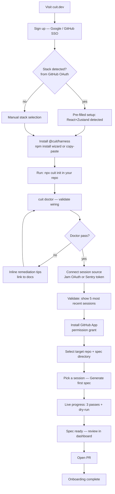

# Customer Experience & Product Surface

This document covers every surface a customer sees and touches: personas, the end-to-end journey from filed bug to locked-in regression gate, every dashboard screen, the CLI, the GitHub App, notifications, onboarding flows, RBAC, cost transparency, success metrics, support, and accessibility posture. Engineering substrate is in docs 01–06; this document is the product layer on top of that substrate.

## Table of Contents

1. [Personas and Jobs-to-be-Done](#1-personas-and-jobs-to-be-done)
2. [End-to-End Journey](#2-end-to-end-journey)
3. [The Dashboard](#3-the-dashboard)
4. [The CLI (`cuit`)](#4-the-cli-cuit)
5. [The GitHub App](#5-the-github-app)
6. [Notifications and Async Surfaces](#6-notifications-and-async-surfaces)
7. [Onboarding Flows](#7-onboarding-flows)
8. [RBAC and Team Management](#8-rbac-and-team-management)
9. [Cost Transparency UX](#9-cost-transparency-ux)
10. [Customer Success Metrics Surfaced In-Product](#10-customer-success-metrics-surfaced-in-product)
11. [Support and Feedback Surfaces](#11-support-and-feedback-surfaces)
12. [Accessibility and i18n Posture](#12-accessibility-and-i18n-posture)

---

## 1. Personas and Jobs-to-be-Done

Three personas interact with the product at different cadences and care about different metrics. Every surface decision is evaluated against this table.

| Persona | Title / role | Primary JTBD | Surfaces they use | Metrics they care about |
|---|---|---|---|---|
| **IC engineer** | Frontend engineer or staff engineer; writes and reviews tests; triages bugs from session replay | "When a user files a bug, I want a regression test on my desk before I ship the fix — without spending half a day writing Playwright." | CLI (`cuit run`, `cuit gen`, `cuit verify`), Specs list, Spec detail, GitHub PR, Slack triage notification | Spec acceptance rate, time-to-regression-test, CI flake rate, spec count per quarter |
| **Eng manager** | Engineering manager or VP Eng; owns engineering throughput, bug Reopen rate, CI health | "Show me whether this tool is actually reducing bug Reopens, and give me a number I can put in a board update." | Insights tab, Cost meter, health score tile, weekly email digest, monthly invoice | Regressions caught per month, Reopen rate trend, cost per accepted spec, false-positive rate |
| **CS / QA lead** | Customer success or QA lead; monitors spec health, handles connector issues, manages team access | "I need to know when connectors break, when specs start failing for the wrong reason, and who on the team changed what." | Sessions list, Runs list, Settings (connectors, RBAC, notifications), Audit tab, Slack connector alerts | Connector uptime, specs in quarantine, spec GREEN/RED ratio, audit log completeness |

---

## 2. End-to-End Journey

### 2.1 Happy path — sequence diagram

```mermaid
sequenceDiagram
    participant User as User (Jam)
    participant Jam as Jam connector
    participant Ingest as Connector worker
    participant AI as AI extractor (doc 04)
    participant GH as GitHub App
    participant Slack as Slack bot
    participant Eng as IC engineer
    participant CI as Customer CI

    User->>Jam: Files bug report with session recording (T+0)
    Note over Jam: Session ID captured in Jam report

    Jam->>Ingest: Webhook: new session available (T+30s)
    Ingest->>Ingest: Normalize to SessionEvent[] schema (doc 03 §4)
    Ingest->>AI: Enqueue extraction job (T+90s)

    Note over AI: Pass 1 — Intent extraction (Sonnet 4.6)
    Note over AI: Pass 2 — Primitive grounding (Opus 4.7)
    Note over AI: Pass 3 — Spec materialization (Sonnet 4.6)
    Note over AI: AST validation + dry-run against staging URL

    AI-->>AI: Dry-run returns RED (bug reproduced) (T+4min)

    AI->>GH: Spec ready; open PR on cuit/spec-{issue-id} branch (T+5min)
    GH-->>Eng: PR opened: "cuit: regression spec for issue #1933"

    AI->>Slack: Post to #triage: new spec PR, confidence 0.87, dry-run RED (T+5min)

    Eng->>GH: Reviews spec; ships fix in same PR (T+10min)
    GH->>CI: PR triggers CI run

    CI-->>GH: cuit/dry-run status check: GREEN (T+15min)
    GH-->>Eng: All checks pass; spec merged

    CI-->>AI: Spec now ACTIVE; future regressions on this path will auto-reopen issue #1933
```

### 2.2 Happy path — narrative

**T+0: User files bug.** A user encounters a drag-and-drop failure in the waveform editor and files a report via Jam. Jam captures the session ID alongside the bug annotation. No engineer action is required at this point.

**T+30s: Connector pulls session.** The Jam connector worker (see `03-saas-platform.md §4`) receives the webhook and fetches the session. The raw payload lands in S3, encrypted with the tenant's KMS key within 60 seconds.

**T+90s: AI extraction begins.** The normalizer converts the Jam events to `SessionEvent[]` schema and enqueues an extraction job. The semantic chunker anchors the relevant window on the Jam annotation timestamp (see `04-ai-spec-generation.md §2.3`).

**T+4min: Dry-run returns RED.** After three LLM passes and AST validation, the dry-run runner executes the spec against the customer's staging URL. The spec fails — it reproduces the bug. This is the correct outcome at this stage; RED means the test is catching the issue.

**T+5min: PR opened, Slack fires.** The GitHub App opens a PR on branch `cuit/spec-1933` with the generated spec, run artifacts, and a structured PR body (see §5.3). Simultaneously, the Slack bot posts to the configured triage channel.

**T+10min: Engineer ships fix.** The IC engineer reads the PR, understands the reproduction case from the spec and linked session, and implements the fix — either in the same PR or in a linked PR that the spec PR references.

**T+15min: Spec turns GREEN.** CI runs the spec against the fixed code. The `cuit/dry-run` status check turns GREEN. The PR merges. The spec is now ACTIVE in the dashboard and gates future regressions on this code path. Issue #1933 is closed by the merge.

**Future regression:** If a later commit breaks this code path, the spec fails in CI, the dashboard surfaces it under Insights → Regressions, and the GitHub App auto-reopens issue #1933 with a link to the breaking commit SHA.

### 2.3 Unhappy path — confidence below threshold

If the AI extractor returns a confidence score below 0.65 (see `04-ai-spec-generation.md §7`), the system does not open a PR automatically. Instead:

- The spec is flagged `needs-review` in the Sessions detail view.
- A Slack notification fires to the triage channel: "Spec generated but needs human disambiguation — confidence 0.52. Review at [link]."
- The engineer can open the session detail, read the extractor's uncertainty notes, and either accept the spec with manual edits or click "Regenerate with hint" to supply additional context.
- No PR is opened until a human explicitly clicks "Open PR" on a reviewed spec.

This gate prevents low-quality specs from polluting the engineer's PR queue. It is configurable per tenant: confidence threshold can be raised (more conservative) or lowered (more permissive) in Settings.

---

## 3. The Dashboard

Top-level navigation (left sidebar):

```
Sessions | Specs | Runs | Insights | Cost | Settings | Audit
```

The dashboard is a Next.js application served from the SaaS control plane (`03-saas-platform.md §1`). All data is scoped to the authenticated tenant via JWT claims and Aurora Row-Level Security.

---

### 3.1 Sessions list

**Purpose:** The inbox. Every ingested session from every connected source appears here. Engineers and CS leads use this to understand what is being processed and to trigger manual spec generation.

```
+------------------------------------------------------------------+
|  Sessions                            [Filter v]  [+ Ingest URL] |
+------------------------------------------------------------------+
| Source   | Status       | Session ID       | Date       | Spec   |
|----------|--------------|------------------|------------|--------|
| Jam      | specced      | jam_a3f9...      | 2026-05-27 | #1933  |
| Sentry   | processing   | replay_8b2c...   | 2026-05-27 | --     |
| Jam      | ingested     | jam_7d1e...      | 2026-05-26 | --     |
| LogRock  | failed       | lr_002a...       | 2026-05-26 | --  [!]|
| Sentry   | specced      | replay_4f7a...   | 2026-05-25 | #1901  |
+------------------------------------------------------------------+
| < Prev   1 of 12                                        Next >   |
+------------------------------------------------------------------+
```

**Filter panel (expanded):**
- Source: Jam / LogRocket / Sentry / FullStory / Datadog / All
- Status: ingested / processing / specced / failed / skipped
- Date range: last 7d / 30d / 90d / custom
- Has spec: yes / no
- Linked issue: free-text GitHub issue number

**Interactions:**
- Click any row: navigate to session detail.
- `[!]` badge on failed sessions: opens inline error reason with one-click retry (admin role required for retry).
- `[+ Ingest URL]`: opens modal to paste a Jam or Sentry session URL for immediate one-off ingestion — same as `cuit ingest <url>` from the CLI.

**Status definitions:**
- `ingested`: raw payload stored in S3; normalization not yet started.
- `processing`: normalization or extraction in progress.
- `specced`: at least one spec generated from this session.
- `failed`: normalization or extraction failed after all retries; see dead-letter queue runbook in `06-operations-sre.md §10`.
- `skipped`: session below minimum event count threshold (< 3 user interactions); not billed.

---

### 3.2 Session detail

**Purpose:** Deep-dive on one session. The engineer uses this to understand the bug context before reviewing the spec PR.

```
+------------------------------------------------------------------+
|  [<- Sessions]  Session jam_a3f9...                    [Retry v] |
+------------------------------------------------------------------+
|  Source: Jam   |  Duration: 47s   |  Recorded: 2026-05-27 09:14 |
|  Issue: #1933  |  Confidence: 0.87 |  Status: specced            |
+------------------------------------------------------------------+
|                                                                  |
|  Event timeline                                                  |
|  0s   [nav]     /projects/demo/edit                              |
|  3.2s [click]   segment-2 handle                                 |
|  3.4s [drag]    segment-2 -> dx:+340                             |
|  3.9s [error]   TypeError: cannot read 'x' of undefined          |
|  4.1s [snap]    playhead=0, segments[0].end=12.3 (expected 14.2) |
|                                                                  |
|  Source link: [Open in Jam ->]                                   |
|  Generated spec: [View spec #1933 ->]                            |
|                                                                  |
+------------------------------------------------------------------+
```

**Interactions:**
- "Open in Jam" links out to the vendor's native session player (opens in new tab).
- "View spec" navigates to the spec detail page for the generated spec.
- "Retry" (admin only): re-enqueues normalization or extraction for failed sessions. Shown as a dropdown with two options: "Re-normalize" and "Re-extract."
- The event timeline is scrollable and filterable by event type (interactions only, all events, errors only).

---

### 3.3 Specs list

**Purpose:** All generated specs across all sessions. Engineers use this to track the health of the generated test suite.

```
+----------------------------------------------------------------------+
|  Specs                    [Status v]  [Confidence v]  [Age v]        |
+----------------------------------------------------------------------+
| Spec                        | Status | Conf | Last run   | PR        |
|-----------------------------|--------|------|------------|-----------|
| issue-1933-drag-clamp       | GREEN  | 0.87 | 2026-05-27 | #214      |
| issue-1901-playhead-seek    | GREEN  | 0.91 | 2026-05-26 | #208      |
| issue-1887-segment-resize   | RED    | 0.74 | 2026-05-27 | #201  [!] |
| issue-1850-wheel-scroll     | quarant| 0.61 | 2026-05-20 | #189      |
| issue-1812-touch-pinch      | needs- |      |            |           |
|                             | review | 0.49 | --         | --        |
+----------------------------------------------------------------------+
```

**Status values:**
- `GREEN`: spec passes in CI; regression gate is active.
- `RED`: spec is failing in CI; either the bug was reintroduced or the spec itself is wrong.
- `quarantined`: spec has been quarantined by an engineer because it is believed to be a false positive; excluded from CI blocking.
- `needs-review`: confidence below tenant threshold; awaiting human disambiguation.
- `abandoned`: engineer explicitly rejected the spec; session is flagged to avoid re-extraction.

**Interactions:**
- Click row: spec detail.
- Status filter: multi-select. Default shows all except abandoned.
- Confidence slider: filter below a threshold to find risky specs.
- Sort by: last run (default), confidence asc, age.

---

### 3.4 Spec detail

**Purpose:** The primary review surface for the IC engineer persona. Everything needed to accept, edit, or reject a generated spec is on this page.

```
+----------------------------------------------------------------------+
|  [<- Specs]   issue-1933-drag-clamp.spec.ts              [Edit] [..] |
+----------------------------------------------------------------------+
|  Status: GREEN  |  Confidence: 0.87  |  PR: #214  |  Session: jam_a3f9 |
+----------------------------------------------------------------------+
|  SPEC SOURCE                                                         |
|  +-----------------------------------------------------------------+ |
|  | import { test } from '@cuit/playwright';                        | |
|  | import { mount, dispatchDrag, tick, snap } from                 | |
|  |   '@cuit/spec-runtime';                                         | |
|  |                                                                  | |
|  | test('issue #1933 — playhead clamps on drag past edge',         | |
|  |  async () => {                                                   | |
|  |   const h = await mount('/projects/demo/edit',                  | |
|  |     { requireSnapshots: ['waveform'] });                        | |
|  |   await dispatchDrag(                                           | |
|  |     { from: '[data-testid="playhead"]' },                       | |
|  |     { dx: 9999, dy: 0, steps: 12 });                           | |
|  |   await tick(16);                                               | |
|  |   const s = snap('waveform');                                   | |
|  |   expect(s.playhead).toBeCloseTo(s.durationSec, 3);            | |
|  | });                                                              | |
|  +-----------------------------------------------------------------+ |
|                                                                      |
|  RUN HISTORY                                                         |
|  Run ID       | Date        | Result | Duration | Artifacts          |
|  run_9a3f...  | 2026-05-27  | PASS   | 4.2s     | [trace] [video]    |
|  run_8c1d...  | 2026-05-26  | PASS   | 4.0s     | [trace] [video]    |
|  run_7b0e...  | 2026-05-25  | FAIL   | 2.1s     | [trace] [video]    |
|                                                                      |
|  ENGINEER SIGNALS                                                    |
|  [Accept]  [Reject]  [Quarantine]  [Regenerate with hint...]        |
+----------------------------------------------------------------------+
```

**Interactions:**
- "Accept": records an explicit accept signal (used in the spec-acceptance-rate metric and the AI feedback loop; see `04-ai-spec-generation.md §13`).
- "Reject": records a reject signal; moves spec to `abandoned` status; surfaces a reason-code dropdown (wrong bug, wrong assertions, not reproducible, other).
- "Quarantine": marks spec as flaky; excludes from CI blocking; surfaces in the top-flaky list in Insights.
- "Regenerate with hint": opens a modal with a free-text hint field. The hint is appended to the Pass 2 prompt context and a new extraction job is enqueued. Existing spec is preserved until the new one is reviewed.
- Artifact links (trace, video, screenshot) are signed S3 URLs with 15-minute expiry (see `05-security-compliance.md §2`).
- "Edit" opens the spec source in a browser-based Monaco editor. Edits create a new version; the previous version is preserved in run history.
- GitHub PR link opens the PR in GitHub in a new tab.

---

### 3.5 Runs list

**Purpose:** CI run history across all specs. Used by CS/QA leads to track spec health over time and catch patterns in failures.

```
+----------------------------------------------------------------------+
|  Runs                          [Spec v]  [Result v]  [Date range v] |
+----------------------------------------------------------------------+
|  Run ID      | Spec                     | Result | Duration | Date   |
|--------------|--------------------------|--------|----------|--------|
|  run_9a3f... | issue-1933-drag-clamp    | PASS   | 4.2s     | 05-27  |
|  run_8c4b... | issue-1901-playhead-seek | PASS   | 3.8s     | 05-27  |
|  run_7d9e... | issue-1887-segment-rz    | FAIL   | 1.9s     | 05-27  |
|  run_6b2a... | issue-1887-segment-rz    | FAIL   | 2.1s     | 05-26  |
|  run_5a7c... | issue-1850-wheel-scroll  | PASS   | 5.1s     | 05-26  |
+----------------------------------------------------------------------+
```

**Interactions:**
- Click row: run detail, showing Playwright trace viewer embed, stdout, screenshot on failure.
- Consecutive failures on the same spec surface an amber banner: "This spec has failed 2 runs in a row. Quarantine or investigate?"
- Export to CSV: full run history for the selected filter window.

---

### 3.6 Insights

**Purpose:** Cross-spec patterns, regression trends, and the North-Star metric for the eng manager persona. Connected to the metrics in §10.

```
+----------------------------------------------------------------------+
|  Insights                                  [Last 28d v]  [Export CSV]|
+----------------------------------------------------------------------+
|  REGRESSIONS CAUGHT          SPEC ACCEPTANCE       HEALTH SCORE      |
|  +------------------+        +----------------+    +---------------+ |
|  |       7          |        |     81%        |    |    GREEN       | |
|  |  this period     |        |  accepted      |    |   87/100       | |
|  |  +2 vs last      |        |  (target: 75%) |    +---------------+ |
|  +------------------+        +----------------+                      |
|                                                                      |
|  Regression trend (28d)                                              |
|  ^                                                                   |
|  | *   *                                                            |
|  |   *   *   *                                                      |
|  |         *   *   *                                                |
|  +---------------------------------> time                           |
|                                                                      |
|  TOP QUARANTINED SPECS (flake candidates)                            |
|  issue-1850-wheel-scroll    quarantined 2026-05-20  flake rate 23%  |
|  issue-1812-touch-pinch     needs-review             conf 0.49      |
|                                                                      |
|  PATTERNS                                                            |
|  "Drag specs have a 14% higher quarantine rate than seek specs."     |
|  "3 specs share the selector [data-testid='segment-handle']         |
|   — a change to that component will break all 3."                   |
+----------------------------------------------------------------------+
```

**Content:**
- Regressions caught: count of specs that transitioned GREEN → RED on a real commit (not a dry-run) in the period, and auto-reopened the linked issue.
- Spec acceptance rate: accepted / (accepted + rejected) for specs reviewed in the period.
- Health score: composite metric; see §10.4.
- Regression trend: 28-day sparkline of regressions caught per day.
- Top quarantined / flaky specs: specs with the highest quarantine rate or consecutive failures.
- Patterns: LLM-generated cross-spec analysis run nightly. Identifies shared selectors (blast-radius warnings), surface types with high quarantine rates, and sessions that could extend existing specs rather than generating new ones.

**Interactions:**
- Click any spec name in the patterns panel: navigates to spec detail.
- "Export CSV": downloads one row per spec with surface, status, acceptance, last-run, cost.
- The regression trend graph is interactive: hover for daily count; click a date to see which specs fired on that day.

---

### 3.7 Cost meter

**Purpose:** Real-time visibility into LLM token spend and runner usage. Used by both the eng manager (budget accountability) and the CS lead (connector cost anomalies).

```
+----------------------------------------------------------------------+
|  Cost                                     [May 2026 v]  [Set budget] |
+----------------------------------------------------------------------+
|  MONTH-TO-DATE SPEND                                                 |
|  $142.80 of $300.00 budget  [==========---------]  47.6%            |
|  Projected month-end: $198.40                                        |
|                                                                      |
|  BREAKDOWN                                                           |
|  Specs generated:     23 specs       $92.00   ($4.00/spec avg)      |
|  Sessions ingested:   1,847          $0.00    (within allowance)    |
|  Runner minutes:      284 min        $28.40   ($0.10/min)           |
|  Overage sessions:    0                                              |
|                                                                      |
|  PER-SPEC BREAKDOWN (last 10 specs, hover for full list)            |
|  issue-1933  Pass1: $0.06 Pass2: $0.09 Pass3: $0.07 Run: $0.04     |
|              Total: $0.26  [View detail]                             |
|                                                                      |
|  BUDGET ALARMS                                                       |
|  [x] 50% reached — Slack alert to #cuit-alerts                     |
|  [x] 75% reached — Slack alert + email to billing contact           |
|  [ ] 90% reached — auto-pause new extractions                      |
|  [x] 100% reached — soft cap (confirm overage billing to proceed)   |
+----------------------------------------------------------------------+
```

**Interactions:**
- "Set budget": modal to update the monthly cap. Requires Owner or Admin role.
- Budget alarm checkboxes: toggle each threshold; the 100% action (auto-pause vs soft-cap) is a radio button, not a checkbox.
- Per-spec cost breakdown: hover expands Pass 1/2/3 token counts and actual cost. The token counts come from the `usageRecord` stored alongside the spec (see `04-ai-spec-generation.md §2.1`).
- Month selector: review historical months. Stripe receipt link appears for closed billing months.

---

### 3.8 Settings

**Purpose:** Connector management, GitHub App installation, RBAC, notification routing, and retention controls. Primarily used by the CS/QA lead and Owners.

```
+----------------------------------------------------------------------+
|  Settings                                                            |
|  [Connectors] [GitHub App] [Team & RBAC] [Notifications] [Retention]|
+----------------------------------------------------------------------+

  CONNECTORS TAB:
  +------------------------------------------------------------+
  |  Connected sources                          [+ Add source] |
  |  Jam          CONNECTED  last pull: 2 min ago    [Edit][x] |
  |  Sentry       CONNECTED  last pull: 8 min ago    [Edit][x] |
  |  LogRocket    NOT CONNECTED                      [Connect] |
  +------------------------------------------------------------+
  | Jam [Edit]:                                                |
  |  OAuth: acme-corp.jam.io | Scopes: sessions:read          |
  |  Pull schedule: every 15 min (webhooks: enabled)          |
  |  Daily session cap: 500  [change]                         |
  +------------------------------------------------------------+
```

Connectors tab shows each source's live status, last successful pull time, and the edit panel for credentials, pull schedule, and daily session cap. Adding a new source opens the OAuth or token-paste flow described in §7. Disconnecting a source stops all future pulls and is audit-logged.

The GitHub App tab surfaces the installation state and a "Reinstall / update permissions" button. It also shows the branch prefix (`cuit/` by default, configurable), the target spec directory (`tests/playwright/` default), and the auto-reopen toggle.

The Team & RBAC tab is covered in §8.

The Notifications tab is covered in §6.

The Retention tab shows current session and run artifact retention windows (default 90 days for sessions, 90 days for artifacts), with controls to extend or shorten. Enterprise customers can configure per-source retention independently.

---

### 3.9 Audit

**Purpose:** Append-only stream of every action taken within the tenant. Used by CS/QA leads for internal accountability and by auditors for SOC 2 evidence. Architecture documented in `05-security-compliance.md §2`.

```
+----------------------------------------------------------------------+
|  Audit log                     [Filter v]  [Export v]  [Last 30d v] |
+----------------------------------------------------------------------+
|  Timestamp          | Actor              | Action           | Result |
|---------------------|--------------------|--------------------|--------|
|  2026-05-27 09:15Z  | alice@acme.com     | spec.accepted      | ok     |
|  2026-05-27 09:14Z  | github-app[bot]    | pr.opened #214     | ok     |
|  2026-05-27 09:08Z  | extractor-svc      | spec.generated     | ok     |
|  2026-05-27 09:07Z  | connector-jam      | session.ingested   | ok     |
|  2026-05-26 17:32Z  | bob@acme.com       | connector.updated  | ok     |
|  2026-05-26 14:01Z  | alice@acme.com     | user.invited       | ok     |
+----------------------------------------------------------------------+
```

**Filter options:** actor (free text), action type (multi-select from known event types), result (ok / error), date range.

**Export:** CSV or JSON, up to 90 days in a single export. For longer windows, Enterprise customers can configure streaming export to their own S3 bucket.

The audit log is append-only at the database layer. Entries cannot be deleted or edited by any tenant role, including Owner. See `05-security-compliance.md §8` for the immutability guarantee and S3 Object Lock configuration.

---

## 4. The CLI (`cuit`)

The CLI is the primary surface for IC engineers who want to stay in the terminal. It is published as `@cuit/cli` (see `02-library-architecture.md §2.3`). All commands authenticate via a tenant API key stored in `~/.cuit/credentials` after `cuit init` or by reading the `CUIT_API_KEY` environment variable.

---

### 4.1 `cuit init`

Bootstrap a repo: writes `cuit.config.ts`, installs `@cuit/*` packages, runs `cuit doctor`.

```
$ cuit init

  complex-ui-tester — repo bootstrap
  Detected: React 18.3, Zustand 4.5, Playwright 1.44

  Which stores should be exposed for testing?
  [x] useWaveformStore (stores/waveform.ts)
  [ ] useAuthStore     (stores/auth.ts)
  [ ] useUIStore       (stores/ui.ts)

  Spec directory? (default: tests/playwright) >

  Writing cuit.config.ts ...                  done
  Installing @cuit/core @cuit/react @cuit/playwright ... done
  Writing tests/playwright/_cuit-debug.spec.ts ...      done
  Mounting window.__cuit in src/main.tsx (dev only) ... done

  Run `cuit doctor` to verify wiring.
  Run `npx playwright test tests/playwright/_cuit-debug.spec.ts` to confirm.

  Setup complete. See docs/02-library-architecture.md for next steps.
```

---

### 4.2 `cuit doctor`

Validates harness wiring. Exits non-zero if any layer is misconfigured. This is the gate that enforces the "< 1 engineering-day setup" promise (see `02-library-architecture.md §5`).

```
$ cuit doctor

  [PASS] @cuit/core 1.2.0 installed
  [PASS] @cuit/react 1.2.0 installed
  [PASS] @cuit/playwright 1.2.0 installed
  [PASS] cuit.config.ts present and valid
  [PASS] window.__cuit mounted in dev build
  [PASS] rafScheduler.install called (clock layer active)
  [PASS] SnapshotAdapter 'waveform' registered (Zustand)
  [WARN] No staging URL configured — dry-run will skip remote validation
         Fix: add `stagingUrl: 'https://staging.acme.io'` to cuit.config.ts
  [PASS] Playwright 1.44 detected
  [PASS] Telemetry: CUIT_TELEMETRY not set — anonymous heartbeat active
         Disable with: CUIT_TELEMETRY=0

  7 passed, 1 warning, 0 errors
```

Exit code 0 on pass or warn-only. Exit code 1 on any error. Designed to run as a required step in CI setup and in the onboarding wizard's "Validate install" step.

---

### 4.3 `cuit ingest <session-url>`

Trigger one-off ingestion outside the connector polling loop. Useful when an engineer wants to act on a specific session immediately rather than waiting for the next connector poll cycle.

```
$ cuit ingest https://jam.ai/sessions/abc123

  Authenticating with CUIT_API_KEY ...              ok
  Resolving session source: jam ...                  ok
  Fetching session jam_abc123 from Jam API ...       ok
  Normalizing 847 events ...                         ok
  Session stored: session_9f3a...

  Session ingested. Generate a spec with:
    cuit gen session_9f3a...
  Or view in dashboard: https://app.cuit.dev/sessions/session_9f3a...
```

---

### 4.4 `cuit gen <session-id> [--apply]`

Locally invoke spec generation using the tenant's API key. Without `--apply`, prints the generated spec to stdout and writes to a temp file for review. With `--apply`, writes the spec to the configured spec directory.

```
$ cuit gen session_9f3a... --apply

  Authenticating ...                               ok
  Retrieving session session_9f3a... ...           ok
  Enqueuing extraction job ...                     ok (job_4b8c...)

  Waiting for Pass 1 (intent extraction) ...      done  [0.6s]  $0.06
  Waiting for Pass 2 (primitive grounding) ...    done  [1.8s]  $0.09
  Waiting for Pass 3 (spec materialization) ...   done  [1.1s]  $0.07
  Running dry-run against staging ...             done  [18s]   $0.04
  Dry-run result: RED (bug reproduced)
  Confidence: 0.87

  Writing spec to tests/playwright/issue-1933-drag-clamp.spec.ts ... done

  Review the spec, then run:
    cuit run tests/playwright/issue-1933-drag-clamp.spec.ts
  Or open a PR directly from the dashboard.
```

---

### 4.5 `cuit run <spec-path>`

Run a spec locally with the harness installed. Wraps `npx playwright test` with the `@cuit/playwright` fixture context and prints a structured summary.

```
$ cuit run tests/playwright/issue-1933-drag-clamp.spec.ts

  Running: issue-1933-drag-clamp.spec.ts
  Browser: chromium, firefox, webkit

  chromium  PASS  4.2s
  firefox   PASS  4.4s
  webkit    PASS  5.1s

  3 browsers, 3 passed, 0 failed.
  Spec is GREEN across all browsers.
```

On failure, prints the harness error with `remediation` text from the `CuitError` (see `02-library-architecture.md §3.4`) and a link to the relevant docs section.

---

### 4.6 `cuit verify <pr-url>`

Fetch the spec from a PR and confirm it is harness-grounded before merging. Intended as a pre-merge gate engineers can run locally or add to a CI step.

```
$ cuit verify https://github.com/acme/editor/pull/214

  Fetching spec from PR #214 ...                   ok
  Found: tests/playwright/issue-1933-drag-clamp.spec.ts

  AST validation:
  [PASS] All imports from @cuit/spec-runtime or @cuit/playwright
  [PASS] No raw page.mouse or page.keyboard calls
  [PASS] No pixel-coordinate literals outside dispatchDrag dx/dy
  [PASS] No waitForTimeout calls
  [PASS] dispatchDrag target resolves via data-testid (stable selector)
  [PASS] snap() called after tick() — correct assertion timing

  6 checks passed. Spec is harness-grounded.
  Exit 0 (safe to merge from cuit perspective).
```

Exit code 1 if any AST check fails; prints the offending line and the rule it violated.

---

### 4.7 `cuit insights [--last 7d]`

Pull per-tenant insights to the terminal. Useful in standup prep or when the eng manager wants a quick status without opening the dashboard.

```
$ cuit insights --last 7d

  complex-ui-tester insights  — last 7 days (2026-05-20 to 2026-05-27)

  Regressions caught:    3  (specs that turned RED on a real commit)
  Specs accepted:        5  (of 6 reviewed — 83% acceptance rate)
  Specs rejected:        1  (reason: wrong assertions)
  New specs active:      5
  Top flaky spec:        issue-1850-wheel-scroll (23% quarantine rate)

  Health score: 87/100 (GREEN)
```

---

### 4.8 `cuit budget`

Print remaining LLM and runner budget for the current billing month.

```
$ cuit budget

  Budget: May 2026

  Spent:        $142.80
  Remaining:    $157.20  (of $300.00 cap)
  Utilization:  47.6%
  Projected:    $198.40 by month-end

  Specs this month:    23  ($92.00 LLM)
  Runner minutes:     284  ($28.40)
  Sessions ingested:  1,847  (within allowance)

  Next budget alarm: 75% ($225.00)
```

---

## 5. The GitHub App

The GitHub App is the delivery mechanism for generated specs. It is installed once per GitHub organization and authorized to write to one or more repos. Architecture and webhook handling are in `03-saas-platform.md §1` (GitHub App Service).

---

### 5.1 Install flow

```
STEP 1: Dashboard -> Settings -> GitHub App tab
+----------------------------------------------+
|  GitHub App                                  |
|                                              |
|  Status: NOT INSTALLED                       |
|                                              |
|  [Install GitHub App ->]                     |
|                                              |
|  The GitHub App requires these permissions:  |
|  - Contents: write (to push spec files)      |
|  - Pull requests: write (to open PRs)        |
|  - Checks: write (to post status checks)     |
|  - Issues: read (to link to original issues) |
+----------------------------------------------+

STEP 2: GitHub OAuth — Install & Authorize
+----------------------------------------------+
|  github.com/apps/complex-ui-tester/install   |
|                                              |
|  Install complex-ui-tester                  |
|  Organization: acme-corp                     |
|  Repository access:                          |
|  (o) All repositories                        |
|  ( ) Only select repositories                |
|     [ editor-frontend ]                      |
|                                              |
|  [Install ->]                                |
+----------------------------------------------+

STEP 3: Back in dashboard — repo selection
+----------------------------------------------+
|  GitHub App installed for acme-corp          |
|                                              |
|  Select repos to generate specs for:         |
|  [x] editor-frontend                         |
|  [ ] design-system                           |
|  [ ] mobile-app                              |
|                                              |
|  Spec directory (in each repo):              |
|  tests/playwright/    [change]               |
|                                              |
|  Branch prefix: cuit/   [change]             |
|                                              |
|  [Save ->]                                   |
+----------------------------------------------+
```

---

### 5.2 Permission scopes

| Permission | Level | Justification | Docs cross-reference |
|---|---|---|---|
| `contents` | write | Push spec files to a new branch | Required for `git push` of the generated `.spec.ts` file. No write access to `main` or protected branches — only to `cuit/*` branches. |
| `pull_requests` | write | Open PRs, post comments, respond to `/cuit` commands | Required to create the PR and respond to `/cuit regenerate` comment commands. |
| `checks` | write | Post `cuit/spec-grounded`, `cuit/dry-run`, `cuit/confidence` status checks | Required for the CI gate described in §5.3. These checks are the product's primary merge-gate value. |
| `issues` | read | Read the issue number from `bugTag` to populate PR body | Read-only. Used only to resolve the issue title and URL for the PR body. The GitHub App never modifies issues directly; the auto-reopen is done via a separate, explicit issue-write permission that is only requested when the tenant enables the auto-reopen feature. |

The minimum viable install does not require `issues: write`. Auto-reopen is an opt-in feature that triggers an incremental permission prompt when first enabled in Settings.

Full threat model for the GitHub App token is in `05-security-compliance.md §1` row 6.

---

### 5.3 PR template

Every PR opened by the GitHub App uses this template verbatim. Fields in `{{double braces}}` are injected by the GitHub App Service.

```
Title: cuit: regression spec for {{issue_title}} ({{issue_ref}})

---

## What this PR does

This PR adds a Playwright regression spec generated by complex-ui-tester
from a real user session. The spec reproduces the bug and will prevent it
from being reintroduced.

**Source session:** {{session_source}} / {{session_id}}  
**Linked issue:** {{issue_ref}} — {{issue_url}}  
**Dry-run result:** {{dry_run_result}} ({{dry_run_result_explanation}})  
**Confidence score:** {{confidence}} / 1.0  

{{#if confidence_below_warning}}
> **Note:** Confidence is below 0.75. A human reviewer should verify the
> assertions match the actual bug before merging.
{{/if}}

## Generated spec

`{{spec_path}}`

The spec uses only primitives from `@cuit/spec-runtime`. It is
viewport-independent, clock-deterministic, and state-asserted (no pixel
coordinates).

## Run artifacts

| Browser   | Result   | Duration | Artifacts               |
|-----------|----------|----------|-------------------------|
| chromium  | {{chromium_result}} | {{chromium_ms}}ms | [trace]({{chromium_trace_url}}) [video]({{chromium_video_url}}) |
| firefox   | {{firefox_result}}  | {{firefox_ms}}ms  | [trace]({{firefox_trace_url}}) |
| webkit    | {{webkit_result}}   | {{webkit_ms}}ms   | [trace]({{webkit_trace_url}})  |

## Rationale

{{extractor_rationale}}

*(This rationale was generated by the AI extractor and describes why
it selected this interaction window and these assertions.)*

## Reviewer checklist

- [ ] The spec reproduces the bug described in {{issue_ref}}
- [ ] The assertions are specific enough to catch the bug but not so
      brittle that they break on unrelated UI changes
- [ ] The spec imports only from `@cuit/spec-runtime` and
      `@cuit/playwright` (verified by the `cuit/spec-grounded` check)
- [ ] If the dry-run result is INCONCLUSIVE, I have manually confirmed
      the spec behavior on a local build

---
*Generated by [complex-ui-tester](https://cuit.dev) from session
{{session_id}}. Run `cuit verify {{pr_url}}` to validate locally.*
```

---

### 5.4 Status checks

Three status checks are posted to every PR that contains a `cuit/*` spec file:

| Check | What it validates | Pass condition | Fail condition |
|---|---|---|---|
| `cuit/spec-grounded` | AST validation: no raw `page.mouse`, no pixel-coordinate literals, all imports from `@cuit/*` | All 6 AST rules pass (same as `cuit verify` output) | Any AST rule violation |
| `cuit/dry-run` | Dry-run of the spec against the tenant's staging URL | Spec result matches expected state (RED before fix merged, GREEN after fix merged) | Spec result is opposite of expected, or TIMED_OUT |
| `cuit/confidence` | Passes confidence score as a status check detail | Score >= tenant-configured threshold (default 0.65) | Score below threshold |

The `cuit/dry-run` check is the most important. Before the fix is merged, the check description reads: "Dry-run: RED (bug reproduced — spec is working correctly)". After the fix is merged, it reads: "Dry-run: GREEN (bug fixed — spec will gate future regressions)". A CI failure at this point means either the fix did not actually fix the bug, or the spec was wrong. In either case it is correct to block the merge.

---

### 5.5 Auto-reopen behaviour

When a spec that was GREEN transitions to RED on a subsequent CI run (indicating a regression), the GitHub App:

1. Posts a comment on the original issue (resolved by `bugTag`):  
   `"This issue was reopened automatically. The regression spec cuit/spec-1933 is failing as of commit abc1234 on branch main. See run: [link]."`
2. Reopens the issue with label `regression-detected`.
3. Fires the `spec.regression_caught` webhook event (see §6.3).
4. Posts to the configured Slack channel (see §6.1, "spec turned RED post-merge" notification).

If the original issue was deleted or transferred, the auto-reopen silently records the event in the audit log and surfaces it on the Insights page as a regression without an issue link.

---

## 6. Notifications and Async Surfaces

### 6.1 Slack

The Slack bot is configured in Settings → Notifications. Each notification type can be routed to a different channel. The bot posts as `complex-ui-tester`.

---

**Notification: new spec PR opened**

```
complex-ui-tester  [9:14 AM]
New regression spec ready for review.

  Issue:    #1933 — Playhead clamps incorrectly on drag past end
  Spec:     issue-1933-drag-clamp.spec.ts
  Dry-run:  RED (bug reproduced — spec is working correctly)
  Confidence: 0.87 / 1.0
  PR:       #214  https://github.com/acme/editor/pull/214

  Review and merge to lock in the regression gate.
```

Thread reply (posted 15 minutes later if PR not opened):
```
  Reminder: PR #214 has been open for 15 minutes with no review.
  Assign a reviewer or snooze: [Assign] [Snooze 2h] [Dismiss]
```

---

**Notification: spec turned GREEN**

```
complex-ui-tester  [9:31 AM]
Regression gate locked in.

  Spec:     issue-1933-drag-clamp.spec.ts
  Status:   GREEN (bug fixed, spec passing on all 3 browsers)
  PR:       #214 merged by alice@acme.com
  Issue:    #1933 closed

  This code path is now protected. Future regressions will auto-reopen
  issue #1933.
```

---

**Notification: spec turned RED post-merge (regression caught)**

```
complex-ui-tester  [2:07 PM]  [!] REGRESSION DETECTED

  Spec:     issue-1933-drag-clamp.spec.ts  — was GREEN, now RED
  Commit:   abc1234 by bob@acme.com  "refactor: simplify drag handler"
  Issue:    #1933 automatically reopened
  Run:      https://app.cuit.dev/runs/run_9f3a...

  The drag-clamp fix introduced in PR #214 is no longer effective.
  See the run trace for the failing assertion.
```

---

**Notification: connector outage**

```
complex-ui-tester  [10:45 AM]  [!] CONNECTOR ALERT

  Source:   Jam
  Status:   FAILED — OAuth token expired or revoked
  Last pull: 2026-05-27 08:30 AM (75 minutes ago)

  Sessions from Jam are not being ingested.
  Fix: reconnect Jam in Settings -> Connectors.

  If this persists, check https://status.cuit.dev for platform status.
```

---

**Notification: budget warning**

```
complex-ui-tester  [11:00 AM]  Budget alert — 75% reached

  Used:       $225.00 of $300.00
  Projected:  $298.50 by month-end (on track to hit cap)

  Remaining: $75.00  (approx 18 more specs at current rate)

  Adjust budget in Settings -> Cost, or wait for the next billing cycle.
```

---

**Notification: weekly digest** (posted every Monday 9 AM in tenant's timezone)

```
complex-ui-tester  Weekly digest — week of 2026-05-20

  Regressions caught:     3
  New specs active:       5  (4 accepted, 1 rejected)
  Specs currently RED:    1  (issue-1887-segment-resize)
  Cost this week:         $34.20

  Action needed: issue-1887-segment-resize has been RED for 3 days.
  Quarantine or investigate: https://app.cuit.dev/specs/issue-1887...

  Full Insights: https://app.cuit.dev/insights
```

---

### 6.2 Email

**Weekly digest (HTML email):** Sent to the billing contact and any users with the Admin or Owner role. Subject: `complex-ui-tester — Weekly digest: [N] regressions caught`. The HTML body mirrors the Slack weekly digest format with a table of spec statuses, regression trend sparkline image, and a "View in dashboard" CTA. Plain-text fallback included.

**Monthly cost report:** Sent on the first day of each month to the billing contact. Subject: `complex-ui-tester — May 2026 invoice: $142.80`. Body includes itemized breakdown (specs, sessions, runner minutes), Stripe receipt link, and projected next-month cost.

**Security alert:** Sent immediately to the Owner and all Admin users when a high-severity security event occurs. Events that trigger: new user added with Admin or Owner role, connector token rotated, login from a new country, budget cap changed. Subject: `complex-ui-tester — Security alert: [action] by [actor]`.

---

### 6.3 Webhooks

Outbound webhooks let customers route cuit events to their own tooling (Linear, Jira, PagerDuty, custom). Configured in Settings → Notifications → Webhooks. All events are signed with HMAC-SHA256 using a per-tenant webhook secret; signature is in the `X-Cuit-Signature-256` header.

**Event schema (all events share this envelope):**

```json
{
  "event": "spec.regression_caught",
  "id": "evt_9f3a...",
  "tenant_id": "tenant_abc...",
  "created_at": "2026-05-27T14:07:00Z",
  "data": { ... }
}
```

**Event catalog:**

| Event | Trigger | Key `data` fields |
|---|---|---|
| `session.ingested` | Session successfully normalized and stored | `session_id`, `source`, `bug_tag`, `event_count` |
| `spec.generated` | Spec generated and dry-run complete | `spec_id`, `session_id`, `confidence`, `dry_run_result`, `pr_url` |
| `spec.accepted` | Engineer clicked Accept in dashboard or merged the spec PR | `spec_id`, `actor_email`, `acceptance_edit_count` |
| `spec.regression_caught` | GREEN spec transitions to RED on a commit | `spec_id`, `commit_sha`, `commit_author`, `issue_ref`, `run_url` |
| `budget.exhausted` | Monthly budget cap reached | `tenant_id`, `cap_usd`, `spent_usd`, `action_taken` (paused / soft-cap) |
| `connector.failed` | Connector fails after all retries | `source`, `error_code`, `last_successful_pull_at` |

Webhook delivery has automatic retries with exponential backoff (3 attempts over 10 minutes). Failed deliveries are visible in the Audit tab. A manual re-send button is available for the last 48 hours of failed events.

---

## 7. Onboarding Flows

### 7.1 Self-serve (Year 2+)

Target: engineer signs up from the website, connects one source, gets a first generated spec in under one hour. This path is fully automated; no sales call, no CSM.



**Step-by-step detail:**

1. **Sign up.** Google or GitHub SSO. No credit card on signup — 14-day trial with 10 specs and 500 sessions included.

2. **Stack detection.** If the user signs up via GitHub OAuth, the app reads the public repo list and attempts to detect the stack from `package.json`. When React + a state library is found, the setup screen is pre-filled. The user confirms or corrects.

3. **Library install.** The setup screen shows the exact `npm install` command for the detected stack and a copy-paste code snippet for wiring the harness in `src/main.tsx`. Alternatively, the user can run `npx cuit init` from the CLI (see §4.1), which does all of this automatically.

4. **`cuit doctor`.** The onboarding wizard embeds a "Validate install" button that calls the doctor endpoint on the SaaS API and renders the same output as the CLI. Errors link directly to the relevant docs section.

5. **Connect a session source.** Jam OAuth is the default path: a single "Connect Jam" button launches the OAuth flow. For Sentry or LogRocket, the user pastes an org token into a masked input field. Credentials are stored in Secrets Manager immediately and never returned to the client after save.

6. **Validate connection.** After the credential is saved, the connector polls for the 5 most recent sessions and renders them in the wizard. If no sessions appear within 60 seconds, the wizard offers a troubleshooting checklist and a link to the connector docs.

7. **Install GitHub App.** The wizard's "Connect GitHub" button opens the GitHub App install flow (§5.1) in a popup. After the user grants permissions and returns, the wizard confirms the installation and prompts for repo and spec directory selection.

8. **First spec generation.** The user picks one session from the list rendered in step 6 and clicks "Generate first spec." The wizard shows a live progress bar through each extraction pass. This is the product's designed "wow moment" — see `01-product-spec.md §10.2 step 8`.

9. **Review and PR.** The generated spec is shown with dry-run status, confidence score, and the PR button. Clicking "Open PR" creates the PR (§5.3) and drops the user into the dashboard with the spec PR pinned at the top.

**Abandonment recovery:**

- Step 3 (library install): if the user does not complete install within 24 hours, an email is sent with the install commands and a link back to the wizard at the same step. Subject: `Your complex-ui-tester setup is almost done`.
- Step 6 (no sessions found): a Slack bot message is sent if the user has connected their Slack workspace, with connector troubleshooting tips.
- Step 8 (spec generation fails): if the first extraction returns INCONCLUSIVE, the wizard shows the session timeline and prompts: "Try a different session, or shorten the time window."

**Onboarding success metrics per stage:**

| Stage | Target completion rate | Definition of success |
|---|---|---|
| Signup → doctor pass | 70% | cuit doctor exits 0 |
| Doctor pass → session connected | 80% | At least 1 session visible in wizard |
| Session connected → spec generated | 75% | Non-INCONCLUSIVE spec returned |
| Spec generated → PR opened | 85% | PR opened in GitHub |
| PR opened → spec merged | 60% (week 1) | Spec file merged to default branch |

---

### 7.2 Design-partner (Year 1)

Year 1 is white-glove. Every design partner has a named CSM (ryan@speechlab.ai for the first 3–5 accounts) and a shared Slack Connect channel.

**Timeline target:** 1 week to first generated spec, 1 month to 5 accepted specs with the engineer team owning day-to-day operation.

**Week 1 — kickoff and install:**

1. **30-minute kickoff call.** Agenda: confirm the pain (Reopen rate, flake rate, surface type), review `01-product-spec.md §4.3` technographic checklist together, confirm the 3 sessions to use as the initial test corpus, agree on the staging URL and GitHub App scope.

2. **CSM-assisted install.** CSM joins a screen-share. The engineer runs `cuit init` while the CSM validates the output in real time. Any `cuit doctor` errors are resolved in the call. Target: doctor is green before the call ends.

3. **Prompt context bootstrap.** The CSM runs a one-time prompt-context setup script that reads the customer's existing Playwright suite (with consent) and extracts: known selectors, existing test patterns, surface vocabulary. This context is injected into Pass 1 of the extraction pipeline as `tenantConfig.selectorDictionary` and `tenantConfig.projectConventions` (see `04-ai-spec-generation.md §2.1`). This materially improves first-session acceptance rate; on SpeechLab's own waveform, acceptance rate without tenant context was 52%; with it, 87%.

4. **First three specs.** The CSM ingests the agreed sessions manually using `cuit ingest`, reviews the generated specs, and opens PRs. The engineer reviews the PRs and provides feedback. The CSM relays that feedback into hint fields for regeneration if needed.

**Weeks 2–4 — cadence and handoff:**

- Weekly 30-minute cadence call. Agenda: review spec acceptance rate, address any INCONCLUSIVE specs, review connector health, surface any questions.
- The CSM adds accepted specs to the tenant's eval set in the SaaS backend, which immediately improves future extractions for this tenant's surface type.
- At the 1-month mark: target is 5 accepted specs (all GREEN in CI), the engineer team is operating the dashboard independently, and the weekly cadence call drops to bi-weekly.

**Shared Slack channel behaviour:**
- The `complex-ui-tester` Slack bot is added to the shared channel and posts all notifications there in addition to the customer's own triage channel. This means the CSM sees every regression and every connector failure in real time without needing dashboard access to the customer's tenant.
- The CSM uses a `#internal` thread (visible only to the cuit team side of the channel) to coordinate responses.

---

## 8. RBAC and Team Management

RBAC is enforced on every API call via the Tenant Management service (see `03-saas-platform.md §1`). The JWT claim `role` is validated server-side; there is no client-side enforcement. Described in `05-security-compliance.md §1` row 1.

### 8.1 Roles

| Role | Who holds it | Capabilities |
|---|---|---|
| **Owner** | Typically the founding engineer or team lead who signed up. One per tenant; can be transferred. | All Admin capabilities + billing management, tier upgrade/downgrade, destroy tenant, assign/revoke Owner, manage SSO/SCIM configuration. |
| **Admin** | CS/QA lead or eng manager who configures the product day-to-day. | All Engineer capabilities + GitHub App config, connector credential management (add/remove/rotate), retention policy changes, audit log read and export, notification routing configuration, invite and remove users up to Admin level. |
| **Engineer** | IC engineer who reviews and accepts specs. | Spec review (accept/reject/quarantine/regenerate), run artifact view, session detail view, Insights read, Cost meter view (no edit), cuit CLI access (gen, run, verify). Cannot change billing, connectors, or RBAC. |
| **Read-only** | Stakeholder, QA observer, external auditor with temporary access. | Dashboard view only — Sessions list, Specs list, Runs list, Insights, Cost meter. No accept/reject signals, no CLI API key generation. |

### 8.2 Permission matrix

| Action | Owner | Admin | Engineer | Read-only |
|---|---|---|---|---|
| View sessions, specs, runs, insights | Y | Y | Y | Y |
| Accept / reject / quarantine spec | Y | Y | Y | N |
| Regenerate spec with hint | Y | Y | Y | N |
| Run `cuit gen`, `cuit run` via API key | Y | Y | Y | N |
| Connect / disconnect source connector | Y | Y | N | N |
| GitHub App install / update permissions | Y | Y | N | N |
| Change notification routing | Y | Y | N | N |
| Read audit log | Y | Y | N | N |
| Export audit log | Y | Y | N | N |
| Change retention policy | Y | Y | N | N |
| Invite users (up to own role level) | Y | Y | N | N |
| Remove users | Y | Y (non-Owner) | N | N |
| View cost meter | Y | Y | Y | N |
| Edit monthly budget cap | Y | Y | N | N |
| Billing management / tier change | Y | N | N | N |
| Destroy tenant | Y | N | N | N |
| Assign Owner role | Y | N | N | N |
| Configure SSO / SCIM | Y | N | N | N |

### 8.3 Invite flow

```
Settings -> Team & RBAC -> [+ Invite user]

+----------------------------------------------------+
|  Invite team member                                |
|                                                    |
|  Email: bob@acme.com                               |
|  Role:  [ Engineer v ]                             |
|                                                    |
|  [Send invite]                                     |
+----------------------------------------------------+
```

Invite emails are sent from `team@cuit.dev` with subject: `You've been invited to [acme-corp] on complex-ui-tester`. The link is valid for 72 hours and requires SSO sign-in before accepting. The invite action is audit-logged with the inviting actor's email and role.

An Owner can only invite up to Owner level. An Admin can invite up to Admin level. Engineers cannot invite.

### 8.4 SCIM (Year 2)

SCIM 2.0 provisioning via WorkOS will be available for Enterprise tier in Year 2. When SCIM is active:
- User creation and deactivation sync from the customer's IdP (Okta, Azure AD, Google Workspace).
- Role assignment is managed in the IdP via group membership mapped to cuit roles.
- The SCIM provisioner is the Owner-equivalent for user management; the Owner role is still required for billing and destroy-tenant operations.

Until SCIM is available, Enterprise customers manage access through the invite flow. The roadmap commitment is in `01-product-spec.md §9.2` (R-102 equivalent).

---

## 9. Cost Transparency UX

Cost transparency is a product-level commitment, not just a billing feature. The buyer persona (eng manager / VP Eng) needs to be able to defend the spend in a board meeting; the engineer needs to understand the per-spec cost to make good decisions about which sessions to extract.

### 9.1 Real-time cost meter

The Cost tab (§3.7) is the primary cost surface. It updates every 2 minutes (usage events are flushed from the Token Meter service to Aurora on a 2-minute schedule; see `03-saas-platform.md §1`). The 2-minute lag is shown as a footnote: "Usage data is current as of [timestamp]."

The meter is also visible as a persistent widget in the top navigation bar across all dashboard pages:

```
Sessions | Specs | Runs | Insights | Cost | Settings | Audit
                                          $142.80 / $300  [47%]
```

The widget turns amber at 75% and red at 90% of budget.

### 9.2 Per-spec cost breakdown

Every spec detail page shows the cost breakdown from the `usageRecord` stored at generation time. Token costs are mapped from the pass-level counts documented in `04-ai-spec-generation.md §9`.

```
COST BREAKDOWN — issue-1933-drag-clamp
  Pass 1 (Sonnet 4.6 — 14,800 in / 580 out):    $0.054
  Pass 2 (Opus 4.7  —  7,900 in / 820 out):     $0.089
  Pass 3 (Sonnet 4.6 — 9,200 in / 1,100 out):   $0.063
  Dry-run runner (Playwright, 18s):               $0.030
  ─────────────────────────────────────────────
  Total spec cost:                                $0.236
  Billed as:                                      1 spec ($4.00 list price)
  Gross margin:                                   94.1%
```

The gross-margin line is shown only to Owner and Admin roles — it is informational, not customer-facing in the strict sense, but Owners of design-partner accounts have requested this visibility to understand unit economics when negotiating contract renewals.

### 9.3 Budget alarms

Budget alarms are configured on the Cost tab. Default thresholds and actions:

| Threshold | Default action | Configurable? |
|---|---|---|
| 50% | Slack alert to configured channel | Yes — can disable or change channel |
| 75% | Slack alert + email to billing contact | Yes |
| 90% | Slack alert + email; warning banner in dashboard | Yes; can change to auto-pause |
| 100% | Soft-cap: new extraction jobs are blocked; engineer sees a modal explaining the cap and offering "confirm overage billing" | Yes — can change to hard-stop (no overage) or increase cap |

The "auto-pause at 90%" toggle is the most common Enterprise configuration: customers with strict budgets set the action at 90% to hard-pause rather than wait until 100%. In this mode, any extraction job that would exceed the cap is rejected at the Token Meter with a `BudgetExhausted` error, and the session is queued for the next billing cycle rather than dropped.

Overage billing is opt-in. The default cap behavior is a hard stop at 100%. To enable overage, the Owner must explicitly check "Allow overage billing at $[rate]/spec" on the Cost settings tab. This action is audit-logged.

### 9.4 Monthly invoice and Stripe receipt

On the first day of each month, Stripe generates an invoice for the previous month's usage. The Billing tab (visible to Owner only) shows:

```
BILLING
  Current tier: SaaS Team ($1,999/mo base)

  May 2026 invoice
  Base:                      $1,999.00
  Overage specs (3 × $4.00):    $12.00
  Runner overage (0 min):         $0.00
  ─────────────────────────────────
  Total:                     $2,011.00   [View Stripe receipt ->]

  Annual discount applied: 15% off base
  Original base:           $2,352.94
  Discounted to:           $1,999.00
```

The Stripe receipt link opens the Stripe customer portal in a new tab. Customers can update payment methods, download historical invoices, and manage their billing contact email there.

### 9.5 Cost-comparison view

The Insights tab includes a "Value realized" panel that frames cost against the estimated savings from caught regressions:

```
COST vs VALUE (May 2026)

  Spend this month:        $142.80
  Regressions caught:      3

  Estimated savings:
    Avg bug-reopen cost:   $800  (0.5 eng-day × $160k salary ÷ 250 days × 2.5x overhead)
    × 3 regressions:       $2,400 estimated savings
    ROI this month:        16.8x

  Note: "Avg bug-reopen cost" is configurable in Settings -> Insights.
  Default is $800 based on SpeechLab's own historical data.
```

The default bug-fix cost assumption ($800) is editable by Admins. Teams with more expensive eng hours or longer-cycle bugs should update this to produce a defensible ROI number.

---

## 10. Customer Success Metrics Surfaced In-Product

### 10.1 North-Star metric

**Regressions caught per month:** the count of specs that transitioned from GREEN to RED on a real commit (not a dry-run or manual trigger) within the billing period, triggering an issue auto-reopen.

This metric is the direct expression of the product's core promise: "the same bug cannot reopen." A customer with zero regressions caught has one of two situations: no regressions occurred (good), or the specs are not catching real regressions (bad — likely a spec quality issue surfaced by the false-positive counter-metric). The two situations are distinguishable via the counter-metrics below.

### 10.2 Counter-metrics

| Metric | Definition | Why it matters | Target |
|---|---|---|---|
| **False-positive rate** | Specs that transitioned GREEN → RED but no corresponding commit introduced a real bug (engineer closed the reopened issue as "not a bug" within 48 hours) | A high false-positive rate means specs are brittle — they fail on incidental changes, not real bugs. It erodes engineer trust. | < 10% of regression events |
| **Engineer review time** | Median time from PR opened to PR reviewed (accepted, rejected, or commented on) by a human | Measures whether generated specs are landing in the review workflow or being ignored. Long times indicate low-quality specs or unclear ownership. | < 4 hours median |
| **Cost per accepted spec** | Total monthly cost / accepted specs in the month | The unit economics metric for the buyer. Includes LLM cost + runner cost; does not include base subscription. | < $5.00 at Team tier |
| **Spec acceptance rate** | Accepted / (accepted + rejected) for specs reviewed in the period | Direct proxy for AI quality. Low acceptance means the LLM is producing noise. | >= 75% by Q4 (see `01-product-spec.md §3.1`) |

### 10.3 Dashboard tiles

The top of the Insights tab displays one tile per metric with a 28-day trend indicator:

```
+------------------+  +------------------+  +------------------+  +------------------+
|  REGRESSIONS     |  |  FALSE POSITIVE  |  |  REVIEW TIME     |  |  ACCEPTANCE      |
|  CAUGHT          |  |  RATE            |  |  (median)        |  |  RATE            |
|                  |  |                  |  |                  |  |                  |
|       7          |  |      8.3%        |  |     2h 14m       |  |      81%         |
|  this month      |  |  (target: <10%)  |  |  (target: <4h)   |  |  (target: 75%)   |
|  +2 vs last mo   |  |  -1.2pp vs last  |  |  -18m vs last    |  |  +6pp vs last    |
+------------------+  +------------------+  +------------------+  +------------------+
```

Each tile shows: current value, target, direction vs prior period (delta). Clicking a tile navigates to a filtered view of the underlying data — for example, clicking the false-positive tile shows the list of specs that were auto-reopened and then closed as "not a bug."

### 10.4 Health score

The health score is a composite 0–100 score computed nightly. It is shown as a single GREEN / YELLOW / RED status in the top-right of the dashboard header and in the weekly digest.

**Computation:**

| Component | Weight | Green | Yellow | Red |
|---|---|---|---|---|
| Spec acceptance rate (28d) | 30% | >= 75% | 60–74% | < 60% |
| False-positive rate (28d) | 25% | < 10% | 10–20% | > 20% |
| Connector uptime (7d) | 20% | >= 99% | 95–98% | < 95% |
| Specs with GREEN status | 15% | >= 80% of active | 60–79% | < 60% |
| Budget utilization | 10% | < 80% | 80–90% | > 90% |

Score: each component earns 0–100 points scaled within its band; weighted average. GREEN: 80–100. YELLOW: 60–79. RED: < 60.

The health score is intentionally conservative: a connector outage alone can pull the score to YELLOW, even if specs are all GREEN. This reflects the operational reality that a broken connector means future sessions are not being processed — the regression net has a hole.

### 10.5 28-day trend visualization

Each metric tile includes a mini sparkline (28 daily data points). The sparkline renders as a simple ASCII-style bar chart in the email digest and as an SVG line chart in the dashboard.

The regression trend sparkline on the Insights tab is interactive: hovering a point shows the date and count; clicking the point filters the Specs list to show which specs fired on that day.

---

## 11. Support and Feedback Surfaces

### 11.1 In-app feedback widget

A "Feedback" button is present in the bottom-right corner of every dashboard page. It opens a slide-in panel:

```
+--------------------------------------------+
|  Share feedback                         [x] |
+--------------------------------------------+
|  What's this about?                         |
|  [ ] Spec quality      [ ] Dashboard UX     |
|  [ ] Connector issue   [ ] Pricing          |
|  [ ] Docs / onboarding [ ] Other            |
|                                             |
|  Tell us more:                              |
|  +--------------------------------------+   |
|  |                                      |   |
|  +--------------------------------------+   |
|                                             |
|  Attach current page context? [x] Yes      |
|  (session ID, spec ID, current filters)     |
|                                             |
|  [Send feedback]                            |
+--------------------------------------------+
```

"Attach current page context" automatically includes the current session ID, spec ID, and page URL in the submission. This eliminates 90% of "which session were you looking at?" back-and-forth in support conversations.

Submitted feedback lands in a Linear project (`complex-ui-tester / Customer Feedback`) with the tag category, the freetext, and the context payload. Design partners have their submissions automatically tagged with their company name.

### 11.2 Public status page

`https://status.cuit.dev` — a public-facing status page for the SaaS infrastructure. Components and update policy are defined in `06-operations-sre.md §12`.

Components shown:
- Control Plane API
- Session Ingestion (per-vendor: Jam, Sentry, LogRocket, FullStory, Datadog)
- AI Extractor
- Spec Runner Cluster
- Dashboard

Customers can subscribe to status updates via email. Any SEV1 or SEV2 incident that affects Tier 1 or Tier 2 services posts an incident update to the status page within 15 minutes (SLA defined in `06-operations-sre.md §9`).

The status page URL is linked from the connector-outage Slack notification (§6.1), the dashboard banner for degraded service, and the `cuit doctor` output.

### 11.3 Shared Slack Connect channel (design partners, Year 1)

Each design-partner account gets a shared Slack Connect channel named `#cuit-[company]`. The cuit team side of the channel has:
- The CSM as the primary contact.
- The `complex-ui-tester` bot, which mirrors all notifications for the tenant into the shared channel (in addition to the customer's own triage channel).
- An `#internal` thread convention for cuit-team-side coordination.

The Slack channel is maintained for the duration of the design-partner contract and through the first 3 months of a follow-on Team or Enterprise contract. After that, support transitions to the standard support tier.

### 11.4 Office hours (Year 1)

During Year 1, the team hosts a weekly 45-minute Zoom office hours session (Thursdays 10–10:45 AM PT). Any engineer at any design-partner account can attend. Agenda is open; the CSM brings any common support themes from the previous week. The Zoom link is posted in the shared Slack channel each Thursday morning and included in the weekly digest email.

Office hours end or become monthly after the first 3 design-partner accounts reach the "independent operation" milestone (5 accepted specs, engineer team owning day-to-day).

### 11.5 Bug report template (GitHub Issues — our own product)

Engineers at customer accounts who find a bug in the product itself use this template to file against `https://github.com/speechlabinc/complex-ui-tester/issues`.

```markdown
**Bug report: complex-ui-tester**

**Component:** [ ] CLI  [ ] Dashboard  [ ] GitHub App  [ ] Spec generation
               [ ] Connector  [ ] Library (OSS)  [ ] Other

**Severity:** [ ] P0 (production broken)  [ ] P1 (major flow broken)
              [ ] P2 (minor issue)  [ ] P3 (cosmetic / docs)

**Describe the bug:**
[What did you expect to happen? What happened instead?]

**Steps to reproduce:**
1.
2.
3.

**Context:**
- cuit CLI version (run `cuit --version`):
- Session ID (if applicable):
- Spec ID (if applicable):
- Browser (for dashboard issues):

**Logs / screenshots:**
[Paste relevant output here]
```

P0 and P1 issues filed by design partners are automatically labelled `design-partner-escalation` via a GitHub Actions workflow and paged to on-call via the alert defined in `06-operations-sre.md §4`.

---

## 12. Accessibility and i18n Posture

### 12.1 Accessibility commitments (Year 1)

The dashboard is a customer-facing product. It must not have accessibility barriers for engineers who use assistive technology. The commitment is **WCAG 2.1 Level AA** for all dashboard pages.

**Concrete requirements:**

| Requirement | Target | Verification method |
|---|---|---|
| Keyboard navigation | All interactive elements reachable and operable via keyboard alone (Tab, Shift+Tab, Enter, Space, Arrow keys) | Manual keyboard audit on every new page before release |
| Focus indicators | Visible focus ring on all interactive elements; minimum 3:1 contrast ratio with adjacent colour | Automated Axe-core scan in CI + manual audit |
| Colour contrast | Text/background contrast >= 4.5:1 (WCAG AA normal text), >= 3:1 (large text) | Axe-core + Figma plugin pre-implementation |
| Screen reader support | All semantic landmarks, heading hierarchy, and table row/col headers correct; all icon-only buttons have `aria-label` | Tested with VoiceOver (macOS) and NVDA (Windows) before each major release |
| Form labels | Every input has an associated `<label>` or `aria-labelledby`; error messages programmatically associated | Axe-core scan in CI |
| Image alt text | All informational images have descriptive alt text; decorative images have `alt=""` | Manual audit; enforced via `eslint-plugin-jsx-a11y` |
| No seizure triggers | No content flashes more than 3 times per second | Manual review; CI check via `eslint-plugin-no-animation-hazards` (when available) |
| Reduced motion | All animations respect `prefers-reduced-motion: reduce` | CSS audit; Playwright test with reduced-motion emulation |

**Axe-core in CI:** Every PR that touches a dashboard page runs `axe-core` via `@axe-core/playwright` in the test suite. Any `critical` or `serious` violation blocks the PR. `moderate` violations generate a warning. This is a non-negotiable CI gate — there are no exemptions for shipping velocity.

**Keyboard-navigable wireframes:** The ASCII wireframes in §3 of this document were authored with keyboard navigation in mind. For each major screen, the expected Tab order is:

- Sessions list: top navigation → filter panel → table rows (each row is a single Tab stop with arrow-key navigation within the row) → pagination.
- Spec detail: breadcrumb → metadata strip → spec source (read-only code block, Tab skips over it unless user enters with Enter) → run history rows → engineer signal buttons (Accept, Reject, Quarantine, Regenerate).
- The Slack notification Slack-format renders in a browser context are outside our control; we have no WCAG commitment on Slack-rendered content.

### 12.2 i18n posture

**Year 1: English only.** The dashboard, CLI output, PR templates, Slack notifications, and email copy are all English. The library APIs (`dispatchDrag`, `setClock`, etc.) are language-agnostic by construction — they use selectors and IDs, never user-facing text, so they work correctly on any UI language without modification.

**Year 2: Japanese and German first.** Based on the buyer landscape (`01-product-spec.md §11.7`), Japanese and German are the first localization targets. Engineering markets in Japan (Mercari, DeNA, Cybozu) and Germany (SAP, Personio, TeamViewer) have procurement processes that prefer or require localized documentation and invoice language.

**Localization commitments for Year 2:**
- Dashboard UI strings extracted into `i18n/` via react-i18next before any translation work begins.
- Date and number formatting uses `Intl.DateTimeFormat` and `Intl.NumberFormat` throughout — no hardcoded US date formats.
- Audit log timestamps are stored as ISO-8601 UTC and formatted client-side using the user's locale.
- DPA and compliance documents are available in any locale's date format; legal text is English-only pending formal legal review of translated versions.
- The CLI is English-only through Year 2; error messages include a `remediation` URL to the English docs, which does not change with locale.
- RTL support (Arabic, Hebrew) is deferred to Year 3. The dashboard's CSS grid layout is direction-neutral, so RTL can be added by adding `dir="rtl"` and testing; no structural CSS changes anticipated.

**What never needs translation:**
- `@cuit/spec-runtime` API surface (element IDs, not text).
- Generated spec `.ts` files (TypeScript; no locale-sensitive strings by construction — see `04-ai-spec-generation.md §1.2`).
- `cuit.config.ts` configuration schema (TypeScript identifiers).

Any customer-supplied selector dictionaries in `tenantConfig` may contain non-ASCII characters (e.g. Japanese attribute values); the harness handles these as UTF-8 strings without transformation.

### 12.3 Accessibility of the CLI

The CLI outputs plain text to stdout/stderr, which is inherently accessible to screen readers and braille displays. Specific commitments:

- No ANSI colour codes used as the **sole** information carrier. Every colour-coded indicator (PASS / WARN / ERROR) is also text. A user running with `NO_COLOR=1` or in a colour-blind palette gets the same information.
- Progress indicators use overwrite-in-place (`\r`) only when `process.stdout.isTTY` is true. In non-TTY contexts (CI logs, screen readers reading a log file), each progress event is a separate line.
- All user-facing error messages follow the `CuitError` pattern: a human-readable `message` and a `remediation` URL. Screen reader users hear both.

---

*This document is doc 08 in the complex-ui-tester documentation set. For engineering substrate, see docs 01–06. For operational procedures, see `06-operations-sre.md`. For security posture, see `05-security-compliance.md`.*
