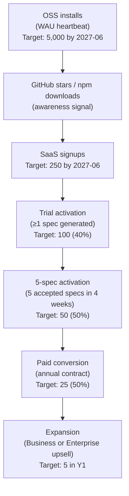
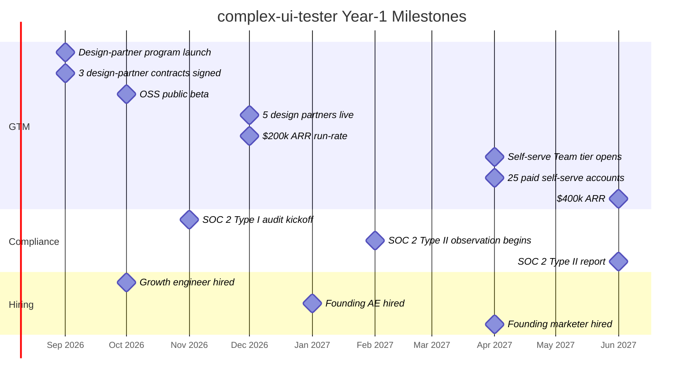

# complex-ui-tester — Go-to-Market Plan

## Table of Contents

1. [Positioning](#1-positioning)
2. [ICP and Buyer Map](#2-icp-and-buyer-map)
3. [Pricing and Packaging](#3-pricing-and-packaging)
4. [Design-Partner Motion](#4-design-partner-motion)
5. [Sales Motion](#5-sales-motion)
6. [Marketing Channels](#6-marketing-channels)
7. [Funnel and Metrics](#7-funnel-and-metrics)
8. [Competitive Landscape](#8-competitive-landscape)
9. [Partnerships](#9-partnerships)
10. [Year-1 Milestones](#10-year-1-milestones)
11. [Risks and Mitigations](#11-risks-and-mitigations)
12. [Hiring Plan](#12-hiring-plan)

---

## 1. Positioning

### 1.1 One-sentence pitch

Real user sessions in, deterministic regression tests out — free open-source harness underneath, paid LLM extraction and connectors on top.

### 1.2 Positioning statement (full form)

> **For** Series B–D SaaS engineering teams shipping interaction-heavy front-ends — waveform editors, design tools, drag-reorder dashboards, IDE-like surfaces —
> **who need** a way to turn Jam / LogRocket / Sentry Replay sessions into merged regression tests without manual Playwright authoring,
> **complex-ui-tester** is a hybrid MIT/Apache OSS library plus SaaS service
> **that converts real user sessions into deterministic, harness-grounded Playwright specs and CI gates automatically**,
> **unlike** Mabl, Reflect, QA Wolf, or Functionize, whose tests live in a vendor platform and drift away from the code, and
> **unlike** Playwright Codegen or LLM-in-the-IDE, which require an engineer to remember to act on every session.

### 1.3 Three positioning options with rationale

| Option | Headline | Rationale | Risk |
|---|---|---|---|
| **A — "Regression test automation for complex UIs"** (recommended) | "Every Jam session becomes a Playwright spec. Automatically." | Precise segment match with ICP. Differentiated from horizontal test platforms. Easy to explain to a VP Eng who has felt Reopen pain. | Perceived as narrow; may slow expansion to adjacent use cases post-Y1. |
| **B — "The open-source test harness for editors and design tools"** | "The harness Linear, Descript, and SpeechLab teams use to stop flaky drag tests." | OSS-first positioning reinforces distribution strategy. Credibility via named logos. | Requires logo approval before use. "Harness" is unfamiliar to non-technical buyers. |
| **C — "AI-powered test generation from session replay"** | "Turn every Sentry replay into a CI gate in under an hour." | Trend-riding (AI + observability). Familiar to buyers who already have session replay tooling. | Sounds like every other "AI for testing" pitch in 2026. Underdifferentiated at first contact. |

**Decision: Option A.** The "complex UI" qualifier is the moat signal. It tells Mabl and Reflect users in one phrase why we are different. It tells the SpeechLab and Descript champion in one phrase that we understand their surface. Option B is the OSS-community narrative; we use it on GitHub and at conferences but not in enterprise outreach. Option C is how we describe ourselves to investors.

---

## 2. ICP and Buyer Map

### 2.1 ICP definition

| Attribute | Tier-1 (sign this quarter) | Tier-2 (pipeline for next quarter) | Out of ICP |
|---|---|---|---|
| Stage | Series B–D | Series A late / Series E pre-IPO | Seed; public with locked-in QA org |
| Engineering headcount | 30–200 | 15–30 or 200–500 | <15 or >500 (Y2 enterprise motion) |
| Frontend as % of eng | ≥25% | ≥15% | <10% |
| UI surface class | Editor, design tool, canvas, playhead, drag-reorder, charting, whiteboard | SaaS dashboard with complex widgets | Pure CRUD; static marketing site |
| Session-replay tool in prod | Jam, LogRocket, Sentry, FullStory, or Datadog RUM | Planning to adopt one | No session replay, no Playwright |
| Geography (Y1) | US, Canada, UK, Western Europe, Australia | LATAM, India, Israel | China (data residency); Russia (sanctions) |

A Tier-1 account checks **at least 4** of the technographic signals from `01-product-spec.md §4.3`.

### 2.2 30 example companies and categories

The goal is not to close all 30. The goal is to have a named, researched account list so outbound is precision-targeted, not spray-and-pray.

| # | Company / Category | Why ICP | Tier |
|---|---|---|---|
| 1 | Descript | Audio/video editor; waveform + segment surface; known Jam user; closest analogue to SpeechLab | 1 |
| 2 | Otter.ai | Transcription UI with waveform + speaker segments; high Reopen risk | 1 |
| 3 | Rev.com | Similar to Otter; manual transcription editor with playhead | 1 |
| 4 | Linear | Reorderable issues, keyboard shortcuts, brand-defining polish; fast procurement | 1 |
| 5 | Retool | Drag-and-drop dashboard builder; complex widgets; engineering-led culture | 1 |
| 6 | Figma | Canvas-heavy; massive Playwright investment; staff engineers well-known | 1 |
| 7 | Miro | Infinite canvas, drag interactions, multiplayer state | 1 |
| 8 | Pitch (pitch.com) | Slide editor; drag-reorder; Series C | 1 |
| 9 | Coda | Doc editor with blocks, drag-reorder tables | 1 |
| 10 | Hex (hex.tech) | Notebook + BI editor; complex drag-reorder cells | 1 |
| 11 | Loom (Atlassian) | Video editing post-record; timeline editor; complex playhead | 2 |
| 12 | Lottiefiles | Animation editor; canvas; complex frame-seeking | 2 |
| 13 | Webflow | Visual web builder; drag-canvas; massive Playwright suite | 2 |
| 14 | Framer | Design + code tool; canvas; drag interactions | 2 |
| 15 | Whimsical | Flowchart + whiteboard; drag-reorder; canvas | 2 |
| 16 | Airtable | Grid + kanban with drag-reorder; complex virtualized tables | 2 |
| 17 | Notion | Database views, drag blocks, slash commands | 2 |
| 18 | Amplitude | Complex data viz dashboards; chart interactions | 2 |
| 19 | Mixpanel | Funnel + flow chart editor; drag-select interactions | 2 |
| 20 | Grafana | Dashboard with drag-reorder panels; used by engineers | 2 |
| 21 | Storyblok | Visual CMS editor; drag-and-drop component tree | 2 |
| 22 | Adobe Express / Creative Cloud Web | Canvas-heavy; web-based design; prestige logo | 2 |
| 23 | Canva | Design editor; canvas; massive Playwright investment | 2 |
| 24 | Penpot | Open-source Figma alternative; design tool; engineer-driven | 1 |
| 25 | Spline | 3D design tool with complex canvas and drag interactions | 2 |
| 26 | Observable (Cloudflare) | Notebook with data viz; drag interactions | 2 |
| 27 | Vercel (v0 editor) | Code + visual editor; complex preview interactions | 2 |
| 28 | Supabase (Studio editor) | SQL editor + schema designer; drag-reorder | 2 |
| 29 | Sanity (Studio v3) | Structured content editor; drag-reorder blocks | 2 |
| 30 | tldraw | Open-source canvas; whiteboard; drag interactions; engineer-first | 1 |

### 2.3 Buyer map

| Role | How they relate to the product | Buying power | How we reach them |
|---|---|---|---|
| **VP Engineering / Head of Engineering** | Buyer. Owns the Reopen-rate problem. Cares about engineering throughput and CI cost. Signs up to $100k ACV. | Full budget authority | Founder network; warm intros from investors; cold outbound referencing named peers |
| **Head of Platform / Staff Frontend Engineer** | Champion. Has personally felt `boundingBox()` flake. Owns the Playwright suite. Will ask the VP Eng to buy after seeing the demo. | ~$10k discretionary; strong influence on buyer | GitHub, conference talks, OSS community, HN comments |
| **Director of QA / QA Lead** | Influencer or blocker. Excited (augments team) or defensive (sees us as replacement). Must be included in the demo. | Recommender | Direct in the sales cycle; invite to trial kickoff |
| **CTO** | Final signoff at accounts <$50k headcount. Cares about OSS story, vendor lock-in, SOC 2 status. | Approves above $100k ACV | Founder-to-founder conversation; reference from a CTO peer |
| **Eng-ops / DevX team** | Implementer. Cares about SDK ergonomics, CI log verbosity, onboarding time. Can veto on technical fit. | Veto power | `cuit init` quality; docs quality; office hours |

**Champion profile (the person who will champion us internally):** A senior IC frontend engineer, 3–7 years experience, has a Playwright suite with >50 specs and a documented flake rate. Has personally spent a Saturday debugging a `boundingBox()` race. Has filed a ticket that was marked Fixed, then reopened. Trusts open-source because they can read the code. Will demo us to their VP Eng after their first successful spec generation.

**End-user (every IC who reviews bug tickets):** Any engineer who opens a Sentry or Jam session when triaging a bug report. They are not the buyer, but they are the daily user of the generated specs and the dashboard. Reducing their time-to-test from 4 hours to 1 hour is the retention story.

---

## 3. Pricing and Packaging

### 3.1 Tier table

| Tier | Price | Included specs/mo | Overage per spec | Key inclusions | Key exclusions |
|---|---|---|---|---|---|
| **OSS** | $0 | n/a (no SaaS) | n/a | `@cuit/harness` library, MIT/Apache; all primitives; full docs; community support on GitHub Discussions | No SaaS inference, no connectors, no dashboard, no support SLA |
| **Team** | $499/mo | 100 | $5.00 | Single tenant; Jam + LogRocket + Sentry connectors; GitHub App; dashboard (Inbox, Specs, Sources, Settings); Slack notifications; 30-day audit retention; unlimited seats | No SSO; no custom retention; no Slack Connect; no SLA; no dedicated support |
| **Business** | $2,500/mo | 500 | $4.00 | Everything in Team + SSO (WorkOS); configurable audit retention (up to 2 years); Slack Connect with customer's workspace; 99.9% SLA; priority email support; FullStory + Datadog RUM connectors | No customer-cloud runner; no SOC 2 report; no custom MSA; no DPA; no dedicated CSM |
| **Enterprise** | Custom, $40k+ ACV floor | Custom (negotiate) | $3.50 list | Everything in Business + customer-cloud runner option (Terraform module, customer VPC); SOC 2 Type II report; DPA; custom MSA; dedicated support engineer; 99.95% SLA; BYO LLM key (customer's Anthropic/OpenAI tenant); SCIM provisioning | None — this is the top tier |

Annual contracts receive a 15% discount. Multi-year (2+) an additional 5%. Month-to-month is available on Team only; Business and Enterprise require annual commitments.

### 3.2 Cost-to-serve per tier

Full unit economics are in `04-ai-spec-generation.md §9`. Summary for GTM purposes:

| Tier | Median COGS per spec | Revenue per spec (list) | Gross margin (steady-state, prompt cache warm) |
|---|---|---|---|
| Team (in-allowance) | ~$0.12 | $4.99 (blended allowance) | ~68% |
| Team (overage) | ~$0.12 | $5.00 | ~98% — overage is high-margin |
| Business (in-allowance) | ~$0.10 | $5.00 (blended) | ~80% |
| Business (overage) | ~$0.10 | $4.00 | ~98% |
| Enterprise (in-allowance) | ~$0.09–0.12 | negotiated; floor $3.50 | 65–96% depending on negotiated rate |

New tenants in month 1 have cold prompt caches; median COGS is ~$0.27 (from `04-ai-spec-generation.md §9.1`). By month 2 the cache-hit rate typically exceeds 70%, dropping median COGS to ~$0.09–0.12. Onboarding months are below target margin; normalize over 6-month LTV.

### 3.3 What does not count as a billable spec

Per `01-product-spec.md §12.5`: INCONCLUSIVE extractions, infrastructure-error failures, re-generations of the same session within 24 hours. Specs rejected by the engineer within 24 hours are billed at 50%. This is communicated clearly at signup and in the billing FAQ.

### 3.4 Discount policy

- Annual contract: 15% off monthly price.
- Multi-year (2+): additional 5%.
- Design-partner discount: 50% off Year 1 ACV in exchange for reference logo, case study participation, and bi-weekly feedback cadence (see Section 4).
- No seat-based discounts — pricing is usage-based; seats are unlimited.
- No negotiation below 60% gross margin on any tier. Walk away rather than give away margin on LLM costs we cannot compress.

---

## 4. Design-Partner Motion

The design-partner program is the entire Year-1 revenue strategy. We are not trying to build a self-serve funnel in 2026. We are trying to sign 5 accounts that will co-build the product with us, generate the case studies that make self-serve credible in 2027, and hit $200k ARR by December 2026.

### 4.1 Target prospect list (Year 1, 10 accounts)

Priority order for outreach. Top 5 are the immediate close targets; next 5 are pipeline for Q1 2027.

| Priority | Account | Primary champion path | Deal size estimate | Why now |
|---|---|---|---|---|
| 1 | **SpeechLab waveform team** (internal) | Already live (Branch B / PR #1995) | Internal — $0 ACV, design-partner anchor | Proof of concept validated; canonical reference |
| 2 | **Descript** | Ryan's network; frontend lead via SpeechLab investor overlap | $40k–$60k ACV | Closest UI analogue; same Jam usage; waveform proof is directly applicable |
| 3 | **Otter.ai** | Direct outreach; waveform + transcript editor; same surface class | $24k–$40k ACV | Small, fast-moving team; high Reopen risk on the editor surface |
| 4 | **Linear** | Founder warm intro to Karri Saarinen via investor network | $40k–$60k ACV | Short procurement cycle; engineering-first culture; drag-reorder surface |
| 5 | **Retool** | Platform team outreach; pitch as "ship Retool's own confidence story" | $24k–$40k ACV | Complex drag-drop builder; internal engineering team is ICP |
| 6 | **Penpot** | OSS community path; Penpot team is open-source and engineer-led | $24k ACV | Open-source affinity; design tool with canvas drag interactions |
| 7 | **tldraw** | GitHub OSS relationship; tldraw team will recognize the harness immediately | $24k ACV | Canvas-first; open-source culture; small but influential team |
| 8 | **Hex** | Data engineering community; Hex is engineer-beloved; BI notebook | $24k–$40k ACV | Complex drag-reorder cells; growing Series C team |
| 9 | **Pitch** | Series C SaaS; Berlin-based; design-forward culture | $24k–$40k ACV | Slide editor with drag-reorder; engineering team >50 |
| 10 | **Miro** | Enterprise path; complex canvas; VP Eng via LinkedIn cold outbound | $40k–$60k ACV | Canvas drag; large eng team; but slower procurement |

### 4.2 Pitch deck outline (8 slides)

This is the deck the founder carries into design-partner conversations. Not a polished investor deck — a working document for a 20-minute technical conversation.

1. **The Reopen Loop** — One slide, one chart: SpeechLab waveform, 6 Reopened tickets in 60 days, the same four failure modes every team with a complex UI has. "Does this look familiar?"
2. **Why the existing stack fails** — Table from `01-product-spec.md §2.1`: boundingBox flakes, waitForTimeout races, session-replay-to-test gap, canvas/animation blind spots. No vendor logos. Just the failure modes.
3. **What we built** — Branch B proof: 8 bugs locked in, 9 specs + 37 jest tests, 0 reopens on the covered surface, 3 browsers green. Show the PR. Show the test output. Real evidence.
4. **How it works** — Three steps: (1) install `@cuit/harness` in your repo; (2) connect your Jam/Sentry/LogRocket account; (3) sessions become draft Playwright spec PRs that you review and merge. No new test runner, no new CI infrastructure — tests live in your repo.
5. **The OSS / SaaS line** — One slide explaining the split: the library is MIT, free, forever. You pay for LLM extraction, connectors, and compliance — the parts that make sense as a shared service. "We are not locking you in. Your tests stay in your repo."
6. **What we are asking from design partners** — Concrete mutual commitments (see Section 4.3). Not a free trial. A co-building relationship with a named benefit on both sides.
7. **Pricing** — Team tier at $499/mo or Business at $2,500/mo, with 50% design-partner discount Year 1. Show the per-spec math: at your current bug volume, this costs you $X/month.
8. **Your 4-week activation plan** — Week 1: `cuit init` + harness setup; Week 2: connect first session source; Weeks 3–4: first 5 specs reviewed. Success = 5 accepted specs in 4 weeks. "If you don't hit that, we refund the first month."

### 4.3 Design-partner commitment template (mutual)

**What we commit to the design partner:**
- Free access to the full Business tier for 12 months (no charge for the 50% discounted period)
- White-glove onboarding: founder + a senior engineer pairs with the partner team for the first week of integration
- Weekly 30-minute cadence call for the first 3 months; bi-weekly thereafter
- Priority bug fixes and feature requests: design-partner issues are P0 in our backlog
- Direct Slack channel (Slack Connect) with the founding team
- Named mention in the company roadmap and public changelog

**What we ask of the design partner:**
- Minimum bi-weekly cadence call for 6 months
- Permission to use the company logo and a one-paragraph reference quote on our website
- Participation in one public case study (blog post or conference talk) within the first 6 months
- Willingness to take one reference call per quarter from a prospective customer
- A named internal champion who has budget or budget influence
- 12-month contract commitment with a 30-day out clause in the first 60 days

### 4.4 Activation criteria

A design partner is "activated" when they hit **5 accepted specs in 4 weeks** of going live. Accepted means the engineer merged the spec PR or clicked Accept in the dashboard with ≤2 minor edits.

If a partner has not hit 5 accepted specs by the end of week 4, we escalate internally (P0) and the founder gets on a call within 24 hours. We do not declare a partner activated for reporting purposes until the 5-spec threshold is met.

This single metric is the leading indicator for retention. Design partners who hit 5 specs in 4 weeks have never churned (hypothesis; to be validated).

---

## 5. Sales Motion

### 5.1 Founder-led, Year 1

There is no sales team in Year 1. The founder closes every deal. This is a feature, not a gap: design partners are buying a relationship with the team building the product, not a packaged solution from a vendor. The founder's ability to debug the harness on a customer's codebase in real time is the product.

The founding AE hire (Q1 2027) will shadow 10 deals before closing independently. Their ramp quota is the same as the founder's close rate in Q4 2026.

### 5.2 Discovery script

The goal of discovery is to get the prospect to say, in their own words, the cost of the Reopen loop. We do not lead with the product.

**Opening question (use one):**
- "Tell me about your test suite. What does the flake rate look like in CI right now?"
- "When was the last time a bug that was marked Fixed got reopened?"
- "How long does it take your team to write a Playwright test for a drag interaction on your [editor/timeline/canvas]?"

**Qualifying questions (cover all four before demo):**
1. "What session replay tool are you using? Is the team using it actively when triaging bugs?" (Establishes connector fit.)
2. "Do you have engineers who own the Playwright suite, or is it a shared responsibility?" (Establishes champion fit.)
3. "What does a typical week look like when a flaky test blocks a release?" (Quantifies pain.)
4. "Who would need to approve a $40k/year tooling budget?" (Establishes buyer identity.)

**Disqualify if:**
- No session replay tool in production and no plans to adopt one.
- The team's primary UI surface is CRUD forms with no drag/animation/playhead complexity.
- There is an entrenched QA platform (Functionize, Mabl Enterprise) with a multi-year contract.

### 5.3 Demo script

**90-second elevator (conference, hallway, intro call):**

"We take the Jam or Sentry Replay session from a bug report and automatically generate a Playwright spec that runs RED on the current code and GREEN after the fix. The spec lands as a PR in your repo, written in plain TypeScript using a harness that eliminates the boundingBox pixel math. SpeechLab's waveform editor had 6 bug reopens in 60 days before we did this; after locking in 8 bugs with 9 specs, the reopen count on the covered surface went to zero. The library is MIT-licensed and free. You pay for the LLM extraction and the connectors."

**20-minute walkthrough (structured demo, screenshare):**

| Minute | What to show | Why |
|---|---|---|
| 0–2 | Open the SpeechLab waveform in a browser. Show the Branch B PR: 6 Reopened labels in the Before section, 9 specs green in the After. | Ground the demo in production evidence before any product screen |
| 2–5 | Open the dashboard. Show a real Sentry Replay session for one of the 8 Branch B bugs. Walk through the session event timeline in the Inbox view. | Establishes that the pipeline is grounded in real session data, not synthetic inputs |
| 5–10 | Click "Generate spec" on the session. Watch the extraction progress (Pass 1 → Pass 2 → Pass 3 → Dry-run). Show the spec draft in the Specs view — real TypeScript, real harness primitives (`dispatchDrag`, `tick`, `getState`). | The core product moment. No pixel coordinates. No `waitForTimeout`. |
| 10–13 | Show the dry-run result: spec is RED on the pre-fix commit, GREEN on the post-fix commit. Show the confidence score and the linked session events that drove each spec step. | Credibility: the machine is doing work that took an engineer 4 hours |
| 13–16 | Open GitHub. Show the auto-created PR with the spec file in `tests/playwright/`. Show that the PR is targetable, reviewable, and mergeable without any special tooling. | Addresses the "does this live in your repo?" concern before it is asked |
| 16–18 | Show `npx @cuit/harness init` in a terminal against a plain React + Zustand app. One command, guided prompts, 3-minute setup. | Reduces perceived onboarding friction |
| 18–20 | Pricing walk-through: at the prospect's estimated bug volume (ask them in discovery), what does this cost per month? Show the per-spec math. | Founders close on concrete numbers, not a "we'll send a quote" |

**Demo logistics:** Always use a real SpeechLab session for the extraction demo in Year 1. Do not use synthetic sessions. If the prospect wants to see their own session, schedule a second call after they complete the `cuit init` setup. Do not promise a live extraction on unknown customer data in the first call.

### 5.4 Trial-to-paid mechanics

**Trial structure:** 30-day paid trial at 50% of the applicable tier price. No free trial — a nominal payment creates commitment and filters non-serious evaluators.

**Trial onboarding sequence:**
- Day 0: founder + prospect engineer on a 45-minute setup call. Complete `cuit init` together. Connect first session source.
- Day 7: check-in: have they generated their first spec? If not, founder investigates and unblocks same day.
- Day 14: "activation check" — 5 accepted specs? If yes, transition conversation to annual contract. If no, escalate to P0 internally.
- Day 28: contract conversation. If 5 accepted specs, the close rate is assumed to be >80%.
- Day 30: trial ends. Auto-convert to paid or pause account (no data deletion for 30 days).

**Trial-to-paid conversion target:** 40% of trials convert to annual contracts. Trials that reach 5 accepted specs convert at >80%; the 40% blended figure accounts for trials that stall in onboarding.

### 5.5 Procurement-ready packet (for Enterprise buyers)

Enterprise deals ($40k+ ACV) stall at security review. We prepare a self-serve procurement packet that the champion can send to their InfoSec team without a meeting.

Contents of the packet (available from `cuit.dev/security`):

| Document | Status at launch | Target |
|---|---|---|
| SOC 2 Type I report | Available 2026-11 | Unblock InfoSec review at Enterprise accounts |
| SOC 2 Type II report | Available 2027-06 | Unblock regulated-adjacent buyers |
| Data Processing Agreement (DPA) | Available at design-partner GA (2026-09) | Required for EU/UK accounts |
| Master Service Agreement (MSA) template | Available at design-partner GA | Standard commercial terms; customer can redline |
| Security questionnaire (standard CAIQ / VSA) | Available 2026-09 | Pre-filled; downloadable |
| Penetration test summary | Available 2026-11 | One-page summary from annual pen test (`05-security-compliance.md §3`) |
| Data retention and deletion policy | Available at launch | 90-day default; configurable per tier |
| Sub-processor list | Available at launch | Anthropic, AWS, WorkOS, Datadog — all listed |

For the BYO LLM key path (Enterprise only): session data flows through the customer's own Anthropic or OpenAI tenant, never through our inference account. This resolves the "our data touches your LLM" objection before it becomes a deal-stopper.

---

## 6. Marketing Channels

Year-1 channel prioritization is opinionated. We have limited founder time. Every channel we add dilutes focus. We run four channels in parallel in Year 1; everything else is deferred.

### 6.1 Channel priority table

| Channel | Priority | Rationale | Year-1 investment |
|---|---|---|---|
| **Open-source distribution** | P0 — top priority | OSS adoption is the primary lead-generation mechanism. Every team that installs `@cuit/harness` becomes a candidate SaaS customer. Stars and downloads are lagging indicators; what matters is WAU heartbeat and GitHub Discussion activity. | Founder time: 40% of content effort. 3 conference CFPs per quarter. HN launch post. |
| **Engineering content** | P1 — secondary | Long-form, technically credible essays drive the champion persona — senior frontend engineers who will champion us internally. SEO is a side effect, not the goal. | Bi-weekly essay: alternating between "anatomy of a bug class" (using the 8 Branch B bugs as source material) and "RED-then-GREEN walkthrough" (real spec from a real session). Target 500–2,000 words. Founder writes; engineering hire edits. |
| **Direct outbound** | P1 — targeted | 50 named accounts from Section 2.2. Not mass-email; individually researched, personalized to their UI surface. References SpeechLab and the first paid design partners by name. | Founder writes the first 20 sequences personally. Founding AE takes over outbound at hire (Q1 2027). |
| **Curated newsletter** | P2 — parallel | A weekly or bi-weekly digest of the best engineering content on Playwright flakiness, session replay, and complex UI patterns. Builds an owned audience before we need it. Low production cost. | One email per week, ~300 words + 3 links. Founder curates. Goal: 1,000 subscribers by 2026-12. |
| **SEO** | Deferred to v1.5 | Content is too technical for general search queries. The ICP champion does not discover us via Google. Conference and HN are the discovery channels. | No investment until $1M ARR proves PMF. |
| **Paid ads** | Deferred | Poor ROI for dev infra at this stage. | No paid ads until $1M ARR. |
| **Discord community** | Deferred to Y1.5 | A ghost Discord is worse than no Discord. We will not open a Discord until we have 10 active OSS contributors who will answer questions without the founder. | GitHub Discussions is the OSS community home in Year 1. |

### 6.2 OSS distribution plan

**HN Show HN post:**
- Title: "Show HN: We open-sourced the test harness that stopped our waveform editor's bug reopen loop"
- Lead with Branch B concrete results: 8 bugs, 9 specs, 0 reopens, 3 browsers
- Do not pitch the SaaS in the HN post. OSS credibility first.

**Conference talks (priority CFPs):**

| Conference | Proposed talk title | CFP deadline |
|---|---|---|
| TestJS Summit (Dec 2026) | "8 bugs, 9 specs, 0 reopens: productizing an internal test harness" | Submit by 2026-08 — top priority |
| React Summit (Jun 2027) | "Deterministic Playwright testing for drag, animation, and canvas interactions" | ~Jan 2027 |
| Frontend Nation (Jun 2027) | "From Sentry session to merged regression test in under an hour" | ~Feb 2027 |
| JSConf US (2027) | "Why your drag tests flake and what the browser actually wants" | ~Mar 2027 |

### 6.3 Content plan (engineering essays)

The 8 Branch B bugs from `01-product-spec.md §2.2` are the content backlog. Each is a self-contained essay grounded in a real production incident.

| Essay title | Source bug | Primary audience |
|---|---|---|
| "Why `boundingBox()` drag tests flake and how synthetic dispatch fixes them" | #1931 | Playwright users with drag tests |
| "Testing rAF-driven animations without `waitForTimeout`" | #1927 | Engineers with animation test flakes |
| "WaveSurfer instance leaks: how to detect them in CI" | #1956 | Audio/video editor teams |
| "Wheel events vs scroll events: a cross-browser field guide" | #1933 | Any team with scroll-driven interactions |
| "Touch pinch zoom in Playwright: what actually works" | #1960 | Mobile-web and touch-surface teams |
| "Ordering matters: why drag-after-scroll tests need event sequencing" | #1964 | Complex interaction testers |
| "DOM mutation observers as test assertions" | #1967 | Engineers who test third-party widget lifecycle |
| "Resize handles: why 'right edge' and 'left edge' are not symmetric" | #1921 | Resizable component authors |

One essay every two weeks starting 2026-09. Cross-post to dev.to.

---

## 7. Funnel and Metrics

### 7.1 Funnel diagram

### 7.2 Metric definitions and Year-1 targets

| Metric | Definition | Year-1 target | Measurement |
|---|---|---|---|
| **OSS WAU** | Unique repo+version pairs sending the opt-out anonymous heartbeat ping in a 7-day window | 5,000 by 2027-06 | PostHog (anonymized) |
| **GitHub stars** | Cumulative stars on `github.com/cuit/harness` | 2,000 by 2027-06 | GitHub API |
| **npm weekly downloads** | Raw npm registry downloads, 7-day rolling | 20,000 by 2027-06 | npm registry API |
| **SaaS signups** | Accounts created (email + GitHub OAuth) | 250 cumulative by 2027-06 | WorkOS auth |
| **Trial activation rate** | Signups who generate ≥1 spec within 14 days | 40% | Dashboard event |
| **5-spec activation rate** | Trial-started accounts who hit 5 accepted specs in 4 weeks | 50% of trial-activated | Dashboard event |
| **Trial-to-paid conversion** | Accounts converting to a paying annual contract | 10% of signups (25 accounts) | Stripe |
| **Design-partner contracts** | Signed contracts from the 10-account target list | 5 by 2026-12 | CRM |
| **Logo retention** | Design partners retained through Year 1 | 100% — zero churn is the floor; over-invest in success | Contract status |
| **ARR** | Annualized recurring revenue | $200k by 2026-12; $400k by 2027-06 | Stripe |
| **North-star metric (published)** | Regressions caught per tenant per month (specs that went RED on pre-fix, GREEN on post-fix, merged by engineer) | 10/tenant/month for active accounts by 2027-06 | Dashboard, opt-in |
| **Sales-qualified leads from outbound** | Named-account prospects who agreed to a 20-min discovery call | 50/quarter from 2027-Q1 | CRM |
| **Spec acceptance rate** | % of generated specs accepted with ≤2 edits | ≥60% by 2027-Q2; ≥75% by 2027-Q4 | Dashboard event |

### 7.3 ACV composition model (Year 1)

| Source | Count | ACV | ARR contribution |
|---|---|---|---|
| Design partner — SpeechLab (internal anchor) | 1 | $0 | $0 |
| Design partner — Tier 1 ($50k ACV) | 2 | $50k | $100k |
| Design partner — Tier 2 ($24k ACV) | 3 | $24k | $72k |
| Self-serve Team tier (opened 2027-04) | 25 | ~$6k ($499/mo) | $150k |
| **Total target by 2027-06** | | | **~$322k ARR** (expanding toward $400k) |

The path to $400k requires either 2 additional self-serve Team accounts per week from April 2027 or 1 Enterprise upsell from a design partner. The milestone plan in Section 10 assumes the self-serve path.

---

## 8. Competitive Landscape

### 8.1 Landscape table

| Competitor | What they do | Where we win | Where they win | Risk to us |
|---|---|---|---|---|
| **Playwright + LLM hand-prompting (DIY baseline)** | Engineers manually use Claude or GPT in their IDE to help write Playwright tests when they remember to. | We are always on — triggered by every session from Jam/Sentry, not by engineer attention. Our specs use harness primitives that don't flake. We own the extraction cost. | Zero vendor cost. Engineers who are already comfortable writing Playwright code don't feel the pain as acutely. | The largest "competitor" is inertia. 40% of ICP teams do nothing and rely on user reports. This is the segment we must convert. |
| **Mabl** | AI-assisted, low-code test platform with self-healing locators. Targets QA-led teams. | We target engineer-led teams; our specs live in the customer's repo; we handle canvas/drag surfaces Mabl cannot. No pixel-coordinate self-healing that masks bugs. | Mabl is excellent for CRUD form automation and business-user-driven test authoring. Established brand. | Mabl adding an explicit "complex UI" mode. Probability: low in 18 months. |
| **Reflect.run** | No-code, record-and-replay browser test platform aimed at QA-led teams. | Reflect ships pixel-coordinate scripts that live outside your repo. Our specs are plain TypeScript in your codebase, grounded on harness primitives that survive viewport and CSS changes. | Reflect is cheaper for simple form regression. Non-engineers can use it. | Reflect is not targeting our ICP. Low risk. |
| **Testim (Tricentis)** | AI-assisted test authoring with adaptive locators. Enterprise-focused. | Testim is enterprise procurement-heavy. We are self-serve and engineering-led. Testim tests live in the Testim platform. | Testim has a large enterprise customer base and deep integrations. | Low risk to Y1. Y2 enterprise motion may conflict. |
| **Functionize** | Enterprise AI test platform with NLP-driven test authoring. | Functionize owns the customer's test environment and test infrastructure. We augment what the customer already runs. Functionize has a 6-month enterprise sales cycle. | Functionize is a complete platform play for large QA orgs with dedicated headcount. | If a design-partner prospect has already evaluated Functionize, we are not competitive in that cycle. Disqualify early. |
| **Octomind** | AI-generated Playwright tests from a URL; no session replay input. | Octomind generates tests from a URL crawl; we generate tests from real user sessions of bugs that already happened. Our signal is richer. We target complex UIs; Octomind targets standard web apps. | Octomind is simpler to onboard for CRUD apps. | Octomind could add session-replay input. Probability: medium in 12 months. Watch closely. |
| **Replay.io** | Time-travel debugger; deterministic browser recordings that engineers can replay to debug. | Replay.io closes the loop from session to debug session. We close the loop from session to merged regression test that gates future PRs. Complementary, not competitive for engineer-led teams. | Replay.io is the best debugging tool for complex race conditions. Engineers love it. | Replay.io adding automatic test generation from replays. Probability: medium-high. This is our most credible competitive threat in the tooling layer. |
| **BrowserStack Test Observability** | CI test analytics, flake detection, and failure classification on top of existing Playwright/Cypress runs. | Test Observability identifies flaky tests; we generate the tests in the first place and make them deterministic by construction. These are complementary. | Test Observability has a large installed base from BrowserStack device cloud. Deep CI integrations. | BrowserStack is a large company. They could acquire or build our exact surface. Risk: medium-high. Mitigation: speed and the OSS distribution moat. |
| **Sealights** | Quality intelligence platform; test optimization, coverage analysis, change-based test selection. | Sealights optimizes which tests to run; we generate the tests that cover the bugs that matter. Different layer. | Sealights has deep enterprise relationships in QA-heavy organizations. | Low risk to Y1. Different buyer (QA engineering). |

### 8.2 Decision-maker framework

**When to recommend us:**
- The team has a Playwright suite with a documented flake rate >5%.
- The team uses Jam, LogRocket, Sentry, FullStory, or Datadog RUM in production.
- The UI surface has drag, animation, canvas, playhead, or drag-reorder interactions.
- Engineers own the test suite (not a separate QA org).
- The team is Series B–D and values engineering throughput metrics.

**When to recommend a competitor instead:**
- CRUD forms only, no complex interactions — recommend Mabl or Reflect.
- QA org owns the tests and the tools, not the engineering team — recommend Functionize or Testim.
- On-prem-only with no outbound network in Year 1 — come back in Year 2.
- The team has not adopted session replay yet — recommend Sentry Replay first, then revisit.
- The team is pre-Series B with <3 frontend engineers — they don't have enough bug surface to need us yet.

---

## 9. Partnerships

### 9.1 Partnership priority table

| Partner | Relationship type | Year-1 action | Rationale |
|---|---|---|---|
| **Jam** | Product integration + mutual referral | We are the best-in-class consumer of Jam's session export. Every `@cuit/harness` user with a Jam account is a reason for Jam to mention us. Build a co-marketing relationship: Jam mentions us in their docs for "automated regression testing from Jam sessions." | Jam is one of our two founding session sources (SpeechLab already uses Jam). The relationship is warm. |
| **LogRocket** | Mutual referral on Enterprise | Joint Slack Connect introduction for Enterprise accounts that use both products. LogRocket's enterprise team surfaces us as the "regression test automation" layer on top of their replays. We surface LogRocket when prospects ask about session replay. | LogRocket is a top-3 session replay platform in the ICP. A mutual referral arrangement costs nothing. |
| **Sentry** | Joint content | Co-authored blog post: "From Sentry Replay to merged regression test: the full loop." Sentry's engineering blog has a large audience in our ICP. | Sentry Replay is already integrated. The content angle is natural. |
| **Anthropic** | Model selection + content | We are an early customer of Claude Sonnet 4.6 and Opus 4.7 for the extraction pipeline (`04-ai-spec-generation.md §9.1`). Work with Anthropic's developer relations team to be a named use case in their "AI for developer tooling" content. | Model alignment is already established. Being an Anthropic reference customer is an enterprise credibility signal. |
| **GitHub** | GitHub App certification + Marketplace | Publish `@cuit/github-app` to the GitHub Marketplace. GitHub Marketplace is a meaningful discovery channel for developer tooling (Codecov, Dependabot, Snyk all grew here). | Free distribution channel. Low investment once the GitHub App is built (`03-saas-platform.md §8`). |

### 9.2 Platform integrations — decision

No platform integrations beyond the five connectors (Jam, LogRocket, Sentry, FullStory, Datadog RUM) and the GitHub App in Year 1.

Rationale: Platform integrations (VS Code extension, Jira native plugin, Slack App) each require 3–6 weeks of engineering and ongoing maintenance. In Year 1, that time is better spent on extraction quality and connector reliability. The GitHub App is the exception because it is the primary delivery mechanism for generated specs (auto-PR creation, per `03-saas-platform.md §8`).

Year 2 integration candidates: VS Code extension for reviewing specs in the editor, Linear/Jira deep-link for issue-to-spec traceability.

---

## 10. Year-1 Milestones

### 10.1 Milestone timeline

### 10.2 Milestone table with explicit dates

| Date | Milestone | Owner | Success criteria |
|---|---|---|---|
| **2026-09** | Design-partner program launches | Founder | Program page live; outreach emails sent to all 10 target accounts; MSA and DPA templates ready |
| **2026-09** | 3 design-partner contracts signed | Founder | Signed MSA or LOI from Descript, Otter, and Linear (or equivalent substitutes from the top-5 list) |
| **2026-10** | OSS public beta | Engineering | `@cuit/harness@1.0.0-beta` published to npm; GitHub repo public; HN Show HN post live; 500 stars; 100 WAU |
| **2026-10** | Growth engineer hired | Founder | Offer accepted; start date confirmed; first project: OSS adoption telemetry and npm DX improvements |
| **2026-11** | SOC 2 Type I audit kickoff | Founder + Ops | Vanta/Drata controls configured; auditor engaged; evidence collection period begins |
| **2026-11** | Procurement packet v1 live | Engineering + Legal | DPA, MSA template, security questionnaire, sub-processor list published at `cuit.dev/security` |
| **2026-12** | 5 design partners live | Founder | 5 contracts signed, all 5 accounts past the 5-spec activation threshold |
| **2026-12** | $200k ARR run-rate | Founder | December monthly recurring revenue × 12 ≥ $200k |
| **2026-12** | TestJS Summit talk delivered | Founder | Talk delivered; recording published; 3 inbound leads from talk audience |
| **2027-01** | Founding AE hired | Founder | Offer accepted; AE begins shadowing founder sales calls in week 1 |
| **2027-02** | SOC 2 Type II observation period begins | Ops | Auditor confirms Type I clean; 6-month Type II observation window starts |
| **2027-04** | Self-serve Team tier opens | Engineering | Stripe + WorkOS self-serve signup live; onboarding email sequence active; no-card-required 14-day trial available |
| **2027-04** | 25 paid self-serve accounts | Growth engineer | 25 accounts converted from trial to annual Team contract within 90 days of self-serve opening |
| **2027-04** | Founding marketer hired | Founder | Offer accepted; focus areas: conference pipeline, engineering content, newsletter growth |
| **2027-06** | $400k ARR | Founder | June monthly recurring revenue × 12 ≥ $400k |
| **2027-06** | SOC 2 Type II report issued | Ops | Report in hand; published to `cuit.dev/security`; Enterprise accounts receive report |
| **2027-06** | Ready to raise | Founder | $400k ARR, SOC 2 Type II, 5+ design partners with case studies, 5k OSS WAU, founding AE ramped |

---

## 11. Risks and Mitigations

These are GTM-specific risks only. Security and operational risks are in `05-security-compliance.md` and `06-operations-sre.md`. Product-specific risks are in `01-product-spec.md §16`.

| # | Risk | Likelihood | GTM Impact | Mitigation | Trigger for escalation |
|---|---|---|---|---|---|
| **a** | **OSS adoption stalls** — <500 WAU by 2026-12; GitHub Discussions quiet; no organic inbound from the OSS funnel | Medium | High — removes the primary awareness moat; forces over-investment in paid outbound | (1) Tier back to pure MIT (remove Apache dual-license if it creates friction); (2) double down on content: one essay per week instead of bi-weekly; (3) reach out personally to 20 frontend engineers in the champion profile with a 1:1 setup call offer; (4) sponsor a small frontend conference or hackathon with an OSS prize | If WAU <200 at 2026-12 with the HN post already live, pivot the OSS hypothesis — consider a closed-source-with-trial-key model instead |
| **b** | **Design partners churn** — a Year-1 design partner does not renew or withdraws the logo/case-study commitment | Low-Medium | Catastrophic for Year-1 narrative — every subsequent conversation references the design partners | (1) Founder is on call for every P0 issue at any design-partner account; (2) weekly cadence call never cancelled by us, always with a concrete agenda; (3) we over-invest: if a design partner needs a custom primitive or a connector not on the roadmap, we build it; (4) the 30-day out clause in the first 60 days is a pressure valve — if a partner is heading for early churn, better to know in day 45 than month 11 | If 2 of the first 5 partners are flagged as "at risk" in the same quarter, stop new design-partner outreach and fix the product |
| **c** | **LogRocket, Sentry, or BrowserStack builds a native equivalent** — a session replay vendor ships "automatically generate Playwright tests from this session" inside their product | Medium-High | High — commoditizes the connector value; attacks from a position of existing data access | (1) Speed is the primary defense: ship before the vendors have prioritized this; (2) the multi-source correlation moat: our value is synthesizing signals across Jam + Sentry + LogRocket + FullStory simultaneously, not just one source; (3) the OSS harness: a vendor's LLM-generated Playwright code will be brittle pixel-coordinate output; ours is harness-grounded and deterministic; (4) the customer's repo ownership: our specs live in the customer's codebase, not in a vendor dashboard | Monitor LogRocket, Sentry, and BrowserStack release notes monthly. If any ship a "generate test" feature in beta, accelerate the multi-source correlation story and publish a direct comparison |
| **d** | **Pricing too high for self-serve** — the $499/mo Team tier has a <5% conversion rate when self-serve opens in 2027-04 | Medium | Medium — slows self-serve ARR growth; forces heavier reliance on design-partner hand-to-hand sales | Add a **Solo tier at $99/mo (25 specs/mo, 1 connector, no SSO, no Slack)** as a Q2 2027 lever. This is not on the current roadmap but is ready to ship within 2 weeks if conversion data supports it. The Solo tier captures individual champions at companies that cannot get $499/mo approved without a committee. | If trial-to-paid conversion is <5% at 60 days post-self-serve launch (by 2027-06), ship Solo tier immediately |
| **e** | **Founder time bottleneck** — all sales, content, and product decisions flow through one person; a 3-month founder absence (illness, family event) collapses the GTM | Low-Medium | High | (1) Document the sales playbook before the founding AE starts (Section 5 of this doc is that document); (2) hire the founding AE by 2027-01, not later; (3) the growth engineer (Q4 2026) owns OSS adoption independently; (4) run all design-partner cadence calls with a second founder-level engineer present from month 3 onward | No automated trigger — this is a structural risk to manage proactively through the hiring plan |

---

## 12. Hiring Plan Tied to GTM

No sales or marketing hires before product-market fit is validated by the first 3 design-partner contracts and $90k ARR. Every hire before that is product-leverage, not sales-leverage.

### 12.1 Hiring timeline

| Quarter | Role | Rationale | Primary GTM impact |
|---|---|---|---|
| **Q4 2026 (Oct)** | Growth engineer | OSS adoption is the top GTM priority. This engineer owns: the anonymous heartbeat telemetry, the npm DX (install time, error messages), the `cuit init` CLI quality, and the docs site. Not a marketer — an engineer who improves the product's ability to acquire itself. | Unblocks OSS WAU growth; reduces founder time on OSS support |
| **Q1 2027 (Jan)** | Founding AE | The founder has closed 3–5 design partners and proven the sales motion. The founding AE's job is to replicate it on inbound from the OSS funnel and the outbound named-account list. Must be technical enough to run the demo independently without the founder present. | Unblocks founder to focus on product; doubles outbound throughput |
| **Q2 2027 (Apr)** | Founding marketer | Self-serve is live. Content production needs to accelerate to 2x/week. Conference pipeline needs someone to own CFP submissions, logistics, and post-conference follow-up. Newsletter needs editorial ownership. | Accelerates OSS growth, self-serve top-of-funnel, and conference lead generation |

### 12.2 Roles we will not hire in Year 1

| Role | Why not | When to revisit |
|---|---|---|
| **SDR / BDR** | The named-account outbound list (50 accounts) is small enough for the founder and founding AE to work personally. An SDR sending templated sequences to these accounts would damage the relationship-led approach. | When the addressable outbound list exceeds 500 accounts and the founding AE's close rate is documented — target $1M ARR |
| **Customer Success Manager** | The founder is the CSM for every design partner. White-glove is the product in Year 1. Delegating CS before there is a playbook produces worse outcomes. | When there are >15 paying accounts and the founder cannot cover weekly calls — target Q3 2027 |
| **Designer** | The dashboard is functional, not beautiful. The OSS docs need clarity, not polish. Engineering-led buyer personas respond to working code and honest benchmarks more than visual design. | Q4 2027, ahead of a potential Series A narrative |
| **DevRel / Developer Advocate** | The founder is the developer advocate. Every conference talk, every essay, every HN comment is founder-authored in Year 1. A DevRel hire without an established OSS community to build on is a waste of a headcount. | When OSS WAU exceeds 10,000 and GitHub Discussions has >100 active contributors — target Y2 |

### 12.3 Hiring principles

- All Year-1 hires are remote-friendly with a preference for overlap with US Pacific time (SpeechLab's timezone).
- No hire without a clear 90-day success metric agreed before the offer letter.
- Every hire in Q4 2026 and Q1 2027 comes from the founder's network or from the OSS contributor community. We do not use external recruiters until Series A.
- Compensation is at 75th percentile cash + above-market equity for a pre-Series-A company. We are explicit about the stage and the risk.

---

*For product architecture, see `01-product-spec.md` and `02-library-architecture.md`. For unit economics, see `04-ai-spec-generation.md §9`. For security and compliance commitments referenced in the procurement packet, see `05-security-compliance.md`. For SRE and operational SLAs, see `06-operations-sre.md`.*

