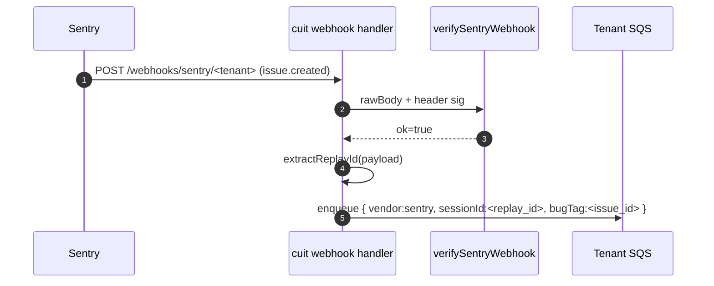

# 10. Adapter / Connector Specification

This document is the authoritative reference for every adapter that ingests
session recordings into `complex-ui-tester`. It extends — and does not repeat —
the architectural framing in
[`02-library-architecture.md` §4](./02-library-architecture.md) and the SaaS
ingestion pipeline in
[`03-saas-platform.md` §4](./03-saas-platform.md). Where those documents define
the shape of the contract, this document defines the **per-vendor wire
implementation**: exact endpoints, auth, rate limits, payload shape,
normalization mapping, PII rules, quirks, and the conformance test surface every
adapter must pass before merging to `main`.

The audience is a staff engineer onboarding a new vendor adapter, an SRE
debugging a stuck connector worker, and a security reviewer auditing the
data-egress posture of a new integration.

> Adapter packages live under `packages/adapters-*` in the OSS monorepo
> (`@cuit/adapters-jam`, `@cuit/adapters-logrocket`,
> `@cuit/adapters-sentry-replay`, `@cuit/adapters-fullstory`,
> `@cuit/adapters-datadog-rum`). The same code path is consumed by:
> 1. The SaaS **Connector Worker** (doc 03 §4) running on ECS Fargate.
> 2. End-users of the OSS CLI / library, bringing their own credentials.
>
> The contract is identical for both consumers — that is the load-bearing
> property of this spec.

---

## Part A — The Canonical Contract

### A.1 `SessionEvent[]` schema (the contract)

The single output of every adapter's `normalize()` call is an ordered array of
`SessionEvent` records. This is a **discriminated union** keyed on `type`. The
union is closed — adapters MAY put vendor-specific data in `metadata`, but they
MAY NOT invent new `type` discriminants. New event types are an across-the-org
API change and require a major-version bump of `@cuit/core`.

> Doc 02 §4.2 and doc 03 §4 each present a partial view of this schema. This
> section reproduces the **full** TypeScript declaration so adapter authors do
> not have to cross-reference. When the schemas in those documents drift from
> this one, **this document is authoritative**.

```ts
// @cuit/core/events/types.ts

/** Stable vendor identifier. Open string for customer-supplied adapters. */
export type VendorId =
  | 'jam'
  | 'logrocket'
  | 'sentry-replay'
  | 'fullstory'
  | 'datadog-rum'
  | (string & {});

/** Event-type discriminator. Closed union — see note above. */
export type SessionEventType =
  | 'pointer'        // mouse/pointer activity (click, move, down, up)
  | 'wheel'          // scroll wheel / trackpad scroll
  | 'keyboard'       // key down, key up, composition
  | 'touch'          // touch gestures (tap, swipe, pinch)
  | 'nav'            // navigation: pushState, popState, href change, hashchange
  | 'network'        // XHR / fetch request + response pair
  | 'console'        // console.{log,info,warn,error,debug}
  | 'mutation'       // DOM mutation (rrweb-derived)
  | 'error'          // uncaught exception / unhandled rejection
  | 'state-snapshot' // host-app state (waveform, redux store, etc.)
  ;

/**
 * Fields present on EVERY SessionEvent regardless of type.
 * All time fields obey the conventions in §A.1.2.
 */
export interface SessionEventBase {
  /**
   * Monotonic milliseconds since the session's first event.
   * MUST be non-negative and MUST be monotonically non-decreasing across the
   * full event array. Where the vendor provides absolute wall-clock only,
   * the adapter computes `ts = wallClock - sessionStartWallClock` and asserts
   * `ts >= 0`.
   */
  ts: number;

  /**
   * Epoch milliseconds (UTC) when the event was observed by the vendor.
   * Useful for joining across sources (see doc 02 §4.4 multi-source
   * correlation). Where the vendor only provides relative time, the adapter
   * computes wallClock from a known `sessionStartedAt`.
   */
  wallClock: number;

  /**
   * Monotonic integer, unique within a single normalized session. Starts at 0.
   * Adapters SHOULD assign `seq` after sorting by `(ts, vendor-provided
   * sub-order)` so that two events with identical `ts` retain a stable order.
   */
  seq: number;

  /**
   * Which vendor produced this event. Same string as the adapter's
   * `SessionAdapter.vendor` literal. Required so that downstream
   * `correlateSessions()` (doc 02 §4.4) can attribute events to a source.
   */
  vendor: VendorId;

  /**
   * Vendor-native event identifier, verbatim. For most vendors this is a UUID;
   * for FullStory it is `${SessionId}:${EventTime}:${EventType}`. Used as the
   * dedup key during pipeline-side idempotent upserts (doc 03 §4).
   */
  vendorEventId: string;

  /**
   * Vendor-specific opaque payload. Adapters MAY put any well-formed JSON
   * here. Downstream consumers MUST NOT make load-bearing decisions on
   * `metadata` — it is for debug, audit, and replay only.
   */
  metadata?: Readonly<Record<string, unknown>>;
}

/** Discriminated members. Each carries a literal `type` field. */

export interface PointerEvent extends SessionEventBase {
  type: 'pointer';
  /** Sub-kind. `move` events are heavy; some adapters downsample to 30 Hz. */
  action: 'down' | 'up' | 'move' | 'click' | 'dblclick' | 'contextmenu';
  /** Page coordinates in CSS pixels at the time of the event. */
  x: number;
  y: number;
  /** Locator chain at the time of the event. See §A.1.3 for selector rules. */
  target?: ElementLocator;
  /** Pointer kind. 'mouse' | 'pen' | 'touch'. */
  pointerType?: 'mouse' | 'pen' | 'touch';
  /** Modifier key state. Bit-packed for size: shift=1, ctrl=2, alt=4, meta=8. */
  modifiers?: number;
  /** Button bitmask (W3C UIEvent button). */
  button?: number;
}

export interface WheelEvent extends SessionEventBase {
  type: 'wheel';
  deltaX: number;
  deltaY: number;
  /** 0 = pixel, 1 = line, 2 = page (W3C DeltaMode). */
  deltaMode: 0 | 1 | 2;
  target?: ElementLocator;
  modifiers?: number;
}

export interface KeyboardEvent extends SessionEventBase {
  type: 'keyboard';
  action: 'down' | 'up' | 'press' | 'compositionstart' | 'compositionend';
  /** Always populated; never the raw character if isPassword=true (see §A.1.4). */
  key: string;
  /** W3C `code` (e.g. 'KeyA', 'Digit7'). */
  code: string;
  modifiers?: number;
  /** True if the target was an input with type=password or autocomplete=cc-*. */
  isPassword?: boolean;
  target?: ElementLocator;
}

export interface TouchEvent extends SessionEventBase {
  type: 'touch';
  action: 'start' | 'move' | 'end' | 'cancel';
  touches: ReadonlyArray<{ id: number; x: number; y: number; force?: number }>;
  target?: ElementLocator;
}

export interface NavEvent extends SessionEventBase {
  type: 'nav';
  action: 'pushState' | 'replaceState' | 'popState' | 'hashchange' | 'load';
  from?: string;
  to: string;
  /** Document title at the destination, when the vendor captures it. */
  title?: string;
}

export interface NetworkEvent extends SessionEventBase {
  type: 'network';
  /** Request-side fields. */
  method: 'GET' | 'POST' | 'PUT' | 'PATCH' | 'DELETE' | 'HEAD' | 'OPTIONS' | string;
  url: string;
  status?: number;
  /** Response time in ms. Computed when both request-start and response-end are seen. */
  durationMs?: number;
  /** Initiator: 'xhr' | 'fetch' | 'beacon' | 'navigation' | string. */
  initiator?: string;
  /**
   * Request body summary (NOT the full body). MUST already be scrubbed of
   * obvious secrets (§A.1.4). May be `{ truncated: true, bytes: N }`.
   */
  requestSummary?: Readonly<Record<string, unknown>>;
  responseSummary?: Readonly<Record<string, unknown>>;
}

export interface ConsoleEvent extends SessionEventBase {
  type: 'console';
  level: 'debug' | 'info' | 'log' | 'warn' | 'error';
  /** Already-formatted message. Adapters MUST NOT re-eval format strings. */
  message: string;
  /** Captured stack, if the vendor provides one. */
  stack?: string;
  /** Origin file:line:column, if known. */
  source?: { file: string; line: number; column?: number };
}

export interface MutationEvent extends SessionEventBase {
  type: 'mutation';
  /** rrweb-compatible event subtype (full-snapshot=2, incremental=3, meta=4, ...). */
  rrwebType: number;
  /**
   * Whole-payload rrweb event. Kept verbatim because the renderer is the only
   * consumer that interprets it, and because rrweb's own schema is stable.
   */
  rrwebData: Readonly<Record<string, unknown>>;
}

export interface ErrorEvent extends SessionEventBase {
  type: 'error';
  /** Error name, e.g. 'TypeError'. */
  name: string;
  message: string;
  stack?: string;
  /** Linked issue identifier (Sentry issue ID, Jam report ID). */
  bugTag?: string;
  /** Distinguish thrown errors from unhandled promise rejections. */
  kind: 'exception' | 'unhandledrejection' | 'sentry-issue' | 'jam-report';
}

export interface StateSnapshotEvent extends SessionEventBase {
  type: 'state-snapshot';
  /** Registered snapshot-adapter ID, e.g. 'waveform', 'redux', 'mobx'. */
  adapterId: string;
  /** Adapter-defined opaque payload. Must be JSON-serializable. */
  state: Readonly<Record<string, unknown>>;
  /**
   * Optional structural diff from the previous snapshot with the same
   * `adapterId` in this session. RFC-6902 JSON Patch.
   */
  diff?: ReadonlyArray<{ op: string; path: string; value?: unknown }>;
}

/** The closed union. */
export type SessionEvent =
  | PointerEvent
  | WheelEvent
  | KeyboardEvent
  | TouchEvent
  | NavEvent
  | NetworkEvent
  | ConsoleEvent
  | MutationEvent
  | ErrorEvent
  | StateSnapshotEvent;

/**
 * Element-targeting shape. Adapters provide whichever fields the vendor
 * supports; consumers prefer testId > role+name > selector > xpath.
 * See doc 02 §7.2 `ElementLocator` — this is the same type, exposed at the
 * event boundary.
 */
export interface ElementLocator {
  selector?: string;
  xpath?: string;
  testId?: string;
  role?: string;
  name?: string;
  textContent?: string;
  boundingRect?: { x: number; y: number; width: number; height: number };
}
```

#### A.1.1 Mandatory vs optional fields

| Field                       | All events | Notes                                                                                  |
| --------------------------- | ---------- | -------------------------------------------------------------------------------------- |
| `ts`                        | required   | Adapter MUST compute even when the vendor lacks it (interpolate from `seq`).           |
| `wallClock`                 | required   | Compute from `sessionStartedAt + ts` if vendor only gives relative time.                |
| `seq`                       | required   | Assigned by adapter post-sort; vendor-side ordering is advisory only.                   |
| `vendor`                    | required   | Literal string equal to `SessionAdapter.vendor`.                                        |
| `vendorEventId`             | required   | If vendor lacks an event ID, adapter computes a stable hash (see §A.1.5).               |
| `type`-specific fields      | required   | Per the interface above. Missing fields are a conformance-suite failure.                |
| `metadata`                  | optional   | Adapter discretion. Use sparingly.                                                      |
| `target` on pointer/wheel/keyboard/touch | optional | Strongly preferred. Adapter MUST emit it whenever the vendor exposes any target info.   |

#### A.1.2 Time conventions

- `ts` units: **integer milliseconds**, monotonic non-decreasing.
- `wallClock` units: **integer milliseconds since Unix epoch**, UTC.
- `ts === 0` for the first event in the session by convention. The vendor's
  "session-started" timestamp seeds `wallClock` for that first event; from
  there, `wallClock_i = wallClock_0 + ts_i`.
- Adapters MUST detect and reject clock-skew anomalies (e.g. `wallClock`
  going backwards by > 60 s between consecutive events). The validation
  result reports `ts.discontinuity` warnings; the pipeline decides whether
  to DLQ.

#### A.1.3 Element locator rules

- `selector` MUST be a CSS selector that matches a single element at the time
  the event fired. Adapters DO NOT recompute selectors at fetch time — they
  pass through whatever the vendor captured at record time. The renderer in
  the dashboard handles re-resolution.
- `xpath` is preferred only when no stable CSS selector exists. Some vendors
  (FullStory) emit element paths in a proprietary format; the adapter
  converts to XPath where lossless and stores the original in
  `metadata.fsPath`.
- `testId` is set only when the vendor exposes a `data-testid` attribute or
  equivalent.
- `textContent` is bounded to 256 characters and PII-scrubbed (§A.1.4).

#### A.1.4 PII handling at the schema boundary

Every adapter runs a **scrubbing pass** between vendor payload and emitted
`SessionEvent`. The pass is non-negotiable and is enforced by the conformance
test in §C.13. Defaults:

| Pattern                            | Regex / heuristic                                                                  | Replacement              |
| ---------------------------------- | ---------------------------------------------------------------------------------- | ------------------------ |
| Email                              | `[a-zA-Z0-9._%+-]+@[a-zA-Z0-9.-]+\.[a-zA-Z]{2,}`                                    | `[REDACTED:email]`       |
| Credit card (Luhn-valid 13–19 d)   | `\b(?:\d[ -]*?){13,19}\b` then Luhn-check                                          | `[REDACTED:cc]`          |
| US SSN                             | `\b\d{3}-\d{2}-\d{4}\b`                                                            | `[REDACTED:ssn]`         |
| JWT (3 base64 chunks, dot-joined)  | `eyJ[A-Za-z0-9_-]{8,}\.[A-Za-z0-9_-]{8,}\.[A-Za-z0-9_-]{8,}`                       | `[REDACTED:jwt]`         |
| Bearer/Authorization header value  | `(?i)authorization:\s*bearer\s+[^\s]+`                                             | `authorization: [REDACTED]` |
| Phone (E.164 + common US formats)  | `\+?\d{1,2}[\s.-]?\(?\d{3}\)?[\s.-]?\d{3}[\s.-]?\d{4}`                              | `[REDACTED:phone]`       |
| `isPassword=true` on keyboard      | `KeyboardEvent.target.type==='password'` OR `autocomplete=cc-*`                    | `key='*'`                |
| Cookies in network events          | `request.headers.cookie`                                                           | dropped                  |
| Set-Cookie in network responses    | `response.headers['set-cookie']`                                                   | dropped                  |

Rules are configurable via `AdapterContext.redaction` — but the default set
MUST always run. The customer can ADD rules; they cannot DISABLE the defaults.
Disabling defaults requires a signed Enterprise-tier configuration override
captured in the audit log per
[doc 05 §8](./05-security-compliance.md#8-audit-logging).

#### A.1.5 Stable `vendorEventId` synthesis

When a vendor does not surface an event ID (Jam, partial FullStory cases),
the adapter computes:

```
vendorEventId = base64url(sha256(`${vendor}|${sessionId}|${seq}|${ts}|${type}|${stableTargetKey}`)).slice(0, 22)
```

where `stableTargetKey` is the first non-empty of `target.testId`,
`target.xpath`, `target.selector`, or the empty string. The slice length is
chosen to give ~132 bits of entropy — collision-free at any conceivable
per-tenant volume.

#### A.1.6 Zod schema sketch

Every adapter exports a runtime parser. The parser is the single source of
truth for the pipeline's validation gate (§A.4).

```ts
// @cuit/core/events/schema.ts
import { z } from 'zod';

const ElementLocator = z.object({
  selector: z.string().max(2048).optional(),
  xpath: z.string().max(4096).optional(),
  testId: z.string().max(256).optional(),
  role: z.string().max(64).optional(),
  name: z.string().max(256).optional(),
  textContent: z.string().max(256).optional(),
  boundingRect: z
    .object({ x: z.number(), y: z.number(), width: z.number(), height: z.number() })
    .optional(),
});

const Base = z.object({
  ts: z.number().int().nonnegative(),
  wallClock: z.number().int().nonnegative(),
  seq: z.number().int().nonnegative(),
  vendor: z.string().min(1),
  vendorEventId: z.string().min(1).max(256),
  metadata: z.record(z.unknown()).optional(),
});

const Pointer = Base.extend({
  type: z.literal('pointer'),
  action: z.enum(['down', 'up', 'move', 'click', 'dblclick', 'contextmenu']),
  x: z.number(),
  y: z.number(),
  target: ElementLocator.optional(),
  pointerType: z.enum(['mouse', 'pen', 'touch']).optional(),
  modifiers: z.number().int().nonnegative().optional(),
  button: z.number().int().optional(),
});

// ... one extension per discriminant. Final union:

export const SessionEvent = z.discriminatedUnion('type', [
  Pointer,
  /* Wheel, Keyboard, Touch, Nav, Network, Console, Mutation, Error, StateSnapshot */
]);

export const SessionEventArray = z.array(SessionEvent).superRefine((arr, ctx) => {
  for (let i = 1; i < arr.length; i++) {
    if (arr[i].ts < arr[i - 1].ts) {
      ctx.addIssue({
        code: z.ZodIssueCode.custom,
        path: [i, 'ts'],
        message: `ts non-monotonic: ${arr[i].ts} < ${arr[i - 1].ts}`,
      });
    }
    if (arr[i].seq !== arr[i - 1].seq + 1) {
      ctx.addIssue({
        code: z.ZodIssueCode.custom,
        path: [i, 'seq'],
        message: `seq must increase by 1 (got gap ${arr[i].seq - arr[i - 1].seq})`,
      });
    }
  }
});
```

---

### A.2 `SessionAdapter` interface

Every adapter implements this interface, parameterized by the vendor's raw
payload type. The interface is **the** stability contract — changing it is a
major version bump of `@cuit/core` and a coordinated release across all
adapter packages.

```ts
// @cuit/core/adapter/types.ts

export interface SessionAdapter<TVendorPayload = unknown> {
  /** Stable vendor literal. Used as discriminator and as the `vendor` field. */
  readonly vendor: VendorId;

  /** SemVer of this adapter's emitted SessionEvent schema. Major MUST match @cuit/core. */
  readonly schemaVersion: `${number}.${number}.${number}`;

  /** Capabilities surfaced to the correlator and the LLM extractor. */
  readonly capabilities: AdapterCapabilities;

  /**
   * Exchange `creds` for an `AuthHandle`. SHOULD validate the token by making
   * one cheap, read-only API call (vendor `whoami` or equivalent) so that
   * misconfigured tokens fail at connect time, not at first session pull.
   *
   * @throws AdapterError('AUTH_INVALID')         credentials rejected by vendor
   * @throws AdapterError('AUTH_INSUFFICIENT')    vendor accepted creds but scope is too narrow
   * @throws AdapterError('AUTH_NETWORK')         transient network failure (caller may retry)
   *
   * Idempotency: safe to call multiple times. Tokens MUST NOT be logged.
   */
  authenticate(creds: VendorCredentials, ctx: AdapterContext): Promise<AuthHandle>;

  /**
   * Stream session descriptors matching `query`. Uses cursor pagination
   * internally; the AsyncIterable yields one descriptor per session.
   *
   * Implementations MUST honor `ctx.signal` (AbortSignal) between pages.
   *
   * Rate-limit handling: see §A.4.2 — adapters apply per-instance token
   * bucket + 429 honoring. Callers SHOULD NOT add their own backoff above it.
   *
   * @throws AdapterError('AUTH_EXPIRED')        the AuthHandle is stale; refresh + retry
   * @throws AdapterError('RATE_LIMITED', { retryAfterMs })  caller should not retry; the adapter has already retried
   * @throws AdapterError('VENDOR_5XX')          vendor returned a sustained 5xx; pipeline-level retry
   */
  listSessions(
    query: SessionQuery,
    auth: AuthHandle,
    ctx: AdapterContext,
  ): AsyncIterable<SessionDescriptor>;

  /**
   * Fetch the full raw payload for one session by vendor-native ID.
   * Returns the vendor's wire shape verbatim — no normalization.
   *
   * Idempotency: GET-style. Safe to retry. Vendor caching headers honored.
   *
   * @throws AdapterError('NOT_FOUND')           vendor returned 404
   * @throws AdapterError('SESSION_INCOMPLETE')  vendor returned partial data, marked as in-progress
   */
  fetchSession(
    id: string,
    auth: AuthHandle,
    ctx: AdapterContext,
  ): Promise<TVendorPayload>;

  /**
   * Pure transform. NO I/O, NO clock reads, NO crypto random. Output MUST be
   * deterministic given the same input — this is what makes the conformance
   * suite's golden-fixture comparison meaningful.
   *
   * @throws AdapterError('NORMALIZE_FAILED', { details }) — schema mismatch
   */
  normalize(raw: TVendorPayload): SessionEvent[];

  /**
   * Run the adapter's own validation (Zod parse + adapter-specific invariants).
   * Distinct from the pipeline's validation gate so that adapters can ship
   * vendor-specific rules (e.g. "Sentry replays MUST contain at least one
   * fullSnapshot rrweb event").
   *
   * Pure. No I/O.
   */
  validate(events: SessionEvent[]): ValidationResult;
}

export interface AdapterCapabilities {
  domEvents: boolean;
  videoBytes: boolean;
  console: boolean;
  network: boolean;
  errors: boolean;
  stateSnapshots: boolean;
  customUserEvents: boolean;
  realtimeStream: boolean;   // can push events live, not only batch
  batchExport: boolean;      // can paginate over historical sessions
  aiInsights: boolean;       // pre-computed highlights (LR Galileo, Sentry Seer)
}

export interface AdapterContext {
  /** Caller-provided fetch. Defaults to globalThis.fetch in @cuit/cli; injected w/ tracing in SaaS. */
  fetch: typeof globalThis.fetch;
  /** AbortSignal — all adapter I/O honors this. */
  signal: AbortSignal;
  /** Structured logger. Defaults to no-op. */
  log?: (level: 'debug' | 'info' | 'warn' | 'error', msg: string, data?: unknown) => void;
  /** Optional override for redaction rules. Defaults always apply (§A.1.4). */
  redaction?: Partial<RedactionConfig>;
  /** Per-instance rate-limit override (default: vendor-published or empirical). */
  rateLimit?: Partial<RateLimitConfig>;
  /** Tracing context (W3C traceparent). The connector worker forwards this. */
  traceparent?: string;
}

export interface SessionQuery {
  /** Inclusive lower bound, epoch ms. */
  since?: number;
  /** Exclusive upper bound, epoch ms. */
  until?: number;
  /** Vendor-side cursor token. Adapters opaque-store and return. */
  cursor?: string;
  /** Max sessions per page hint. Adapter chooses an actual value within vendor limits. */
  pageSize?: number;
  /** Vendor-specific filter (e.g. Sentry `project:read` scope). */
  filter?: Readonly<Record<string, unknown>>;
}

export interface SessionDescriptor {
  vendor: VendorId;
  sessionId: string;
  startedAt: number;       // epoch ms
  endedAt: number;         // epoch ms
  /** Hint of event count; not load-bearing. */
  approximateEventCount?: number;
  /** Linked issue/error if the vendor exposes one (Sentry, Jam). */
  bugTag?: string;
}

export interface AuthHandle {
  vendor: VendorId;
  /**
   * Opaque to callers. Adapters use it to attach the actual access token to
   * outbound requests. NEVER serialize an AuthHandle to a log line.
   */
  readonly [INTERNAL]: unknown;
  /** UNIX seconds when the access token expires. */
  expiresAt?: number;
  /** Scopes the vendor confirmed at auth time. */
  scopes?: ReadonlyArray<string>;
}

export type VendorCredentials =
  | { kind: 'oauth2'; clientId: string; clientSecret: string; refreshToken: string }
  | { kind: 'api-key'; apiKey: string; appKey?: string /* Datadog */ }
  | { kind: 'pat'; token: string }
  | { kind: 'integration-token'; token: string; orgSlug?: string };

export interface ValidationResult {
  ok: boolean;
  errors: ReadonlyArray<{ path: string; message: string }>;
  warnings: ReadonlyArray<{ path: string; message: string }>;
  /** Aggregate quality score; the LLM extractor uses this for confidence weighting. */
  scoreOutOf100: number;
}

declare const INTERNAL: unique symbol;
```

#### A.2.1 Error model

A single error class — `AdapterError` — with a closed list of `code` values.
Pipeline code (doc 03 §4) and CLI code map codes to actions identically.

```ts
export type AdapterErrorCode =
  | 'AUTH_INVALID' | 'AUTH_EXPIRED' | 'AUTH_INSUFFICIENT' | 'AUTH_NETWORK'
  | 'NOT_FOUND' | 'SESSION_INCOMPLETE'
  | 'RATE_LIMITED' | 'VENDOR_4XX' | 'VENDOR_5XX'
  | 'NORMALIZE_FAILED' | 'SCHEMA_VIOLATION'
  | 'TIMEOUT' | 'ABORTED'
  | 'WEBHOOK_INVALID_SIGNATURE' | 'WEBHOOK_REPLAY';

export class AdapterError extends Error {
  constructor(
    readonly code: AdapterErrorCode,
    message: string,
    readonly meta?: { retryAfterMs?: number; status?: number; details?: unknown },
  ) { super(message); }
}
```

| Code                          | Caller action                                           | Retry?                                |
| ----------------------------- | ------------------------------------------------------- | ------------------------------------- |
| `AUTH_INVALID`                | Mark connector broken, page tenant admin                | No                                    |
| `AUTH_EXPIRED`                | Refresh and retry once                                  | Once, immediately                      |
| `AUTH_INSUFFICIENT`           | Surface required scopes in dashboard                     | No                                    |
| `AUTH_NETWORK`                | Pipeline retry with backoff                              | Yes, 5x w/ jitter                      |
| `NOT_FOUND`                   | Mark session "missing" in `ingest_sessions`              | No                                     |
| `SESSION_INCOMPLETE`          | Re-queue with 5-minute delay                             | Yes, up to 6h                          |
| `RATE_LIMITED`                | Honour `retryAfterMs`; downstream backoff                | Yes, after delay                       |
| `VENDOR_4XX` (non-auth)       | DLQ                                                     | No                                     |
| `VENDOR_5XX`                  | Pipeline retry with capped exponential backoff           | Yes, 6x to ~60s                        |
| `NORMALIZE_FAILED`            | DLQ + on-call page (likely vendor schema break)          | No                                     |
| `SCHEMA_VIOLATION`            | DLQ                                                     | No                                     |
| `TIMEOUT` / `ABORTED`         | Re-queue                                                | Yes                                    |
| `WEBHOOK_INVALID_SIGNATURE`   | Drop, increment metric `webhook.invalid_sig.count`       | No                                     |
| `WEBHOOK_REPLAY`              | Drop, increment metric `webhook.replay.count`            | No                                     |

#### A.2.2 Idempotency

`fetchSession()`, `listSessions()`, and `validate()` are idempotent and side-
effect free. `normalize()` is pure. `authenticate()` is idempotent at the
adapter level but MAY consume rotating refresh-tokens on the vendor side —
adapters use vendor refresh-rotation semantics (OAuth2 RFC 6749 §6) and store
the new refresh token in `AuthHandle` via `ctx.onTokenRotated()` if provided.

#### A.2.3 Cancellation

Every async method honors `ctx.signal`. Mid-pagination aborts MUST close the
underlying connection and resolve the iterable promptly. The conformance
suite verifies cancellation latency under 250 ms.

---

### A.3 Capabilities matrix

Concrete values per current vendor APIs as of **2026-05**. Re-validated on
every adapter package release; the conformance suite (§C.13) refuses to build
if these values drift from the running implementation.

| Capability                | Jam            | LogRocket             | Sentry Replay       | FullStory             | Datadog RUM         |
| ------------------------- | -------------- | --------------------- | ------------------- | --------------------- | ------------------- |
| **`domEvents`** (rrweb)   | false          | true                  | true                | true (proprietary)    | true                |
| **`videoBytes`**          | false          | false                 | false               | false                 | false               |
| **`console`**             | true           | true                  | true                | true                  | true                |
| **`network`**             | true (XHR/fetch summary) | true       | true                | true                  | true                |
| **`errors`**              | true           | true                  | true (native)       | true                  | true                |
| **`stateSnapshots`**      | false          | true (Custom Events)  | false               | true (Custom Events)  | true (Global Context) |
| **`customUserEvents`**    | true           | true                  | true (breadcrumbs)  | true                  | true                |
| **`realtimeStream`**      | false          | true (Streaming Export) | false (poll only) | false                 | false               |
| **`batchExport`**         | true           | true                  | true                | true                  | true                |
| **`aiInsights`**          | true (annotations) | true (Galileo)    | true (Seer)         | true (Insights)       | false               |

Notes:

- **Jam** records user-narrated bug reports, not continuous sessions. Counts
  as `customUserEvents=true` because Jam's recorded "actions" are essentially
  discrete user-action records.
- **Sentry's** "real-time" is via webhook on error creation, not a streaming
  event channel — `realtimeStream=false`; webhook flow is documented in
  §B.3.5.
- **Datadog RUM Replay** historically used a proprietary recorder; as of
  early 2024 they emit rrweb-compatible events for new sessions. Older
  sessions remain in the old format and the adapter has a back-compat path.

---

### A.4 Cross-cutting concerns

#### A.4.1 Auth model

| Vendor        | Auth                                          | Storage path                              | Doc 05 ref            |
| ------------- | --------------------------------------------- | ----------------------------------------- | --------------------- |
| Jam           | OAuth 2.0 (PKCE) authorization code            | `cut/<tenant>/jam` (refresh + access)     | §6 row 1              |
| LogRocket     | Org-scoped API token (no OAuth third-party)    | `cut/<tenant>/logrocket`                  | §6 row 2              |
| Sentry        | Internal Integration token OR User Auth Token  | `cut/<tenant>/sentry`                     | §6 row 3              |
| FullStory     | API key (Server API) — no OAuth                | `cut/<tenant>/fullstory`                  | §6 row 4              |
| Datadog       | API key + Application key pair                 | `cut/<tenant>/datadog`                    | §6 row 5              |

All tokens are stored in AWS Secrets Manager under a per-tenant KMS CMK
(doc 05 §2.3, §6.1). Adapters NEVER read from environment variables; the
calling SaaS worker resolves the secret and passes credentials in via
`SessionAdapter.authenticate()`. The OSS CLI prompts the user interactively
or reads a project-local `.cuit/credentials.json` (chmod 600).

#### A.4.2 Rate-limit handling

Every adapter wraps its underlying `ctx.fetch` in a shared utility:

```ts
// @cuit/adapter-utils/src/rate-limited-fetch.ts

export interface RateLimitConfig {
  /** Steady-state requests per second the adapter targets. */
  rps: number;
  /** Bucket size (burst). */
  burst: number;
  /** Honor 429 `Retry-After` (seconds OR HTTP-date). */
  honor429: boolean;
  /** Max retries on 429 / 5xx. */
  maxRetries: number;
  /** Backoff base + cap for jittered exponential. */
  baseMs: number;
  capMs: number;
}

export function rateLimitedFetch(cfg: RateLimitConfig, inner: typeof fetch): typeof fetch;
```

- Token-bucket implementation; refilled at `rps` per second, capped at `burst`.
- On 429: if `Retry-After` is present, wait exactly that long, then retry.
- On 429 without header: full-jitter exponential backoff
  `random(0, min(cap, base * 2^attempt))`.
- On 5xx: same backoff family with `maxRetries` ceiling.
- Per-adapter defaults are listed in each B.x.4 subsection.

#### A.4.3 Pagination

| Vendor      | Style                    | Cursor opaque to caller? |
| ----------- | ------------------------ | ------------------------ |
| Jam         | Cursor (`next_cursor`)   | Yes                      |
| LogRocket   | Cursor (`page_token`)    | Yes                      |
| Sentry      | Link header (RFC 5988)   | Yes                      |
| FullStory   | Offset+limit             | No (transformed to cursor) |
| Datadog     | Cursor (`page[cursor]`)  | Yes                      |

The adapter API surfaces a single `cursor: string` in `SessionQuery` and
`SessionDescriptor.next?`. FullStory's offset is base64-encoded into the
cursor shape so callers never see the underlying offset.

#### A.4.4 Idempotency keys

Pipeline-side dedup uses `(tenantId, vendor, vendorEventId)` as the
upsert key — see doc 03 §4 ingestion. For sessions the key is
`(tenantId, vendor, sessionId)`. SQS message dedup ID is set to
`${vendor}-${sessionId}` to defend against duplicate webhook deliveries.

#### A.4.5 DLQ rules

A session lands in the per-tenant DLQ when ANY of:

1. `normalize()` throws `NORMALIZE_FAILED` more than 3 times across retries.
2. `validate()` returns `ok=false` with a non-recoverable error
   (e.g. schema discriminator missing).
3. The session was last-fetched > 6 hours ago and remains
   `SESSION_INCOMPLETE`.
4. Vendor returned a permanent 4xx (`403`, `410`).

Each DLQ entry is annotated with `failureCode`, `attempts`, `firstSeenAt`,
and `lastError`. The on-call runbook is in
[doc 06 §5](./06-operations-sre.md). Reprocessing is via
`cuit-cli ingest reprocess --vendor X --session-id Y`.

---

### A.5 Versioning

The OSS adapter packages are independently semver'd but track a single
`@cuit/core` major-version line:

```
@cuit/core               2.x
@cuit/adapters-jam       2.<minor>.<patch>
@cuit/adapters-logrocket 2.<minor>.<patch>
...
```

#### A.5.1 SemVer rules

- **Major bump** — closed-union extension (new `SessionEvent.type`), removal
  of any optional field that downstream consumers might depend on, or
  removal of any vendor capability we previously claimed.
- **Minor bump** — new capability emitted by an adapter (e.g. Sentry adds
  rrweb v2 support), new optional fields in `SessionEvent`, new error codes.
- **Patch** — bug fixes, fixture refresh, vendor endpoint version bump that
  preserves payload shape.

#### A.5.2 Vendor-API pinning

Each adapter pins a target vendor API version in its package.json:

```json
"cuit": {
  "vendorApi": "sentry-2024-12-01",
  "minSupportedVendorApi": "sentry-2024-06-01"
}
```

When a vendor announces a breaking API change:

1. Open a canary release: `@cuit/adapters-X@2.<n>.0-canary.1` with the new
   vendor version pin. Canaries are tagged `canary` on npm (NOT `latest`).
2. SaaS connector worker reads `cuit.vendorApi` and routes a 10% sample of
   that tenant's sessions through the canary build, leaving 90% on the
   stable.
3. After 7 days of green canary metrics
   (per [doc 06 §3](./06-operations-sre.md)), promote canary to `latest`.
4. Notify customers ≥ 90 days before the old vendor API is sunsetted, per
   [doc 06 §7](./06-operations-sre.md) change-management policy.

#### A.5.3 Breaking-change protocol

When a vendor change is unavoidable and breaks the adapter contract:

1. Major-bump the adapter, e.g. `@cuit/adapters-fullstory@3.0.0`.
2. Cut a `@2` LTS branch and accept patches for 12 months.
3. Publish a migration guide under `docs/migrations/adapters-X-2-to-3.md`.
4. Coordinate the SaaS roll-out: connector worker version-skews per tenant
   while customers self-upgrade their OSS dependencies.

---

## Part B — Per-Vendor Specs

### B.1 Jam (`@cuit/adapters-jam`)

#### B.1.1 Vendor overview

Jam is a **bug-report-first** session-recording tool. Recordings are short
(typically 30–120 s), tied 1:1 with a customer-filed bug report, and consist
of:

- A timeline of discrete user actions (click, type, navigate) — NOT a full
  rrweb DOM mutation stream.
- Console output captured during the recording window.
- Network XHR/fetch summaries (URL, method, status, duration) — bodies are
  not retained by default.
- A user-narrated comment ("here is what I expected to happen") attached as
  metadata.
- Optional Jam AI summary (auto-generated reproduction steps).

The fidelity is intentionally lower than LogRocket/Sentry — Jam optimizes for
human-readable bug repros, not DOM-level replay. That makes Jam the only
source that surfaces user intent verbatim, and that signal is load-bearing
for the LLM extractor (see [doc 04](./04-ai-spec-generation.md)).

**Gotchas:**

1. Jam sessions do not have stable monotonic timestamps. Each action carries
   a relative offset, but on long-paused recordings the offsets can drift —
   we interpolate (see B.1.9).
2. Jam URLs in the recording can include hash fragments containing CSRF
   tokens; the adapter strips these before emitting `NavEvent.to`.
3. The Jam recording remains "in progress" until the user clicks "Share" —
   the API returns `status=draft` until that moment. We never ingest drafts.

#### B.1.2 Authentication

- **Type:** OAuth 2.0 Authorization Code with PKCE.
- **Scopes required:** `recordings:read` only. The onboarding wizard
  refuses to proceed if the granted token includes write scopes
  (`recordings:write`, `workspaces:admin`).
- **Token storage:** AWS Secrets Manager
  `cut/<tenant>/jam` (per-tenant KMS CMK, doc 05 §6).
- **Access-token lifetime:** 1 hour. Refresh token rotates on every refresh
  (RFC 6749 §6 with rotation). Refresh-token lifetime: 90 days.
- **Rotation cadence:** quarterly forced rotation via the connector revoke +
  re-OAuth flow (doc 05 §6 revocation diagram).
- **Honeytoken canary:** see doc 05 §6.4. The Jam adapter creates one
  synthetic "Test recording" per tenant whose ID is embedded in the secret
  as `canary_session_id`. The adapter never reads it. CloudWatch checks
  Jam's audit log nightly for access against that ID.

`authenticate()` issues `GET https://api.jam.dev/v1/users/me` to validate the
token. A 200 with `scopes` array containing `recordings:read` and no write
scopes returns a populated `AuthHandle`. Anything else raises
`AUTH_INSUFFICIENT` or `AUTH_INVALID`.

#### B.1.3 Endpoints used

Base URL: `https://api.jam.dev/v1`. All requests over TLS 1.3.

| Op                | Method | Path                                              | Headers / Query                          |
| ----------------- | ------ | ------------------------------------------------- | ---------------------------------------- |
| Whoami            | GET    | `/users/me`                                       | `Authorization: Bearer <access>`         |
| List recordings   | GET    | `/recordings`                                     | `?since=<iso>&cursor=<opaque>&limit=50`  |
| Get recording     | GET    | `/recordings/{id}`                                | -                                        |
| Get events        | GET    | `/recordings/{id}/events`                         | -                                        |
| Get console       | GET    | `/recordings/{id}/console`                        | -                                        |
| Get network       | GET    | `/recordings/{id}/network`                        | -                                        |
| Get comments      | GET    | `/recordings/{id}/comments`                       | -                                        |
| OAuth refresh     | POST   | `https://api.jam.dev/oauth/token`                 | `grant_type=refresh_token`               |

Request sketch (fetch events):

```http
GET /v1/recordings/rec_abc123/events HTTP/1.1
Host: api.jam.dev
Authorization: Bearer JAM_ACCESS_TOKEN
Accept: application/json
User-Agent: cuit-adapter-jam/2.4.1 (+https://github.com/speechlab/complex-ui-tester)
traceparent: 00-<trace>-<span>-01
```

Response sketch (truncated):

```json
{
  "recording_id": "rec_abc123",
  "events": [
    {
      "id": "evt_01",
      "kind": "click",
      "offset_ms": 1240,
      "target": {
        "selector": "button[data-testid='play']",
        "text": "Play",
        "bounding_box": { "x": 120, "y": 240, "w": 64, "h": 32 }
      }
    },
    {
      "id": "evt_02",
      "kind": "input",
      "offset_ms": 2670,
      "target": { "selector": "#search", "text_value": "speechlab" },
      "value_redacted": false
    }
  ],
  "next_cursor": null
}
```

#### B.1.4 Rate limits

| Bucket          | Published limit | Adapter target | Notes                                      |
| --------------- | --------------- | -------------- | ------------------------------------------ |
| Per access token| ~100 req/min    | 60 req/min     | Jam's rate limits are undocumented; observed |
| Burst           | ~20             | 10             | Token-bucket burst                           |
| 429 backoff     | `Retry-After` honored | yes      | Adapter uses full-jitter on missing header   |
| 5xx backoff     | n/a             | 6x to ~60s     | Jam outages historically rare but lengthy    |

`RateLimitConfig` defaults: `{ rps: 1.0, burst: 10, honor429: true,
maxRetries: 6, baseMs: 250, capMs: 30_000 }`.

#### B.1.5 Webhooks

Jam supports a "new recording" webhook. The adapter exposes a verification
helper used by the SaaS webhook handler:

- **Subscription URL:** `https://api.jam.dev/v1/webhooks` (POST). Set during
  tenant onboarding.
- **Events subscribed:** `recording.shared` only. The adapter explicitly
  rejects `recording.draft`, `recording.deleted`, and any other event.
- **Signing:** HMAC-SHA256 of the raw body, key = the webhook secret
  returned at subscription time, signature in `X-Jam-Signature` as
  `t=<unix>,v1=<hex>`.
- **Replay protection:** the connector tracks `(webhook_id, t)` in Redis
  with a 5-minute TTL; duplicate delivery within the window is dropped with
  `WEBHOOK_REPLAY`. The `t` timestamp must be within ±300 s of server time.

```ts
// @cuit/adapters-jam/src/webhook.ts
export function verifyJamWebhook(
  rawBody: Buffer,
  headerSig: string,
  secret: string,
  nowMs: number,
): { ok: true; eventId: string } | { ok: false; reason: 'sig' | 'skew' | 'format' };
```

#### B.1.6 Payload schema

Raw vendor shape (the type passed to `normalize()` as `JamRawSession`):

```ts
export interface JamRawSession {
  recording_id: string;
  workspace_id: string;
  shared_at: string;          // ISO 8601
  duration_ms: number;
  url: string;                // page URL at recording start
  user_agent: string;
  viewport: { width: number; height: number };
  events: JamEvent[];
  console: JamConsoleEntry[];
  network: JamNetworkEntry[];
  comments: JamComment[];
  ai_summary?: { steps: string[]; severity: 'low' | 'medium' | 'high' };
}

export interface JamEvent {
  id: string;
  kind: 'click' | 'input' | 'keypress' | 'nav' | 'scroll' | 'drag';
  offset_ms: number;          // relative to recording start
  target: {
    selector: string;
    xpath?: string;
    text?: string;
    text_value?: string;
    bounding_box?: { x: number; y: number; w: number; h: number };
  };
  value_redacted?: boolean;
  modifiers?: ('shift' | 'ctrl' | 'alt' | 'meta')[];
}

export interface JamConsoleEntry {
  offset_ms: number;
  level: 'debug' | 'info' | 'log' | 'warn' | 'error';
  message: string;
  stack?: string;
}

export interface JamNetworkEntry {
  offset_ms: number;
  method: string;
  url: string;
  status?: number;
  duration_ms?: number;
  initiator?: string;
}

export interface JamComment {
  offset_ms: number;
  author: string;
  body: string;
}
```

A canonical fixture lives at
`packages/adapters-jam/test/fixtures/recording.share-link-crash.json`. Excerpt:

```json
{
  "recording_id": "rec_01HSDC2VV4Y3K1Q1Z2QH4N9XPK",
  "workspace_id": "ws_speechlab",
  "shared_at": "2026-05-12T16:42:11.000Z",
  "duration_ms": 38_400,
  "url": "https://app.speechlab.ai/projects/demo/edit",
  "user_agent": "Mozilla/5.0 (Macintosh; Intel Mac OS X 14_4) AppleWebKit/605.1.15",
  "viewport": { "width": 1440, "height": 900 },
  "events": [
    { "id": "evt_01", "kind": "nav",   "offset_ms": 0,
      "target": { "selector": "html" } },
    { "id": "evt_02", "kind": "click", "offset_ms": 2_800,
      "target": { "selector": "[data-testid='share-button']", "text": "Share" } },
    { "id": "evt_03", "kind": "input", "offset_ms": 6_120,
      "target": { "selector": "#email", "text_value": "alex@example.com" },
      "value_redacted": false }
  ],
  "console": [
    { "offset_ms": 6_400, "level": "error",
      "message": "TypeError: Cannot read properties of undefined (reading 'id')",
      "stack": "at ShareModal (app.js:12:34)" }
  ],
  "network": [
    { "offset_ms": 6_300, "method": "POST",
      "url": "https://api.speechlab.ai/v1/share?token=eyJhbGciOi…",
      "status": 500, "duration_ms": 220, "initiator": "fetch" }
  ],
  "comments": [
    { "offset_ms": 30_000, "author": "alex@speechlab.ai",
      "body": "Clicking Share crashes the modal on staging." }
  ],
  "ai_summary": {
    "steps": ["Open project", "Click Share", "Enter email", "Observe crash"],
    "severity": "high"
  }
}
```

#### B.1.7 Normalization mapping

| Vendor field                                | `SessionEvent` field                                                                                    | Notes                                                                                       |
| ------------------------------------------- | ------------------------------------------------------------------------------------------------------- | ------------------------------------------------------------------------------------------- |
| `recording_id`                              | (carried separately as session id)                                                                       | -                                                                                           |
| `shared_at`                                 | seeds `wallClock` for event 0                                                                            | parse to epoch ms                                                                            |
| `events[i].offset_ms`                       | `ts` (after monotonic-gap fix)                                                                            | gaps > 250 ms with no console/network filler get adjusted via interpolation (B.1.9 quirk 1) |
| `events[i].id`                              | `vendorEventId`                                                                                          | -                                                                                            |
| `events[i].kind = 'click'`                  | `PointerEvent { type:'pointer', action:'click' }`                                                       | `x,y` derived from `target.bounding_box` center                                              |
| `events[i].kind = 'input'`                  | `KeyboardEvent { type:'keyboard', action:'down', key:'?' }` per character of `target.text_value`         | When `value_redacted` true OR `target.selector` matches `[type=password]`, emit one event with `key='*'` and `isPassword=true` |
| `events[i].kind = 'keypress'`               | `KeyboardEvent { type:'keyboard', action:'press' }`                                                      | -                                                                                            |
| `events[i].kind = 'nav'`                    | `NavEvent { action: 'pushState', to: target.selector }`                                                  | Hash + query stripped of token-looking patterns                                              |
| `events[i].kind = 'scroll'`                 | `WheelEvent { type:'wheel', deltaY: inferred }`                                                          | Lossy; `metadata.derived = true`                                                              |
| `events[i].kind = 'drag'`                   | Emit `pointer down` + `pointer move` + `pointer up` triplet                                              | `seq` increments for each synthesized event                                                  |
| `events[i].target`                          | `ElementLocator { selector, xpath, textContent, boundingRect }`                                          | `textContent` truncated to 256, scrubbed                                                     |
| `console[i].offset_ms` + entry              | `ConsoleEvent`                                                                                           | -                                                                                            |
| `network[i].offset_ms` + entry              | `NetworkEvent`                                                                                           | URL is scrubbed of `?token=…`, `?api_key=…`                                                  |
| `comments[i]`                               | `metadata.jamComments` on the session-level object passed through `CommonSession.raw`                    | Not emitted as a SessionEvent (no `type` matches)                                            |
| `ai_summary`                                | `metadata.aiSummary` on the session                                                                      | Surfaces to the LLM extractor as auxiliary hint                                              |
| Recording-level error in `console`          | If a `stack` looks like an exception, emit an `ErrorEvent` with `kind:'exception'`                       | Heuristic flagged in `metadata.derived = true`                                               |
| **Lossy / unmappable fields**               |                                                                                                          |                                                                                              |
| `value_redacted` flag                       | Stored in `metadata.jamValueRedacted` for audit                                                          | -                                                                                            |
| `comments[i].author`                        | Stored in `metadata.jamCommentAuthor`; PII-scrubbed (email pattern)                                      | -                                                                                            |
| `workspace_id`                              | Stored in `metadata.jamWorkspaceId` on session-level                                                      | -                                                                                            |

#### B.1.8 PII handling

Jam's data is the highest-PII surface of any vendor we ingest because:

- Comments are free-form user-typed prose, often containing emails / phone
  numbers ("call me at 555-1234 to reproduce").
- Input events include the typed text verbatim unless the recorder flagged
  `value_redacted`.
- Recording URLs sometimes include unrotated CSRF tokens.

Adapter-side scrubbing rules (in addition to the defaults in §A.1.4):

1. Every `target.text_value` is run through the full default regex set
   BEFORE being expanded into per-character `KeyboardEvent`s.
2. URLs in `nav` and `network` events have `token`, `api_key`, `apiKey`,
   `access_token`, `id_token`, `key`, `secret`, `password` query params
   stripped (replaced with `[REDACTED]`) and any path segment matching a
   JWT pattern replaced with `[REDACTED:jwt]`.
3. `comments[i].body` is scrubbed with the full default set before being
   stored in metadata.
4. If `target.selector` indicates a password input (`[type='password']`,
   `[autocomplete='current-password']`, `[autocomplete='new-password']`),
   all subsequent character events from that input emit `key='*'` and
   `isPassword=true`.

The conformance suite includes a fixture
`fixtures.pii.kitchen-sink.json` containing every supported PII pattern, and
the test asserts none of those patterns survive in the normalized output.

#### B.1.9 Known quirks & failure modes

1. **Timestamp drift on long pauses.** Jam pauses event capture during long
   idle periods (> 5 s of no user input). On resume, `offset_ms` jumps in
   ways that violate monotonic-ms invariants when correlated with the
   console stream. The adapter detects gaps > 250 ms with no intervening
   console/network event and adjusts the `ts` of subsequent events by
   subtracting the gap minus 250 ms. Original offsets retained in
   `metadata.jamOriginalOffsetMs`.

2. **Draft recordings.** `GET /recordings/{id}` returns `status: 'draft'`
   for in-progress recordings. The adapter throws `SESSION_INCOMPLETE`; the
   pipeline re-queues with 5-minute delay.

3. **Deleted recordings.** Jam returns 410 Gone for user-deleted recordings.
   Adapter throws `NOT_FOUND` (mapped from 410).

4. **Comments edited after publish.** The comments list is mutable on Jam's
   side. The adapter is read-only and ingests once; later edits are
   ignored. A workflow exists to re-pull (`cuit-cli ingest reprocess`).

5. **Workspace-level rate limits.** Jam applies a workspace-wide bucket on
   top of the per-token limit; a noisy customer pulling 5 tenants' worth
   of recordings concurrently can starve their own bucket. The connector
   serializes pulls per workspace ID.

6. **Synthetic drag.** Jam emits one `kind:'drag'` per drag operation with
   no intermediate points. The adapter synthesizes 8 intermediate pointer
   moves (linear interpolation) — the conformance suite verifies this is
   deterministic.

#### B.1.10 Testing & fixtures

- Canonical fixtures live at `packages/adapters-jam/test/fixtures/`:
  - `recording.share-link-crash.json` — happy path, the running example.
  - `recording.drag-resize.json` — drag synthesis.
  - `recording.password-input.json` — PII scrubbing.
  - `recording.long-pause.json` — timestamp drift quirk #1.
  - `recording.deleted.json` — 410 path (response fixture, not session).
  - `recording.pii.kitchen-sink.json` — every PII pattern.
- Regeneration: `pnpm --filter @cuit/adapters-jam fixtures:refresh` requires
  a sandboxed Jam workspace whose access token lives in
  `~/.cuit/dev-creds/jam.json`. The script records, fetches, scrubs, and
  diffs against the committed fixture.
- Snapshot policy: golden-fixture `normalize()` output is snapshotted to
  `__snapshots__/`. Snapshots are committed; the conformance suite refuses
  to merge a diff without explicit `--update-snapshots` and a changelog
  entry.

#### B.1.11 Operational notes

- Stale-session alert: pages on-call when `now - lastJamPullSuccess > 4h`
  for any tenant with an active Jam connector.
- Vendor-outage detection: 3 consecutive `VENDOR_5XX` responses across
  different sessions within 2 minutes triggers a circuit breaker that
  pauses the Jam connector pool for 5 minutes and posts a Slack notice.
- Credential rotation: tenants are emailed 14 days before quarterly forced
  rotation. The dashboard exposes a self-serve "Rotate Jam connector"
  button (doc 05 §6 revocation diagram).

---

### B.2 LogRocket (`@cuit/adapters-logrocket`)

#### B.2.1 Vendor overview

LogRocket is a continuous-recording session replay tool. Sessions consist
of:

- A MutationObserver-derived DOM event stream — structurally close to
  rrweb. LogRocket emits `incrementalSnapshot`-style records (type 3) with
  its own subtypes; the adapter translates each into the
  `MutationEvent` shape.
- High-fidelity user interaction events (clicks with offsets,
  text-input events, scroll positions).
- Console capture (verbatim).
- Network captures (request + response, with body sampling).
- LogRocket "Galileo" AI Highlights — short auto-generated descriptions of
  notable session segments. We surface these as `metadata.galileoHighlights`.

**Gotchas:**

1. LogRocket's session ID format changed in 2023 from `app/session/N` to a
   ULID. The adapter accepts both formats and normalizes.
2. The MutationObserver stream pauses when the tab is backgrounded.
   Timestamps go monotonic-OK but `wallClock` has gaps that other sources
   will not — correlation must account for this.
3. Custom events (`LogRocket.track('eventName', data)`) are first-class in
   LogRocket but vary wildly across customers; the adapter passes them
   through as `metadata.lrCustomEvent` with no schema enforcement.

#### B.2.2 Authentication

- **Type:** Organization-scoped API token. LogRocket has no third-party
  OAuth as of 2026-05.
- **Scope:** "Data Export" capability (read-only by construction —
  LogRocket gates write APIs behind a separate token type).
- **Storage:** `cut/<tenant>/logrocket`. Stored verbatim; LogRocket tokens
  are opaque ~64-char strings.
- **Lifetime:** never expires (no rotation built into the vendor). We
  enforce **quarterly rotation** ourselves (doc 05 §6) — the dashboard
  prompts admins to paste a freshly-issued token.
- **Validation at connect:** `GET /v1/orgs/{org}/profile` returns the org
  metadata. A `403` indicates wrong scope; a `401` indicates revoked.

#### B.2.3 Endpoints used

Base URL: `https://api.logrocket.com`.

| Op                       | Method | Path                                                              |
| ------------------------ | ------ | ----------------------------------------------------------------- |
| Org profile (whoami)     | GET    | `/v1/orgs/{org}/profile`                                           |
| List apps                | GET    | `/v1/orgs/{org}/apps`                                              |
| List session URLs        | GET    | `/v1/orgs/{org}/apps/{app}/data-export/list?since=&until=&cursor=` |
| Get session record       | GET    | `/v1/orgs/{org}/apps/{app}/sessions/{id}`                          |
| Get session events       | GET    | `/v1/orgs/{org}/apps/{app}/sessions/{id}/events`                   |
| Streaming export channel | GET    | `/v1/orgs/{org}/apps/{app}/data-export/stream` (SSE)               |
| Galileo highlights       | GET    | `/v1/orgs/{org}/apps/{app}/sessions/{id}/galileo`                  |

Streaming-export request sketch:

```http
GET /v1/orgs/spchlab/apps/web/data-export/stream HTTP/1.1
Host: api.logrocket.com
Authorization: Bearer <LR_TOKEN>
Accept: text/event-stream
Cache-Control: no-cache
Last-Event-ID: 1700000000:42
```

Response is SSE, one `data:` line per event batch JSON. The adapter wraps
the SSE consumer in a `realtimeStream()` helper (capability flag —
`realtimeStream=true`).

#### B.2.4 Rate limits

| Bucket                       | Published | Adapter target | Notes                                          |
| ---------------------------- | --------- | -------------- | ---------------------------------------------- |
| REST per org                 | 60 req/min| 45 req/min     | Leaves 25% headroom for the dashboard           |
| Data-export batch endpoint   | 30 req/min (separate bucket) | 20 req/min |                                                 |
| Streaming-export connection  | 1 per app | 1              | Adapter enforces single-flight in the worker    |
| 429 backoff                  | yes       | yes            | `Retry-After` always present                     |
| 5xx backoff                  | n/a       | 6x to ~60s     | -                                              |

Defaults: `{ rps: 0.75, burst: 5, honor429: true, maxRetries: 6,
baseMs: 500, capMs: 30_000 }`.

#### B.2.5 Webhooks

LogRocket does not expose webhooks for session events as of 2026-05. The
adapter polls via REST or consumes the SSE stream. There IS a webhook for
"alert triggered" (custom error-rate alerts) — the adapter surfaces it as a
helper but the SaaS pipeline does not subscribe by default.

#### B.2.6 Payload schema

```ts
export interface LogRocketRawSession {
  session_id: string;          // ULID
  app_id: string;
  user: { id?: string; name?: string; email?: string };
  started_at: string;          // ISO 8601
  duration_ms: number;
  url: string;
  user_agent: string;
  viewport: { width: number; height: number };
  events: LREvent[];
  custom_events: LRCustomEvent[];
  galileo_highlights?: Array<{
    start_ms: number;
    end_ms: number;
    label: string;
    summary: string;
  }>;
}

export type LREvent =
  | { type: 'mutation'; t: number; rrweb: Record<string, unknown> }
  | { type: 'click';    t: number; x: number; y: number; target: LRTarget }
  | { type: 'input';    t: number; target: LRTarget; redacted: boolean }
  | { type: 'scroll';   t: number; target: LRTarget; deltaX: number; deltaY: number }
  | { type: 'console';  t: number; level: string; args: unknown[] }
  | { type: 'network';  t: number; method: string; url: string; status?: number;
      duration_ms?: number; req_size?: number; res_size?: number }
  | { type: 'error';    t: number; name: string; message: string; stack?: string }
  | { type: 'nav';      t: number; from: string; to: string };

export interface LRCustomEvent {
  t: number;
  name: string;
  properties: Record<string, unknown>;
}

export interface LRTarget {
  selector: string;
  xpath?: string;
  text?: string;
  rect?: { x: number; y: number; w: number; h: number };
  testid?: string;
}
```

Canonical fixture `packages/adapters-logrocket/test/fixtures/session.scrubber-drag.json`:

```json
{
  "session_id": "01HQA5G4N9KKD3J3T5K8XZ1WJM",
  "app_id": "spchlab-web",
  "user": { "id": "u_123", "email": "alex@speechlab.ai" },
  "started_at": "2026-05-12T14:00:00.000Z",
  "duration_ms": 18_320,
  "url": "https://app.speechlab.ai/projects/demo/edit",
  "user_agent": "Mozilla/5.0",
  "viewport": { "width": 1440, "height": 900 },
  "events": [
    { "type": "mutation", "t": 0,    "rrweb": { "type": 2, "data": { "node": {}, "initialOffset": { "left": 0, "top": 0 } } } },
    { "type": "click",    "t": 1200, "x": 320, "y": 180,
      "target": { "selector": "[data-testid='play']", "testid": "play" } },
    { "type": "input",    "t": 2800,
      "target": { "selector": "#search" }, "redacted": false },
    { "type": "network",  "t": 3100, "method": "GET",
      "url": "/api/projects/demo/segments?cursor=abc",
      "status": 200, "duration_ms": 84 },
    { "type": "console",  "t": 4500, "level": "warn", "args": ["slow render"] }
  ],
  "custom_events": [
    { "t": 1500, "name": "spec.runner.installed",
      "properties": { "version": "2.4.1" } }
  ],
  "galileo_highlights": [
    { "start_ms": 1000, "end_ms": 5000, "label": "Frustration",
      "summary": "Repeated clicks on the same element" }
  ]
}
```

#### B.2.7 Normalization mapping

| Vendor field                                | `SessionEvent` field                                              | Notes                                                                                  |
| ------------------------------------------- | ----------------------------------------------------------------- | -------------------------------------------------------------------------------------- |
| `session_id`                                | session id                                                         | -                                                                                      |
| `started_at`                                | seeds `wallClock` for event 0                                      | -                                                                                      |
| `events[i].t`                               | `ts`                                                              | already monotonic in vendor output                                                      |
| `events[i].type='mutation'`                 | `MutationEvent { rrwebType: rrweb.type, rrwebData: rrweb.data }`  | passthrough                                                                            |
| `events[i].type='click'`                    | `PointerEvent { action:'click', x, y, target }`                   | -                                                                                      |
| `events[i].type='input'`                    | `KeyboardEvent { action:'down', key:'*' }` (because LR redacts input by default) | When `redacted=false`, emit per-character via the same expansion as Jam |
| `events[i].type='scroll'`                   | `WheelEvent { deltaX, deltaY, deltaMode:0 }`                       | -                                                                                      |
| `events[i].type='console'`                  | `ConsoleEvent { level, message: args.map(formatArg).join(' ') }`  | `formatArg` is deterministic JSON-ish                                                  |
| `events[i].type='network'`                  | `NetworkEvent { method, url, status, durationMs }`                | URL scrubbed of secret-looking params                                                  |
| `events[i].type='error'`                    | `ErrorEvent { name, message, stack, kind:'exception' }`           | -                                                                                      |
| `events[i].type='nav'`                      | `NavEvent { action:'pushState', from, to }`                       | -                                                                                      |
| `custom_events[i]`                          | `StateSnapshotEvent { adapterId:'logrocket-custom', state: properties }` | Emitted only when `properties` is a plain object; otherwise dropped with a warning   |
| `galileo_highlights`                        | `metadata.galileoHighlights` on the session                       | Not a per-event SessionEvent                                                            |
| `user.email`                                | dropped at adapter boundary                                       | Tenant-level user identity is enriched separately via the SaaS user-table              |
| **Lossy**                                   |                                                                    |                                                                                        |
| LR's "interaction type" sub-flags           | preserved in `metadata.lrSubtype` for debug                       | -                                                                                      |
| LR's per-event session-region rectangle     | preserved in `metadata.lrRegion`                                  | -                                                                                      |

#### B.2.8 PII handling

LogRocket has an in-product redaction config — text inputs marked
`data-private` or matched by the customer's privacy rules are already
redacted server-side. We do NOT trust this. The adapter re-runs the default
scrub set on:

- `console.args` (joined string), even though LogRocket scrubs known
  PII patterns server-side.
- `network.url` query params.
- `user.email` and `user.name` — never emitted into `SessionEvent`; if
  needed for correlation they are passed via a separate user-context
  channel on the `CommonSession` wrapper, scrubbed to a hashed identifier.
- `custom_events[i].properties` — recursively scrubbed; values matching
  PII patterns replaced with `[REDACTED]`.

LogRocket sometimes leaks credit-card numbers in `rrweb` `incrementalSnapshot`
text-mutation records. The adapter walks the `rrwebData.adds` /
`rrwebData.attributes` tree and replaces `value`/`textContent` fields whose
content matches the Luhn-valid CC regex.

#### B.2.9 Known quirks & failure modes

1. **Pause/resume creates wallClock gaps.** When the tab is backgrounded,
   LogRocket pauses the recorder. `ts` remains monotonic, but
   `wallClock = started_at + ts` will diverge from actual wall-clock by
   the pause duration. Adapter detects pauses by looking for
   `mutation` events with `rrweb.type === 5` (custom "paused" marker) and
   adjusts `metadata.lrPauseMs` for downstream consumers. Correlation
   uses `ts`, not `wallClock`, in the presence of pauses.

2. **Streaming export can drop messages.** SSE re-delivery is not
   guaranteed by LogRocket. The adapter persists `Last-Event-ID` to S3
   every 30 seconds (worker side, not adapter) and on reconnect requests
   from that ID; gaps are reconciled against the REST list endpoint.

3. **Custom-event payload size cap.** LogRocket truncates
   `properties` at 16 KiB. The adapter checks `metadata.lrTruncated=true`
   and warns; the LLM extractor knows to expect this.

4. **Old ULID-less sessions.** Sessions older than 2023-11 use
   `app_id/session/N` IDs. The adapter accepts both formats; the
   normalized session ID is whatever the vendor returned (no rewriting).

5. **Galileo highlights are eventually consistent.** The highlights for a
   session may be empty for ~3 minutes after session end. The adapter
   re-queues with delay if `galileo_highlights` is empty on first fetch
   AND `now - session.ended_at < 5 min`.

6. **Network response-body samples.** LogRocket includes truncated
   response bodies for some sampled requests. The adapter strips bodies
   entirely (`responseSummary = { truncated: true, bytes: res_size }`).

#### B.2.10 Testing & fixtures

- Fixtures at `packages/adapters-logrocket/test/fixtures/`:
  - `session.scrubber-drag.json` — running example.
  - `session.pause-resume.json` — quirk #1.
  - `session.galileo-empty.json` — quirk #5.
  - `session.cc-leak-in-mutation.json` — PII scrubbing through rrweb.
  - `streaming.batch.jsonl` — SSE payload for streaming consumer test.
- Regeneration: `pnpm --filter @cuit/adapters-logrocket fixtures:refresh`
  pulls from a dedicated LogRocket sandbox app. The script writes through
  the scrubber so committed fixtures are PII-free even pre-test.
- Snapshot policy: same as Jam; committed `__snapshots__/`.

#### B.2.11 Operational notes

- Stale-session alert: pages on-call if streaming-export reconnect-count
  > 5 in any 5-minute window OR if poll-mode `lastSuccess > 90 min`.
- Vendor-outage detection: LogRocket public statuspage scraped every
  60 s; any "investigating" component triggers a label-based dashboard
  filter and pauses honeytoken alerting (false-positive suppression).
- Credential rotation: 90-day cadence enforced; dashboard surface
  `expiresAt` is synthetic (90 days after last paste), since LogRocket
  tokens never naturally expire.

---

### B.3 Sentry Replay (`@cuit/adapters-sentry-replay`)

#### B.3.1 Vendor overview

Sentry Replay is a Sentry-Issue-bound session-recording surface backed
directly by rrweb. The native event format IS rrweb — segments of rrweb
events stored alongside the Sentry error that triggered them.

Sessions consist of:

- An ordered set of "segments" (typically 0–60 s each), each segment is a
  gzipped JSON array of rrweb events.
- The Sentry Issue / Event that this replay is bound to (the `bugTag`).
- Sentry breadcrumbs leading up to the error (essentially a curated user-
  interaction log).
- Optional "Seer" AI root-cause analysis associated with the issue.

Sentry is the **highest-fidelity** source we ingest for DOM mutations,
because the payload is canonical rrweb and the bug context (stack trace,
error metadata) is the strongest available.

**Gotchas:**

1. A Sentry replay can be linked to MULTIPLE issues; we attach the most
   recent issue ID as `bugTag` and store the full list in
   `metadata.sentryIssueIds`.
2. Segments may arrive out of order on the wire; the adapter sorts by
   `segment_id` before stitching.
3. rrweb `fullSnapshot` (type 2) may appear more than once in a single
   session — every time the user reloads in-tab, Sentry emits a fresh full
   snapshot. The conformance suite verifies the adapter accepts
   multi-fullSnapshot sessions without throwing.

#### B.3.2 Authentication

- **Type:** Internal Integration Token (preferred) OR User Auth Token.
  Both are presented as `Bearer` headers. OAuth user-flow exists but we
  use Internal Integration because it is org-scoped, machine-friendly,
  and revocable without user logout.
- **Scopes required (Internal Integration):**
  `event:read`, `project:read`, `org:read`, `member:read`. No write
  scopes. The onboarding wizard validates scope on connect.
- **Storage:** `cut/<tenant>/sentry`.
- **Lifetime:** Internal Integration tokens do not auto-expire. We rotate
  quarterly via the connector revoke flow.

`authenticate()` issues
`GET https://sentry.io/api/0/` (the root) which returns org info and the
authenticated user; 401 maps to `AUTH_INVALID`, 403 with `permissions`
list indicating missing scope maps to `AUTH_INSUFFICIENT`.

#### B.3.3 Endpoints used

Base URL: `https://sentry.io/api/0`.

| Op                             | Method | Path                                                                          |
| ------------------------------ | ------ | ----------------------------------------------------------------------------- |
| Whoami                         | GET    | `/`                                                                            |
| List issues                    | GET    | `/projects/{org}/{proj}/issues/`                                               |
| List replays for project       | GET    | `/projects/{org}/{proj}/replays/`                                              |
| Get replay (metadata)          | GET    | `/projects/{org}/{proj}/replays/{replay_id}/`                                  |
| List replay segments           | GET    | `/projects/{org}/{proj}/replays/{replay_id}/segments/`                         |
| Get segment payload            | GET    | `/projects/{org}/{proj}/replays/{replay_id}/segments/{segment_id}/`            |
| Issue → linked replays         | GET    | `/issues/{issue_id}/replays/`                                                  |
| Seer root-cause                | GET    | `/issues/{issue_id}/autofix/`                                                  |

Segment payload sketch (gzipped JSON, content-encoding gzip):

```http
GET /api/0/projects/spchlab/web/replays/c6e8fe.../segments/3/ HTTP/1.1
Host: sentry.io
Authorization: Bearer <SENTRY_TOKEN>
Accept-Encoding: gzip
```

Response is `application/json` (decompressed by transport):

```json
{
  "segment_id": 3,
  "events": [
    { "type": 2, "data": { "node": { "type": 0, "id": 1 } }, "timestamp": 1715520000123 },
    { "type": 3, "data": { "source": 2, "type": 1, "id": 42 },               "timestamp": 1715520000180 }
  ]
}
```

#### B.3.4 Rate limits

| Bucket                       | Published   | Adapter target |
| ---------------------------- | ----------- | -------------- |
| Sentry org rate              | 40 req/s    | 25 req/s        |
| Concurrent in-flight per org | 10          | 5               |
| 429 backoff                  | yes         | yes (`X-Sentry-Rate-Limit-Remaining`, `Retry-After`) |

Defaults: `{ rps: 25, burst: 50, honor429: true, maxRetries: 6,
baseMs: 100, capMs: 10_000 }`.

Segment fetch is the hot path; the adapter fetches up to **5 segments
concurrently** per replay via a bounded `Promise.allSettled` pool. Higher
concurrency observably degrades vendor-side latency for the same org.

#### B.3.5 Webhooks

Sentry's "issue created" webhook is the primary push channel. The adapter
exposes a verifier:

- **Subscription:** Internal Integration → "Alerts" → "Issue Alerts" with
  webhook URL `https://api.cuit.dev/webhooks/sentry/<tenant>`.
- **Events:** `issue.created`, `issue.updated` (where the latter carries
  a replay link that wasn't present at creation).
- **Signing:** HMAC-SHA256 over the raw body using the integration's
  "Client Secret"; header `Sentry-Hook-Signature` (hex).
- **Replay protection:** `Sentry-Hook-Resource` + `Request-ID` header
  uniqueness tracked in Redis with 5-minute TTL.
- The adapter helper extracts `replay_id` from `event.contexts.replay.id`
  when present and emits an ingest job for that replay.

```ts
export function verifySentryWebhook(
  rawBody: Buffer,
  headerSig: string,
  clientSecret: string,
): boolean;

export function extractReplayId(payload: SentryWebhookPayload): string | null;
```



#### B.3.6 Payload schema

```ts
export interface SentryRawReplay {
  replay_id: string;
  project_id: string;
  project_slug: string;
  started_at: string;       // ISO
  finished_at: string;
  duration_ms: number;
  user_agent: string;
  viewport: { width: number; height: number };
  url: string;
  issue_ids: string[];
  segments: SentryReplaySegment[];
  breadcrumbs: SentryBreadcrumb[];
  seer?: { root_cause: string; suggested_fix: string; confidence: number };
}

export interface SentryReplaySegment {
  segment_id: number;
  events: RRWebEvent[];     // canonical rrweb shape
}

export interface SentryBreadcrumb {
  timestamp: number;        // epoch seconds (float)
  category: string;         // 'navigation' | 'ui.click' | 'console' | 'fetch' | ...
  level: 'debug' | 'info' | 'warning' | 'error' | 'fatal';
  message?: string;
  data?: Record<string, unknown>;
}
```

Fixture `packages/adapters-sentry-replay/test/fixtures/replay.share-modal-typeerror.json`:

```json
{
  "replay_id": "c6e8fee84a7e4a4b9d4f6d4a4f1a1a1a",
  "project_id": "12345",
  "project_slug": "spchlab-web",
  "started_at": "2026-05-12T16:42:00.000Z",
  "finished_at": "2026-05-12T16:42:42.000Z",
  "duration_ms": 42_000,
  "user_agent": "Mozilla/5.0",
  "viewport": { "width": 1440, "height": 900 },
  "url": "https://app.speechlab.ai/projects/demo/edit",
  "issue_ids": ["issue_4b2c"],
  "segments": [
    { "segment_id": 0, "events": [
      { "type": 4, "data": { "href": "https://app.speechlab.ai/projects/demo/edit", "width": 1440, "height": 900 }, "timestamp": 1715528520000 },
      { "type": 2, "data": { "node": { "type": 0, "id": 1 } },                                                       "timestamp": 1715528520005 }
    ]},
    { "segment_id": 1, "events": [
      { "type": 3, "data": { "source": 2, "type": 0, "id": 42 }, "timestamp": 1715528522800 }
    ]}
  ],
  "breadcrumbs": [
    { "timestamp": 1715528526.42, "category": "ui.click",
      "level": "info",
      "message": "button[data-testid='share-button']" },
    { "timestamp": 1715528526.50, "category": "console",
      "level": "error",
      "message": "TypeError: Cannot read properties of undefined (reading 'id')" }
  ],
  "seer": {
    "root_cause": "ShareModal destructures share.id before share resolves",
    "suggested_fix": "Add null-guard on share",
    "confidence": 0.78
  }
}
```

#### B.3.7 Normalization mapping

| Vendor field                                  | `SessionEvent` field                                        | Notes                                                                                  |
| --------------------------------------------- | ----------------------------------------------------------- | -------------------------------------------------------------------------------------- |
| `replay_id`                                   | session id                                                  | -                                                                                      |
| `started_at`                                  | `wallClock` seed                                            | -                                                                                      |
| `segments[*].events[i].type=2`                | `MutationEvent { rrwebType: 2, rrwebData: data }`           | fullSnapshot — may occur multiple times per session (quirk #3)                          |
| `segments[*].events[i].type=3`                | `MutationEvent { rrwebType: 3, rrwebData: data }`           | incremental                                                                            |
| `segments[*].events[i].type=4`                | `NavEvent { action:'load', to: data.href }` + a `MutationEvent` carrying the meta record | meta event — emit both                                                                |
| `segments[*].events[i].type=5`                | `MutationEvent { rrwebType: 5, rrwebData: data }`           | custom — Sentry uses this for breadcrumb cross-refs                                   |
| `segments[*].events[i].type=6`                | `MutationEvent { rrwebType: 6, rrwebData: data }`           | plugin                                                                                 |
| `segments[*].events[i].timestamp`             | `wallClock` directly; `ts = wallClock - replay.started_at`  | epoch ms                                                                               |
| `breadcrumbs[i].category='ui.click'`          | `PointerEvent { action:'click', target: { selector: message } }` | dedup'd against rrweb mouseInteraction in the same ±50 ms window                |
| `breadcrumbs[i].category='navigation'`        | `NavEvent`                                                  | -                                                                                      |
| `breadcrumbs[i].category='console'`           | `ConsoleEvent { level: map(level), message }`               | level: warning→warn, fatal→error                                                       |
| `breadcrumbs[i].category='fetch' \| 'xhr'`     | `NetworkEvent`                                              | URL scrubbed                                                                           |
| `breadcrumbs[i].category='error'`             | `ErrorEvent { kind:'sentry-issue', bugTag: issue_ids[0] }` | bugTag forwarded                                                                       |
| `issue_ids`                                   | `bugTag` on every `ErrorEvent`; first ID as the session-level bugTag | -                                                                              |
| `seer`                                        | `metadata.sentrySeer` on the session                        | -                                                                                      |
| **Lossy**                                     |                                                              |                                                                                        |
| Sentry user context (`user.email` etc.)       | dropped — never emitted                                     | -                                                                                      |
| Sentry tags                                   | preserved in `metadata.sentryTags`                          | -                                                                                      |

#### B.3.8 PII handling

Sentry-side recommendation is to use the `beforeSend` hook to scrub. We do
not trust customer hygiene. The adapter:

- Walks every `MutationEvent.rrwebData` of type 3 sub-source `5` (input)
  and replaces `text` with `'*'.repeat(text.length)` when the prior
  fullSnapshot indicates the target was `<input type=password>` or has
  `autocomplete=cc-*`.
- Strips Sentry's `user.email`, `user.username`, `user.ip_address` from
  the breadcrumb metadata.
- Scrubs PII from breadcrumb `message` and `data.value`.
- Scrubs URLs in `breadcrumbs[category='fetch' | 'xhr']` query strings.

#### B.3.9 Known quirks & failure modes

1. **Multi-fullSnapshot.** `type=2` rrweb events may appear multiple times
   in a session. The normalizer emits all of them as `MutationEvent`; the
   downstream rrweb replayer handles state resets correctly.

2. **Segment out-of-order delivery.** Sentry's segment list endpoint
   sometimes returns segments in non-monotonic order under high load.
   Adapter sorts by `segment_id` before stitching.

3. **Replay attached to multiple issues.** `issue_ids` is plural. We emit
   the most recent (highest `issue_id` lexicographic ULID) as `bugTag`
   for `ErrorEvent`s; the full list is in `metadata.sentryIssueIds`.

4. **Seer eventual consistency.** Seer analysis may take minutes to
   populate. The adapter does NOT block on Seer — it fetches once;
   `seer` may be `undefined`.

5. **Issue-level vs. event-level errors.** Sentry can attach replays to
   the issue rather than the specific event. The adapter prefers
   `event.contexts.replay.id`; falls back to the issue's `latestEvent`'s
   replay id.

6. **Sub-org replays.** Some orgs have a dedicated "replay" project.
   Tenants configure `project_slug` at connector setup; misconfiguration
   surfaces as `NOT_FOUND` from `/replays/`.

#### B.3.10 Testing & fixtures

- Fixtures at `packages/adapters-sentry-replay/test/fixtures/`:
  - `replay.share-modal-typeerror.json` — running example.
  - `replay.multi-fullsnapshot.json` — quirk #1.
  - `replay.out-of-order-segments.json` — quirk #2.
  - `replay.no-issue-link.json` — direct user-recorded replay.
  - `replay.password-input.json` — input scrubbing through rrweb.
- Regeneration: `pnpm --filter @cuit/adapters-sentry-replay fixtures:refresh`
  consumes a Sentry sandbox org via stored OAuth token.
- Snapshot policy: same as Jam/LR.

#### B.3.11 Operational notes

- Stale-session alert: pages on-call when nightly sweep finds 0 new
  replays for a tenant with > 100 daily-active users in the prior 7-day
  window AND replay sample-rate > 0.
- Vendor-outage detection: Sentry's statuspage scraped; on Replay
  component degradation, the connector switches from realtime to nightly
  sweep mode.
- Credential rotation: quarterly; same flow as Jam. Internal Integration
  rotation is two-step (create new integration, swap, delete old).

---

### B.4 FullStory (`@cuit/adapters-fullstory`)

#### B.4.1 Vendor overview

FullStory records full DOM events but emits them in a **proprietary
schema** (not rrweb). FullStory sessions are batched in a server-side
store and exposed via the Server API and Data Export endpoints.

Sessions contain:

- A timeline of FullStory `EventType` records (click, change, navigate,
  exception, console, network — each with vendor-specific subtypes).
- A DOM "element path" format that resembles XPath but is FullStory-
  specific (`body[0]>main[0]>div.x123>button.share`).
- Custom events emitted via `FS.event('name', props)`.
- A FullStory "Insight" object — semi-AI-curated summary of notable
  user behavior in the session.

**Gotchas:**

1. FullStory `SessionId` is **per-org-unique**, not globally unique.
   Multiple tenants importing FullStory data can collide; we always
   namespace by `tenantId` upstream.
2. The "Data Export" endpoint is offset+limit-paginated and rate-limited
   on the account level (not per-token), so the connector must serialize
   pulls per FullStory account ID.
3. FullStory's element path format is lossy — selectors collapse
   sibling-index conflicts under load. The adapter preserves the raw
   path in `metadata.fsPath` while emitting a best-effort XPath.

#### B.4.2 Authentication

- **Type:** API key (FullStory does not offer OAuth for third-party
  integrations as of 2026-05).
- **Scope required:** "Data Export" capability on the account.
- **Storage:** `cut/<tenant>/fullstory` (per-tenant KMS CMK).
- **Lifetime:** keys do not expire; we enforce quarterly rotation.
- **Validation:** `GET /v2/operations` (a no-op listing) returns 200 on a
  valid key; 401 = invalid; 403 = insufficient scope.

#### B.4.3 Endpoints used

Base URL: `https://api.fullstory.com`.

| Op                       | Method | Path                                                                            |
| ------------------------ | ------ | ------------------------------------------------------------------------------- |
| Operations (whoami)      | GET    | `/v2/operations`                                                                 |
| List sessions            | GET    | `/v2/sessions?start_time=&end_time=&limit=100&offset=0`                          |
| Get session events       | GET    | `/v2/sessions/{session_id}/events`                                               |
| Get session metadata     | GET    | `/v2/sessions/{session_id}`                                                      |
| Data export job (bulk)   | POST   | `/v2/exports`                                                                    |
| Data export job status   | GET    | `/v2/exports/{job_id}`                                                           |
| Insight                  | GET    | `/v2/sessions/{session_id}/insight`                                              |

The connector defaults to per-session pulls (`/v2/sessions/{id}/events`)
because export-job latency (5–30 min) is incompatible with our 30-min
target ingest latency for routine pulls. The export-job path is used for
backfills only.

#### B.4.4 Rate limits

| Bucket                       | Published      | Adapter target     | Notes                                  |
| ---------------------------- | -------------- | ------------------ | -------------------------------------- |
| Per account                  | 200 req/min    | 120 req/min        | Account-wide, not per-token             |
| Export-job concurrent        | 3              | 2                  |                                          |
| 429 backoff                  | `Retry-After`  | yes                |                                          |
| 5xx backoff                  | n/a            | 6x to ~60s         |                                          |

Defaults: `{ rps: 2, burst: 5, honor429: true, maxRetries: 6,
baseMs: 500, capMs: 30_000 }`.

The connector enforces single-flight per `account_id` because the bucket
is account-wide. Two tenants sharing one FullStory account
(uncommon but seen in agency-customer setups) are serialized.

#### B.4.5 Webhooks

FullStory's "Public Webhooks" can fire on `session.created`,
`session.completed`, and on custom event names. We subscribe only to
`session.completed`:

- **Subscription:** via FullStory dashboard or `/v2/webhooks` API.
- **Signing:** HMAC-SHA256 of raw body, header `X-FullStory-Signature`,
  format `v1=<hex>,t=<unix>`.
- **Replay protection:** Redis dedup keyed on
  `(payload.delivery_id, t)`, 5-minute TTL.

```ts
export function verifyFullStoryWebhook(
  rawBody: Buffer,
  header: string,
  secret: string,
  nowMs: number,
): { ok: true; deliveryId: string } | { ok: false; reason: string };
```

#### B.4.6 Payload schema

```ts
export interface FSRawSession {
  session_id: string;          // per-account unique
  account_id: string;
  user_id?: string;
  uid?: string;                // customer-assigned user ID
  created_time: string;        // ISO 8601
  ended_time: string;
  duration_ms: number;
  device: { os: string; browser: string; type: string };
  viewport: { width: number; height: number };
  pages: FSPage[];
  events: FSEvent[];
  custom_events: FSCustomEvent[];
  insight?: { headline: string; categories: string[]; severity: string };
}

export interface FSPage {
  url: string;
  start_ms: number;
  end_ms: number;
  title?: string;
}

export interface FSEvent {
  event_id?: string;           // sometimes null
  event_time_ms: number;       // relative to session start
  event_type:
    | 'click' | 'change' | 'consoleMessage' | 'exception' | 'navigation'
    | 'mouse_move' | 'scroll' | 'fetch' | 'xhr' | 'pageLoad' | 'unload'
    | 'identify' | 'customEvent';
  target_text?: string;
  target_selector?: string;    // FullStory path format
  target_xpath?: string;       // sometimes populated
  data?: Record<string, unknown>;
}

export interface FSCustomEvent {
  event_time_ms: number;
  name: string;
  properties: Record<string, unknown>;
}
```

Fixture `packages/adapters-fullstory/test/fixtures/session.checkout-failure.json` (excerpt):

```json
{
  "session_id": "9876543210:1715528520",
  "account_id": "acct_speechlab",
  "uid": "user_42",
  "created_time": "2026-05-12T16:42:00.000Z",
  "ended_time":   "2026-05-12T16:43:00.000Z",
  "duration_ms": 60_000,
  "device": { "os": "macOS", "browser": "Chrome", "type": "desktop" },
  "viewport": { "width": 1440, "height": 900 },
  "pages": [
    { "url": "https://app.speechlab.ai/billing", "start_ms": 0,    "end_ms": 60_000, "title": "Billing" }
  ],
  "events": [
    { "event_id": "evt_a", "event_time_ms": 2000, "event_type": "click",
      "target_text": "Upgrade", "target_selector": "body[0]>main[0]>div.x123>button.upgrade" },
    { "event_id": "evt_b", "event_time_ms": 8000, "event_type": "change",
      "target_text": "4111 1111 1111 1111",
      "target_selector": "body[0]>main[0]>form#cc>input.cc" },
    { "event_id": "evt_c", "event_time_ms": 12000, "event_type": "exception",
      "data": { "message": "Payment declined", "stack": "at processPayment …" } }
  ],
  "custom_events": [
    { "event_time_ms": 5000, "name": "stripe.create_payment_method.failed",
      "properties": { "code": "card_declined" } }
  ]
}
```

#### B.4.7 Normalization mapping

| Vendor field                              | `SessionEvent` field                                                          | Notes                                                                                  |
| ----------------------------------------- | ----------------------------------------------------------------------------- | -------------------------------------------------------------------------------------- |
| `session_id`                              | session id                                                                     | always namespaced with `tenantId` upstream (quirk #1)                                  |
| `created_time`                            | `wallClock` seed                                                              | -                                                                                      |
| `events[i].event_time_ms`                 | `ts`                                                                          | -                                                                                      |
| `events[i].event_id` OR synthesized       | `vendorEventId`                                                               | sometimes null → adapter synthesizes per §A.1.5                                        |
| `event_type='click'`                      | `PointerEvent { action:'click' }`                                             | -                                                                                      |
| `event_type='change'`                     | `KeyboardEvent { action:'down', key:'*' }` (default redacted) OR per-character expansion when `data.value_redacted=false` and target is not a CC/PII field | CC field auto-detected; never expanded             |
| `event_type='scroll'`                     | `WheelEvent { deltaX:0, deltaY:data.delta ?? 0 }`                              | -                                                                                      |
| `event_type='mouse_move'`                 | `PointerEvent { action:'move', x:data.x, y:data.y }`                           | downsampled to 30 Hz                                                                   |
| `event_type='navigation'`                 | `NavEvent`                                                                    | -                                                                                      |
| `event_type='pageLoad' \| 'unload'`       | `NavEvent { action: 'load' }`                                                 | -                                                                                      |
| `event_type='consoleMessage'`             | `ConsoleEvent`                                                                | level mapped: `error→error`, `warn→warn`, otherwise `log`                              |
| `event_type='exception'`                  | `ErrorEvent { kind:'exception', name, message, stack }`                       | -                                                                                      |
| `event_type='fetch' \| 'xhr'`              | `NetworkEvent`                                                                | URL scrubbed                                                                           |
| `event_type='identify'`                   | dropped (PII)                                                                 | -                                                                                      |
| `event_type='customEvent'` + `custom_events[i]` | `StateSnapshotEvent { adapterId:'fullstory-custom', state: properties }` | -                                                                            |
| `target_selector`                         | `ElementLocator { selector: convertFsPathToCss(raw), xpath: convertFsPathToXPath(raw) }` | original FS path preserved in `metadata.fsPath`                              |
| `target_text`                             | `ElementLocator.textContent`                                                  | scrubbed, truncated to 256                                                              |
| `pages[i]`                                | one `NavEvent { action:'load', to: url, title }` at `ts = pages[i].start_ms`  | -                                                                                      |
| `insight`                                 | `metadata.fullstoryInsight` on session                                        | -                                                                                      |
| **Lossy**                                 |                                                                                |                                                                                        |
| `device.os` / `browser`                   | `metadata.fullstoryDevice` on session                                          | -                                                                                      |
| FS event "frustration signals"            | `metadata.fullstoryFrustration` on the relevant event                          | rage-clicks, dead-clicks                                                                |

#### B.4.8 PII handling

FullStory has aggressive in-product redaction (`fs-mask`/`fs-exclude`),
but again, we do not trust customer hygiene. Adapter scrubs:

- `target_text` and `target_selector` text-content portions through the
  default set.
- `change` event values: auto-detect CC (Luhn), SSN, email; always
  redact. For non-PII text inputs the customer-side `data.value_redacted`
  flag is respected — but defaults stay on.
- URL query strings on `fetch` / `xhr` events.
- `custom_events[i].properties` recursively (same rules as LogRocket).

FullStory's `uid` field is per-customer customer-supplied; we hash it
with HMAC-SHA256 (tenant-scoped salt from Secrets Manager) and emit only
the hash on the `CommonSession.user.id` side-channel. Original `uid`
never appears in `SessionEvent`.

#### B.4.9 Known quirks & failure modes

1. **Session-ID collisions across accounts.** Two FullStory accounts
   produce overlapping numeric IDs. The connector namespaces by
   `(tenantId, accountId, sessionId)` for storage; the adapter exposes
   only `sessionId` so callers must already know the account.
2. **Lossy element paths.** When the same selector matches multiple
   elements at record time, FullStory disambiguates with sibling indices
   that don't translate cleanly to CSS. The adapter falls back to XPath
   in those cases and notes `metadata.fsLossySelector=true`.
3. **`mouse_move` flood.** A 60-second session can include 1 800 mouse-
   move events. The adapter downsamples to 30 Hz before emitting (every
   ~33 ms slice keeps at most one move). Original count in
   `metadata.fsMouseMoveCountOriginal`.
4. **`event_id` sometimes null.** Older sessions (pre-2024) lack stable
   IDs. The adapter synthesizes per §A.1.5.
5. **Export-job latency.** Backfill via `/v2/exports` takes 5–30 minutes.
   The job-status worker polls every 60 s with a 60-minute deadline;
   timeout maps to `TIMEOUT`, ingest re-queue.
6. **Identify event PII.** `event_type='identify'` events carry raw
   `email`, `displayName`, `properties.*`. Adapter drops these
   entirely — they are not surfaced into `SessionEvent` or `metadata`.

#### B.4.10 Testing & fixtures

- Fixtures at `packages/adapters-fullstory/test/fixtures/`:
  - `session.checkout-failure.json` — running example (CC redaction).
  - `session.lossy-selector.json` — quirk #2.
  - `session.mouse-move-flood.json` — quirk #3.
  - `session.no-event-ids.json` — quirk #4.
  - `session.identify-events.json` — PII drop.
- Regeneration: `pnpm --filter @cuit/adapters-fullstory fixtures:refresh`
  hits a sandboxed FullStory org; the script asserts no PII survives
  in committed JSON.
- Snapshot policy: same as other adapters.

#### B.4.11 Operational notes

- Stale-session alert: pages on-call if no new FullStory sessions
  ingested for an active tenant in 6 hours.
- Vendor-outage detection: FullStory's statuspage feed scraped every
  60 s; the connector switches to a slower backoff during degradation.
- Credential rotation: 90-day cadence enforced via dashboard prompt; no
  vendor-side rotation API, manual swap only.

---

### B.5 Datadog RUM (`@cuit/adapters-datadog-rum`)

#### B.5.1 Vendor overview

Datadog RUM (Real User Monitoring) captures session, view, action, error,
resource, and long-task events. Replay is rrweb-derived since the 2024
schema migration. Datadog RUM consists of:

- `session` events — session metadata.
- `view` events — per-route view records.
- `action` events — user interactions.
- `resource` events — network requests.
- `error` events — uncaught exceptions / explicit errors.
- `long_task` events.
- Replay segments (rrweb-derived) attached to sessions where replay
  recording is enabled.

**Gotchas:**

1. Datadog RUM session IDs are **NOT globally unique** — they are
   org-scoped UUIDs. We namespace by `(orgId, sessionId)` upstream.
2. RUM has TWO data-fetch paths: the search API (returns enriched
   structured events) and the Replay API (returns rrweb segments). The
   adapter fans out to both per session.
3. Some older sessions (pre-2024) use Datadog's legacy DOM-event format,
   NOT rrweb. The adapter has a back-compat translation path for these.

#### B.5.2 Authentication

- **Type:** API key (`DD-API-KEY`) + Application key (`DD-APPLICATION-KEY`)
  pair. Both required for RUM queries.
- **Scope required:** `rum_read` on the Application key.
- **Storage:** `cut/<tenant>/datadog` — TWO secret values
  (`api_key`, `app_key`).
- **Lifetime:** Datadog keys do not expire; quarterly rotation enforced.
- **Validation:** `GET /api/v1/validate` returns 200 if keys are valid.

#### B.5.3 Endpoints used

Base URL: `https://api.datadoghq.com` (region-specific: `.eu`, `.us3`, etc.;
adapter reads region from tenant config).

| Op                              | Method | Path                                                                           |
| ------------------------------- | ------ | ------------------------------------------------------------------------------ |
| Validate keys                   | GET    | `/api/v1/validate`                                                              |
| Search RUM events               | POST   | `/api/v2/rum/events/search`                                                     |
| Aggregate RUM events            | POST   | `/api/v2/rum/analytics/aggregate`                                               |
| List sessions (search)          | POST   | `/api/v2/rum/events/search` w/ filter `@type:session`                            |
| Get session replay metadata     | GET    | `/api/v2/rum/replay/sessions/{session_id}`                                       |
| List replay segments            | GET    | `/api/v2/rum/replay/sessions/{session_id}/segments`                              |
| Get replay segment              | GET    | `/api/v2/rum/replay/sessions/{session_id}/segments/{segment_id}`                 |

Search request sketch:

```http
POST /api/v2/rum/events/search HTTP/1.1
Host: api.datadoghq.com
DD-API-KEY: ******
DD-APPLICATION-KEY: ******
Content-Type: application/json

{
  "filter": {
    "query": "@type:session @application.id:abc-123",
    "from": "2026-05-12T16:00:00Z",
    "to":   "2026-05-12T17:00:00Z"
  },
  "page": { "limit": 50, "cursor": null },
  "sort": "timestamp"
}
```

#### B.5.4 Rate limits

| Bucket                       | Published        | Adapter target |
| ---------------------------- | ---------------- | -------------- |
| Per org                      | 300 req/min      | 200 req/min     |
| Search endpoint              | 30 req/min       | 20 req/min      |
| 429 backoff                  | `X-RateLimit-Reset` (epoch s) | yes |
| 5xx backoff                  | n/a              | 6x to ~60s      |

Defaults: `{ rps: 3, burst: 10, honor429: true, maxRetries: 6,
baseMs: 500, capMs: 30_000 }`.

Datadog returns `X-RateLimit-Reset` as a Unix-second timestamp; the adapter
computes `retryAfterMs = max(0, reset*1000 - now)`.

#### B.5.5 Webhooks

Datadog supports monitor-based webhooks but not native RUM session
webhooks. The connector polls. A Datadog **Monitor** can be configured by
the customer to fire on RUM error spikes — those POSTs route to
`/webhooks/datadog/<tenant>` and trigger an out-of-band session pull:

- **Signing:** HMAC-SHA256 over body, key = the monitor's webhook
  password, header `X-Datadog-Signature`.
- **Replay protection:** `event_id` dedup in Redis with 5-min TTL.

#### B.5.6 Payload schema

```ts
export interface DDRawSession {
  session_id: string;
  application_id: string;
  user?: { id?: string; name?: string; email?: string };
  start_time: string;          // ISO 8601
  end_time: string;
  duration_ns: number;          // Datadog uses ns natively
  views: DDViewEvent[];
  actions: DDActionEvent[];
  errors: DDErrorEvent[];
  resources: DDResourceEvent[];
  long_tasks: DDLongTaskEvent[];
  replay?: { segments: DDReplaySegment[] };
  global_context?: Record<string, unknown>;
}

export interface DDViewEvent  { date: string; view: { url: string; name?: string }; }
export interface DDActionEvent {
  date: string;
  action: {
    type: 'click' | 'tap' | 'custom' | 'application_start';
    target?: { name?: string; selector?: string; xpath?: string };
  };
}
export interface DDErrorEvent {
  date: string;
  error: { message: string; type?: string; stack?: string; source: string };
}
export interface DDResourceEvent {
  date: string;
  resource: { method: string; url: string; status_code?: number; duration: number };
}
export interface DDLongTaskEvent { date: string; long_task: { duration: number }; }

export interface DDReplaySegment {
  segment_id: number;
  start_ms: number;
  end_ms: number;
  events_format: 'rrweb-v2' | 'legacy-dd-v1';
  events: unknown[];           // rrweb if rrweb-v2; vendor-proprietary if legacy
}
```

Fixture `packages/adapters-datadog-rum/test/fixtures/session.long-task-spike.json` (excerpt):

```json
{
  "session_id": "fbbb1f9a-2bda-4d22-9a90-9c2c8aef0b00",
  "application_id": "app_speechlab",
  "start_time": "2026-05-12T16:00:00.000Z",
  "end_time":   "2026-05-12T16:00:42.000Z",
  "duration_ns": 42_000_000_000,
  "views":   [{ "date": "2026-05-12T16:00:00.000Z", "view": { "url": "https://app.speechlab.ai/editor" } }],
  "actions": [{ "date": "2026-05-12T16:00:05.000Z", "action": { "type": "click",
    "target": { "name": "Play",   "selector": "[data-testid='play']" } } }],
  "errors":  [{ "date": "2026-05-12T16:00:12.000Z",
    "error":  { "type": "TypeError", "message": "Cannot read 'id'", "source": "javascript",
                "stack": "at Player.play (app.js:240:8)" } }],
  "resources": [{ "date": "2026-05-12T16:00:06.000Z",
    "resource": { "method": "GET", "url": "/api/segments?cursor=abc",
                  "status_code": 200, "duration": 84_000_000 } }],
  "long_tasks": [{ "date": "2026-05-12T16:00:10.000Z", "long_task": { "duration": 320_000_000 } }],
  "replay": { "segments": [
    { "segment_id": 0, "start_ms": 0, "end_ms": 20_000,
      "events_format": "rrweb-v2",
      "events": [
        { "type": 2, "data": { "node": { "type": 0, "id": 1 } }, "timestamp": 1715528400000 }
      ]
    }
  ]}
}
```

#### B.5.7 Normalization mapping

| Vendor field                          | `SessionEvent` field                                                          | Notes                                                                                  |
| ------------------------------------- | ----------------------------------------------------------------------------- | -------------------------------------------------------------------------------------- |
| `session_id`                          | session id                                                                     | namespaced upstream w/ `application_id`                                                |
| `start_time`                          | `wallClock` seed                                                              | -                                                                                      |
| `views[i]`                            | `NavEvent { action:'load', to: view.url, title: view.name }`                  | `ts = epoch(view.date) - epoch(start_time)`                                            |
| `actions[i].action.type='click'`      | `PointerEvent { action:'click', target }`                                     | `x,y` unavailable from Datadog action — omitted unless replay segment provides them    |
| `actions[i].action.type='tap'`        | `TouchEvent { action:'start', touches:[{ id:0, x:0, y:0 }] }`                  | lossy; flagged `metadata.derived=true`                                                  |
| `actions[i].action.type='custom'`     | `StateSnapshotEvent { adapterId:'datadog-custom', state: action.target ?? {} }` | -                                                                                |
| `errors[i]`                           | `ErrorEvent { name: error.type, message, stack, kind:'exception' }`           | `source` preserved in `metadata.ddErrorSource`                                          |
| `resources[i]`                        | `NetworkEvent { method, url, status: status_code, durationMs: duration/1e6 }` | `duration` is ns                                                                       |
| `long_tasks[i]`                       | `StateSnapshotEvent { adapterId:'datadog-longtask', state: { durationMs } }`  | -                                                                                      |
| `replay.segments[i].events` (`rrweb-v2`) | each rrweb event → `MutationEvent`                                          | passthrough; `ts = segment.start_ms + event_offset`                                    |
| `replay.segments[i].events` (`legacy-dd-v1`) | translated via `translateLegacyDdEvent(event)` → MutationEvent OR PointerEvent OR ConsoleEvent | quirk #3; explicit unit-tested table |
| `global_context`                      | `metadata.ddGlobalContext` on session (PII-scrubbed)                          | -                                                                                      |
| `user.id` (if non-PII opaque)          | hashed and stored in session-level `CommonSession.user.id`                    | `user.email`, `user.name` always dropped                                                |
| **Lossy**                             |                                                                                |                                                                                        |
| Datadog tags (`@env`, `@version`)     | `metadata.ddTags` on session                                                  | -                                                                                      |
| Network `resource.size`               | `metadata.ddResourceSize` on the NetworkEvent                                  | -                                                                                      |

#### B.5.8 PII handling

- Datadog's "Sensitive Data Scanner" is a server-side scrub; we re-run
  our defaults on top.
- `user.email`, `user.name`, `user.id` (when looking email-ish) never
  emitted; only the salted hash of `user.id` if present.
- `global_context` is recursively scrubbed.
- Resource URLs are query-string-scrubbed.
- rrweb input fields scrubbed identically to the Sentry path
  (§B.3.8) since the format is the same.

#### B.5.9 Known quirks & failure modes

1. **Session ID not globally unique.** Namespace storage by
   `(tenantId, applicationId, sessionId)`.
2. **Two-path fetch fan-out.** Structured events come from search; replay
   segments come from the Replay API. The adapter performs both pulls
   and stitches results by `ts`. If the Replay API returns 404, the
   adapter proceeds with only structured events and sets
   `capabilities.domEvents=false` for that specific session in the
   resulting `CommonSession`.
3. **Legacy event format.** Sessions before 2024-03 may emit
   `events_format=legacy-dd-v1`. The adapter has a translation table
   (`packages/adapters-datadog-rum/src/legacy-translate.ts`) that is
   golden-fixture tested. Unrecognized legacy subtypes raise
   `NORMALIZE_FAILED`.
4. **Region routing.** Datadog has multiple regional endpoints
   (`datadoghq.com`, `datadoghq.eu`, `us3.datadoghq.com`, ...). The
   tenant connector config must specify the region; misconfiguration
   produces a clean `AUTH_INVALID` because the keys won't validate at
   the wrong region.
5. **Long sessions and pagination.** Sessions > 4 h are paginated across
   multiple `events/search` calls. The adapter caps a single fetch at
   30 minutes of cursor-walking and re-queues the remainder via the
   pipeline's per-session work queue.
6. **`duration` units.** Datadog stores durations in nanoseconds. The
   adapter normalizes to milliseconds; the conformance suite has a
   regression test for `100 * 1e6 ns → 100 ms`.

#### B.5.10 Testing & fixtures

- Fixtures at `packages/adapters-datadog-rum/test/fixtures/`:
  - `session.long-task-spike.json` — running example.
  - `session.legacy-format.json` — quirk #3.
  - `session.no-replay.json` — quirk #2 (replay 404).
  - `session.eu-region.json` — region routing.
  - `session.ns-vs-ms.json` — quirk #6.
- Regeneration: `pnpm --filter @cuit/adapters-datadog-rum fixtures:refresh`
  requires sandboxed API + APP keys in `~/.cuit/dev-creds/datadog.json`.
- Snapshot policy: same as other adapters.

#### B.5.11 Operational notes

- Stale-session alert: pages on-call if `/api/v1/validate` fails for any
  tenant connector (likely customer-rotated keys without telling us).
- Vendor-outage detection: Datadog statuspage scraped every 60 s; the
  connector switches to "structured events only" mode (skip replay)
  during Replay-component degradation to keep the LLM pipeline fed.
- Credential rotation: 90-day cadence; dashboard surfaces both API key
  and APP key with separate `expiresAt` synthetic counters.

---

## Part C — Tooling

### C.12 Adapter test harness

Every adapter package shares a common test harness powered by
[`vitest`](https://vitest.dev) + [`msw`](https://mswjs.io). The harness is
published as `@cuit/adapter-test-kit` (a `devDependency` only).

```ts
// @cuit/adapter-test-kit/src/index.ts

export interface HarnessOptions {
  adapter: SessionAdapter<unknown>;
  /** msw handlers stubbing the vendor API. */
  handlers: Array<RequestHandler>;
  /** Path to fixtures directory. The harness auto-discovers *.json. */
  fixturesDir: string;
}

export function describeAdapter(name: string, opts: HarnessOptions): void;
```

A typical adapter test file is one line:

```ts
// packages/adapters-jam/test/conformance.test.ts
import { describeAdapter } from '@cuit/adapter-test-kit';
import { jamAdapter } from '../src';
import { handlers } from './msw-handlers';

describeAdapter('jam', {
  adapter: jamAdapter,
  handlers,
  fixturesDir: __dirname + '/fixtures',
});
```

`describeAdapter` synthesizes the full conformance suite (§C.13) plus per-
fixture golden-output snapshot tests. The adapter passes — "is adapter
green" — when **all** of the following hold:

1. Every fixture round-trips: `normalize()` output equals the committed
   golden snapshot, byte-for-byte after stable JSON serialization.
2. `validate()` returns `ok=true` for every committed fixture.
3. The full PII regex suite runs against the normalized output and
   returns **zero matches** across all fixtures.
4. No required field is unpopulated on any emitted event.
5. The deterministic-pure test runs `normalize()` 100 times against the
   same input and asserts byte-identical output.
6. Cancellation latency under 250 ms on `listSessions` and
   `fetchSession`.
7. Rate-limit shim test: msw replies 429 with `Retry-After: 1`, adapter
   waits, retries, succeeds. Total wall-clock under 2 s.

### C.13 Adapter conformance suite

Every new adapter (and every adapter PR) must pass this checklist. The
list is mechanically enforced by `@cuit/adapter-test-kit`:

- [ ] **C.13.1 Schema** — `SessionEvent[]` output passes the Zod parser in §A.1.6.
- [ ] **C.13.2 Monotonicity** — `ts` non-decreasing across the full array.
- [ ] **C.13.3 Sequence integrity** — `seq` starts at 0 and increments by 1.
- [ ] **C.13.4 Vendor literal** — every event's `vendor` equals `adapter.vendor`.
- [ ] **C.13.5 Deterministic normalize** — 100 repeat runs produce byte-identical output.
- [ ] **C.13.6 Idempotency of `fetchSession`** — same input yields same output across 10 calls.
- [ ] **C.13.7 Auth flow** — `authenticate()` rejects insufficient scopes with `AUTH_INSUFFICIENT`.
- [ ] **C.13.8 Rate-limit honour** — 429 with `Retry-After` triggers correct delay.
- [ ] **C.13.9 5xx backoff** — sustained 5xx exhausts retries and surfaces `VENDOR_5XX`.
- [ ] **C.13.10 Cancellation** — abort propagates within 250 ms.
- [ ] **C.13.11 PII scrub** — kitchen-sink fixture produces zero PII regex hits.
- [ ] **C.13.12 No env reads** — adapter source contains zero `process.env` references (enforced via ast-grep).
- [ ] **C.13.13 No filesystem reads** — adapter source contains zero `fs.`/`node:fs` imports (enforced via ast-grep).
- [ ] **C.13.14 Capabilities truthful** — every capability claimed by `adapter.capabilities` is exercised by at least one fixture.
- [ ] **C.13.15 Error model** — adapter throws only `AdapterError`s with codes from the closed list (§A.2.1).
- [ ] **C.13.16 Webhook signing** — if the adapter exports a webhook verifier, the verifier rejects malformed sig, replayed delivery, and skewed timestamp.
- [ ] **C.13.17 Snapshot freshness** — committed golden snapshots match the current `normalize()` output. PRs that change snapshots must include a changelog entry.
- [ ] **C.13.18 No console logs** — adapter source contains zero `console.*` calls; all logging routes via `ctx.log`.
- [ ] **C.13.19 No global state** — repeated instantiation of the adapter from a fresh import produces identical behaviour.
- [ ] **C.13.20 SemVer compatibility** — `schemaVersion` major matches the `@cuit/core` peer-range in `package.json`.

The CI gate runs this suite on every PR touching `packages/adapters-*` and
blocks merge on any failure.

### C.14 Adding a new adapter (zero → merged)

Step-by-step process for onboarding a new vendor:

#### C.14.1 Research checklist

Before writing any code, the adapter author fills in
`docs/adapters/<vendor>-research.md` answering:

1. **Vendor API kind** — REST? GraphQL? gRPC? Streaming/SSE/WebSocket?
2. **Auth model** — OAuth2, API key, PAT, mTLS? Scope granularity?
3. **Rate limits** — published numbers; account vs token vs IP buckets?
4. **Pagination** — cursor or offset; opaque or transparent?
5. **Webhook surface** — events emitted, signing scheme, replay protection.
6. **Payload format** — rrweb, proprietary, hybrid? Sampling rules?
7. **PII surface** — what raw fields can contain PII?
8. **Vendor-side redaction** — what redaction does the vendor offer and
   which classes does it cover?
9. **Pricing implications** — does our pull volume affect customer cost?
10. **Status page + outage history** — does the vendor publish a feed?
11. **Customer profile** — which existing customers asked for this vendor?
12. **Capability matrix delta** — which capabilities will the adapter claim?

The research doc is reviewed by Security and SRE before code begins.

#### C.14.2 Scaffold

```bash
pnpm gen:adapter <vendor>
```

This generator creates:

```
packages/adapters-<vendor>/
├── package.json              # peer-deps @cuit/core, @cuit/adapter-utils
├── tsconfig.json
├── src/
│   ├── index.ts              # exports `xAdapter: SessionAdapter<XRawSession>`
│   ├── auth.ts               # authenticate()
│   ├── list.ts               # listSessions()
│   ├── fetch.ts              # fetchSession()
│   ├── normalize.ts          # normalize()  (pure)
│   ├── validate.ts           # validate()
│   ├── webhook.ts            # webhook verifier (if applicable)
│   └── types.ts              # XRawSession + sub-types
├── test/
│   ├── conformance.test.ts   # describeAdapter() — auto-generated
│   ├── fixtures/             # populated by author
│   ├── __snapshots__/        # generated by first test run
│   └── msw-handlers.ts       # vendor API stubs
├── CHANGELOG.md
└── README.md
```

The scaffold ships with a failing test by default — the author cannot
accidentally publish an empty adapter.

#### C.14.3 Implementation gates

```mermaid
flowchart LR
    R[Research doc] -->|Security + SRE review| S[Scaffold]
    S --> A[Auth + listSessions]
    A --> F[fetchSession]
    F --> N[normalize + Zod parse]
    N --> V[validate]
    V --> P[PII scrub + fixtures]
    P --> C[Conformance suite green]
    C --> CR[Code review]
    CR --> DOC[Doc 10 update]
    DOC --> CAN[Canary release 10%]
    CAN --> GA[GA — promote to latest tag]
```



Concretely, the PR cannot be merged until:

- [ ] Research doc landed.
- [ ] All 20 conformance items green (§C.13).
- [ ] At least 5 committed fixtures, including one PII-kitchen-sink.
- [ ] PII scrub regression test green.
- [ ] Webhook verifier unit-tested (if applicable).
- [ ] Doc 10 updated with a new B.x section.
- [ ] [`02-library-architecture.md` §4.5](./02-library-architecture.md) registration block updated.
- [ ] [`03-saas-platform.md` §4](./03-saas-platform.md) ingestion table updated.
- [ ] [`05-security-compliance.md` §6](./05-security-compliance.md) token-storage table updated.
- [ ] [`07-data-platform-and-feedback-loops.md`](./07-data-platform-and-feedback-loops.md) downstream-flow table updated.
- [ ] Connector worker Terraform module bumped to include the new adapter.
- [ ] Dashboard onboarding wizard updated.
- [ ] Changelog + version bump.

#### C.14.4 Promotion

After merge, the adapter ships as a `canary`-tagged npm release for
**7 days** (per §A.5.2). The connector worker reads the canary tag for a
configurable 10% sample of tenants who opted in via the
"early-access connectors" flag. Promotion to `latest` requires the
on-call dashboard to show:

- Zero `NORMALIZE_FAILED` errors over the canary window.
- p99 ingest latency for canary tenant within 1.2× of the cohort median.
- Zero `WEBHOOK_INVALID_SIGNATURE` or `WEBHOOK_REPLAY` rate spikes.

---

## Part D — Extension surface (customer adapters)

### D.15 Customer-supplied adapters

A customer running an in-house session recorder (common in financial-
services and healthcare verticals where third-party SaaS recorders are
disallowed) can ship a custom adapter conforming to the same
`SessionAdapter` interface and have the SaaS pipeline treat it as a
first-class source. This section defines exactly how.

#### D.15.1 Interface contract

The customer-supplied package MUST export a `default` value that
satisfies `SessionAdapter<TVendorPayload>` and a `manifest`:

```ts
// @customer/cuit-adapter-acme/src/index.ts
import type { SessionAdapter, AdapterManifest } from '@cuit/core';
import type { AcmeRawSession } from './types';

export const manifest: AdapterManifest = {
  vendor: 'acme-internal',
  packageVersion: '1.0.0',
  schemaVersion: '2.0.0',     // must match @cuit/core major
  capabilities: { /* ... */ },
  homepage: 'https://acme.example.com/cuit-adapter',
  supportEmail: 'observability@acme.example.com',
};

const acmeAdapter: SessionAdapter<AcmeRawSession> = { /* ... */ };
export default acmeAdapter;
```

#### D.15.2 Install-time validation gate

The CLI ships a `cuit adapter install <package>` command that:

1. Installs the package into a sandboxed `node_modules`.
2. Loads the default export and the `manifest`.
3. Runs the full conformance suite (§C.13) against the package's
   committed fixtures.
4. Refuses to register the adapter if any conformance item fails.
5. Surfaces a YAML report at `~/.cuit/adapters/<vendor>/install-report.yml`.

For the SaaS pipeline, customer-supplied adapters are installed only via
the dashboard, which re-runs the same gate server-side and additionally:

- Pins the package version (no auto-upgrade).
- Pre-scans the package for `postinstall` scripts (per
  [doc 05 §1 row 10](./05-security-compliance.md)) and refuses any.
- Runs the package's tarball through Socket.dev / Snyk before install.

#### D.15.3 SaaS hosting modes

A customer adapter can run in one of two SaaS modes:

| Mode                       | Where the customer adapter runs                  | Vendor API egress                                       |
| -------------------------- | ------------------------------------------------ | ------------------------------------------------------- |
| **Mode 1 — Hosted**        | CUT-managed connector worker (ECS Fargate)        | Outbound HTTPS to customer's endpoint over public IP    |
| **Mode 2 — Self-hosted**   | Customer's VPC; outputs normalized events to CUT  | None — customer pushes normalized events into our API   |

Mode 1 requires the customer's internal session-recording API to be
reachable from our connector worker (either public-IP with allow-list
auth, or a customer-managed PrivateLink endpoint). Mode 2 corresponds to
the "split-plane" deployment in [doc 05 §7 Flavor A](./05-security-compliance.md).

The interface is identical in both modes — the adapter doesn't know which.

```mermaid
flowchart LR
    subgraph CustVPC["Customer environment"]
      INT[(Internal session<br/>recorder)]
      ADP1[Customer adapter<br/>Mode 1: not here]
      ADP2[Customer adapter<br/>Mode 2: here]
    end
    subgraph CUT["complex-ui-tester SaaS"]
      W[Connector worker]
      ADPH[Customer adapter<br/>Mode 1: hosted]
      P[Normalizer + storage]
    end
    INT --> ADP2
    ADP2 -->|normalized SessionEvent[]<br/>over mTLS| P
    INT -->|raw payload over mTLS| W
    W --> ADPH
    ADPH --> P
```

#### D.15.4 Security review checklist (per customer adapter)

Before a customer adapter is approved for installation in our SaaS
environment, Security runs:

- [ ] **D.15.4.1 Code review** of the entire adapter source (lines of code typically < 2 000).
- [ ] **D.15.4.2 Dependency audit** — Socket.dev scan, Snyk scan, SBOM (CycloneDX) generation; any `postinstall` script is blocking.
- [ ] **D.15.4.3 Network surface** — adapter MUST only call `ctx.fetch`; any `node:http`/`node:net` import is blocking.
- [ ] **D.15.4.4 Egress allow-list** — Mode 1 connector worker uses a customer-supplied DNS allow-list; egress to anything else is denied at the K8s NetworkPolicy.
- [ ] **D.15.4.5 Filesystem surface** — adapter MUST NOT import `node:fs`. Enforced statically.
- [ ] **D.15.4.6 PII coverage** — adapter's PII scrubbing runs the §A.1.4 defaults plus any customer-specific additions. Customer cannot disable defaults; if a default conflicts with customer data shape, an override goes through a written Enterprise change (audit-log row).
- [ ] **D.15.4.7 Capabilities truthful** — capability claims verified against committed fixtures.
- [ ] **D.15.4.8 Webhook surface** — if exposed, signing scheme audited (HMAC SHA-256 minimum, replay-protected, ≤ 5 min skew window).
- [ ] **D.15.4.9 Rate-limit defaults** — must use `@cuit/adapter-utils` rate-limited fetch wrapper; bare `fetch` is blocking.
- [ ] **D.15.4.10 Liability** — customer signs an attestation that the adapter source represents the production behaviour and that they consent to CUT running our conformance suite against it on every release.

#### D.15.5 Distribution channels

| Channel                           | Visibility            | Notes                                                          |
| --------------------------------- | --------------------- | -------------------------------------------------------------- |
| Public npm                        | OSS, anyone can install | Standard for community adapters; no Security review by us.    |
| Private npm (customer-scoped)     | Customer-only          | Installed via the SaaS dashboard's "Custom adapter" wizard.   |
| GitHub release tarball            | Customer-only          | Signed with cosign; verified at install.                       |
| Self-hosted (Mode 2)              | Customer's VPC         | Source code remains in customer's git; only normalized events  |
|                                   |                        | cross the boundary.                                            |

#### D.15.6 Lifecycle and updates

Customer adapters are versioned independently. Update flow:

1. Customer publishes a new version to their chosen channel.
2. Customer opens a "version bump" request in the SaaS dashboard.
3. CUT runs the install-time gate (§D.15.2) and Security review (§D.15.4) on the new version.
4. If green, the connector worker pins the new version for that tenant.
5. The previous version remains available for rollback for 30 days.

#### D.15.7 Downstream propagation

Customer adapters feed the same downstream pipeline as the bundled
vendors: normalized `SessionEvent[]` arrays land in S3, then Aurora,
then the LLM extractor. See
[doc 07](./07-data-platform-and-feedback-loops.md) for the downstream
shape and the feedback-loop closure (run results → spec revision → adapter
fixture refresh, in the rare case where a customer adapter's output
needs revision to address a regression).

---

## Cross-references summary

| Topic                                | This doc | External                                                                                  |
| ------------------------------------ | -------- | ----------------------------------------------------------------------------------------- |
| Adapter contract (interface)         | §A.2     | [doc 02 §4.1](./02-library-architecture.md)                                                |
| Common session schema                | §A.1     | [doc 02 §4.2](./02-library-architecture.md), [doc 03 §4](./03-saas-platform.md)            |
| Multi-source correlation             | §A.1.5 (vendorEventId) | [doc 02 §4.4](./02-library-architecture.md)                                       |
| State-snapshot adapters              | §A.1 `StateSnapshotEvent` | [doc 02 §5](./02-library-architecture.md)                                     |
| Connector ingestion pipeline         | §A.4.5 DLQ rules | [doc 03 §4](./03-saas-platform.md)                                                |
| Token storage + rotation             | §A.4.1 + each B.x.2 | [doc 05 §6](./05-security-compliance.md)                                       |
| STRIDE threat model for adapters     | §A.4 + §D.15.4 | [doc 05 §1](./05-security-compliance.md)                                            |
| Customer-cloud / self-host           | §D.15.3  | [doc 05 §7](./05-security-compliance.md)                                                  |
| Downstream data flow                 | §D.15.7  | [doc 07](./07-data-platform-and-feedback-loops.md)                                        |
| On-call alerts per vendor            | each B.x.11 | [doc 06 §5 (operations)](./06-operations-sre.md)                                       |
| Vendor-version pinning & promotion   | §A.5     | [doc 06 §7 change-management](./06-operations-sre.md)                                     |

---

*End of `10-adapter-spec.md`. A future doc 11 (runner-cluster-spec, not yet
written) will cover the spec-runner side of the pipeline once normalized
events have been converted into executable specs. Until then, see
[`03-saas-platform.md §7`](./03-saas-platform.md) for the high-level runner
architecture.*


