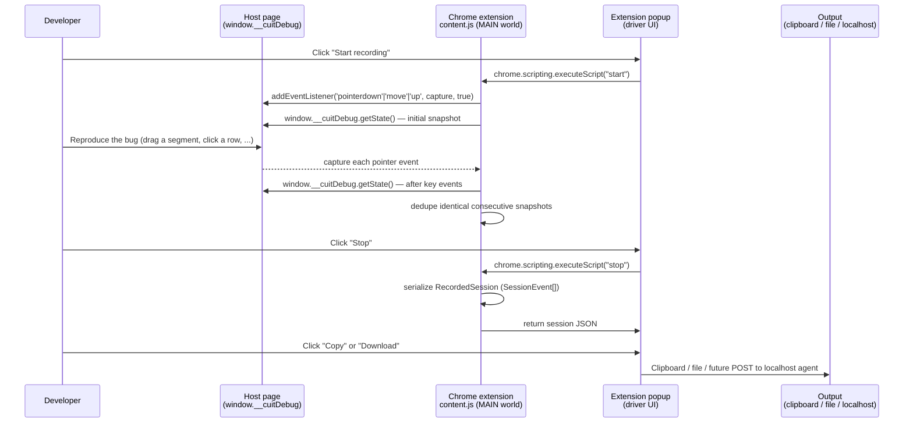

# 11. First-Party Recorder & Chrome Extension

This document is the authoritative design for the **first-party data
collection layer** that captures user interactions and host-app state
snapshots, producing the `SessionEvent[]` JSON that
[`@cuit/spec-gen`](./04-ai-spec-generation.md) consumes.

It is what closes the agentic feedback loop. The recorder is the
**Observe** edge in the closed loop that turns Claude Code, Codex, Cursor,
and any future agentic coding model into a deterministic UI engineer.

```
                          ┌──────────────────────────────────────┐
                          │  RECORDER  (this doc — layer 0)      │
                          │  Captures pointer events + semantic  │
                          │  selectors + window.__cuitDebug      │
                          │  state snapshots into one JSON file. │
                          └──────────────────┬───────────────────┘
                                             │
                                             ▼
                          ┌──────────────────────────────────────┐
                          │  @cuit/spec-gen  (doc 04)            │
                          │  Maps SessionEvent[] → spec.ts       │
                          │  grounded in harness primitives.     │
                          └──────────────────┬───────────────────┘
                                             │
                                             ▼
                          ┌──────────────────────────────────────┐
                          │  @cuit/harness  (doc 02)             │
                          │  Executes the spec deterministically │
                          │  against the customer's UI.          │
                          └──────────────────┬───────────────────┘
                                             │
                                             ▼
                          ┌──────────────────────────────────────┐
                          │  Verdict: RED on bug, GREEN on fix   │
                          │  The agent (Claude / Codex) reads    │
                          │  the verdict; proposes the fix; the  │
                          │  loop closes.                        │
                          └──────────────────────────────────────┘
```

The same JSON shape also normalizes from Jam / LogRocket / Sentry Replay /
FullStory / Datadog RUM (see [doc 10](./10-adapter-spec.md)) — the
recorder is a **drop-in replacement** for those vendors when first-party
capture is preferred (and it is, almost always).

---

## Table of contents

1. [Why first-party](#1-why-first-party)
2. [Architecture overview](#2-architecture-overview)
3. [What gets captured](#3-what-gets-captured)
4. [Output format](#4-output-format)
5. [Chrome MV3 extension](#5-chrome-mv3-extension)
6. [Programmatic API (`@cuit/recorder`)](#6-programmatic-api-cuitrecorder)
7. [Integration with the agent loop](#7-integration-with-the-agent-loop)
8. [Privacy posture](#8-privacy-posture)
9. [Failure modes and observability](#9-failure-modes-and-observability)
10. [Versioning and compatibility](#10-versioning-and-compatibility)
11. [Roadmap](#11-roadmap)
12. [Open questions](#12-open-questions)

---

## 1. Why first-party

Third-party session-replay tools (Jam, LogRocket, Sentry Replay, FullStory,
Datadog RUM) are general-purpose products. They were built before this
problem existed, and they were not designed for spec generation. We
support them via [doc 10](./10-adapter-spec.md) adapters — but on every
axis that matters for the agent loop, a first-party recorder wins.

| Axis | Third-party | First-party (`@cuit/recorder`) |
|---|---|---|
| Semantic selectors | Pixel coordinates + best-effort CSS path | Reads `data-segment-id`, `data-testid`, `data-cuit-id` directly |
| State snapshots | Inferred from DOM mutation | Calls `window.__cuitDebug.getState()` — the customer's authoritative state model |
| Event shape | rrweb / proprietary | Native `SessionEvent[]` — zero normalization |
| Latency to spec-gen | Pull through SaaS API (minutes) | Inline export (milliseconds) |
| Auth | OAuth + API keys per vendor | None |
| Cost per session | Vendor pricing + our pricing | Free at the recorder |
| Data egress | Sent to vendor, then pulled back | Stays local until explicitly exported |
| PII scrubbing | Best-effort at vendor | Configurable at capture, before any export |
| Vendor lock-in | High | Zero (MIT) |
| Bootstrap | Vendor account required | Install an extension, open your app |

The recorder also unlocks one capability the vendors structurally cannot
deliver: **closed-loop integration with a local agent**. Because the
recorder JSON is produced in the browser and never has to traverse a
third-party API, it can be POSTed to a localhost endpoint (or piped into
`pnpm cuit gen`) in a single hop — the agent reads the session and writes
the fix without anyone external being in the loop.

---

## 2. Architecture overview

The recorder ships as **one logical module** with two distribution
surfaces:

| Surface | Package | Use case |
|---|---|---|
| Programmatic | `@cuit/recorder` | Library code instantiates a `Recorder` directly (Playwright fixtures, e2e setup, in-app debug shelf). |
| Browser extension | `@cuit/recorder-extension` (Chrome MV3) | Developer drops the extension into Chrome and records any page that exposes `window.__cuitDebug`. |

Both produce **byte-identical** `RecordedSession` JSON. The extension's
`content.js` is a JS port of the TypeScript module; a future build step
generates one from the other so they cannot drift.

### 2.1 High-level data flow



### 2.2 Why the content script runs in the MAIN world

Chrome MV3 content scripts default to an **isolated world** that cannot
read the host page's `window.__cuitDebug`. We declare `"world": "MAIN"` in
`manifest.json` so the recorder lives in the same JS realm as the host
app and can read the debug hook directly.

The trade-off: scripts in the MAIN world cannot use `chrome.*` extension
APIs. So the popup drives the recorder via
`chrome.scripting.executeScript({ world: "MAIN", func: ... })` and the
recorder exposes a small `window.__cuitRecorder` API for the popup to
call (`start`, `stop`, `status`).

### 2.3 Why the popup uses `chrome.scripting.executeScript`, not message passing

`chrome.runtime.sendMessage` only delivers to the **isolated** content
world. To talk to the MAIN-world recorder, we have to inject a small
function via `chrome.scripting.executeScript({ world: "MAIN" })`. This is
synchronous from the popup's perspective and avoids the dual-world
serialization tax of an isolated proxy script.

---

## 3. What gets captured

The recorder is deliberately **opinionated** about what it captures. It
captures exactly what `@cuit/spec-gen` needs to produce a working spec,
and nothing else. No video frames, no DOM mutation logs, no console
output, no network traffic. Adding more is in [§11 Roadmap](#11-roadmap).

### 3.1 Event categories

| Event type | Trigger | Purpose downstream |
|---|---|---|
| `nav` | `recorder.start()` | Sets the spec's `goto` primitive URL. |
| `pointer` (down) | `pointerdown` on document, capture phase | Identifies the spec's drag target by semantic name. |
| `pointer` (move) | `pointermove` on document, capture phase | Used to derive the final `dx` / `dy` for `dispatchDrag`. |
| `pointer` (up) | `pointerup` on document, capture phase | Triggers a state snapshot for the assertion target. |
| `state-snapshot` | On start, after each `pointerdown` / `pointerup`, on `recorder.stop()`, on explicit `captureSnapshot()` | Provides the assertion's expected value. |

### 3.2 Semantic selector resolution

For each pointer event, the recorder walks up from the event target
looking for the first matching attribute in this priority order:

1. `data-segment-id` — used by waveform-style UIs (SpeechLab).
2. `data-testid` — the closest thing to a community convention.
3. `data-cuit-id` — our reserved namespace for custom semantic IDs.

If a match is found, the recorder writes it to the event's `targetName`.
Spec-gen prefers `targetName` over `targetSelector` when both exist.

Customers can configure additional attributes via the `semanticSelectors`
option:

```ts
new Recorder({
  sessionId: 'r1',
  semanticSelectors: ['data-segment-id', 'data-testid', 'data-cuit-id', 'aria-label'],
});
```

A CSS selector path is always recorded as `targetSelector` (up to 8
ancestors deep, with `#id` short-circuit and class names truncated to two
per element). This is the fallback when no semantic name resolves.

### 3.3 State-snapshot capture

The recorder calls a user-supplied `snapshotProvider`. The bundled
default — `cuitDebugProvider` — reads `window.__cuitDebug.getState()`. The
returned object is **flattened**:

```
state = {
  segments: [
    { id: 'seg-0', x: 0, width: 80 },
    { id: 'seg-1', x: 120, width: 80 },
  ],
  playing: false,
}

→ flattens to →

[
  ['segments.length', 2],
  ['segments[0].id', 'seg-0'],
  ['segments[0].x', 0],
  ['segments[0].width', 80],
  ['segments[1].id', 'seg-1'],
  ['segments[1].x', 120],
  ['segments[1].width', 80],
  ['playing', false],
]
```

Flattened pairs become `state-snapshot` events with `path` + `value`.

**Identical-consecutive deduplication**: the recorder hashes the
serialized snapshot and skips the next emit if the hash is unchanged.
This keeps traces tight when the developer pauses between interactions
without losing any state-change events.

### 3.4 What is NOT captured (by design, in v0.1)

| Category | Why deferred |
|---|---|
| Video frames | The spec generator does not consume them; they are large and PII-sensitive. |
| Console output | Useful for debug but not for spec generation. Roadmap §11. |
| Network requests | Out of scope for UI specs (covered by separate API integration tests). |
| Keyboard events | Roadmap §11 — needed for IDE-like UIs but not v0.1. |
| Wheel / touch | Roadmap §11 — partial support in `@cuit/harness` already. |
| DOM mutation logs | The state-snapshot path replaces this; mutation logs would duplicate. |

The decision rule for adding a new category: **does `@cuit/spec-gen`
currently consume it?** If yes, capture it. If no, defer until the
generator does.

---

## 4. Output format

The recorder produces a `RecordedSession` JSON object. The shape is
identical to what the [adapter spec doc 10](./10-adapter-spec.md)
normalizes from third-party vendors — meaning the rest of the pipeline
treats recorder output and adapter output interchangeably.

### 4.1 TypeScript shape

```ts
export type RecordedSession = {
  sessionId: string;
  vendor: 'cuit';                   // distinguishes first-party from adapters
  createdAt: number;                // ms-since-epoch when recorder.start() ran
  url: string;                      // page URL at the time of capture
  events: SessionEvent[];           // ordered by `seq`, monotonic
};
```

`SessionEvent` is the discriminated union from
[`@cuit/types`](../proof-of-concept/packages/types/src/index.ts) — `nav`,
`pointer`, `state-snapshot`. No other event kinds in v0.1.

### 4.2 JSON example

A real recorded session of the canonical segment-drag bug looks like:

```json
{
  "sessionId": "rec-agent-001",
  "vendor": "cuit",
  "createdAt": 1748952000123,
  "url": "http://localhost:5173/",
  "events": [
    {
      "seq": 0,
      "vendor": "cuit",
      "vendorEventId": "rec-agent-001-nav-0",
      "ts": 0,
      "wallClock": 1748952000123,
      "type": "nav",
      "url": "http://localhost:5173/"
    },
    {
      "seq": 1,
      "vendor": "cuit",
      "vendorEventId": "rec-agent-001-snap-1",
      "ts": 0,
      "wallClock": 1748952000123,
      "type": "state-snapshot",
      "path": "segments.length",
      "value": 3
    },
    "...",
    {
      "seq": 12,
      "vendor": "cuit",
      "vendorEventId": "rec-agent-001-p-12",
      "ts": 0,
      "wallClock": 1716800000000,
      "type": "pointer",
      "phase": "down",
      "targetSelector": "div > div[data-testid='waveform-track'] > div",
      "targetName": "seg-0",
      "x": 40,
      "y": 32,
      "pointerId": 1
    },
    "...",
    {
      "seq": 26,
      "vendor": "cuit",
      "vendorEventId": "rec-agent-001-snap-26",
      "ts": 0,
      "wallClock": 1716800000000,
      "type": "state-snapshot",
      "path": "segments[0].x",
      "value": 25
    }
  ]
}
```

A canonical 27-event recorded session occupies ~6KB of JSON. There is no
binary payload. The format is human-diffable.

### 4.3 Sequence and timing invariants

- `events[i].seq` is monotonically increasing, starting at 0.
- `events[i].ts` is relative to `createdAt` (ms since session start).
- `events[i].wallClock` is `Date.now()` at capture time. **Note**: this
  may be monkey-patched by the `@cuit/harness` `setClock` primitive if
  the recorder runs concurrently with a spec — that is expected and used
  for deterministic replay.
- `events` are in capture order, not necessarily timestamp order (jsdom
  and some browsers can fire `pointermove` slightly out-of-order from the
  monotonic clock). Spec-gen sorts by `seq` defensively.

### 4.4 Schema versioning

The recorder writes no `schemaVersion` field today. The schema is
defined by `@cuit/types` and changes only via a major-version bump of
that package. Consumers that need to lock to a specific schema should
pin `@cuit/types` directly.

A future revision may add `metadata.recorder = { version, schemaVersion }`
to support migration tooling.

---

## 5. Chrome MV3 extension

Source: [`proof-of-concept/packages/recorder-extension/`](../proof-of-concept/packages/recorder-extension/).

### 5.1 Manifest highlights

```json
{
  "manifest_version": 3,
  "permissions": ["activeTab", "scripting", "storage", "clipboardWrite", "downloads"],
  "host_permissions": ["<all_urls>"],
  "content_scripts": [
    {
      "matches": ["<all_urls>"],
      "js": ["content.js"],
      "run_at": "document_idle",
      "world": "MAIN",
      "all_frames": false
    }
  ],
  "background": { "service_worker": "background.js", "type": "module" },
  "action": { "default_popup": "popup.html" }
}
```

Permission rationale:

| Permission | Why |
|---|---|
| `activeTab` | Only the tab the developer pinned is touched. |
| `scripting` | Required to invoke the MAIN-world content script from the popup. |
| `clipboardWrite` | "Copy JSON" button. |
| `downloads` | "Download" button writes the session JSON to disk. |
| `storage` | Reserved — future feature for persisting session history. Not used in v0.1. |
| `host_permissions: <all_urls>` | The developer chooses which page to record. The content script is MAIN-world but inert until the developer clicks Start. |

### 5.2 Install flow (developer)

1. `git clone git@github.com:speechlabinc/complex-ui-tester.git`
2. Chrome → `chrome://extensions` → toggle **Developer mode**.
3. Click **Load unpacked**.
4. Select `proof-of-concept/packages/recorder-extension/`.
5. Pin the extension to the toolbar.

No build step is required for v0.1 — the extension ships unbundled.

### 5.3 Use flow (developer)

1. Navigate to the page exposing `window.__cuitDebug`.
2. Click the extension pin. Click **Start recording**.
3. Reproduce the bug exactly as a user would.
4. Click **Stop**.
5. Click **Copy JSON** or **Download**.
6. Paste the JSON into Claude Code / Codex / Cursor with the agent prompt
   from [§7 Integration with the agent loop](#7-integration-with-the-agent-loop).

### 5.4 Popup state machine

```
idle ─────[Start]─────▶ recording ─────[Stop]────▶ has-recording
  ▲                                                    │
  │                                                    │
  └─────────────────[Start (discards previous)]────────┘
```

The popup polls `chrome.scripting.executeScript` every 400ms while
recording to update the event count badge.

### 5.5 Future devtools panel (planned, v0.2)

A devtools panel will offer:

- Live tree-view of captured events as they arrive.
- Inline JSON preview with syntax highlighting.
- "Replay this spec" button that pipes the JSON into a local `cuit gen`
  invocation via [§7 the local agent endpoint](#73-the-local-agent-endpoint).

See `chrome.devtools.panels.create` for the integration point. Source
will live at `recorder-extension/devtools.html` + `devtools-panel.js`.

---

## 6. Programmatic API (`@cuit/recorder`)

For code that wants to capture sessions without a browser (e.g., from a
Playwright fixture, an e2e setup hook, or a custom developer shelf inside
the app), use the package directly.

### 6.1 Minimal example

```ts
import { Recorder, cuitDebugProvider } from '@cuit/recorder';

const rec = new Recorder({
  sessionId: 'rec-001',
  vendor: 'cuit',
  snapshotProvider: cuitDebugProvider,  // reads window.__cuitDebug.getState()
});

rec.start();
// ... the host app runs; events flow into the recorder ...
rec.stop();

const session = rec.export();
// session matches the JSON shape in §4. Pass to @cuit/spec-gen, or
// stringify and ship to a local agent endpoint.
```

### 6.2 Full constructor options

```ts
type RecorderOptions = {
  sessionId: string;
  vendor?: 'cuit' | 'jam' | 'logrocket' | 'sentry-replay' | 'fullstory' | 'datadog-rum';
  snapshotProvider?: () => Record<string, unknown> | null;
  now?: () => number;
  document?: Document;
  semanticSelectors?: string[];
};
```

| Option | Default | Use |
|---|---|---|
| `sessionId` | (required) | Stable per-session identifier. Becomes `RecordedSession.sessionId`. |
| `vendor` | `'cuit'` | Provenance tag. Use `'cuit'` for first-party capture. |
| `snapshotProvider` | none | Function returning the host app's state. Without it, no `state-snapshot` events are emitted. |
| `now` | `() => Date.now()` | Time source override. Useful for tests. |
| `document` | `globalThis.document` | DOM root for listener installation. Required in Node-side tests with jsdom. |
| `semanticSelectors` | `['data-segment-id', 'data-testid', 'data-cuit-id']` | Attributes that resolve `targetName`. |

### 6.3 Lifecycle methods

- `start()` — installs capture-phase listeners on the document. Idempotent.
- `stop()` — removes listeners. Snapshots final state.
- `captureSnapshot()` — explicit snapshot, useful between interactions.
- `export()` — returns the `RecordedSession`. Throws if `start()` was not called.
- `size()` — number of events captured so far. Useful for live UI.

### 6.4 Stable contract guarantees

- The `RecordedSession` shape is locked at v1.0. Adding fields is a minor
  bump; renaming or removing is a major.
- Event order matches capture order; spec-gen tolerates clock skew within
  a session by sorting on `seq`.
- The recorder writes no logs, makes no network calls, and never
  exfiltrates data.

---

## 7. Integration with the agent loop

The recorder's job is to feed an agentic coding model a deterministic
input it can reason about. Three integration patterns are supported.

### 7.1 Paste-into-chat

Simplest. The developer clicks **Copy JSON** in the extension popup, then
pastes into a Claude Code / Codex / Cursor chat with this prompt:

```
I captured this session reproducing a UI bug. The JSON is attached.

1. Run `@cuit/spec-gen` on the events to produce a Playwright/Vitest spec.
2. Run the spec against the current code. I expect it to fail RED — that
   means the bug is reproduced.
3. Read the failure (expected vs actual). Identify the smallest code
   change that flips the assertion to pass.
4. Apply the fix. Re-run the spec. Confirm GREEN.
5. Open a PR. The same spec becomes the regression gate.
```

This is the v0.1 reference flow. It works today. See
`marketing-site/src/content/proof.ts` for the verbatim prompt.

### 7.2 CLI hand-off

The developer downloads the session JSON and pipes it through `pnpm cuit
gen`:

```bash
# Future CLI (planned for the SaaS):
pnpm cuit gen ./session.json --apply

# Today, the runner CLI does the same end-to-end:
pnpm proof:agent-loop      # uses an in-process recorder
```

The CLI runs the same closed loop as the agent prompt: generate spec →
run → RED → propose → apply → GREEN.

### 7.3 The local agent endpoint (planned, v0.2)

The recorder extension will POST the session JSON to a configurable
localhost endpoint (default: `http://localhost:7711/cuit/session`) where
a local agent process listens. This eliminates the copy-paste step
entirely — the developer clicks Stop and the agent's PR appears in their
IDE without further input.

Design notes:

- **Port choice**: 7711 chosen as low-collision (no IANA assignment, not
  a common dev-server port). Configurable in the extension settings.
- **CSRF protection**: requests carry a `X-Cuit-Recorder-Token` header
  the local agent must validate against a one-time token displayed in the
  extension popup.
- **No remote endpoints**: the extension will refuse to POST to any host
  that is not `127.0.0.1` / `localhost` in v0.2. Remote agent
  integration is a separate roadmap item with explicit security review.
- **Reference local agent**: a small Node script in
  `proof-of-concept/packages/agent-endpoint/` (planned) will demonstrate
  the contract.

### 7.4 The MCP server pattern (planned, v0.3)

For Claude Code specifically, an MCP server exposing
`mcp__cuit__capture_and_generate(url, instructions)` would let the agent
itself trigger the recorder — open the URL, run the recorded interaction
script, generate the spec, run it, return the verdict. This unifies
"observe" and "act" inside the agent's loop with no developer in the
hot path.

---

## 8. Privacy posture

The recorder is **local-by-default and capture-time-scrubbing**. See also
[doc 05 §1](./05-security-compliance.md) for the SaaS-side controls.

### 8.1 Data flow

| Action | Data location |
|---|---|
| Recorder running | Events accumulate in the content-script process memory only. |
| Stop | JSON materialized in the extension popup process only. |
| Copy / Download | JSON enters the OS clipboard / filesystem at the developer's explicit action. |
| POST to localhost (v0.2) | JSON sent to `127.0.0.1` only; refused otherwise. |

The recorder **never** sends data to a remote endpoint, the cuit SaaS,
or any third-party. There is no telemetry. No anonymous-heartbeat ping.
This is enforced by the absence of any network code in `content.js`.

### 8.2 PII scrubbing hooks (planned, v0.2)

The default capture includes the page URL (which may contain PII in
query strings) and any string values inside `window.__cuitDebug.getState()`
(which may contain PII if the host app puts user content there).

v0.2 will add:

- `redactUrlParams?: string[]` — strip listed params before recording.
- `redactStatePaths?: string[]` — null out matching JSONPath values in
  snapshots before emission.
- A per-event allowlist hook: `shouldEmit?: (e: SessionEvent) => boolean`.

For v0.1, developers should treat the recorder JSON the same way they
treat any local debug log: scrub before sharing externally.

### 8.3 Sub-processors

There are none. The recorder is a single content script that runs in
your browser. No vendor account. No cloud. The Chrome extension itself
is the only "third party" you trust, and its source is in
[`proof-of-concept/packages/recorder-extension/`](../proof-of-concept/packages/recorder-extension/).

---

## 9. Failure modes and observability

| Failure | Symptom | Mitigation |
|---|---|---|
| Host app does not expose `window.__cuitDebug` | Recorder captures pointer events but no `state-snapshot` events; spec-gen falls back to bounding-box assertions (lower confidence). | Popup status shows `__cuitDebug: missing` so the developer knows to wire it up. Roadmap §11 — auto-detection via DOM probes. |
| `__cuitDebug.getState()` throws | Snapshot is silently skipped (`try`/`catch`). | Popup status badge flashes red. v0.2 will surface the exception text in the popup. |
| Extension installed but content script not yet injected | Popup shows "recorder not installed (reload tab)". | Reload the tab; MV3 content scripts inject on document-idle. |
| Recording on a Chrome system page | Refused — Chrome blocks content scripts on `chrome://` URLs. | Popup shows "chrome:// pages can't be recorded". |
| Service worker eviction (MV3) | The popup loses driver state. | The recorder lives in the page's MAIN world, not the SW, so capture continues. The popup re-queries `status` on every open. |
| Captured 0 pointer events | The page intercepted events at a layer above the recorder. | Use the popup's `__cuitDebug` indicator to confirm the recorder is installed; verify the page is not using closed shadow DOM (roadmap §11). |
| Identical-snapshot dedupe collapses a meaningful state change | The dedup hash is on the flattened snapshot string — if two distinct states serialize identically, the second is dropped. | Customize `snapshotProvider` to include a monotonic tick when state-equality is ambiguous. |

The recorder emits **no telemetry** to us, so we observe failures only
when developers report them. v0.2 will add an opt-in
`diagnostic-export` mode that includes timing and listener-counter
metadata for support cases.

---

## 10. Versioning and compatibility

### 10.1 Recorder module

| Channel | Use |
|---|---|
| `@cuit/recorder@latest` | Stable. Locked schema. |
| `@cuit/recorder@next` | First-party consumers (SpeechLab, Othelia, PointLoad) and design partners. |
| `@cuit/recorder@canary` | Build-of-day for internal smoke testing. |

The recorder follows the same release-channel discipline as the rest of
the OSS library — see [doc 02 §11](./02-library-architecture.md).

### 10.2 Chrome extension

Manifest version is currently `0.1.0`. Chrome Web Store submission is a
v0.2 milestone — until then, distribution is by `Load unpacked` from
the GitHub repo.

Update mechanism: the extension's `content.js` is regenerated from
`@cuit/recorder` at build time (planned tooling — `scripts/sync-content.ts`
will diff the bundled output and fail CI on drift).

### 10.3 Browser support

| Browser | Status |
|---|---|
| Chrome / Chromium (MV3) | Supported v0.1. |
| Edge | Mechanically compatible (Chromium-based, MV3). Untested v0.1. |
| Firefox (WebExtensions) | Roadmap. Manifest port required. |
| Safari (App Extensions) | Roadmap. App-extension wrapping required. |

The programmatic `@cuit/recorder` module is browser-engine agnostic and
works in any environment with a `document` and standard `PointerEvent`
constructor (including JSDOM ≥ 25 with a one-line `PointerEvent`
polyfill).

---

## 11. Roadmap

### v0.2 (Q3 2026)

- **Bundled content script**: a single `pnpm -F @cuit/recorder-extension
  build` step bundles `@cuit/recorder` into `content.js` so the
  TypeScript and JS sources cannot drift.
- **Devtools panel**: live event tree, JSON preview, "send to local
  agent" button.
- **Local agent endpoint**: `POST http://127.0.0.1:7711/cuit/session`
  with one-time token auth (see [§7.3](#73-the-local-agent-endpoint)).
- **PII scrub hooks**: `redactUrlParams`, `redactStatePaths`,
  `shouldEmit` config options.
- **Keyboard + wheel events**: needed for IDE-like UIs and scroll-driven
  interactions.
- **Recorder DSL**: developers can annotate semantically meaningful
  moments mid-recording — e.g. `recorder.markCheckpoint('after-undo')` —
  which spec-gen uses as natural break points.

### v0.3 (Q1 2027)

- **MCP server** for Claude Code (see [§7.4](#74-the-mcp-server-pattern-planned-v03)).
- **Firefox WebExtension** port.
- **Shadow DOM piercing**: capture events inside closed shadow roots via
  a small host-app shim.
- **DOM mutation log** (opt-in) for canvas-heavy UIs that don't expose
  state through `__cuitDebug`.
- **rrweb compatibility export**: emit rrweb-compatible JSON for use
  with non-cuit pipelines.

### v0.4 (Q3 2027)

- **Safari App Extension** port.
- **Continuous capture mode**: recorder runs always-on with a 5-minute
  ring buffer; on user signal (`Cmd+Shift+B`), the last buffer is
  materialized and sent for spec generation. Eliminates the "I forgot
  to start recording" failure mode.
- **Differential capture**: across multiple sessions of the same page,
  the recorder identifies which selectors are stable vs flaky and
  contributes to the per-tenant selector dictionary (see [doc 07 §3](./07-data-platform-and-feedback-loops.md)).

---

## 12. Open questions

| # | Question | Status |
|---|---|---|
| 1 | Should we ship a Chrome Web Store listing in v0.2, or keep Load-unpacked-only through v0.3? | Trade-off: store listing increases trust but commits us to an update cadence and submission compliance. Lean toward v0.2 listing under speechlabinc. |
| 2 | Should `data-testid` precedence outrank `data-segment-id`? | Currently `data-segment-id` wins for SpeechLab waveform compatibility. Open question for new design partners with conflicting conventions. |
| 3 | Auto-detect `__cuitDebug`-style hooks at common locations (`window.__REDUX_STORE__`, `window.__ZUSTAND_STORE__`)? | Roadmap §11 v0.2 — defer until we see real customer state model variance. |
| 4 | Default keyboard/wheel capture on or off in v0.2? | Lean: opt-in for v0.2, default-on once the spec-gen supports those primitives. |
| 5 | Capture multi-touch gestures? | Defer — single-pointer covers 95% of bugs in current design-partner traffic. |
| 6 | Cross-tab session correlation (drag from app A to app B)? | Out of scope for v0.x. The Recorder is single-page. |
| 7 | Recorder telemetry (opt-in)? | Defer until we have customer demand. Today: zero telemetry by design. |

Resolve open questions before v0.2 ships.

---

*End of `11-recorder-extension.md`. The next document in the series will
cover the local agent endpoint and the MCP server contract that complete
the closed-loop integration.*

