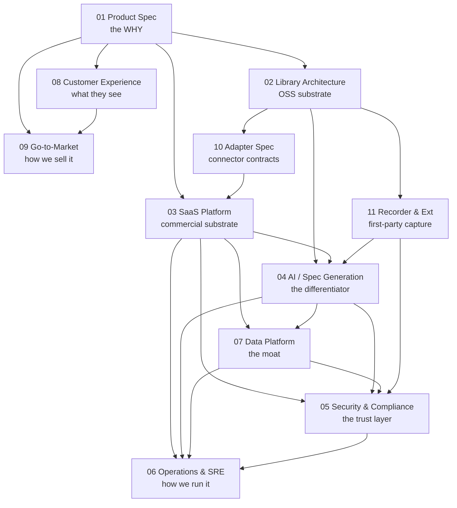

# Documentation Index

This directory holds the authoritative design documents for `complex-ui-tester`. The docs are numbered in the order a reader should typically follow, not by priority — most reviewers will jump directly to the doc that matches their role (see [the role-based reading guide in the top-level README](../README.md#where-to-start-reading)).

All docs are draft v1, last-reviewed 2026-05-27. Owner: ryan@speechlab.ai.

---

## The series

| # | Doc | Audience | What it answers |
|---|---|---|---|
| 01 | [Product Spec](./01-product-spec.md) | Customers, design partners, investors, PMs | What is the product, who is it for, why now, what does success look like, how does it compete, pricing surface, year-1 plan. The PRD. |
| 02 | [Library Architecture](./02-library-architecture.md) | OSS contributors, library consumers, framework integrators | How is the OSS library structured. Monorepo layout (pnpm + Turborepo + tsup + Vitest + Changesets), package boundaries (`@cuit/core`, `@cuit/react`, `@cuit/vue`, `@cuit/playwright`, `@cuit/adapters-*`), the harness primitive surface (Layers 1–6), framework-agnostic core design, "one canonical codebase" enforcement. |
| 03 | [SaaS Platform](./03-saas-platform.md) | Platform engineers, infra reviewers, SaaS evaluators | The SaaS control plane and data plane. Service map, AWS infrastructure (ECS Fargate, EKS, Aurora PG16, ElastiCache Redis, SQS, S3, Cognito), tenant model, multi-tenant isolation, GitHub App integration, billing/metering. |
| 04 | [AI / Spec-Generation Pipeline](./04-ai-spec-generation.md) | ML infra engineers, security reviewers, applied AI leads | The LLM pipeline that converts a session into a Playwright spec. 3-pass design (normalize → intent → ground → materialize), model routing across Claude Opus/Sonnet/Haiku, prompt caching, harness-primitive grounding, confidence scoring, eval harness, cost model, prompt-injection defense, rollout strategy. |
| 05 | [Security & Compliance](./05-security-compliance.md) | Customer security teams, auditors, internal engineering | STRIDE threat model, SOC 2 Type II control mapping, customer-cloud / self-hosted runner option, data classification, encryption posture, IR plan, prompt-injection mitigations, supply-chain controls, vendor sub-processors. |
| 06 | [Operations & SRE](./06-operations-sre.md) | SRE, on-call engineers, customer success | SLOs/SLIs/error budgets, service catalog, observability stack, alerting policy, on-call rotation, deployment pipeline, capacity planning, cost SLOs, operational incident management (distinct from 05's security IR), runbook list, backup/DR, year-1 readiness milestones. |
| 07 | [Data Platform & Feedback Loops](./07-data-platform-and-feedback-loops.md) | Platform engineers, applied AI leads, prospective customers evaluating the moat | The data infrastructure that turns sessions into per-tenant prompt context and closed-loop feedback. Five per-tenant data assets (selector dictionary, bug-class corpus, UI pattern library, custom primitives, confidence calibration), feedback signal taxonomy, RAG retrieval, weekly tuning cycle, cross-tenant anonymized insights, data ownership / portability / exit, and why this is hard to self-build. THE moat doc. |
| 08 | [Customer Experience & Product Surface](./08-customer-experience.md) | PM, design, customer success, design-partner contacts | Personas, end-to-end journey, dashboard (every screen wireframed), the `cuit` CLI, GitHub App + PR template, Slack/email/webhook notifications, onboarding flows (self-serve + design-partner), RBAC, cost transparency UX, success metrics, support surfaces, accessibility/i18n posture. |
| 09 | *Go-to-Market — moved to the private `cuit-internal` repo (pricing strategy, ACV targets, hiring plan)* | — | — |
| 10 | [Adapter / Connector Spec](./10-adapter-spec.md) | Adapter implementers, vendor partners, integration leads | `SessionEvent[]` schema (the canonical contract), `SessionAdapter` interface, capability matrix, cross-cutting concerns (auth, rate limits, idempotency), per-vendor specs for Jam / LogRocket / Sentry Replay / FullStory / Datadog RUM (endpoints, payloads, normalization, quirks, fixtures), test harness + conformance suite, customer-supplied adapters. |
| 11 | [First-Party Recorder & Chrome Extension](./11-recorder-extension.md) | Engineers integrating the recorder, security reviewers, agentic-coding integrators | Why first-party beats third-party for the agent loop, MV3 architecture, what gets captured (pointer + semantic selectors + `window.__cuitDebug` snapshots), `RecordedSession` output format, the programmatic `@cuit/recorder` API, the three integration patterns (paste / CLI / local-agent endpoint), privacy posture, roadmap to MCP server. |
| 12 | [QA Data Warehouse](./12-qa-data-warehouse.md) | Engineering leaders evaluating the SaaS, integration engineers | What the SaaS centralizes — the OSS-vs-SaaS buy-vs-build line. Six entity classes (sessions, specs, runs, bug-classes, signals, audit log) versioned against git SHA, queryable via dashboard + REST API + MCP server. Eight MCP tools surfaced for Claude Code / Cursor / Aider mid-task investigation. Security posture, data ownership, roadmap. |

---

## How the docs relate

- **01** sets the product context every other doc assumes.
- **02 and 03** describe the two halves of the product (OSS lib + SaaS) at the architecture level.
- **04** is the SaaS subsystem most differentiating to a customer — broken out from 03 because it warrants its own design surface.
- **05 and 06** are operational concerns that apply to the SaaS only; the OSS library has no operational footprint we run.
- **07** is THE moat. The OSS library is free; this doc explains why customers still pay.
- **08** is the product surface — wireframes, CLI, PR templates, notifications. Read with 07.
- **09** is GTM execution: pricing, sales motion, marketing, milestones.
- **10** is the connector reference — read when implementing or evaluating a new session source.

---

## Conventions

- **Front matter:** YAML with `title`, `owner`, `last-reviewed`, `status`, `related` (list of sibling docs).
- **Voice:** staff-engineer; opinionated, evidence-backed, no marketing fluff.
- **Cross-references:** link by filename, e.g., `02-library-architecture.md §3.2`.
- **Status values:** `draft v0` → `draft v1` → `accepted` → `superseded by ##-xxx.md`.
- **Diagrams:** mermaid preferred; ASCII for small reference diagrams in the README.
- **Evidence base:** every architectural claim should be testable against SpeechLab Branch B ([PR #1995](https://github.com/speechlabinc/translate-ui-react/pull/1995)) or one of the 8 historical bugs it locked in.

---

## When to add a new doc

Add a new numbered doc only when:

1. The topic spans 500+ lines of unique content, AND
2. At least one reviewer role would read it standalone (e.g., an auditor reads 05 without 01–04), AND
3. The content does not naturally live as a section inside an existing doc.

Otherwise, add a section to an existing doc and update the "related" front-matter. Avoid doc proliferation — readers should not have to chase content across 12 files.

---

## Source vision

The canonical source vision for the product is:

`/Users/ryanmedlin/Downloads/ui-feedback-loop-product-vision.md`

It predates this doc series and is the historical record of the original 12-layer pattern. If a future doc revision contradicts it, this series wins — but contradictions should be noted in the relevant doc's front matter.
